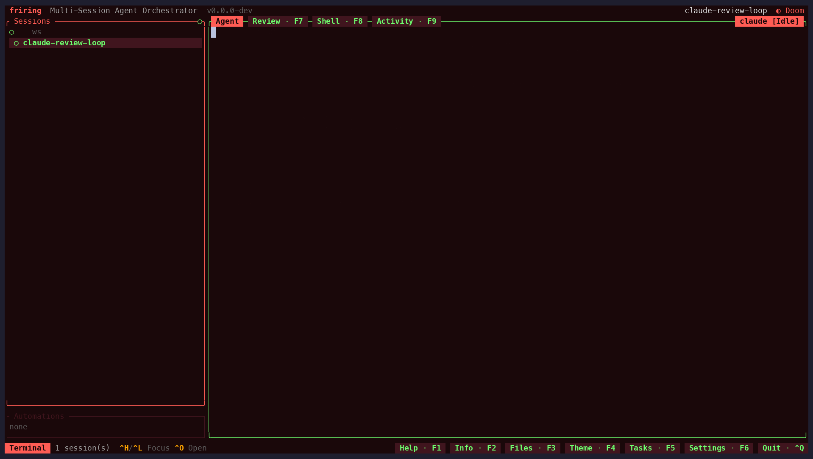
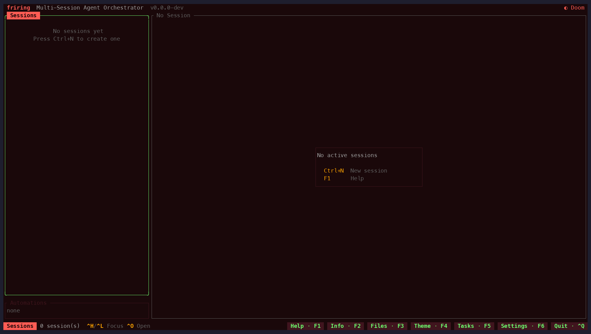

# Friring — a fork of Thurbox

**Friring** is a personal, opinionated fork of
[Thurbox](https://github.com/Thurbeen/thurbox) by Thurbeen. This document
describes what Friring is and how it differs from upstream Thurbox.

## The name

Thurbox's `thur-` reads as *Thursday*; Friring bumps it a day to *Friday*
(`fri-`), and a **ring** is a boxing arena. So Friring is *the ring where the
agents fight* — an arena for agents — or, read another way, *free agents in a
safe ring*.

## Relationship to upstream

- **Upstream:** [`Thurbeen/thurbox`](https://github.com/Thurbeen/thurbox)
- **This fork:** `bvc3at/friring`

Friring exists to land a few opinionated features on top of Thurbox. Some may be
contributed back to upstream over time; conversely, upstream's own improvements
are merged down into Friring as they land. The original commit history is kept
intact as a tribute to the upstream author.

### Deliberately not adopted

Upstream kept changing surfaces this fork had already rewritten. These stay
divergent on purpose:

- **`b6ddf31` copy over SSH via OSC 52** — the fork's clipboard stack already
  covers this and more; see "Copy falls back to `tmux load-buffer` / OSC 52"
  and "In-pane OSC 52 copies reach the user's clipboard" below. Two pieces of
  it *were* since ported onto the fork's own stack: the `OSC52_MAX_BYTES`
  ceiling and `extract_text_from_screen` (see "A terminal selection is read
  from the vt100 grid").
- **`03828a0` footer + status bar on narrow terminals** — the fork's own fix
  (see "The footer's text no longer runs under its buttons") solves the same
  overlap differently. Four ideas from it were ported into that fix rather than
  the commit; see "The footer degrades at narrow widths instead of blanking".
- **`86ab3dc` / `4e19147` / `b951991` F9 session-list collapse** — `F9` is the
  fork's activity view.
- **`1dd5edb` / `2c07e3a` demo regeneration** and the **visual identity** half of
  upstream's website work — the fork records its own demos and ships its own
  site, so upstream's Doom-inspired game-UI redesign, its restyled dividers and
  chrome, and its `iddqd` easter egg stay unadopted. The **bug-fix and
  load-cost** half of that work does apply to the fork's site, which was
  upstream's pre-redesign CSS rebranded, and is adopted separately (see "Own
  website" below).

## Renamed to friring (July 2026)

Friring began as a pure *branding* layer: only the human-facing name was
rebranded, while every functional identifier kept the upstream `thurbox` name.
As of July 2026 the plumbing is renamed too. The app's own identifiers are now
`friring` — the `friring` / `friring-cli` binaries, the crate, the config dir
(`~/.config/friring`), the data dir and DB
(`~/.local/share/friring/friring.db`), the tmux socket (`tmux -L friring`), and
the `FRIRING_*` env vars.

Friring's own distribution is renamed along with it: `cd.yml` publishes
`friring-*` release binaries, `scripts/install.{sh,ps1}` and the Homebrew
formula fetch them from `bvc3at/friring`, self-update / version-check query the
same repo, and `website/` is a Friring-branded site published to
`bvc3at.github.io/friring` (see
[Documentation / branding](#documentation--branding)).

What still says `thurbox` is deliberate, and splits in two:

- **Upstream attribution** — the `LICENSE`, provenance notes, the quality-gate
  badge, and the fork credit carried by the website (footer, FAQ, `llms.txt`)
  point at [`Thurbeen/thurbox`](https://github.com/Thurbeen/thurbox) and stay
  as-is (this is a fork, and the credit is upstream's).
- **Upstream-owned surfaces and shared formats** — the extension payloads a
  bare-name `extension install` fetches from upstream, the
  `min_thurbox_version` extension-manifest key (a wire format shared with
  upstream), and the `tb-` / `tbs-` tmux window prefixes (brand-neutral, kept
  for live-window compatibility).

The tradeoff the branding-only approach used to avoid is now real: upstream
merges carry rename conflicts on the renamed identifiers, and an existing
`thurbox` install needs a one-time [migration](#migration).

## Differences from upstream

### Features

#### Sandboxed agents

Fork-only, and **experimental**: the newest feature here and the least
exercised. The tests cover what friring generates — the seatbelt profile, the
bubblewrap argv, the container spec, the mount plan, every refusal — but none
of them runs a real boundary and watches the kernel deny a read or a
connection, none starts a container, `apple-container` was never run against
real hardware, and `wsl-distro` has no caller. The rules are tested; the
enforcement is argued from them. Both screens that author or pick a profile are
titled *experimental*.

Upstream runs every agent as the user, on the host, with the user's
full filesystem and network. The fork can run any registry agent inside an
isolation boundary chosen per session, scoped to the directories the session
actually needs and to an allowlist of domains.

- **Sandbox profiles** — a UI-edited collection in SQLite (the automations
  pattern): per-path read-only/read-write scope, network mode, domain
  allowlist, resource limits, backend choice. New tables (schema v47)
  **supersede** the dormant upstream `containers` / `project_container_config` /
  `vms` / `project_vm_config` tables (created by upstream schema v8/v10/v11 and
  referenced nowhere in live code), which this feature's migration drops.
  Merges touching those tables resolve toward the Friring tables. `sessions`
  also gains a `sandbox_profile` column, carried end to end like
  `backend_type`, and (schema v48) a `sandbox_unenforced` column recording why
  the last launch could *not* apply that profile, so a restart or a
  cross-instance adopt inherits the warning instead of rendering the sandboxed
  mark over an agent on the host.
- **Two sandbox shapes** — *policy* backends (`seatbelt`, `bwrap`) wrap the
  agent's argv with tmux outside; *place* backends (`docker`/`podman`,
  `apple-container`, `wsl-distro`) run tmux inside and are reached through a new
  sandbox transport that mirrors the fork's SSH/WSL transports. The place
  backends share one `PlaceBackend` seam and one set of refusals as *code* — one
  mount plan, one owner-label set, one spec digest, one collection decision — and
  a conformance test holds all of them to it.
- **Place backends: `docker`/`podman`** — one container per profile, shared by
  that profile's sessions and reached with `<engine> exec -i <ctr> tmux …`.
  `backend_type` carries `sandbox:<profile>` the way `ssh:<host>` does, so
  restore, adoption, restart and delete all re-derive the transport from it, and
  a place that is down turns its sessions into unreachable placeholders that
  reattach when friring starts it again. Mounts are **identical absolute paths**
  (a git worktree references its main repository by absolute path, and agents key
  transcripts and trust by project path), `--mount type=bind` so a missing source
  is refused rather than invented, and the container is given the host user's
  identity — `--user uid:gid`, or `--userns=keep-id` under rootless Podman —
  rather than widening the `0o600` proxy socket. `--cap-drop ALL`,
  `--security-opt no-new-privileges` and `--init` are not configurable. The
  container's name carries a digest of everything a profile edit could change, so
  an edited profile builds a new place instead of reusing mounts that no longer
  describe it. The image is the profile's, one built from its `containerfile`, or
  the default `friring/sandbox:1` built from
  [`packaging/sandbox/Containerfile`](packaging/sandbox/Containerfile) — friring
  publishes no registry image, so a missing one is refused with the build command
  — and it carries no agent CLI: an agent reaches a place through the profile's
  own image or through a one-time install into the profile's home, and a launch
  whose agent is not in the place is refused with that command rather than
  opening a pane that dies. Sessions sharing a place are **not** isolated from
  each other (one uid, one pid namespace, one filesystem); the trust domain is
  the place, and a profile per session is what gives each session one of its own.
- **Place backend: `apple-container`** — Apple's `container` CLI on Apple
  Silicon and macOS 26 or newer, one lightweight VM per place, on friring's own
  `friring-sandbox` network rather than the one every container on the Mac
  shares. It reuses the container engines' mount plan, labels, digest and
  collection decision unchanged, and reads its option surface out of
  `container run --help` at probe time because the CLI is young. Its one real
  limit is stated rather than papered over: **the egress proxy cannot be reached
  across a VM boundary**, so every filtered network mode — and `none`, whose
  promise friring cannot keep there — is refused, leaving an unrestricted `full`
  as the only mode it can honour.
- **Place backend: `wsl-distro`** — one hardened clone per profile
  (`friring-sbx-<profile>`, `automount` and `interop` off, an ownership marker, a
  *checked* `wsl --terminate` before the hardening is verified, bubblewrap
  required inside it), with VHD export/import and reclaiming. **None of that runs
  in this build.** Reaching a distro needs the `wsl:` transport rather than the
  container one, so the launch path was deliberately not wired — and with it
  unwired nothing else calls the backend either: registering, adopting and
  reclaiming are reached through `SandboxHost::wsl_distro` (no caller) or
  `PLACE_KINDS` (the three container engines). What runs is the probe and the
  capabilities the editor gates on. Its refusals are held to the shared
  conformance table anyway, through its own two seams.
- **No sandbox on a native Windows host.** `auto` offers no rung there and a
  pinned backend is refused without being probed, both naming WSL2 as where a
  Windows user's boundary comes from. The engines install and run on Windows,
  but a place mounts every path at exactly its host path — the invariant that
  keeps a git linked worktree and an agent's transcript resume working — and a
  Linux container cannot mount `C:\Users\me\repo` at `C:\Users\me\repo`.
  Upstream has no sandboxing at all, so this narrows only this fork's own
  feature; the Windows *session* features (psmux backend, junction workspaces,
  toast notifications) are untouched.
- **Copy-on-write workspaces on `bwrap`** — the real directory as a read-only
  lower layer and the agent's writes in an inspectable upper layer outside the
  sandbox's own writable scratch. Availability is probed by *mounting* one, since
  a setuid bubblewrap and a kernel that refuses unprivileged overlays are both
  invisible to a version check, and a host that cannot refuses the profile rather
  than binding the root read-write.
- **friring touches only the places it created** — an owner label is set at
  creation, every lookup filters on it, every removal re-checks it, and a
  same-named container without it is neither adopted nor removed. A background
  pass reclaims superseded and orphaned places and reconciles the
  `sandbox_instances` table; idleness never reclaims one, and a profile whose
  live sessions this instance is not driving protects every container of that
  profile by name.
- **Egress firewall** — a Friring-owned Rust filtering proxy enforces a domain
  allowlist while the kernel denies direct egress, so ignoring the proxy means
  no network rather than a bypass. Chosen over resolved-IP `iptables`
  allowlists, which break on CDN address rotation and cannot work under
  seatbelt or in WSL's shared network namespace. A bare `x` is that host alone
  and `*.x`/`.x` are one spelling of its subtree, apex included, in both the
  profile validator and the proxy — two matchers held to one table by
  `tests/egress_matcher_conformance.rs`, both canonicalising a host before they
  compare it (`127.1` and `2130706433` are `127.0.0.1`) and both refusing a
  non-ASCII host outright rather than guessing at a U-label. The proxy dials on
  the *host's* network stack, so it refuses destinations local to the host —
  loopback, unspecified, link-local, the cloud metadata address — in every mode
  including `full`, re-checking after a name resolves, unless an allow rule
  names the literal address; and it replaces a plaintext request's `Host` header
  with the authority it authorised. Both policy backends are wired to it:
  `allowlist` is enforced for real, and `full` with denies is proxied too,
  because a deny list is enforceable nowhere else. An instance is **per session**
  (the bearer token and the unix socket are per boundary, not per profile), and
  a launch with no session identity is refused rather than sharing one; it is
  bound before the agent but belongs to the session only once that launch has a
  pane, so a failed launch never costs a running agent its egress. Seatbelt
  reaches it on host loopback — on both loopback families, because SBPL's
  `localhost` cannot be told which one it means — and a `--unshare-net` sandbox
  through a bind-mounted socket fronted by `friring-cli sandbox relay` running
  inside the namespace.
- **First-use domain prompts** — a refused host raises a status line and, under
  `prompt_new_domains`, a confirm modal; allowing applies to the running proxy
  immediately (no restart) *and* writes a port-scoped rule for that host alone
  back to the profile. It is the only confirmation in friring that grants on `y`
  rather than `Enter` and ignores keys until it has been on screen, because it
  is the only one an agent can raise while the user is typing into a pane. A
  relaunch withdraws a question still on screen, since its answer would land on
  the boundary that replaced the one it was about. The same host is asked about
  once per session however hard the agent retries.
- **Credential handling** — never copies rotating OAuth credentials per
  sandbox (copies invalidate each other on first refresh); prefers host
  passthrough under policy backends (the macOS Keychain keeps working), then a
  long-lived token friring holds in its **own** OS keychain entry (service
  `dev.friring.sandbox`; the registry declares variable *names* only), then one
  login per profile inside the session pane, shared by every session of that
  profile and surviving a container rebuild. `seed-file` copies a credential
  file exactly once per credential family per host, only where the declaration
  asserts the vendor documents it, and never writes a refreshed one back to the
  host. The token's value never reaches a command line in either direction:
  reads use the platform tool's stdout, the write uses its stdin where one
  exists and is refused (with the prompting command printed) where none does,
  and injection is the control-mode window environment — so the headless launch
  path, which passes window environment as `tmux -e` argv, refuses instead. No
  credential problem ever fails a launch: the agent starts signed out and the
  session says so and says what to type. The macOS policy also permits
  `com.apple.trustd.agent`, the narrow per-user Mach service native TLS needs
  for certificate-chain validation, so HTTPS does not fail while a different
  WebSocket TLS stack still succeeds.
- **The safe subset of the user's agent configuration is projected into a
  place** — instructions, skills and commands land in the synthetic home at
  the same `~`-relative path, through a lint pass that parses every JSON/TOML
  document and classifies each host reference as projectable, rewritten,
  needs-a-read-only-mount or host-only, dropping the smallest whole entry around
  anything that cannot cross. No credential ever crosses (not even the launching
  agent's own), nothing reaching the data directory or a tmux socket does, and
  every write refuses a symlink at every component. friring's own hook payload
  crosses too, with each `friring-cli session signal` rewritten to
  `tmux set-option -p @friring_state` — the same rewrite the SSH path uses — so
  a place-backed session reports working/blocked/done through the control-mode
  subscription instead of reporting nothing. Enforced settings are a declared
  template friring fills with the paths the profile granted, merged over the
  user's own file, which pre-seeds the workspace trust an agent would otherwise
  prompt for in a fresh home.
- **The database never enters a sandbox** — a policy-sandboxed session reports
  status through a narrow file channel instead, because automations make database
  write access equivalent to arbitrary host command execution: the launch mints
  `<data dir>/signals/<session>/`, exposes that one directory read-write, and the
  bundled hooks append a state word there when `FRIRING_SIGNAL_FILE` is set
  (unsandboxed sessions run the CLI exactly as before). The host **takes** the
  file with a `rename(2)` into a directory no sandbox is granted before reading
  it, refuses anything that is not a regular file under 4 KiB of UTF-8, and
  writes only a matched constant from a closed vocabulary — never the file's own
  bytes. The database and its `-wal`/`-shm` siblings are masked wherever a
  writable root could create the mount point, whether or not they exist yet, and
  no place is ever given the data directory or the metrics/config/data
  environment variables that point at it.
- **A launch is refused rather than quietly narrowed** — friring will not start
  a session whose profile hands over more than the boundary can hold: read-write
  roots reaching the data directory (ADR-29 — the directory judged from above,
  the database file and its `-wal`/`-shm` siblings from either side, because a
  path naming a file encloses no directory), reaching a tmux server socket
  directory, or reaching friring's own `agents.toml`/`hosts.toml`/`config.toml`,
  which write down the command lines the host launches every agent with; a
  filtered network mode with no proxy running to enforce it; a `docker`/`podman`
  place that cannot be *shown* to reach the proxy's socket, measured by having
  the place dial a listener friring binds outside it rather than guessed from the
  engine's name; and a security-relevant path that is not valid UTF-8 (a rule
  built from a lossy spelling names a different file). The profile editor applies
  the path refusals at save, so such a profile never becomes a stored row, and
  `sandbox import` applies them before it writes any of a document.
- **A per-session scratch directory** — the agent's writable temp space is
  `<data dir>/sandbox/tmp/<session id>`, minted `0700`, adopted after a crash
  and dropped with the session; `TMPDIR`, `TMP` and `TEMP` point programs at it,
  and generated seatbelt profiles sit beside it under
  `<data dir>/sandbox/profiles/`. The host temp root is never granted: friring's
  own tmux server socket lives there, and a network namespace does not stop
  `connect(2)` on a pathname unix socket.
- **The host multiplexer's sockets are denied inside every policy sandbox** —
  `connect(2)` on a pathname unix socket is a filesystem operation no network
  namespace stops, and SBPL models one as a *network* operation, so an
  unrestricted `full` seatbelt profile granted `(allow network*)` over friring's
  own tmux server. A sandbox that reaches it asks that server to run a command
  in a host pane, outside the boundary. Every policy launch now renders a
  **closed** deny set after every allow, each entry in both its written and its
  resolved spelling: friring's own server socket, the socket of the server
  friring is itself running inside (from its own `$TMUX`), and the exact
  `tmux-<uid>` directory under every root a tmux build could use. Deliberately
  nothing broader — `/tmp`, `/run`, `/var/run`, `$XDG_RUNTIME_DIR` and `$TMPDIR`
  as wholes stay grantable, because a blanket unix-socket denial would break an
  agent's own language server, a test harness's socket or a package-manager
  daemon. The residual (a server an operator starts at an arbitrary `-S` path
  inside a granted directory) is recorded in `docs/SANDBOX.md`. bwrap keeps its
  existing masks and adds only what they do not already cover. Upstream has no
  sandboxing, so this closes a hole in this fork's own feature.
- **A shell-free, gated launch helper** (ADR-33) — every policy launch now execs
  `friring-cli sandbox launch` as the program the boundary runs, with the
  agent's argv after its `--`. It replaces the two-line `/bin/sh -c` script that
  used to start the in-namespace egress relay, so **no launch path composes a
  command string** any more: a socket path or an agent argument containing a
  space, a quote or a `;` arrives as one argv element. It also drops the
  multiplexer-nesting variables (`TMUX`, `TMUX_PANE`, `PSMUX*`) that tmux sets
  in the pane and that point at friring's own server, and — for an orchestrated
  child — waits for a release file in a **read-only** gate directory before the
  agent starts, so a child never runs before its session row exists. Then it
  `execvp`s in place, which is what keeps the pane's process the agent, keeps
  it inside the pid namespace `--unshare-pid` created, and keeps the namespace
  teardown taking the relay with it. A host with no `friring-cli` beside `friring` is
  refused with the fix named, and `allow_unsandboxed_fallback` still answers
  that refusal.
- **A filtered session's egress survives a restart** — the proxy listener lives
  in the friring *process*, so a restart used to leave an agent that is still
  running holding proxy URLs naming a port and a credential nothing answered on:
  the session looked filtered and reached nothing. Adoption now rebinds the
  **persisted** endpoint with the **persisted** token, on both loopback families,
  under the profile's policy as it stands *now* — so an edit between the two runs
  takes effect and nothing else drifts. `sessions.egress_state` records the
  outcome honestly (`none`/`preparing`/`active`/`restoring`/`unrestorable` with a
  reason), and a failed restore leaves the token alone: rotating it would take
  the running agent's network away for a reason nothing would explain.
  `sandbox_unenforced` is never written for it — an enforced boundary with a dead
  proxy is still enforced. `preparing` becomes `active` only when the egress
  supervisor answers, because a commit is a message and inferring "filtering" from
  a successful send would claim a boundary nobody agreed to.
- **Exact multiplexer identity per session** — the window name is the adoption
  key and is not evidence: a window can be created by anything holding the socket
  and a pane id is reused after a server restart. Every launch now records
  `#{window_id}`, `#{pane_id}`, `#{pane_pid}` and a per-**launch** `@friring_pane`
  marker, plus a `@friring_server` uuid on the server, and every destructive
  action revalidates the whole set before acting — a mismatch in any recorded
  field is a refusal, and nothing recorded is never a match. `#{socket_path}` is
  compared against the socket the sandbox policy denied, so a launch on a server
  friring did not expect is refused rather than sandboxed against the wrong deny
  set. A variable an older tmux does not report degrades to the marker instead of
  failing the launch.
- **Orchestration bridge, part one: schema, protocol, broker and child policy**
  — fork-only, and the largest addition since the sandbox itself. Schema v49 adds
  the bridge's eight tables (ownership insert-only in SQL, so a verb's authority
  cannot be reassigned by anything holding a write handle), a `session_repos`
  index that is the authority a child's repository is checked against, and the
  multiplexer/egress columns above. `session::bridge` carries a closed verb set,
  a request key validated as one path segment before any join, and typed bodies
  that refuse an unknown field. The queue is files inside the status-signal
  directory a launch already grants — no second grant, no second path in any
  policy — taken by `rename(2)` into a directory no sandbox was given, with a
  FIFO, a symlink, an oversized or non-UTF-8 body and a filename that would be a
  path each refused explicitly. `friring-cli bridge` is the client and
  `friring-cli capabilities` reports what this binary speaks. The broker runs on
  the TEA tick with a bounded per-pass budget so a flood costs latency rather
  than frames, and `BRIDGE_NUDGE` is one exact literal so no message text ever
  reaches another agent's prompt. A child's policy is its owner's put through a
  pure monotone `narrow`, with a subtract set denied after every allow (a parent
  granting the whole home directory encloses the family's state, so the
  subtraction cannot be an absent grant) and the exact seed targets re-granted
  after that. A bridge child always runs from a private agent state directory,
  seeded only from what the agent declares *and* the profile authorizes, in the
  exact mode — `link-rw` being the one mode that shares a file, under three
  conditions, so a rotating credential is refreshed in place and never copied
  (ADR-28). A bridge-required agent is refused, and never falls back to the host,
  wherever it cannot be served. Upstream has no sandboxing and no orchestration,
  so all of this is new here. See ADR-30, ADR-31 and ADR-33.
- **Orchestration bridge, part two: the child lifecycle** — creating a child is
  a saga whose every external effect is written down *before* it is made, so a
  friring killed part-way through reconciles by exact identity and never by a
  prefix scan. The agent is **gated**: its pane exists five steps before it
  starts, which is what lets the proxy commit, the database transaction and the
  identity revalidation each fail without a turn having run. The gate is opened
  by a `rename(2)` into a directory the boundary sees read-only, and only after
  the egress supervisor acknowledges — a silent supervisor fails the create
  rather than starting an agent that believes it is filtered. Readiness is the
  child's **own hook report** and nothing else, because a live pane does not show
  which state directory the agent is running from. A `result` is a finish
  *intent*, not a verdict: the host acks it, stops the exact pane, and only then
  reads the worktree with four read-only `git` commands — a dirty worktree lands
  in `dirty` whatever the child claimed, and a pane friring cannot stop lands in
  `stop_failed`, never integrated either way. `create`, `stop` and `resume` are
  answered when the saga finishes rather than when it is accepted, so a client
  retrying with the same key waits instead of starting a second child.
  Hard-deleting an owner stops its children and deletes none of them; deleting a
  child tells its owner. See ADR-32.
- **A clean bridge stop is resumable parking.** `bridge stop` already quiesces
  the exact pane, verifies the worktree, releases the fan-out slot and preserves
  ownership, branch, worktree and private agent state. The fork now permits
  `bridge resume` from that clean `stopped` state, so a long-lived worker can be
  parked without inventing a replacement worker. A released `stopped` or
  `unusable` child reacquires capacity before any state or pane change and
  refuses `fanout_exhausted` when the profile is full; its `starting` capacity
  claim and relaunch saga are one transaction. Live `dirty` and `stalled`
  resumes keep using the slot they already hold. The count itself **fails
  closed**: an unreadable `bridge_child_states` refuses the request `failed`
  rather than reading as zero live children, which is what would have authorized
  a whole `max_children` worth more of them at the one moment friring could not
  see the ones it already had.
- **Orchestration bridge: the fail-closed contracts** — the places where the
  cheap answer and the safe one differ, resolved toward the safe one. A `stop`
  that lands on a running launch is **not** answered from that launch's own
  result (which would say `state: "ready"` over a child nothing stopped) but held
  and run as a real quiesce once the launch ends; a `result` that beats the
  readiness proof is held the same way rather than dropped, because the agent
  starts one step before S9 and a small worker finishing inside that window is
  ordinary. A quiesce whose verdict or state write fails **refuses** and leaves
  the child `finishing` for recovery, rather than reporting `done` over an empty
  `bridge_results` row. A force-delete whose ownership cascade cannot be read is
  refused rather than deleting the one session that could stop those children. S2
  claims the branch with `git branch` *before* adding the worktree, so a failure
  can say whether the leftovers are this saga's — `git worktree add -b` cannot
  distinguish a lost cross-instance race from a `post-checkout` hook that failed
  after the checkout, and an unwind that guesses either deletes the winner's
  worktree or leaks one. A reclaim that cannot prove ownership removes nothing
  and says where the directory is. The request queue is opened once with
  `O_DIRECTORY | O_NOFOLLOW` and driven by `fdopendir`/`renameat`/`unlinkat`, so
  a session that re-points its own queue directory between friring's check and
  its act reaches nothing. The status-signal dedupe asks the database rather than
  the reading instance's cache, so a peer instance cannot drop a relaunched
  child's first hook report as a repeat of its previous life's. Bridge mail is
  capped at 50 unread per child and 200 per owner rather than the generic 500,
  and a bridge call resets the unanswered-nudge *count* without discarding a
  reminder the recipient is still owed.
- **A nudge nobody can be typed is still owed, and one recipient cannot hold the
  queue.** Three gaps that all end the same way — mail that is never announced to
  anybody. A recipient past its nudge allowance kept its place at the front of a
  selection made by longest-waiting, so every later pass picked it and returned
  without typing: one `stalled` child, a state only an operator clears, silenced
  the nudge for every other recipient in the process including its own owner.
  Every outcome restarts the recipient's interval now, so a pass always gives up
  its place. A recipient this instance could not reach — parked, unloaded here,
  or loaded by another friring on the same database — had its reminder *deleted*,
  and a reminder is only ever created when new mail arrives, so the mail already
  queued was never announced however long the recipient ran afterwards; it is
  kept. And because the reminder is per process while the mail is a row, the owed
  set is re-derived from the mailbox on a slow pass, so a restart or a handover
  between instances no longer loses it.
- **Running the conformance extension found four things linting it could not**
  — `just bridge-e2e` stands up a throwaway sandbox, installs the extension,
  imports its profile, boots the real TUI and drives the new-session wizard by
  keystrokes, because a bridge-requiring agent is refused a headless create.
  Its first real run showed that **neither** bridge-backed extension could have
  started: `extension install` registered agents in `agents.toml` before
  resolving `{home}`, so the launcher — which expands no tokens — was handed
  `cannot run '{home}/bin/leader.sh'`; a `workspace` read scope did not read the
  agent's own program, so the pane died before the agent started; the shipped
  profiles did not grant the extension home, so a script agent could not source
  the library beside it; and the conformance leader wrote its scratch to `/tmp`,
  which every profile denies outright because that is where friring's own tmux
  server listens. All four are closed, the first two in core with tests. The run
  also observes, from **inside a launched session** rather than from a one-shot
  `sandbox exec`, that friring's gate root is neither readable nor writable and
  its database is unreadable — and that a nudge really is typed into a live pane
  by a real multiplexer.
- **Parking proven with a real agent as the child** — `extensions/codex-park`
  and `just codex-park-e2e`. `bridge-conformance` drives the whole parking
  lifecycle with `/bin/sh` agents, which is what makes a green run a statement
  about friring; what a script cannot have is the thing parking exists for, a
  **conversation** to come back to. This harness keeps friring's side identical
  and makes the child an interactive Codex CLI against the local model stub —
  no `env_key`, no login, no account, every proxy variable pointed at a dead
  port so only loopback resolves, and the developer's own `~/.codex` never read.
  It adds a nudge delivered into a live *vendor* pane, a marker written into the
  child's private `CODEX_HOME` and quoted back by the relaunched process, and —
  read from outside the boundary — the threads Codex itself recorded.
  Running it found that a bridge `resume` was **minting a new conversation every
  time**: the relaunch built its config with a fresh `agent_session_id` and
  never a `resume_session_id`, so a worker agent's `resume_args` were never
  consulted and a parked worker came back with its worktree, branch, mailbox and
  private state — and no memory of the task, silently. A resume now resolves the
  child's own recorded conversation and emits the agent's resume group
  (`app::bridge_saga::child_resume_identity`), and one friring cannot **prove**
  will reach the conversation is refused beside the capacity check, before
  anything is mutated — which matters most for a `stalled` child, whose still
  running pane a relaunch stops on its way. `create` is unchanged. The proof is
  declarative and lives with the agent, not in the core: a new
  `[agents.<name>.transcript]` block (a directory under `state_dir`, a file
  suffix, and whether the file name carries the id friring resumes by) is
  evaluated against the private state directory *that* launch uses. An agent
  that declares a resume contract and no way to check it is refused rather than
  guessed at, which is a behaviour change for an `agents.toml` written before the
  key existed. Building it also
  found that the openai stub read
  `hasToolResult` across the whole transcript rather than the turn being
  answered, so a two-fixture tool loop stopped firing from the second turn
  onwards and any resumed agent narrated instead of acting; it now means what
  the anthropic dialect has always meant. Upstream has neither the extension nor
  the harness.
- **The omx Team fan-out, run for the first time** — `just omx-team-e2e`. The
  extension had been manifest-linted, digest-checked and argv-tested, and never
  launched; the scenario was recorded as blocked on an authenticated Codex
  endpoint, which was simply wrong. A custom provider with no `env_key` needs no
  login, so the real vendor package runs against the same local stub as
  everything else. Launching it found four things reading it could not: `omx`
  creates `~/.omx-runs` before it starts and the profile granted no read-write
  path at all; codex 0.153.4 keeps its state in SQLite, which the agent's
  hand-written per-file `state_rw` list could not express, so the leader died on
  "local database appears to be damaged"; neither agent's hook trust can ever be
  pre-seeded, because the leader's `--madmax` state directory and a worker's
  private `CODEX_HOME` are new every launch; and **a bridge child could not
  commit**, because a linked worktree keeps its index in the source repository
  and shares the object store, neither of which a child was granted. friring now
  grants a child its own git metadata directory; the rest is the profile
  template and the two wrappers. Until this, no harness had ever had a child
  that committed. The run now goes all the way: a sandboxed `omx` leader plans a
  DAG, `friring-omx run` fans out one real Codex per node, each commits, friring
  verifies each into `done` itself, and `integrate` merges both branches.
- **What a child's git grant is allowed to reach** — the grant that lets a bridge
  child commit is a grant of shared repository state, so its edges are now
  written down and enforced rather than assumed. Which metadata directory a child
  gets is decided by the repository's own `gitdir` record, never by the `.git`
  marker inside the child's writable worktree: a marker naming a sibling's
  directory, two records naming one worktree, or a worktree with no record at all
  each grant nothing, so a child can cost a sibling the ability to commit — which
  friring reports as a dirty worktree — and can never read or write its state.
  A writable root that *is* a git directory keeps `hooks`, `config`,
  `config.worktree`, `HEAD` and `index` read-only, and a child's own metadata
  directory keeps its `gitdir`/`commondir`/`config.worktree` redirects read-only:
  friring runs `git` in a child's worktree to reach a verdict, so a redirect a
  child could write is a `core.fsmonitor` the host then executes. What stays
  shared — adding and deleting objects, writing any branch ref — is git's own
  design and is documented as the boundary it is, with "leave `<repo>/.git` out
  of `child_shared_rw`" as the lever that closes it. Related: a tool's runtime
  state now belongs on the **agent** that runs it rather than in the profile's
  `paths`, because a profile path is inherited read-only by every child — the
  `omx` extension's `~/.omx` and `~/.omx-runs` moved to the leader agent's
  `state_rw`, so a worker cannot read the leader's session identity, launch
  lineage, logs or codebase map.
- **`friring-cli config paths`, and dev harnesses that prove their own
  isolation** — a dev build reads and writes the operator's own
  `~/.config/friring-dev` and `~/.local/share/friring-dev/friring.db`, and until
  now nothing could check that a harness's redirection had actually reached the
  binary it started: the first thing to reveal a resolved database path was
  `Database::open`, which is already the write, and a schema migration is
  one-way. `config paths` reports the resolved config dir, data dir and database
  file plus the environment variable that decided each, dispatched through
  `cli::early` **before** any database opens and refusing to answer from the
  ordinary path, where the report would no longer be evidence of anything.
  `tbx_sandbox_init_full` now exports `FRIRING_CONFIG_DIR`/`FRIRING_DATA_DIR`
  explicitly instead of relying on the `XDG_*` fallback, whose last link is
  `$HOME`; `bridge-e2e` runs the preflight and aborts unless every path
  canonicalizes inside its own root under those overrides, and passes them to
  every binary through `env` so a tmux server holding an older environment cannot
  substitute one. `scripts/dev/sacrificial-env.sh` is the ring around that: one
  throwaway root, canaries where a fallback would land, and a failed run if one
  changes. `just test`, `just test-one`, `just bridge-e2e` and both boundary
  probes go through it. Upstream has neither the command nor the wrappers.
- **Orchestration bridge, part three: what it looks like** — the info panel
  gains an `Egress:` row, because the shield does not answer whether the domain
  filter is live: a profile can be applied and its allowlist still be down, and
  the session list marks that case beside the shield rather than leaving a
  shield to imply otherwise. A `Bridge:` row says where a session sits in an
  orchestration from either side, from host-known fields only. The profile
  editor grows five orchestration fields, offered as three grant presets rather
  than eight combinations, and only for a backend that can carry the bridge; a
  seed authorization is validated at save rather than at launch. `session
  get|list` carry a `bridge` object with the host's verdict per child and
  nothing a child wrote — an integration step reads that document — and
  `friring-cli bridge --human` renders an answer for a person while JSON stays
  the default for the agent that is usually asking.
- **Extension `[[requires]]`, `on_conflict` and `{home}` in agents** — an
  extension can now declare what must hold before it is installed, activated or
  healed, in five kinds: a capability of the friring binary (checked against the
  same document `friring-cli capabilities` prints), a tool on `PATH`, a file's
  digest, a file's presence, and a file's contents. Every one is a **hard gate**
  — `min_thurbox_version` stays the soft one — because an extension whose
  preconditions do not hold is one whose behaviour nobody has reasoned about. A
  kind this friring does not recognise is refused rather than ignored. The tool
  check runs argv-only with a bounded wait and bounded output, so friring runs
  the operator's installed tool without ever introducing a shell, and caches a
  result against the resolved binary's path and mtime rather than its name. An
  external file may declare `on_conflict = "refuse"`, which fails the install
  over a file friring did not write instead of silently skipping it and
  installing an extension that then behaves as somebody else's file says; a
  destination friring *did* write is restored byte-exact, and uninstall removes
  only marker-managed files and only empties a directory it left empty. `{home}`
  now resolves in an extension's own agent `command`, arguments and sandbox
  environment, which is what lets an extension ship the program its agent runs.
  Upstream has none of this.
- **Two bridge-backed extensions** — `extensions/bridge-conformance` proves the
  orchestration bridge end to end with **no vendor agent involved**: both its
  agents are `/bin/sh` scripts with no login, no model and no network, so a green
  run demonstrates the verbs, the authority rules, the depth rule the worker
  deliberately tries to break, the child boundary and the quiesce protocol —
  rather than an integration with anything. It also drives the whole **parking
  lifecycle**, which is the one part of the child contract that is about what
  survives a process going away and so cannot be reached in-process: stop,
  slot released, a `resume` refused `fanout_exhausted` at a full fan-out with
  the parked child untouched, then the same child resumed and answering new
  mail by quoting a marker its previous life wrote into its private state
  directory. Its worker is a shell script, so what that preserves is a file and
  not an interactive vendor agent's own thread — the distinction is kept
  explicit in `docs/E2E.md` rather than blurred. `extensions/omx` is the real one: it
  runs oh-my-codex 0.21.0 as a leader with every Team node as a sandboxed bridge
  child, replacing the one lane (native `omx team`) that needs a tmux layout the
  boundary does not have, and leaving the rest of OMX alone. Its program is one
  dependency-free Node 20 module in which no string ever becomes a command line
  and every JSON input is validated field by field; its two one-line `sh`
  wrappers are the only shell in it. It is pinned by digest to every skill card
  and role prompt its routing depends on, so an install against a different
  oh-my-codex refuses and names the file that moved. Those digests are the ones
  `omx setup` **installs**, not the ones the release tarball ships: setup
  rewrites each skill card's frontmatter description as it copies it, so pinning
  the tarball made 7 of the 8 skill gates unsatisfiable and the extension
  uninstallable after the exact steps its own README gave — found by running the
  vendor package in a disposable fixture rather than by reading it. friring also
  requires `--install-mode legacy`, because plugin mode installs no
  `~/.codex/skills` at all; and the manifest's `omx --version` pin needed
  friring's own matcher relaxed on its left boundary, since the release prints
  `oh-my-codex v0.21.0` and the `v` was being read as part of the version.
  Running `friring-cli extension install` against a real `omx setup`'s output is
  what found both, and it now exits 0 with every requirement satisfied.
  Integration merges only
  what **friring** verified after it stopped a worker's pane — never a worker's
  own claim — and a conflict is reported rather than resolved. Upstream ships no
  orchestration, so both are new here.
- **The boundary is observed, not only generated** — `friring-cli sandbox exec
  --profile <name> -- <argv>` runs one command inside a profile's boundary,
  composed through the *same* code path a session launch composes it with, and
  never falls back to the host whatever the profile's
  `allow_unsandboxed_fallback` says: "it ran outside the boundary" is not an
  answer to "what does the boundary allow?". On top of it,
  `scripts/dev/sandbox-probes/` (`just seatbelt-probe`, `just bwrap-probe`) asks
  a real kernel whether the multiplexer deny set holds — five tmux servers,
  including one whose socket the probe inherits through `$TMUX`, dialled in all
  three network modes — and asserts the positive controls too, since a boundary
  that refused everything would pass every deny assertion and be useless. Both
  probes skip rather than fail where the platform cannot answer, so a kernel
  without user namespaces reports the machine instead of failing friring. The
  seatbelt probe has been run on macOS: 24 assertions, all passing — and its
  first run **found a hole**, which is the point of having one. Under
  `host-minus-secrets` the generated policy left another session's launch gate
  readable, and a gate's release file carries the key its helper compares
  against; the profile-level check had refused a profile *naming* that tree in
  either mode all along, so the scope simply did not agree with it. Both
  backends now deny the gate tree and re-grant only the launch's own, read-only.
  `docs/SANDBOX.md` records the conformance status and what remains unobserved.
  Upstream has no sandboxing, so none of this exists there.
- **Desired vs applied boundary** — a session records the profile it asked for
  *and* what the launch did with it. A launch that falls back to the host keeps
  the profile (so the next relaunch is sandboxed again) and is marked `⚠`
  rather than `⛨`, with the reason in the info panel, in an error toast, and on
  `friring-cli session create|restart` output. A profile whose stored row
  friring cannot decode is still listed and repairable but is refused at
  launch, naming each column that failed.
- **Agent requirements are declared data** — an optional
  `[agents.<name>.sandbox]` block in `agents.toml` carries the state
  directories an agent must keep writable, the flags that turn its *own*
  sandbox off (mandatory under `seatbelt`, where nesting is denied by the
  kernel), the credential strategy and the names of the token variables it
  accepts, the configuration safe to project into a container, and the
  highest-precedence settings friring writes in there. Upstream's `agents.toml`
  has no such key and loads unchanged; the fork bakes in no agent knowledge.
- **A new module in the architecture allowlist** — `sandbox` may reference
  `session`, `paths` and `shell`, and `agent` may reference `sandbox` (the wrap
  is a decorator on the launch `agent` composes). Enforced in
  `tests/architecture_rules.rs`.
- **`friring-cli sandbox`** (fork-only, as the whole sandbox feature is) —
  profile and place management (`list`, `show`, `rm`, `prune`), TOML
  `export`/`import` that refuses at the *import* anything a launch would refuse,
  and `token set|rm|list` for the `env-token` keychain entry, with the token
  never on a command line in either direction and a store friring cannot write
  to saying so before the value is asked for. The internal `sandbox relay` stays
  the one subcommand dispatched before the database is opened (ADR-29).
- **The profile list is a manager view** — places per profile, with `s` stop,
  `r` rebuild and `p` prune. The two that take a container away from whatever is
  running in it are confirmed in the footer, and `y` alone answers, because
  `Enter` and `d` already mean edit and delete there.

What ships and runs is both policy backends and the two *container* place
backends (`docker`/`podman` and `apple-container`), with every
network mode enforced where the backend can enforce it, host-passthrough
credentials under a policy backend, and status reporting out of either kind of
boundary — a place gets the safe subset of the user's agent configuration
projected into its synthetic home, including friring's own hook payload rewritten
to report through tmux, so a place-backed session says working/blocked/done like
any other. All three place credential strategies are built: `env-token`,
`volume-login` and `seed-file`.

What does not: a place on a *remote* host is refused rather than supported
(friring creates the container locally, with this machine's paths); **nothing
drives the `wsl-distro` backend** — it is built and stub-tested with no
production caller, so no distro is registered, hardened or reclaimed and no
session runs in one, and pinning it refuses with the alternatives;
**`apple-container` honours no filtered network mode**, because the egress proxy
is not reachable across a VM boundary — and a `docker`/`podman` place whose
daemon is in a VM (Docker Desktop, `podman machine`, colima) is refused a
filtered mode for the same reason, now that friring measures it rather than
assuming; and no profile column selects a copy-on-write workspace yet. An egress
proxy dies with the friring process that started it, so a session created by the
short-lived `friring-cli` starts with no way out (kernel-closed, which fails
closed) until a running friring relaunches it. Renaming a profile that has a
place means signing in again: the place tree is named by profile name and the
rename is a database transaction. Design, delivery phases, the full "not in it"
list and ADR-25 through ADR-29 live in
[`docs/SANDBOX.md`](docs/SANDBOX.md).

#### Lazy sessions & ghosts (July 2026)

Upstream restores every persisted session eagerly at startup: sessions whose
tmux pane died (after a reboot, all of them) respawn their agent CLIs serially
before the first frame — N × ~500 ms of boot latency and N × hundreds of MB of
agent processes, whether or not the user wanted those sessions running. The
fork makes "not running" a first-class state:

- **Ghost sessions.** A session without an agent process renders as a greyed
  frozen frame of its last state (`SessionStatus::Unloaded`, dotted `◌` icon,
  muted list row, `unloaded — Enter loads` on the pane border). The frame is
  SGR-styled lines (adopt-seed shape) persisted on the `sessions` row (schema
  v45, columns outside the full-row upsert like the hook columns); it re-parses
  at the current pane size, so ghosts survive terminal/font-size changes.
- **`lazy_session_restore`** (settings.toml, default `true` — a changed
  default vs upstream's respawn-everything): pane-less sessions restore as
  ghosts; live panes still adopt. Startup after a reboot goes from N agent
  boots to ~5 ms of frame parsing.
- **Unload** (`Alt+U` direct / `<leader> U`): capture the visible screen, kill
  the agent window + shell pane, swap in the ghost in place. Loading (Enter /
  restart) rides the existing restart-resume machinery. A ghost is one screen
  by design: scrollback only ever holds output that *scrolled out*, and every
  supported agent's TUI repaints in place (`#{history_size}` measures 0), so
  there is nothing above the screen to save.
- **Loaded-only cycling** (`Alt+N`/`Alt+P` direct, `<leader> c`/`<leader> C`):
  session switching that skips ghosts and unreachable placeholders.
- **Crash safety:** frames are re-saved (~1/min, in-memory serialization only)
  for sessions with new output; backend captures happen at
  unload and clean shutdown (remote hosts serialize in-memory at shutdown
  instead, so a dying host cannot hang the exit).
- Measurements behind the design (frame ≈ 4–5 KB raw / ~1 KB compressed;
  parse ≈ 50 µs; grey pass ≈ 7 µs; idle claude CLI ≈ 333 MB RSS) were taken
  with the e2e stub harness on real agent frames.

#### Model-fuzz stability guards (August 2026)

Long-running state-machine fuzzing of the fork-only panels, ghosts, global
search, and soft-delete lifecycle turned implicit assumptions into enforced
boundaries:

- terminal/parser dimensions are clamped to at least 1×1 at the app, backend,
  and vt100 wiring boundaries, and focused text fields render safely even when
  only zero, one, or two display columns remain;
- restored focus is accepted only while its pane still exists, so responsive
  resizes, live feature changes, task-editor toggles, and stale search
  snapshots cannot leave input captured by a hidden surface;
- a live `SessionId` is unique across Ctrl+Z, Ctrl+U, and multi-instance
  restores: the pending in-memory object is reused when possible and stale
  restore/undo races converge on the session already present; and
- loading a ghost checks the backend-scoped, sanitized tmux window name before
  spawning. A collision leaves the ghost unloaded with an error instead of
  creating an ambiguous second window; and
- a backgrounded spawn reserves its window name from kickoff, not from the
  moment it joins the session list. The worker builds the tmux window
  off-thread, so a second spawn started in that gap used to validate its name
  against a roster still missing the first — two forks accepted in quick
  succession then came up on one window.

#### Per-session memory (August 2026)

The ~333 MB above was the argument *for* ghosts, but nothing in either
upstream's or this fork's UI showed it: a user could not see what a session
cost, what unloading saved, or tell a ghost's frozen frame from a live idle one.
The fork measures it and puts it on screen — a badge on each session row
(`331M`), an `Σ` fleet total on the session list's bottom border, and the info
panel's RAM line (now the whole agent **process tree** with its process count,
where upstream sampled only the pane process). A ghost reads `—`: the measured
absence, distinct from a remote/unmeasurable session, which shows nothing at
all rather than claiming a saving nobody observed.

- Read off-thread every ~3 s from one process-table pass per scan (procfs on
  Linux, one `ps` on macOS, `sysinfo` on Windows) — ADR-P14 in
  `docs/PERFORMANCE.md`; behaviour and caveats in `docs/FEATURES.md` →
  *Per-session memory*.
- Gated by `[features] session_memory` (default `true`); off means the process
  table is never read and none of the three surfaces render.

#### A shelved session costs nothing

The fork's answer to a large fleet is the ghost: unload a session and it stops
costing anything. Two of the ~1 s background scans broke that promise — the F9
activity scan and the cc-activity tree scan both ran every local session,
shelved or not, so a fleet's worth of ghosts each paid their provider's
discovery walk once a second forever. Both now skip ghosts, matching what the
per-session memory scan already did. The codex provider additionally shared its
discovery across one pass instead of repeating it per session, and the
notification bookkeeping's per-tick prune stopped being quadratic in the session
count. Measured on a 526-session fleet with 50 loaded; ADR-P15 in
`docs/PERFORMANCE.md`.

#### The bridge tick costs what is loaded

The same promise, broken the same way by the fork's own orchestration bridge.
`App::tick_bridge` polled every session with a `sandbox_profile` — stored, not
loaded — and on that fleet it held the render thread at 44% of its wall clock
with **zero** pending requests to serve. A placeholder has no agent process on
this host, so nothing can be writing into its request queue and the poll can
only find it empty; the poll and the broker lease now follow the loaded subset,
the two lease statements are `prepare_cached`, the shared `.taking` staging
directory is minted once per pass instead of once per session, and the response
GC — the one piece a shelved session still needs, since nothing else removes an
unread answer — sweeps a bounded rotating slice of the fleet per pass instead of
all of it. No change to the protocol, the grants or the per-queue budget.
ADR-P16 in `docs/PERFORMANCE.md`, including the measurement behind declining an
in-memory lease cache on top.

#### A boundary gate that cannot pass by skipping

Upstream has no sandbox, so none of this exists there. The fork's probes and
bridge harnesses skip where a platform cannot answer, which is right on a
developer's machine and wrong in a CI job whose entire output is those
assertions: a green meaning "asserted nothing" is indistinguishable from one
meaning "asserted everything", and the Linux boundary went unexercised behind
exactly that.

One gate now serves both readings (`scripts/dev/lib/bridge-backend.sh`). It asks
whether a namespace can be **created** rather than whether bwrap is
**installed** — the two differ wherever an LSM restricts unprivileged user
namespaces, and the harnesses had been asking the second while the probe asked
the first, so they ran on a host where `auto` could only resolve to a backend
`Caps::bridge` refuses. It carries the failure's own stderr, because one exit
code covers a refused namespace, an unmakeable mount and an inaccessible
directory. `FRIRING_E2E_REQUIRE_BRIDGE=1` makes every skip in these scripts a
failure; the three dedicated jobs set it, and they are blocking now.

Where a hosted runner withholds the capability,
`scripts/ci/allow-user-namespaces.sh` grants it — probing first and changing
nothing if a namespace is already available, preferring the bwrap-specific
AppArmor profile over the global restriction, and refusing any runner that is
not GitHub-hosted. It changes what the kernel grants and never what a profile
asks for: no product check is relaxed to fit a runner.

`bridge-e2e` also reports a refused launch as itself. Waiting for a pane that
was never created spent the whole budget and then read as a broken bridge; the
refusal is in friring's log the moment the wizard is answered.

Running the gates then found two things reading them could not, both the fork's
own. `MASKED_SOCKET_DIRS` carried `/run` and `/var/run`, which on every systemd
distribution are one directory and a symlink to it — so bwrap was asked for a
tmpfs on a path inside a filesystem it had just replaced, and failed the whole
launch rather than skipping the mount. A mask whose resolved path is already
covered is no longer emitted, and coverage is unchanged. And the probe's claim
that the wrapped process is **pid 1** was simply not true: bwrap keeps a reaper
at pid 1 unless `--as-pid-1` is passed, which friring does not. The invariant
never rested on the number but on the launch having a pid namespace of its own,
so the probe compares `/proc/self/ns/pid` against the host's and the docs say
what actually holds.

The same reading found a third thing, this time in the probes themselves. A deny
assertion is an exit status, and friring refuses a **filtered** profile to a
one-shot before the command starts — so all six denials under
`network_mode = allowlist` had been passing because nothing ran, and both probes
counted them. Each mode's positive control is now the gate on its deny set, a
mode that cannot launch is recorded as `NOT ASKED` and tallied separately, and
the refusal itself is asserted where the six false passes used to be. The
seatbelt probe's honest count is `21 passed, 0 failed, 1 not asked`, against the
`24 passed` it used to report.

Neutral applies to `allowlist` alone. A supported mode that stops launching
leaves the same empty transcript as one nothing can launch in, so the two are
decided by a list rather than by the failure — `none` is what the bridge itself
runs under, and calling it "not asked" would let it break while a required job
stayed green with a footnote.

`bridge-e2e` grew one piece of setup for the same reason. A policy backend grants
a declared state path as it stands on the host — friring creates nothing on an
agent's behalf, and `state_rw` is untyped, so it cannot — which means the
conformance family's state directory has to exist before the leader's first
launch, and on a throwaway `HOME` it did not. bwrap refused to bind the absent
source and the pane died; seatbelt had been hiding it. The harness creates it and
puts a file in it, which also turns the worker's "I cannot read my family's
state" into an observation: against an absent directory that assertion passed for
a narrowed child and an un-narrowed one alike.

#### Headless sends can't answer a dialog (July 2026)

Upstream's headless senders type their text and press Enter as two separate
`tmux send-keys` calls, with no look at the target pane. A session sitting on a
permission dialog swallows the text and reads the Enter as the operator
answering it — so `friring-cli message send`, whose contract is only "enqueue a
payload", approved whatever the recipient was asking permission to do, by
default and with nobody watching.

The fork guards every path that types into a pane (`session send`,
`message send`/`reply`'s wake, `send` automations, task prompts, and the
deferred `run-shell` delivery after a headless spawn):

- **Two signals veto a write** — the agent's own hook-reported `blocked` state
  (`session signal`) and a scrape of the visible pane for
  `agent::tmux::MODAL_MARKERS`. Each covers the other's blind spot (hooks are
  agent-specific, the scrape is a heuristic).
- **Scheduled work is gated on the pane alone.** `blocked` means "a dialog was
  raised this turn", not "a dialog is up now" — Claude Code fires `PreToolUse`
  *before* the prompt and nothing on approval, so an approved tool call reports
  `blocked` for its entire run (measured and pinned by the
  `claude-blocked-spans-tool-run` e2e). The mailbox wake and `session send`
  honor it anyway, since a false refusal there is cheap; `send` automations and
  task delivery don't, so a session busy with a long approved tool call doesn't
  silently miss every fire aimed at it.
- **A refusal fits the caller.** The mailbox wake defers silently and reports
  `wake_deferred`; `session send` errors, with `--force` to type anyway; an
  automation records a `Skipped` run naming the marker and how many steps
  landed; a task stays due instead of being marked in progress.
- **No timeliness lost.** A deferred wake is owed, not dropped
  (`session_messages.wake_pending`, schema v46), and `automation tick` retries
  it once the pane is clear. `--no-wake` never marks it; reading the inbox
  settles it.
- **The nudge is self-describing.** Upstream types the bare word `inbox`; the
  fork names the command and the sender, since the nudge lands as a user turn
  and a recipient that was never taught the convention can only guess at a
  token. Still pointer-only — the body stays in the queue.
- **Replies thread.** `message reply` records `in_reply_to` (schema v46),
  exposed in `--json` and as the `RE` column, so two conversations in flight on
  one task stay tellable apart without smuggling the id into `kind`.

Not a permission boundary: anything that can run `friring-cli` can still
`session send --force`. What it removes is the surprise.

Proved end to end against a **real** claude permission dialog
(`claude-wake-modal-guard`): a send while the dialog is up types nothing and
leaves the tool unexecuted, and the owed nudge lands once a human answers.
Run against the pre-guard build the same scenario reports `"woke": true` and
the pane shows the Bash call already `Done` — the report's finding, reproduced
as a regression test. `scripted-message-queue` covers the pane-scrape half in
isolation (that agent declares no status hooks, so only the scrape can refuse).

#### tmux-style leader key (July 2026)

Upstream dispatches every global command from a direct `Ctrl+<letter>` chord
and has no prefix/leader concept. The fork adds one, because that namespace is
exhausted: every bare `Ctrl+<letter>` is bound or reserved, `F1`–`F10`/`F12`
are spent (`F11` belongs to the OS/terminal on every platform friring runs on,
so new commands land on `Alt` or the leader — see *Session-list collapse*),
and several chords friring holds are ones the inner agent CLI wants
back (`Ctrl+L` clear-screen, `Ctrl+Z` suspend, `Ctrl+V` image-paste in Claude
Code and Codex, `Ctrl+G` external editor).

- **`Ctrl+F` leader + which-key overlay.** Arming paints a grouped table of
  everything reachable; the next key runs it. No timeout (tmux semantics —
  friring is normally driven over SSH, where a timeout would misroute a paused
  keystroke into the agent). `Esc`/`Ctrl+C` cancels, and an armed badge shows
  in the footer.
- **Session selection by number.** `<leader> 1`–`9` jumps to that session and
  `<leader> a` + digit to the Nth *blocked* one — a route that works where
  upstream's `Alt+1`–`9` cannot, since GNOME Terminal / Konsole / Tilix /
  xfce4 / Ghostty-Linux all claim `Alt+<digit>` for their own tabs and macOS
  terminals ship Option-as-Meta off.
- **Three modes** (`[prefix] mode`): `off` reproduces upstream exactly, `both`
  (default) adds the leader alongside the direct chords, and `prefix-only`
  disables direct **global** chords so every bare `Ctrl+<letter>` reaches the
  agent CLI untouched. Pane-scoped keys are unaffected in all modes.
- **`<leader> <leader>` sends the leader's byte** to the agent (tmux
  `send-prefix`), so `Ctrl+F` stays reachable by the inner CLI. The table also
  accepts its keys with `Ctrl` held (`<leader> C-b` == `<leader> b`), as GNU
  screen does.
- **`prefix2` (`F12` by default)** is the layout-independent second door. The
  trade is that `F12` stops toggling the perf HUD while the leader is on —
  that moved to `<leader> m`. `key2 = ""` reverses it.
- **`Ctrl+F` was chosen** because every program that claims it claims it for
  something with a non-`Ctrl` route: Claude Code leaves it unbound, and Codex /
  aider / opencode bind it only to cursor-right, co-bound to `→`. It is also
  home-row on QWERTY/QWERTZ/AZERTY/Nordic, plain C0 (`0x06`, no kitty protocol
  needed through ssh + tmux), and a slip to `Cmd+F` opens a find bar rather
  than quitting the terminal. `ForkSession` keeps `Ctrl+F` as its direct chord
  for `mode = "off"`, and is `<leader> f` otherwise.
- **Reordering by distance.** `<leader> K`/`<leader> J` then `1`–`9` moves the
  active session that many places up/down, renumbering the list by distance
  while the gesture is pending. Upstream reorders one row at a time
  (`Shift+J`/`Shift+K`), which is still there.
- **Startup warnings for risky leader rebinds** — `ctrl+b`, `ctrl+a`,
  `ctrl+c`, `ctrl+d`, `ctrl+z`, `ctrl+q`, `ctrl+s` each report why they will
  misbehave. Warnings only; the user's config wins.
- The `[prefix]` settings table (`docs/CONFIG.md`) is fork-only.

#### Code review v2 (July 2026)

The built-in review view grows the annotate → agent-fixes → re-review loop:

- **`Question` comment classification.** Tab cycle is now `Note → Issue →
  Suggestion → Question → Praise`; `Question` asks the agent to answer
  rather than change code.
- **Structured agent handoff (new default).** `e` (Send→Agent) and `y`
  (Copy) compile an in-band semantics preamble + one `### C<id> [Class]
  <side>:<line>` record per comment, quoting the anchored diff line as a
  grep-able locator (old side marked `(line was removed)`). The upstream
  bullet format is preserved behind `[review] handoff = "legacy"`
  (`docs/CONFIG.md`); the new `[review]` settings table is fork-only.
- **Manual reload (`F5` / `Ctrl+R`).** Rebuilds the current target in place
  (upstream's only refresh was retarget/reopen), preserving the selection by
  file.
- **Self-invalidating reviewed marks.** Marks store a semantic fingerprint
  of the marked content (schema **v42**, `review_marks.fingerprint`); every
  completed build deletes marks whose file/hunk content changed and toasts a
  summary — upstream marks could silently go stale.
- **Staged-only target.** The `t` picker gains `Staged changes (index vs
  HEAD)` (`git diff --cached`) between Working and Branch.
- **Untracked files in the Working target.** Synthesized as all-added
  entries with a `?` glyph (upstream's `git diff HEAD` never showed them);
  oversized/binary files degrade to a placeholder row.
- **Changed-files filter (`o`).** `All → Unreviewed → Commented`, scoping
  the tree and the `}`/`{` jumps, with auto-advance to the next unreviewed
  file on marking.
- **Comment navigation.** `(`/`)` jump prev/next comment (wrapping,
  unfolding folded files); `@` opens an all-comments popup with `C<id>`
  rows.
- **Word-level intra-line diff.** Changed tokens of an aligned del/add pair
  get a stronger background (new theme keys `diff_added_word_bg` /
  `diff_removed_word_bg`, derived per preset); 30% shared-token gate;
  composes with syntax + search highlighting in both layouts.
- **Syntax highlighting in side-by-side.** Both halves of the paired layout
  now render through the same highlighter pipeline as the unified body
  (upstream painted them as plain tinted text).
- **Context expansion (`=`/`+`).** Cycles `-U3 → -U10 → -U25`, shown as
  `· U<n>` in the title.
- **Range comments (`V`).** `V` + `j`/`k` select a same-side, same-file
  line span, `c` comments on it (schema **v43**,
  `review_comments.line_end`); the handoff record reads `new:10-24` and
  quotes the span's first + last lines with `> …` between.
- **Binary diff placeholder.** A binary body renders an explanatory
  `(binary file[, size])` row instead of upstream's bare `+0 -0` header
  (size only where a local stat is free — the Working target).
- **Search history (`↑`/`↓` in the find bar).** Committed searches recall
  per session (in-memory); match-stepping while typing moved to
  `Ctrl+N`/`Ctrl+P` to free the arrows.
- **Review info popup (`i`).** Target + bases, file counts, `+`/`-`,
  filter/context, and the range's commit list in one overlay.
- **Re-review nudge.** After a review is sent, the agent's next
  Working → idle edge toasts "F7 to re-review, F5 to reload" (once per
  send; `[review] nudge_on_idle` opts out).
- **Open in `$EDITOR` (`E`).** Suspends the TUI, opens the selected line
  in `$VISUAL`/`$EDITOR` (`+<line>` convention), and auto-reloads a
  Working-target diff on return. Local sessions only.
- **Real-agent e2e grounding.** The `claude-review-loop` scenario
  (`scripts/dev/agent-e2e/`) drives the whole loop against a real Claude
  Code binary: annotate → `e` → the structured handoff must reach the
  stubbed model API byte-intact (the fixture pins the C-id, class,
  locator, and quoted anchor) → re-review nudge → reopen restores the
  comment. The harness gained an optional `scenario_prepare()` hook for
  post-boot workspace state (an uncommitted edit for the Working target).

That scenario is also the clip: a classified comment saved on a diff line, `e`
compiling it into the structured record, a real Claude Code instance receiving
it and editing the file, the re-review nudge on its idle edge, and the reopened
review still holding the comment on its anchor.



#### Agent activity view (F9)

*The first Friring feature (#1), redesigned in July 2026 into an
agent-neutral retrospective.*

A native central-pane view (**F9**, gated by the `[features] cc_activity`
flag) that reconstructs **what a session's agent did** — every shell command
it ran, file it edited, file it read, web search/fetch it made, and subagent
it delegated to — from whatever the agent CLI persists on disk. Local
sessions only.

- **Section navigator.** The side column lists sections — Overview /
  Timeline / Commands / Files / Web / Agents (`1`–`6` jump) — with live
  counts; the central pane renders the selection. Event rows are compact
  one-liners (`Enter` expands note + result head); the same fold / `/` find /
  wrap / live-tail engine as transcripts.
- **Overview dashboard** (July 2026 UI redesign): identity line (agent ·
  provider · model), a full token line (`in · out · cache r / w`, folding in
  every subagent/workflow transcript's usage), a stat-tile row (`$ ✎ ⊙ ⌕ ⚲ ⚙`
  counts, a `✗ failed` tile only on failure), an events-over-session
  sparkline with a turns/last-action line, the hottest files, the
  most-repeated commands, the newest few actions, the last error with its
  result head, and a `⟳ indexing history…` loader while a large source
  backfills. Every widget fits the pane: tiles wrap by whole tiles, the
  sparkline max-pools down to the available width, event-row markers are
  width-budgeted, and text wrap is on by default (`w` toggles).
- **Turn-grouped Timeline** (same redesign): each user prompt renders as a
  dash-filled turn header (`▶ HH:MM:SS "prompt" ───`), the turn's events sit
  in a `│` gutter — subagent-origin work nested as `└` with a dim origin
  badge — consecutive read/search/bookkeeping repeats fold to one `×N` row,
  and rows carry call→result durations. Bookkeeping tools (TodoWrite,
  TaskOutput, …) are kept as dim **minor** rows instead of being dropped.
- **Providers.** Every supported CLI gets a provider: pure record→event
  parsers in `session::activity::<provider>` plus discovery/tailing glue in
  `app::activity::<provider>`, dispatched by the **command basename** of the
  session's `agents.toml` entry (so wrapper entries like `claude-opus`
  resolve). Sources are stat-signature-gated, append-only files tail
  incrementally by byte offset, SQLite stores are read read-only (WAL-aware),
  and nothing is persisted. Formats were reverse-engineered from each CLI's
  source/docs (July 2026) and every parser degrades to skipped records on
  drift. Twelve providers ship: **claude** (main-transcript `tool_use`
  tailing), **codex** (rollout JSONL, `history_mode`-aware), **gemini**,
  **qwen**, **copilot**, **vibe**, **cursor-agent** (JSONL transcripts),
  **opencode**, **goose**, **crush** (SQLite), **aider** (markdown history),
  **cline** (full-rewrite JSON). Each provider honors its CLI's state-dir
  env overrides (`CODEX_HOME`; `GEMINI_CLI_HOME`; `QWEN_HOME` /
  `QWEN_RUNTIME_DIR`; `COPILOT_HOME`; `VIBE_HOME`; `CURSOR_DATA_DIR`;
  `GOOSE_PATH_ROOT`; `CLINE_DIR` / `CLINE_DATA_DIR` /
  `CLINE_SESSION_DATA_DIR`; `AIDER_CHAT_HISTORY_FILE`; `OPENCODE_DB`;
  `XDG_DATA_HOME` for opencode and goose).
- **Known-unsupported agents** show *why* in the Overview (e.g. `agy`
  encrypts its trajectory store; `amp` keeps threads server-side).
- **The Claude workflow/subagent tree** (the original v1 feature) lives on
  under the Agents section: live + historical tree of a session's workflows
  and Task subagents with full transcripts (thinking / tool calls / output),
  daemon-worker attribution via the replayed `--settings` flag, and the live
  overview of in-flight background runs.
- **Find-in-transcript (`/`).** Incremental find with in-place match
  highlighting, mirroring the code-review / file-viewer find.

What the view *is* — sections, keys, the supported agents, the clip — is
`docs/FEATURES.md` → *Agent activity view*, alongside every other user-facing
feature. The implementation stays here, since it is fork-only:

- **Three data homes.** `SessionInfo.cc_activity` is the lightweight Claude
  **tree index** (workflows + agents + standalone subagents; ids, agentType,
  state, mtimes — no transcript bodies), refreshed off the UI thread ~1 s per
  local session, mtime-signature-gated, and **never persisted** (a high-churn
  DB field would bump `PRAGMA data_version`). `App::activity` holds each
  session's **normalized event accumulator** (`ActivityEvent` stream + meta),
  filled by a second ~1 s scan (offset half a cadence from the first) whose
  per-session state *moves* into the `spawn_blocking` pass and back. The
  Claude accumulator also tails every **subagent / workflow transcript** the
  tree scan indexed, merging all streams by timestamp (origin-labelled,
  subagent task prompts dropped) so delegated work reaches the Timeline.
  History is never clipped for append-only sources: a huge transcript
  backfills front-to-back in 8 MiB chunks, one per pass, surfaced as a
  loader (`SessionActivity::backfilling`); only snapshot/DB sources keep
  (raised) caps — cursor 32 MiB tail-window, crush 50k / opencode 100k /
  goose 50k rows, codex 45 discovery day-shards.
  `App::cc_activities` is the **open-view** UI state (navigator rows,
  selection, scroll, wrap, folds); the selected agent's transcript is parsed
  **on demand** and re-read on growth for live-tail.
- **Path resolution.** The dir is found by scanning `projects/*/` for the
  `<agent_session_id>/subagents` child (`paths::claude_projects_dir`), not by
  computing Claude Code's slug (which replaces `/`, `.`, and likely all non-alnum
  with `-`). `agent_session_id` is what friring injects as `FRIRING_SESSION_ID`;
  `$CLAUDE_CONFIG_DIR` is honored.
- **Surface & keys.** A side navigator in the file-viewer column
  (`InputFocus::CcActivityTree`): the six sections, with the Claude
  workflow/subagent tree nested under Agents (Space folds a workflow or the
  whole subtree). The central pane (`InputFocus::CcActivity`) shows the
  selected section's event list, an agent transcript (assistant thinking /
  text / foldable `tool_use` + `tool_result`), or a workflow overview
  (phases, per-agent grid, logs, plus a background run's live pace / what
  it's blocked on). Keys mirror the code-review view (`j`/`k`, PageUp/Down,
  `Ctrl+D`/`U`, `g`/`G`, `w` wrap, `Left`/`Right` h-scroll, `/` find) plus
  `1`–`6` section jumps. Mutually exclusive with the code-review overlay.
- **Code shape.** Pure data + defensive parsers in `session::activity`
  (model + one submodule per provider) and `session::cc_activity` (the
  Claude tree; arch rule `ui ← session`); the event scan + provider
  discovery in `app::activity` (one submodule per provider), the tree scan +
  view state + key handlers in `app::cc_activity`; the renderer in
  `ui::cc_activity` (reuses `focus_block` / `scrollbar` / theme). Parsing is
  isolated per provider because every agent's on-disk layout is undocumented
  and version-specific (Claude verified against v2.1.201–2.1.206), degrading
  to partial data rather than an error.
- **Follow-ups** (named, not silently dropped): hook-injected capture for
  `agy` (encrypted store) and a session-keyed reader for `amp`; markdown
  rendering of thinking/text (blocked on `ui::markdown` not being
  width-aware); parsing an in-process run's workflow `scripts/*.js` for live
  phase names; baking the session id into per-session hook commands so a
  daemon worker also reports `working`/`blocked`/`done` **status**; and remote
  (`ssh:`/`wsl:`) support. **Done since v1:** daemon-worker attribution + live
  overview, per-session `--settings` for exact attribution, find-in-transcript,
  the July 2026 multi-agent redesign; and (July 2026 UI redesign) subagent /
  workflow event streams merged into the Timeline, chunked async backfill of
  large transcripts replacing the 8 MiB clip, user-prompt turn markers, and
  the dashboard Overview — covered end-to-end by the `claude-activity-view`
  agent-e2e scenario (dashboard tiles + turn-grouped timeline over a stubbed
  turn).

#### Import an existing Claude Code conversation (`i` in the session list)

*The counterpart to the F9 activity view — adopt conversations Friring didn't
start.*

Upstream Thurbox resumes only sessions it spawned (it pins `agent_session_id`
at launch); a raw `claude` run elsewhere, or one in a pre-existing worktree,
could not be adopted. Pressing **`i`** in the session list (gated by the same
`[features] cc_activity` flag — both features read Claude Code's undocumented
on-disk layout) opens a picker of every conversation on disk, and launching one
creates a normal session that `--resume`s it **in a directory you choose**
(default: the conversation's original cwd). Claude + local sessions only (v1).

- **Browse.** An off-thread one-shot scan lists every top-level
  `~/.claude/projects/*/<uuid>.jsonl` (`$CLAUDE_CONFIG_DIR` honored): the
  session's *name* when it has one (the newest `custom-title` line from
  `/rename`, else the newest auto-generated `ai-title` line — both appended on
  change, so the scan reads a 64 KiB tail besides the head, the same window
  Claude Code's own resume picker scans, verified v2.1.207), falling back to
  the message-derived title (Claude Code's `summary` line if present, else the
  first typed prompt — meta lines like slash-command envelopes are skipped),
  plus original cwd, git branch,
  last-active age. Fuzzy search (`/`), newest first. Conversations already
  tracked by a live session are excluded (importing one would race the running
  agent on its own transcript); duplicate ids across project dirs (earlier
  imports) collapse to the newest copy.
- **Pick a directory.** `Enter` moves to a working-directory input prefilled
  with the original cwd (fish-style Tab completion, mirrors the repo picker).
  This is the "resume without cd-ing to the original directory" gap: point an
  old conversation at a fresh worktree.
- **Transcript staging.** `claude --resume <id>` only finds transcripts under
  the *current* directory's project slug (verified v2.1.206), so importing into
  a different directory copies the newest `<id>.jsonl` into
  `projects/<slug-of-destination>/` first. The original file is never touched;
  an existing same-or-newer destination copy is kept (re-importing never rolls
  a continued conversation back). This is the one place friring *computes* a
  slug (`paths::claude_project_slug`, every non-alphanumeric → `-`, destination
  canonicalized first because `claude` slugs its physical cwd) — finding
  existing dirs still scans instead. If a future Claude Code changes the rule,
  the failure is visible (`--resume` errors in the pane), not silent.
- **Spawn.** The session config pins **both** `resume_session_id` (selects the
  `--resume {id}` arg group) and `agent_session_id` (identity: `FRIRING_SESSION_ID`,
  the F9 activity scan, the DB row, later `Ctrl+R` restarts), so an imported
  session behaves exactly like one Friring started. The relaunch agent is the
  registry default when it resumes by id, else the first agent whose
  `resume_args` carry `{id}` (`AgentDef::resumes_by_id`); the agent picker is
  skipped. The session-name modal is prefilled from the conversation's name,
  else its title.
- **Code shape.** Pure head/tail parsing (`parse_conversation_head`,
  `parse_session_names`) in `session::cc_activity` beside the other defensive
  Claude Code parsers; scan + staging + modal state + key handlers in
  `app::cc_import`; renderer in `ui::conversation_picker_modal` (mirrors the
  repo picker's search/list/input/footer shape).
- **Follow-ups** (named, not silently dropped): remote (`ssh:`/`wsl:`) imports
  (scan the remote `~/.claude` and stage over the transport); importing
  conversations of *deleted* (tombstoned) sessions currently re-imports rather
  than restoring; surfacing other agents' conversation stores (codex/opencode)
  if they ever expose stable resume-by-id semantics.

#### Session name passed to the agent (`{name}` in agents.toml)

Upstream's session name lives only in the Thurbox DB and UI (plus the
sanitized `tb-<name>` tmux window title); the agent's own conversation gets an
auto-generated title. The fork adds a `{name}` placeholder to the
`agents.toml` argument templates — substituted with the friring session name
alongside `{id}` — and the seeded claude entry uses it (`-n {name}` in
`new_session_args` and `fork_args`, verified claude v2.1.207), so a
conversation friring *creates* shows up under the same name in claude's own
`/resume` picker. Resume templates deliberately omit `{name}`: a restart never
renames a conversation the agent already owns (an in-agent `/rename`
survives), and conversation *imports* keep the CC title untouched for the same
reason. A name-less launch drops a `{name}` token together with its preceding
flag (no dangling `-n`); previously-seeded `agents.toml` files keep working
and opt in by adding the flag pair. Claude only for now — codex/agy have no
launch-time naming, opencode's needs its `run -i` entry mode. Details in
`docs/CONFIG.md` ("agents.toml").

#### Inline info-pane docking (`info_panel_position`)

Upstream's F2 info panel is always a dedicated column (needs ≥120 cols and
costs the terminal ~15% of its width). The fork adds a top-level
`info_panel_position` setting — `auto` (new default) / `column` / `inline` —
that can dock the pane **inline at the bottom of the sidebar** instead, below
the session list and automations pane, costing no terminal width and working
from 80 cols up. `auto` inlines whenever the full session list + automations
pane + full info content fit the sidebar and falls back to the column
otherwise; `column` is exactly the upstream behavior; `inline` forces the
sidebar dock even when the session list must shrink to its minimum. Applies
live (settings panel / file reload), F2 still toggles visibility, and a
tick-side drift check re-pushes PTY sizes when an `auto` flip moves the dock
(a content-driven layout change no resize event covers). Details in
`docs/CONFIG.md` + `docs/FEATURES.md` ("Info panel docking"); the **default
changed** from upstream's always-column to `auto`.

The one exception to "`inline` never falls back to the column" is the
session-list collapse below: the inline dock *is* the left column, so
collapsing it leaves every position column-only.

#### Session-list collapse (`Alt+L`)

Upstream hides the session-list pane with `F9` for a full-width terminal
(upstream commits [`86ab3dc`], [`4e19147`], [`b951991`]). The feature is
adopted here; two things differ.

**The chord is `Alt+L`, plus `<leader> Shift+L`** — `F9` in this fork is the
agent activity view, and there is no free F-key to move to: `F1`–`F10` and
`F12` are bound, and `F11` belongs to Mission Control on macOS and to
fullscreen in GNOME Terminal / Konsole / xfce4-terminal / Windows Terminal, so
a pill labelled `F11` would silently do nothing. `Shift+F9` is worse than that:
xterm-family terminals map `Shift+F1`–`F10` onto legacy `F13`–`F22`, which
crossterm reports as a bare `KeyCode::F(13..22)` with no `SHIFT` bit, so on
those terminals `Shift+F9` arrives as plain `F9` and opens the activity view
instead. `Alt+L` (**L**ist) joins the fork's existing narrow Alt exception
(`Alt+A`, `Alt+U`, `Alt+J/K`, `Alt+N/P`, `Alt+1`–`9`): it encodes as plain
7-bit `ESC l`, so it survives ssh + tmux without the kitty protocol, and it is
not a bare `Ctrl+<letter>`, so it never defers to the PTY. `<leader> Shift+L`
is the route that needs no terminal configuration at all — and the only one
that works under `[prefix] mode = "prefix-only"`.

**The collapse reconciles with the inline info pane.** Upstream drops the left
column wholesale because upstream's info panel is always a dedicated column;
here `info_panel_position = auto` (the default) or `inline` docks it *in* that
column. So while the list is collapsed the pane is column-only: it falls back
to the dedicated column at `three_panel_min_cols` and up, and below that width
it has nowhere to render — collapsing turns it off with a note, and `F2` says
why instead of flipping a flag that changes nothing on screen. The automations
pane shares the column too, so collapsing moves focus out of the whole
automations context, and a global-search jump to an automation brings the
column back.

**The chevron is expand-only.** Upstream draws a `◀`/`▶` affordance in both
states; here it appears only while the list is collapsed. The fork's central
pane packs four tab pills (Agent · Review · F7 · Shell · F8 · Activity · F9)
into ~40 columns and `break`s when it runs out of room — a permanent ~9-cell
chevron would, on a 120-column terminal with tasks + the file viewer open,
silently drop the Activity tab. Upstream's two refinements ([`b951991`]) are
kept: the one-cell gap before the tab strip, and the hover carve-out that keeps
the chevron a subtle band rather than a filled pill.

[`86ab3dc`]: https://github.com/Thurbeen/thurbox/commit/86ab3dc728f5ab307822c442c959ae8cabc1e68d
[`4e19147`]: https://github.com/Thurbeen/thurbox/commit/4e191473dffa01a20b028cbcc456d25665451972
[`b951991`]: https://github.com/Thurbeen/thurbox/commit/b951991a458ae9ca11f2d92aca9ec36b84df6b13

#### Global search: centered popup + double-`Shift` opener

Upstream's global search (`Ctrl+/`) is a full-width strip docked above the
footer that shrinks the whole content area (resizing every visible session
PTY on open/close). The fork redesigns it after JetBrains' Search
Everywhere:

- **Centered popup.** Floats horizontally centered with its top edge in the
  upper third, overlaying the content — no panel resize, no PTY reflow, and
  the live in-place match highlighting stays visible around it
  (`global_search_popup` in `src/ui/layout.rs`).
- **Double-`Shift` opens it** (in addition to `Ctrl+/`): two bare `Shift`
  taps within ~400 ms with no key between. Requires the kitty keyboard
  protocol — the fork widens the pushed enhancement flags to
  `REPORT_ALL_KEYS_AS_ESCAPE_CODES | REPORT_ALTERNATE_KEYS` (upstream pushes
  only `DISAMBIGUATE_ESCAPE_CODES`) so bare modifier presses are reported at
  all; on legacy terminals the gesture is silently unavailable. Gated by a
  new `[features] double_shift_search` flag (default on).
- **Scope fixes.** Sessions now match on **cwd** (documented upstream but
  not implemented), on **every** worktree branch rather than just the first,
  and on the repos they span; the Files scope is pinned to the session that
  was active at open (it used to silently follow the live preview's session
  switches).
- **It opens as the session switcher, `Tab` widens it.** Upstream searches
  every scope at once with a per-scope cap of 8, which is exactly wrong for
  the errand run dozens of times an hour: a switcher that hides the session
  you are looking for behind a cap has failed. The Sessions scope is
  uncapped, lists every session **most-recently-used first when the query is
  empty** (so `Ctrl+/` `Enter` bounces to the last session), and `Enter` on
  an unloaded session **loads** it — the contract `Enter` already had in the
  session list, which used to be the only route to a ghost.
- **Ranked, not filtered.** `fuzzy_match` gained a score (fzf's two-pass
  greedy plus word-boundary, contiguity and length weights); upstream's
  matcher returns positions only, so results came back in `self.sessions`
  order. Sessions rank on their best-scoring field minus a per-field
  handicap (a name hit always beats an agent/branch/repo/cwd hit), with a
  nudge for the attention queue and recency as the tiebreak.
- The per-keystroke performance rework is tracked separately under
  *Performance* (ADR-P13).

Details in `docs/FEATURES.md` ("Global Search") + `docs/CONFIG.md`.

#### Sync base picker (`Ctrl+S` with multiple remotes)

Upstream's worktree sync hardcodes `origin`: `git fetch origin`, rebase onto
the `@{upstream}` → `origin/HEAD` → `origin/main` → `origin/master` chain. On
a repo with several remotes (fork + upstream is the common case) there was no
way to sync onto anything else. The fork lists each repo's remotes off-thread
on `Ctrl+S` (the ADR-P12 no-git-on-the-UI-thread discipline) and, **only when
a repo has more than one remote**, opens a picker for the base remote before
the sync threads start. The choice is persisted per repo (`repo_sync_bases`,
schema v40) and preselected on the next sync; a single non-`origin` remote is
pinned automatically instead of failing upstream's hardcoded fetch. Details in
`docs/FEATURES.md` ("Choosing the base remote").

#### Type-to-filter selectors (host / base-branch / agent pickers)

Upstream's new-session picker modals for the run-on host, the worktree base
branch, and the coding agent are `j`/`k` + `Enter` selection lists — fine at a
handful of rows, tedious once a repo has many branches or the registry many
agents. The fork makes all three **fuzzy-filterable as you type**: a printable
key builds a subsequence query over the row label (`ma` → `main`, `cl` →
`claude`), matched characters are accent-highlighted, and the cursor snaps to
the first match.

- **Keymap shifts** because printable keys now type: navigation moves to
  `↑`/`↓` (and `Ctrl+N`/`Ctrl+P`); `j`/`k` no longer navigate these three
  modals. `Backspace` narrows the query; `Esc` clears an active query first and
  only closes the modal once it is empty (the footer's secondary button reads
  `Clear` while filtering).
- **Shared plumbing.** A new `fuzzy::FuzzyFilter` holds the query + matching row
  indices and remaps the selection cursor across edits (kept in *filtered* row
  space); the highlight/line/query-row rendering is factored into shared
  `ui::` helpers (`fuzzy_highlighted_spans`, `selector_line_filtered`,
  `render_filter_row`, `render_filter_selector_footer`) that the repo and
  conversation pickers' existing highlighter now also route through. The match
  is the same greedy scan already used elsewhere — microseconds, never a frame
  block — and the base-branch query survives the background branch load
  (ADR-P12), applying the instant the list lands. Details in `docs/FEATURES.md`
  ("Type-to-filter selectors").

#### Real-agent e2e harness & scenario demos (`scripts/dev/agent-e2e/`)

Hermetic, offline end-to-end tests that run a **real agent binary** (Claude
Code is the proven reference) inside a Friring-managed pane with the **model
API stubbed on loopback** — zero-dep node sidecars speaking each wire dialect
from hand-curated semantic fixtures. One scenario description runs both as an
asserting bats test (`just agent-e2e`; three drive depths: the agent's own
print/exec mode → bare-tmux interactive → full Friring TUI) and as a demo
recording (`just agent-demo <scenario>`). Ships with a path-gated,
**non-blocking** `agent-e2e` CI job that installs a pinned claude binary, and
one small CLI addition: `session get/list --json` now expose the raw
`hook_state`/`hook_state_at` columns so external observers (the harness,
automations) can watch status transitions without reading SQLite. Architecture
and contracts in `docs/E2E.md`; decision record ADR-23.

Coverage is **multi-agent**, one stub per wire dialect rather than per agent:
`claude` (anthropic dialect) plus `codex` and `opencode` (a shared `openai`
dialect — Responses and Chat Completions). `antigravity` (`agy`) is declared
**unstubbable**: it forces real Google OAuth before any model traffic, with no
API-key or base-URL escape, so its scenarios refuse to run offline instead of
faking a login. A missing *or unresponsive* agent binary skips only that
agent's tests, so any subset of the CLIs stays green.

The suite has since grown from agent smoke tests into a **core-feature e2e
suite** (31 scenarios, 43 bats tests): tmux-persistence re-adoption, the real
permission→blocked hook path, restart-resume / fork / conversation import
(riding claude's `--session-id {id}` pinning — the harness `agents.toml`
entry now mirrors the production templates), worktree sessions and `Ctrl+S`
sync incl. the conflict handoff to the agent, code-review export, automations,
tasks, inter-session messages, extension lifecycle with offline issue-sync,
global search, the F9 activity view, both wizard flows, and the polish surface
(themes, settings live-reload, keybinding editor, shell pane, soft delete,
attention navigation). Two harness additions keep that hermetic: a
**`scripted` agent profile** — a bash script registered through the ordinary
`agents.toml` machinery (living proof of the agent-neutral registry) that
echoes stdin back, giving fast model-free scenarios that never skip — and a
seeded sandbox `settings.toml` (`[features] notifications = false`) so
blocked-state tests can never fire a real desktop banner. See `docs/E2E.md`.

**The demo half of that promise was mostly untested** — one scenario
description, two outputs only holds if the second output is exercised, and
until a clip was asked of every fork feature, `--demo` had been run against a
handful of plain-text scenarios. Recording the whole set found defects that all
produced a recording which *completed*, and eventually condemned the renderer
itself.

Three were in the generator and are fixed where they stood:

- **An unmappable key was dropped, not refused.** `step_key` returned 1 into a
  flat step list that checks nothing, so the keypress silently went missing and
  the tape ran on — `claude-activity-view` was recording a clip of the activity
  view that never pressed F9.
- **Every wait a scenario meant as a regex was flattened to a literal.** Test
  mode greps (BRE), demo mode matched a different dialect, and the generator
  escaped the pattern wholesale — so `edit.*activity-proof.txt` waited for a
  literal `.` and `*`. The dialects already agree on everything these patterns
  use, so only the characters BRE takes literally and the other does not
  (`+?(){}|`, plus the `/` delimiter) are escaped now.
- **The canvas ignored `SCENARIO_COLS`.** Geometry was pinned whatever the
  scenario declared, so a 220-column scenario recorded against ~128 columns and
  its waits looked for text the pane had truncated.

The rest were VHS, and there is no fixing them from outside it. It screenshots
a headless Chromium and writes the gif at the *nominal* rate whatever it managed
to grab, so a starved capture does not degrade quality — it **compresses time**,
silently. At 1920x1080, eight seconds of scripted `Sleep` recorded as 0.84s (21
frames); the first sixteen clips came out 1-4s long against 9-18s of scripted
pacing. It is purely canvas area (700x300 records the full 8s), which bought a
framerate derived from a measured pixel-rate budget — and ~5fps is also why
typing arrived in visible chunks of five or six characters, a paste rather than
a person. `Wait` captured nothing at all while it blocked, so a generated tape,
which is mostly waits, jump-cut past every part where the app was working. Its
key grammar overstates what it sends: captured against a pty, `Alt+<letter>`
parses and emits the *bare capital* (a tape with `Alt+U` in it records cleanly
while typing `U` into the agent) and `Ctrl+Alt+<letter>` parses and emits
nothing. And its browser cached under the *throwaway* sandbox `$HOME`, so every
single recording re-downloaded ~150MB.

**So the generated demos now record the way the shipped ones always have.**
`scripts/demo` had the right pipeline all along: asciinema captures the TUI's
terminal *byte stream* and agg renders it offline, so capture costs nothing,
every paint keeps its true timestamp, and the render can take as long as it
likes. `e2e_demo_record` boots the TUI in the driver tmux, films an attached
client, and replays the generated tape through `scripts/demo/lib/drive-tape.mjs`
— the same driver, the same font and palette, one product on screen. What that
buys beyond fidelity:

- **Typing is typing again** — 30fps and 16ms/character, against ~5fps and an
  effective ~70ms before. (`drive-tape.mjs` now charges each keystroke's own
  `tmux send-keys` spawn against the interval instead of adding to it; at
  10-20ms a spawn it was typing every tape at half its nominal speed, the
  shipped ones included.)
- **Waits film, and they fail the take.** A `Wait /re/` polls the same pane the
  asserting test polls, so the clip carries the app's real latency — spinner,
  boot, turn — and an unmet wait aborts the recording by line number instead of
  yielding a clip that ran to the end having skipped what it came to film.
- **The demo presses what the test presses.** A new `Key <tmux-key>` tape line
  hands the name straight to `tmux send-keys`, so the translation table is gone
  and with it every key that was unrecordable. `SCENARIO_DEMO_KEYS` survives as
  an *editorial* choice rather than a workaround — an Alt chord is invisible on
  camera, so `"M-u=C-f U"` unloads through the fork's leader and the which-key
  overlay shows the viewer what was pressed.
- **`step_leader <key>`** presses the leader as two keystrokes with a beat
  between them. Test mode gets that gap for free (each `step_key` is its own
  process); a tape does not, and it is also the only reason the which-key
  overlay is ever on camera.
- No framerate to derive, and `check-pacing.mjs` demoted to a **report**: its
  budget assumes a seeded TUI with no agent latency, and here a held frame is
  usually a real CLI booting.

And one scenario bug, found only because a demo shows what a green test hid:
`claude-review-export` waited for a saved comment to render `[Issue]` when the
default classification is `Note`. That never matched — but a `step_wait_pane`
timeout is not checked by the flat step list either, so in test mode it
degraded to a silent 15s sleep and the scenario stayed green on its remaining
asserts (bats hides a passing test's stderr, so the timeout line went unread).
Worth knowing when reading any scenario: **a stale wait costs time, not a red
test**, so `step_wait_pane` is a synchronization primitive and not, on its own,
an assertion.

**One ghost is unreadable; a fleet of them is not — and the point is the
number.** `scripted-unload-ghost` proves the mechanism on a single session,
which makes it a good test and an unwatchable clip: a frozen frame looks exactly
like an idle one. `claude-ghost-fleet` films the claim instead, on **four real
Claude Code processes**, because the reason lazy sessions exist is that an idle
agent CLI is expensive and only a real one has that cost. With per-session
memory on the rows (`feat(ui)`, #48) the clip can show the saving rather than
assert it: four live trees at `Σ 1.3G`, then three, then two, then a sidebar of
greyed rows each reading `—` and **no total at all**, then one loaded back
through `--resume` with its conversation intact. The info panel is open
throughout, because the badge is a number and the panel is what the number
means: `RAM 320.9 MB  7 procs` is the CLI plus every MCP server and tool it
forked, and on a ghost it reads `—` beside a 0% CPU bar. Its account-usage
gauges are stubbed the way `scripts/demo/record.sh` stubs them — a scenario
opts in by declaring a top-level `usage` fixture, which points the fetch at the
loopback stub and seeds a fictional OAuth token at `$HOME/.claude`, never under
`CLAUDE_CONFIG_DIR`, so the CLI itself goes on using its own auth — otherwise
every clip that opens the panel films "not logged in". It navigates by
*cycling* rather than `<leader> <n>` because the rendered order shifts as
sessions unload.

**A fork needs two branches on camera.** `claude-fork` was renamed
`claude-lineage` for a blunt reason — the scenario name is the session name, so
the child rendered as `claude-fork-fork` — but the substantive change is that
both branches now take a turn of their own. A clip that stops after the child's
reply has filmed a copy, not a fork; the child answers a question the parent
never asked, the parent then answers one the child never saw, and a
never-matching `fork-context-leak` fixture asserts at the wire that no request
ever carried both.

**A stub can drive a whole multi-agent workflow.** The Agents half of the F9
view first filmed as "No workflows or subagents yet", and the assumption that a
real workflow simply could not run offline — its agents each talk to the model
API — turned out to be wrong on inspection. The stub answers the turn with a
`Task` or `Workflow` `tool_use`; the real claude binary runs it; every agent
inside calls back into the same loopback stub; and Claude Code writes the run to
disk itself. `claude-activity-view` now films a genuine three-agent, two-phase
workflow, and the one extra piece of traffic it needs is an ambient fixture for
the system-notification turn a *backgrounded* workflow posts back into the main
conversation when it finishes.

Doing that surfaced a **parser drift** the seeded stand-in had been hiding.
Against Claude Code v2.1.220 a workflow writes its agents as
`agent-<id>.json` + `agent-<id>.meta` (a standalone `Task` subagent still writes
`.jsonl` + `.meta.json`), and the completion record moved from
`subagents/workflows/<run>.json` up to `<session>/workflows/<run>.json`. friring
read only the older spelling, so a real workflow rendered as nothing at all —
the exact failure mode `session::cc_activity`'s "degrades to partial data"
promise is meant to make visible, and didn't, because there was no scenario
driving a real one. Both spellings and both locations are read now, and the
scenario is the regression test.

Three choices make the resulting clips presentable rather than merely correct.
Generated demos default to the **`doom`** theme, so a set of them reads as one
product. Scenario prompts, stub replies and model ids follow
`demo-content.json`'s register — planetary infrastructure treated as routine ops,
answered by `fable-67` / `gpt-6.2` / `tempest-oss-140b` — which is not decoration:
a fictional model id keeps a real product name off camera and off a clip that
would otherwise date itself. (Claude Code 2.1.224 charges six lines of pane for
that: it cannot know an unknown model's context window and says so, so the
profile answers with `CLAUDE_CODE_MAX_CONTEXT_TOKENS`.) And the hermetic sandbox
moved from `$TMPDIR` to `/tmp`, because macOS's per-user `$TMPDIR` is ~60
characters before the workspace even starts, and that path is *on camera*
whenever an agent names a file it wrote. It also set how wide a pane a scenario
needed to read a filename off that path: `claude-activity-view` asked for 220
columns for exactly this reason and now runs — and records — at the default,
which is `record.sh`'s 175x42 so that a generated clip and a shipped one are the
same 1918x1084 frame. Two smaller things only a fresh eye catches: the seeded
plan tier is `max`, and `trim-cast.mjs` rewrites U+00A0 to a plain space —
Claude Code pads with no-break spaces and agg is alone in drawing one, because
Meslo has no glyph for it and the fallback chain answers with a Nerd Font icon
that overlaps the character after it (`❯▲`, `⎿▲Wrote`).

The structural limit this also pinned down: everything in `scenario_steps` that
is not a `step_*` runs at tape-**generation** time. One-shot setup lands before
the first frame and records fine, but a scenario whose *narrative* is a mid-step
mutation or poll — `scripted-blocked-attention` signalling sessions blocked one
after another, `scripted-theme-settings` rewriting `settings.toml` to watch it
live-reload — collapses into its own prologue and stays test-only. Its subtler
consequence cost a recording each: generation runs **before** the TUI boots in
demo mode and **while it is already running** in test mode, and the TUI focuses
the terminal when it boots with a session (the list when it boots empty) and
opens on the *last* session in the DB. A fleet scenario that creates its
siblings in the steps therefore starts on a different session, with a different
focus, in each mode — so it precreates one session, waits on the footer's focus
field, and jumps to a known row before its first relative move.

**Seven of the clips ship; the rest were recorded and left out.** They live in
`docs/media/fork/`, each linked from the doc it illustrates — the ghost fleet,
the F9 activity view and the leader key from `docs/FEATURES.md`, the named
workspace and the review handoff from the two sections above, and the pair of
text turns from `docs/E2E.md`. What was dropped was dropped for a reason worth
recording: `claude-lineage` and `claude-unload-load` film features that already
have a shipped clip or a better one (`friring-fork.gif`; `claude-ghost-fleet`
supersedes the single-session ghost), `scripted-global-search` shows a popup
`search-demo.gif` already shows, `claude-restart-resume` films upstream
behavior, and the wizard, automation and extension clips duplicate media
`scripts/demo` records. Every one is a `just agent-demo <scenario>` away if a
doc later needs it; `docs/media/fork/README.md` keeps the list.

`docs/media/fork/` is gated too, on its own profile
(`check-pacing.mjs --profile=agent`, a second `demo-pacing` step). Exempting the
directory wholesale was the first attempt and was too blunt: it also switched
off the 10MB size cap and the blank-final-frame backstop, neither of which has
anything to do with agent latency and both of which catch a defect no reviewer
would (a gif GitHub refuses to render; a leaked teardown, which is perfectly
well-paced). So only the held frame and the opening are relaxed, to ceilings
measured across the seven clips rather than switched off.

The opening is the interesting one. Filming an agent *boot* is not "the app
being honestly slow" — the pane is empty, and it lands on the frame that is the
README preview. `opencode-text-turn` opened on **3.54s of blank pane, 40% of the
clip**. So the recorder gained an off-camera pre-roll
(`SCENARIO_DEMO_PREROLL`, defaulting to the scenario's own agent-ready marker)
that lets the CLI finish booting before the camera starts. That is not a hole in
"waits film, and they fail the take": those are the waits *inside* the tape,
where the latency filmed is the app doing the thing the clip came to show. With
the pre-roll — and with the scenario's now-redundant one-second settle beat
removed — that clip opens on a painted pane at 2.02s and the whole set passes.

#### Stub-driven demo recordings (`scripts/demo/`)

The demo media are recorded against those same loopback stubs instead of real,
logged-in agent accounts. Every pane shows a **scripted conversation** —
pre-played through `friring-cli session send` before recording — sourced from
one file, `scripts/demo/demo-content.json`, which also seeds the sample repo,
the review branch's diff, the tasks/automation and the search query. This
makes the demos deterministic (a re-record diffs cleanly instead of capturing
whatever a live model said) and identity-free (every agent talks to
`127.0.0.1`, so no account email, token or usage can reach the frame), and it
lets the panes show *fictional future* model ids (`fable-67`, `gpt-6.x`, …).
`antigravity` is featured logged-out, being unstubbable. The info panel's
Claude account-usage gauges are stubbed the same way: the fork's
`FRIRING_CLAUDE_USAGE_URL` env override (`docs/CONFIG.md`) points the fetch at
the anthropic stub's `/api/oauth/usage` route, fed with scripted numbers from
`demo-content.json` — otherwise every clip films "not logged in". Details in
`docs/DEVELOPMENT.md` § Demo video.

#### Demo pacing budget (`lib/check-pacing.mjs`, `Wait` in the tapes)

The demo clips are held to a measured pacing budget, and the tapes gained a
`Wait` directive so they stop guessing how long the app needs.

The problem was measured before it was fixed. Across the ten clips, **185.0s of
202.2s was a frozen frame — 91.5% dead air**, and only 466 of 6,065 frames were
unique (2.31 unique fps). Auditing the tapes agreed independently: 178.8s of
scripted `Sleep` against 12.85s of typing, 93.3%. The clips were not unusually
long — the 39.4s hero sits near the median of eighteen comparable TUI project
demos — they simply stalled. Every clip also opened on ~2.3s of frozen screen
(a filmed `sleep 1` in the recorder plus a settle `Sleep` in every tape), and
`theme.tape` spent 3.8s — a third of its runtime — on one static image because
it pressed `Up` eight times through a list with four entries above the cursor.

What changed:

- **`Wait /<re>/` and `Wait Stable [<quiet>]`** in the tape driver, replacing
  the "leave it the time it needs" sleeps. Measured against the guesses they
  replace: a forked agent CLI paints in **0.3–0.4s**, not the scripted 3.5s.
  This mirrors what `record.sh` already did for its own pre-play step, which
  has synced on pane markers rather than fixed sleeps all along.
  Stability is only a proxy for readiness — a beat that repaints, pauses, then
  repaints again satisfies it early — so the settle window is a per-beat
  argument, and the driver prints a note naming any wait whose screen kept
  moving afterwards. That check costs nothing (no key is sent during the `Sleep`
  after a wait, so movement there is the app) and it immediately caught a
  shipped clip: `friring-session-creation` was ending on a blank terminal
  because its wait settled while the agent was still booting.
- **The opening is polled, not slept.** `record.sh` waits for the attached
  client to paint one settled frame instead of a blind `sleep 1`, and the tapes
  dropped their settle beats: ~2.3s → ~0.4s. The floor is ~0.35s (the poll plus
  node's own startup before the first keystroke, all of it filmed), which is
  why the budget targets 0.5s but caps at 0.75s.
- **`check-pacing.mjs`** enforces max held frame 1.0s, opening 0.75s, and
  GitHub's 10MB image limit. It reads each held frame's duration straight from
  the GIF's own frame delays — exact, and with no false positive on typing.
  Only the opening metric shells out to ffmpeg, because a static opening split
  by one ticking character is several short frames to a delay reader and needs
  pixels to see. The recorder refuses a take that busts the budget; CI
  (`demo-pacing`) re-checks whatever was committed.
- **The recorder fails closed on a driver error.** `record_tape` is called as
  `record_tape "$t" || …`, which suppresses `set -e` for its whole body, so a
  tape that died half-way still rendered and shipped — a clean recording of the
  first half of a demo, which is not visibly broken.
- **The cast's teardown trim is no longer all-or-nothing.** `trim-cast.mjs` cut
  at the client's leave-alt-screen event, but the teardown is chunked by the pty
  and its screen-clear can land in a SEPARATE, earlier event — which then
  survived the cut and became a blank final frame, held for the whole closing
  hold. It is intermittent (it depends on how the bytes split: nine clips in one
  batch were clean and the tenth was not) and invisible to every pacing metric,
  because a blank frame is perfectly well-paced. The trim now also walks back
  over content-free events, and the budget gained a **final-frame ink** check as
  a backstop — a good closing frame measures 3.4–9.0% ink, a leaked teardown
  0.013%.

Result across all ten clips: 202.2s → 103.3s, dead air 91.5% → within budget,
worst held frame 3.81s → 0.86s, opening 2.3s → 0.25–0.44s. Several content bugs
surfaced on the way, all of which had been shipping unnoticed because the media
was never re-recorded: two dead keypresses (`theme.tape`'s four no-op `Up`s;
`file-manager.tape` pressing `Enter` on a file, which resolves to
`open_file_in_editor` and so renders nothing in-pane), a session-name field that
is now pre-filled with the repo basename, so tapes that typed a name over it
produced sessions called `orbital-hvacaurora-forecast`, and a repo picker in
`agents.tape` still written for the pre-redesign "Select Repos" modal — the
shipped hero predated that redesign.

One caveat worth knowing when re-recording: **the recorder is sensitive to
machine load.** Under a load average of ~5 the same tape recorded at 2.5x its
length, the pause after the code-review view closes stretched from 0.3s to 3.0s
(taking `Ctrl+N` with it, which then landed in a dead window and wedged the
take), and `Wait Stable` overshot its nominal settle window because every poll
spawns tmux. Record on an otherwise idle machine; a take that wedges or busts
the budget under load is not necessarily a tape bug.

#### Dev-live: run a dev build against the real sessions

Upstream (and the fork's sandbox) keeps dev builds fully isolated: a
`-dev`-versioned binary compiles to the `friring-dev` socket, `friring-dev`
tmux group session and `friring-dev` data dir, so it can never see an
installed release's live sessions. The fork adds the deliberate escape hatch
for verifying a feature against real workloads: a `FRIRING_TMUX_SESSION` env
override for the local group-session name (`local_session()`, mirroring
`FRIRING_SOCKET` — both are needed: the socket picks the server, the session
picks the window group `discover()` scans; remote hosts keep their
`hosts.toml` names). Since quitting friring only detaches (tmux keeps every
agent alive) and startup re-adopts by window name/pane id, pointing a dev
binary at the release socket + session + data + config attaches it to all
live sessions — and quitting hands them back to the installed release.

`scripts/dev/live.sh` (`just dev-live`) packages the workflow: build, refuse
while any client is attached to the release server (no single-instance lock
exists — two TUIs would fight over the same panes; the check repeats right
before launch, since the build/backup window is wide enough to lose the race),
back up `friring.db` (transactional `sqlite3 .backup`, **required** — a torn
file copy can't be trusted as the recovery snapshot; migrations are
forward-only and a dev branch may bump `SCHEMA_VERSION`), then launch the dev
TUI with the four overrides set and `target/debug` first on `PATH`. The
automation heartbeat that friring arms in the *already-running* release server
(`ensure_automation_heartbeat`) now forwards the set `FRIRING_*` overrides into
its window (`-e`), so a heartbeat created under dev-live ticks the live DB
rather than the dev build's isolated default — a no-op on a normal launch where
no overrides are set.

`Ctrl+Alt+R` (`Action::ReloadApp`, fork-only) closes the loop in place:
a normal quit followed by an `exec` of the on-disk binary — env (and so a
dev-live attach) carried over, sessions re-adopted by the new image without
the terminal ever returning to the shell. Rebuild, hit the chord, and the
running instance *is* the new build. Details in `docs/CONFIG.md` (env
table), `docs/DEVELOPMENT.md` ("Live mode"), and `docs/FEATURES.md`
("Reload friring in place").

#### Terminal-first focus

Upstream starts focused on the session list, and clicking a session row
focuses the *list* — so the first thing typed after startup or after a
click lands in the list's single-letter hotkeys (`i` opens the import
picker, `Shift+S` re-sorts) instead of reaching the agent. The fork makes
the terminal the default focus target: startup lands in the terminal when
any session was restored, clicking a session row selects it **and**
focuses the terminal (matching `Enter` / a notification click / a
global-search jump), and `Esc` backs out of a focused session list. The
list stays reachable for management (reorder, import) via `Ctrl+H` or a
click on its empty area. See `docs/FEATURES.md` ("Focus model:
terminal-first").

#### Attention navigation (`F10` + attention badges)

Upstream surfaces a blocked agent only as a red dot (and a desktop
notification) — there is no way to *navigate* by attention. The fork adds
`F10` (rebindable `NextBlockedSession`): jump to the next session in the
**attention queue** in rendered order (wrapping), focus landing in the
terminal, so repeated presses walk the queue and answer each prompt in turn.

The queue is `Blocked` first, then `Done` — a blocked agent is *stopped*
until you act, so those always come first, and only when none is blocked does
it fall through to the finished-but-unseen runs (`Done` already means
"unread": a session drops back to `Idle` the moment you look at it). Both
counts are badged in the session list's title bar (`◆N ●M` ahead of the
status dots) and the live half in the footer (`◆ N blocked · F10`, with the
live shortcut), so attention is visible even when the sidebar is hidden on a
narrow terminal. Opt out of the `Done` half with `[navigation]
attention_includes_done = false`. See `docs/FEATURES.md` ("Live status &
needs attention").

#### Label jump (`Alt+G`), collapsible groups, and the ghost shelf

The digit jumps below only reach the first nine rows, so past ~20 sessions
the tenth onward had no direct keyboard route at all — only stepping.
`Alt+G` / `<leader> A` (rebindable `JumpToSession`) opens a sticky overlay
that labels **every** row with a home-row letter; typing it switches.
Sticky rather than held on purpose: the Alt-hold number overlay needs the
kitty protocol to see the key go *down*, which an outer tmux strips, so this
is the only aim-then-shoot jump that works through one. Labels are single
keys up to 26 sessions; past that only as many trailing letters as needed
become two-key prefixes. The chip reuses the status dot's three columns, so
the overlay never shifts a row.

Alongside it, the list itself can be shortened: `h`/`l` collapse and expand
a repo group to its header line (`● ▸ stripe-api (+4) ──`, keeping the
rolled-up dot), and `<leader> G` / `Alt+Shift+U` (`ToggleGhostShelf`) folds
the unloaded sessions out into a `◌7` count on the title bar. Both filter
the *view* only — `move_in_order` / `sort_alphabetically_within_groups`
still see the full order, so a collapsed row can never be renumbered into
its neighbour — and the active session is exempt from both, so the cursor is
never on a row you can't see. Collapsed groups persist in DB `metadata`; the
shelf is in-memory with a `[navigation] ghost_shelf` startup default. The
pane also gained `g`/`G`/`Home`/`End` and `]`/`[` group leaps. See
`docs/FEATURES.md` ("Collapsing repo groups & the ghost shelf").

#### Peeking the session list during navigation

A 30-column sidebar truncates the very names you are choosing between.
Arming the leader, holding Alt, or opening a jump overlay floats the session
list over the central pane at the width its names need (capped at 45% of the
content, skipped when the column was already wide enough). It **floats**
rather than widening the column because a real resize would reflow every
session's PTY on each leader press — the same reason the global-search popup
floats. While the column is collapsed (`Alt+L`) the peek anchors to the
freed left edge, which is what makes the leader reveal the list there at all.
`[navigation] session_numbers = "always"` additionally paints the `1`–`9`
jump numbers permanently, which is how `Alt+digit` becomes aim-then-shoot
through an outer tmux that strips the kitty protocol.

#### Quick session switching (last-session toggle & numbered jumps)

`Ctrl+6` / `Ctrl+^` (rebindable `LastSession`) bounces between the two
most recent sessions — tmux `last-window`, vim's alternate buffer. Every
deliberate switch records the session it left (`Ctrl+J`/`K`, list `j`/`k`,
clicks, jumps, a committed global-search result, spawn/undelete);
bookkeeping moves (restore reshuffles, delete clamps, search
live-previews) don't, so the toggle always means "where I actually was".

`Alt+1`–`9` jumps to the Nth session in rendered order (tmux
`Alt+digit`), and **holding Alt paints the numbers** on the session list
so the target is visible before the digit is pressed. `Alt+A` (rebindable
`JumpToBlocked`) is the attention variant: it numbers only the sessions in
the attention queue and a digit jumps among those; `Alt+G` labels every row
with a letter for the rows past nine (see *Label jump* above). This is a deliberate, narrow Alt
exception to upstream's "Ctrl = global, everything else = PTY" philosophy
(documented in `docs/FEATURES.md`); every other Alt chord still forwards
to the agent. The hold-to-peek overlay needs the kitty keyboard protocol:
on top of the modifier-reporting flags the double-`Shift` opener already
pushes (see *Global search* above), the fork adds `REPORT_EVENT_TYPES` so
Alt's *release* — and key auto-repeat — are reported, with repeats
(`Repeat` kind) dispatched like `Press` so held keys keep repeating into
the PTY. Legacy terminals lose only the visual overlay: `Alt+digit` /
`Alt+A` still work, the latter as a sticky overlay dismissed by a digit,
`Esc`, or any other key.

#### New-session wizard redesign (palette picker, back-navigation, prefills)

Upstream's repo picker is a three-focus-zone modal (list / path input / a
separate `/` search bar) where `Tab` completes *or* moves focus depending on
whether a ghost suggestion happens to exist, `Enter` with nothing checked
silently starts a session in `$HOME`, and every step's `Esc` throws the whole
flow away. The fork rebuilds the flow:

- **Always-type palette.** One focused input; typing fuzzy-filters the
  recency-sorted bookmarks, typing a path (`~`, `/`, `./`, `../`) switches the
  list to live directory candidates (git repos marked, local per-keystroke,
  remote only on the explicit `Tab` listing). `Tab` only ever completes. Row
  actions move off typed keys: `Space` (input empty) / `Ctrl+Space` pick,
  `Ctrl+T` worktree (was `w`), `Del` forgets (was `d`), `Ctrl+P` unchanged.
  `Enter` opens the highlighted repo directly, confirms the picked set, opens
  a repo candidate, drills into plain directories, or adds + opens a typed
  path in one step. Typed local paths are validated to exist (remote already
  was). Selection is keyed by path, so it survives filtering and re-scans.
- **Explicit no-repo + first-run help.** The silent `$HOME` fallthrough became
  a pinned `start in ~` row; a first run with zero bookmarks offers one-key
  imports of common project folders (`~/code`, `~/src`, …).
- **Esc steps back** through the whole wizard with state preserved (the
  palette returns exactly as left; branch load + origin fetch re-dispatch per
  ADR-P12). First step cancels; the agent picker with a worktree create in
  flight and a fork stay full cancels.
- **Wizard chrome + name prefill.** Every step is titled `New Session — <step>`
  (fork/import variants say so), the name/branch/agent steps show a muted
  breadcrumb of accumulated choices, and the session name is prefilled from
  the repo basename (deduped `-2`, `-3`, … against existing sessions) so the
  common case is Enter-through. The base-branch and agent steps keep their
  upstream type-to-filter selectors.
- **Optional named workspace dir (`Ctrl+O` on the name step).** Upstream
  always builds a multi-repo session's symlink workspace at
  `workspaces/<agent_session_id>` (a UUID). For a multi-repo **local** spawn
  the fork's name step gains a hidden-by-default second field (`Ctrl+O`
  shows/hides, `Tab` switches focus): a bare name puts the workspace at
  `workspaces/<name>`, a `~`/absolute path puts it exactly there. The choice
  is persisted (`sessions.workspace_dir`, schema v41) so restart, the shell
  pane, and delete resolve the same directory; creation and removal refuse a
  target holding anything but symlinks, so a mistyped path can never destroy
  real files (`workspace::ensure_workspace_at` / `remove_workspace_at`).
  `session get/list --json` expose `workspace_dir` + `additional_dirs`, and
  the `claude-named-workspace` agent-e2e scenario drives the whole flow —
  wizard keys, agent writing through the symlinks, persistence, guarded
  delete — against the real Claude Code binary (`docs/E2E.md`).

That last one, filmed by its own scenario — `Ctrl+O` opening the second field,
a name typed into it, and the agent afterwards writing through the symlinks at
the directory it names rather than at a UUID:



Keys and flow are documented in `docs/FEATURES.md`; the back-navigation
interplay with ADR-P12 in `docs/PERFORMANCE.md`.

#### Automations that can stand up a real agent (July 2026)

Upstream's automations are a thin scheduler: a timestamp fires one action that
delivers one static string, locally. That is too weak for the headline use case
— standing up a fresh, correctly-configured agent to do real work on a
schedule. The fork widens the model in one migration (schema **v44**, every
column nullable so pre-v44 rows keep their exact old behavior):

- **Multi-step prompts.** `send` and `spawn` deliver an *ordered list* of
  prompts, each its own paste + Enter with a settle delay between them, so a
  scheduled agent can be configured before it gets work (`/model opus` →
  `/effort high` → the real prompt). Upstream can only send one string, and a
  multi-line one submits as a single message, so slash-command setup was
  impossible. Stored as JSON in `prompt_steps` (`NULL` = the single legacy
  `prompt` column); the default settle delay is 1200 ms, overridable per step.
  Headless delivery emits the whole sequence as one `tmux run-shell` script, so
  the sub-second gaps survive (`run-shell -d` takes whole seconds only).
- **Remote hosts.** A `spawn` automation takes a `hosts.toml` host, so the
  session, the tmux window and the prompt delivery all land there. A remote
  spawn runs in the repo root: a host combined with a worktree branch, a
  worktree extra-repo, or a `~` path is rejected at save, because the TUI
  provisions worktrees through the local git helper and would build the
  checkout on the wrong machine. Upstream
  hard-codes `host: None` and its headless prompt helpers hard-code
  `local_mux_command`, so a remote automation would have spawned a session and
  typed into a window on the wrong machine. The fork routes those helpers
  through a `MuxTarget` (transport + socket + group session + the host's own
  multiplexer binary), resolved from the action's host; an unknown host errors
  *before* the spawn.
- **Fresh session per fire.** `session_mode = fresh` spawns
  `auto-<id>-<UTC stamp>` per run instead of piling every run into one
  `auto-<id>` conversation, stamping the worktree branch the same way (else two
  live runs share one checkout, since `create_or_attach_worktree` is
  idempotent) and capping concurrently-open sessions at 5 so a short cron can't
  accumulate them unboundedly. `reuse` remains the default and matches upstream.
- **Send follows the session's own backend.** Delivery resolves the target
  session's `backend_type`, so an automation can prompt a session running on a
  remote host — and the TUI and the headless tick agree about it. Upstream (and
  this fork's first pass) hardcoded the local multiplexer headlessly, so the
  same automation succeeded from the TUI and recorded a skip from the keeper,
  depending only on which firer won the claim.
- **Send by session name.** A `Send` target is an id *or* a name, re-resolved
  per fire. Upstream's hard UUID dies with the session (force-deleting it
  disables the automation); the name form survives a close-and-recreate — the
  behavior upstream already grants extension-declared automations via re-linking
  but not user-authored ones.
- **Exec off the tick thread, with a process-tree deadline.** Upstream runs an
  `exec` automation's command synchronously inside `tick_core`, so a hung
  command freezes the whole render loop. The fork records a `running` run, hands
  the command to a worker, and updates that same row when it exits — one history entry per fire, visible
  while it works. Commands are killed at a deadline (`--timeout`, default
  900 s) — the whole process group, not just the shell, since a backgrounded
  worker would otherwise outlive the deadline while holding the pipes open —
  with output drained to a bounded tail on separate threads, and a
  `running` row orphaned by a crash is reaped — on the next startup and on every
  headless tick — once it outlives its own command's timeout.
- **The editor reaches the whole model.** Upstream's editor exposes repo /
  worktree / agent as free text and can't set a base branch, extra repos, a
  host, a session mode or an exec timeout at all. The fork makes **agent** and
  **host** selectors over the live registries (an unknown name is a save-time
  error, not a fire-time one), validates the **timezone** (upstream silently
  falls back to system local on a typo, so the automation fires hours off), and
  adds base branch, multi-repo, session mode, exec timeout, and the prompt-step
  editor.
- **CLI parity + dry run + export.** `automation edit` takes the same action
  flags as `create` (upstream can only edit name/trigger/prompt/enabled —
  changing an action meant delete-and-recreate). `automation dry-run` and the
  TUI's `p` overlay show what the next fire *would* do without firing;
  `automation export`/`import` round-trip through the existing
  `[[automations]]` manifest grammar, which the fork widened (spawn actions,
  prompt steps with an optional per-step `[[automations.steps]]` table, host,
  timezone, enabled) rather than forking into a second format; export picks the
  narrowest form that survives a round trip.

Behaviour is identical across all three firing paths (TUI tick, headless
`automation tick`, OS timer) and claim-based at-most-once firing is untouched.
Details in `docs/FEATURES.md` § Automations, the manifest grammar in
`docs/CONFIG.md`, the flags in `docs/CLI.md`.

Deliberately **not** built: automation→automation chaining. See the design note
at the end of `docs/FEATURES.md` § Automations for why multi-step prompts
already cover the case it was meant to serve.

#### Agent metrics on the headless CLI

Upstream collects four kinds of agent metrics and renders every one of them in
the TUI info panel only; `friring-cli` exposed none of them (its `perf` command
reports the app's own render loop, not the agent's cost). The fork adds the
four readers to the headless CLI:

- **`session metrics`** — model, cost, token totals, context use and lines
  +/- from the agent's statusline JSON.
- **`session resources`** — the summed RSS and process count of the agent's
  whole process tree, with an opt-in `--cpu` sample.
- **`session activity`** — commands / edits / reads / subagents / tokens and
  the touched files, reconstructed from the agent CLI's own transcripts (the
  fork-only F9 view's sources).
- **`usage`** — account rate-limit windows and plan tier per `(agent, host)`.

Each **reads the source the TUI reads** rather than a value the TUI publishes,
so all four work with no TUI running — the case that matters for cron and
scripts, since sessions outlive the TUI in tmux. Nothing is cached into SQLite:
a metrics write on the tick cadence would bump every other friring connection's
`data_version` and force a full shared-state reload per poll, which is why
upstream's one published blob (`perf`) is gated behind a debug flag. The
trade-off is that the commands have no history. Rationale and the rejected
alternatives are ADR-24 in `docs/ARCHITECTURE.md`; the surface is documented in
`docs/CLI.md`.

Two supporting changes came with it:

- **Module split.** The provider discovery + scan half of `app::activity`
  became a top-level `activity` module and the platform process-table read
  became `proctable`, because `cli` may not reference `app`
  (`tests/architecture_rules.rs`). Duplicating where each agent CLI keeps its
  transcripts was the alternative, and it would drift.
- **`window_pane_pid` validates the window it resolved.** With an
  unresolvable `-t`, tmux's `display-message` does not fail — it answers from
  the *current* client's pane and exits 0. Every unloaded session therefore
  priced the caller's own process; the fix compares `#{window_name}` against
  the window asked for. The bulk `agent_window_pane_pids` reads every pane pid
  in one `list-windows` so `--all` costs one tmux call.

`session metrics` is the one command with a **user-side prerequisite**, and
deliberately so. friring injects `FRIRING_METRICS_DIR` / `FRIRING_SESSION_ID`
and reads back what the agent's own statusline writes there; it does not wire
that statusline itself. It cannot without taking something away: the hooks
extension can inject hooks through a managed `--settings` file because **hook
entries merge across settings scopes**, but `statusLine` is a scalar setting
that **overrides**, and `--settings` outranks the user's `settings.json` — so a
managed statusline would silently replace whatever the user had (verified
against claude 2.1.224). The other three commands need no setup, and
`session activity` already covers token tallies from the transcript; the
statusline adds only cost, context percentages and lines +/-. See
`docs/CLI.md` § Wiring the statusline.

Covered end to end by the `claude-metrics-cli` e2e scenario, which seeds the
documented statusline recording snippet and asserts all four commands against a
real Claude turn and the stub's usage route.

### Behavior fixes

- **A failed child launch no longer deletes another launch's worktree.** The
  worktree layout sanitizes `/` to `-`, so `feat/one` and `feat-one` are two
  git-legal branch names for one directory. Two creates in a single tick each win
  their own ref — so both record the branch as claimed — and only one wins
  `git worktree add`. The loser's unwind trusted the branch claim as licence over
  the path and force-removed the winner's freshly created, therefore clean,
  worktree. The reclaim now asks `git worktree list` which branch the directory
  is on and removes it only on its own; "somebody else's" and "git would not say"
  both leave it alone with a banner naming it. The branch is still reclaimed,
  because it really was that attempt's.

- **A held `stop` no longer overwrites a result that arrived before it.** A
  `result` and a `stop` can both land while a child's launch is still running,
  and both are held. The deferred path applied the stop first unconditionally, so
  a child that reported `completed` was recorded `failed`/`stopped` — the opposite
  of what the live path does, where a `result` creates the quiesce and a later
  `stop` joins it as a waiter. The held pair now records which arrived first and
  resolves the same way, and the `stop` is answered from the real verdict either
  way.

- **A held finish intent survives a restart.** It lived only in the in-memory job,
  while the `send` that carried it had already been answered `ok` — an answer a
  replay returns verbatim rather than re-running. A crash between S8 and S9 lost
  it, and recovery adopted a child that had already finished, with no verdict and
  its owner's fan-out slot held until somebody stopped it by hand. It is now
  persisted on `child_sagas.finish_outcome`/`finish_message_id` and replayed by
  recovery.

- **Two friring instances starting together no longer make one of them fail.**
  The tmux grouping session is created check-then-create — `has-session`, then
  `new-session -d -s <name>` if absent — and ADR-7b puts several friring
  instances on one machine. Two that start at the same moment can both find it
  absent and both create it; tmux fails the loser with "duplicate session", and
  the loser reported a failed spawn for a session that was, by then, there. A
  failed create is now re-probed, and an existing session makes it a success. It
  masks nothing: a create that failed for any other reason leaves no session and
  still propagates. Found by running the test suite under a throwaway `HOME`,
  which removed the developer's own always-running server — the state that had
  been hiding it.

- **A codex pane can be scrolled.** Upstream takes `vt100` straight from
  crates.io, and 0.16.2 discards every line that scrolls off the top of the
  screen while a `DECSTBM` scrolling region is set — even one anchored at row
  1, which xterm, tmux and iTerm2 all keep. That is exactly how ratatui's
  *inline* viewport grows a transcript on the normal screen, so a Codex session
  had permanently empty scrollback: `Shift+Up`, the wheel and the scrollbar all
  did nothing, and everything above the current screen was simply unreachable.
  (Alternate-screen agents like Claude Code were never affected — they handle
  the wheel themselves and Friring forwards it.) Replaying a recorded Codex
  stream: tmux keeps 22 lines of history, stock vt100 keeps 0. The fork
  resolves `vt100` to `panoptes-vt100` — upstream 0.16.2 with that one
  condition relaxed to "the region starts at row 1" — through a
  `[patch.crates-io]` entry and the one-line re-export crate at `vendor/vt100/`
  that carries the name `[patch]` requires (`tui_term` renders a
  `vt100::Screen`, so both must resolve to the same crate; `[patch]` cannot
  rename). Same stream through the patched build: 22 lines, matching tmux
  exactly. Pinned by `inline_viewport_scrollback` in `src/agent/backend.rs`
  (four cases, including the region *below* row 1 that must still discard) and
  end-to-end by the `codex-scrollback` e2e scenario. Rationale and the rejected
  alternatives are in ADR-2; the whole thing retires if upstream vt100 ever
  ships the fix.

- **codex status hooks actually report.** Upstream ships the codex
  `hooks.json` payload with bare `friring-cli session signal --state <s> ||
  true` commands, which codex rejects on *every* event: it parses each hook's
  stdout and accepts only empty output or JSON matching its own per-event
  schema, while `friring-cli` renders **JSON** whenever stdout isn't a TTY
  (`cli::output::Format::resolve`) — which a hook's piped stdout always is. So
  a codex session painted `error: hook returned invalid <event> JSON output`
  on each turn, its hooks failing on every event. The fork's payload discards
  hook output (`>/dev/null 2>&1`), which is asserted two ways: a unit test over
  the embedded payload (`session_ops::builtin_hooks`) and the `codex-text-turn`
  e2e scenario, which now drives codex's real hooks (the profile points
  `CODEX_HOME` at the `~/.codex` friring writes and launches with
  `--dangerously-bypass-hook-trust`) and fails on any hook cell in the pane.
  Verified against codex-cli 0.145.0. Note the *second* gate, which is the
  user's to clear and not a bug: codex parks on "Hooks need review" the first
  time it sees a new hook command and won't run it until accepted.

- **A `[[config_merges]]` upgrade replaces friring's entries instead of
  stacking them.** Upstream's `install_config_merge` only ever merges, and the
  merge unions arrays by deep equality — so an entry whose command changed
  between payload versions isn't equal to its replacement and survives beside
  it, still firing. (Upstream already knew the shape of this: its uninstall
  prunes the pre-rename `thurbox-cli` marker "or reinstall would duplicate
  ours".) The fork prunes both markers before merging, the same call the
  uninstall revert makes, so the merge is self-healing across payload changes.
  Without it the codex hook fix above could never reach an existing install.
  The prune is gated on the merge actually adding something, and that gate is
  load-bearing: the marker is a command substring, so it also matches a hook the
  *user* hand-wrote around `friring-cli session signal`, and this path runs on
  every TUI start and every heartbeat tick. Gated, the steady state never prunes
  at all and only the one run that changes the payload can touch such a hook.

- **A forced send is refused at a dead pane too.** Adopting upstream's
  dead-pane guard (`c89eecd`) meant choosing where it sits. Upstream had one
  entry point; the fork has two — the modal-guarded `send_prompt_now_on` and
  `send_prompt_unguarded_on`, the escape hatch behind
  `friring-cli session send --force`. The guard goes in the *unguarded* one,
  which every send funnels through: `--force` exists to override the **modal**
  check for an operator who is looking at the pane, and a pane whose process
  has exited accepts nothing either way — so forcing into one would report a
  delivery that did not happen, which is the exact bug being fixed. The
  liveness probe is host-aware (`pane_is_dead_on` runs through the session's
  `MuxTarget`), so a remote session is asked about its own pane rather than a
  local one that may not exist.

- **A database written by a newer friring is refused, not silently opened.**
  Upstream's schema migrations are forward-only and unguarded: a binary opening
  a DB whose stored `schema_version` is *higher* than its own ran no steps and
  proceeded anyway, deferring the breakage to whichever later query hit a
  rebuilt/dropped column (or to silent bad data). The fork's `initialize`
  (`src/storage/schema.rs`, `reject_newer_schema`) now errors **before any
  DDL** — so the `CREATE … IF NOT EXISTS` batch can't recreate a table the
  newer schema dropped — with the two ways out: upgrade the binary or restore
  the pre-upgrade backup. Chiefly hit by relaunching the release binary after a
  schema-bumping dev build ran on the real DB via `scripts/dev/live.sh` (which
  backs the DB up first for exactly this reason).

- **Cancelled multi-repo flow no longer leaks `additional_dirs`.** The
  new-session-name cancel left the wizard's derived extra dirs populated, so
  the *next* spawn silently attached the stale directories. Cleared on
  back-navigation/cancel now (fixed as part of the wizard redesign).

- **Copy falls back to `tmux load-buffer` / OSC 52 when the native clipboard
  can't reach the user.** Upstream copies only through `arboard`, which needs
  X11/Wayland — over SSH to a Linux host, under a display-less tmux, or in WSL
  without WSLg every copy failed with "Clipboard not available". The fork adds
  two fallbacks (`app::clipboard`), tried in the order that actually works:
  (1) inside tmux (`$TMUX` set — the common `tmux -> friring` setup),
  `tmux load-buffer -w -`, which has **tmux itself** set the outer terminal's
  clipboard; a raw application OSC 52 written to our own stdout is *dropped* by
  tmux's default `set-clipboard external` ("ignore attempts by applications to
  set tmux buffers"), so it must come from tmux — and this path returns a real
  exit status rather than being fire-and-forget (needs tmux ≥ 3.2 for `-w`,
  already required). (2) Outside tmux, a raw OSC 52 escape to stdout (for a
  direct OSC-52-capable terminal), whose toast is marked `(OSC 52)` since it is
  fire-and-forget. That raw-escape route alone is length-capped
  (`OSC52_MAX_BYTES`, 74,994 bytes — a 100,000-byte total sequence less base64
  overhead and framing, the ceiling upstream derives in `b6ddf31`): a terminal
  that abandons an over-long sequence keeps *printing* the rest of the base64
  over the TUI, so an oversized copy is refused up front with its size instead.
  The `tmux load-buffer` route has no such cap — tmux reads the text over a
  pipe. Applies to all copy surfaces (selection, status bar,
  code-review markdown). The native path is also skipped when it *works but is
  the wrong machine*: on a macOS (or Windows) host reached over SSH the native
  clipboard API is reachable from the SSH login, so `arboard` "succeeded" onto
  the **host's** clipboard — which the user never sees — and the fallbacks never
  ran. An SSH session (`SSH_TTY`/`SSH_CONNECTION`) with no forwarded
  `DISPLAY`/`WAYLAND_DISPLAY` (which on X11 platforms would route the clipboard
  back to the user) now goes straight to the tmux/OSC 52 route
  (`clipboard::native_clipboard_is_remote`) — except a loopback SSH
  (`ssh localhost`, a loopback server address in `SSH_CONNECTION`), where host
  and user are the same machine and native is kept. Paste keeps arboard only —
  terminals block OSC 52 *reads* — and over SSH it likewise refuses instead of
  silently pasting the *host's* clipboard. Both refusals are **Info**, not
  Error: over SSH, or on a display-less host, having no readable clipboard is
  the correct steady state, not a fault, so the status names the key that does
  work (`Ctrl+Shift+V` / `Cmd+V`, whichever the user's own terminal uses —
  bracketed paste reaches friring either way) rather than painting a red banner
  on every paste. A read that is attempted and *fails* still errors.

- **In-pane OSC 52 copies reach the user's clipboard.** A program inside a
  pane that sets the clipboard via OSC 52 — Claude Code's `/copy`, nvim's
  OSC 52 provider — copied nothing, twice over: seeing `$TMUX`, Claude Code
  wraps the escape in the tmux DCS passthrough (`ESC P tmux ;` + inner ESCs
  doubled), which tmux's default `allow-passthrough off` silently discards;
  and even unwrapped, friring is that pane's "terminal", and the vt100
  parser ignores the escape (nor can its `unhandled_osc` callback carry it —
  vte truncates OSC payloads at 1 KiB, which would corrupt any real copy).
  The fork scans the raw pane byte stream *before* the parser
  (`agent::osc52`, an incremental scanner robust to `%output` chunk splits,
  parsing both the plain and the passthrough-wrapped forms; the control-mode
  stream carries the escape raw, whatever the inner tmux's `set-clipboard` /
  `allow-passthrough` say) and routes each completed payload through the same
  `App::set_clipboard_text` stack as every other copy surface (so it lands
  native locally, or via tmux/OSC 52 over SSH — agent and shell panes, local
  or remote sessions alike), with a `Copied from <session>` toast naming the
  originating pane. Clipboard *queries* (`52;<sel>;?`) are dropped, never
  answered; payloads over 8 MiB of base64 are dropped whole rather than
  truncated. Per-pane queues are generation-gated (ADR-P10: the every-tick
  nothing-new poll is one atomic load) and drop-oldest at 8 so a spamming
  pane can't grow memory — the newest copy is the one that must win. Every
  queue is drained each tick but only that newest copy (by global capture
  sequence, so cross-pane order holds) is *written*: the rest would be
  overwritten before anyone could paste them, and writing them all would put
  up to eight blocking `tmux load-buffer` spawns per pane on the event-loop
  tick.

- **A terminal selection is read from the vt100 grid, not the painted cells.**
  Upstream drags copy whatever glyphs the frame buffer holds, so a URL or path
  long enough to soft-wrap arrives with a newline where the pane edge was — it
  stops being one string exactly when pasting it as one string is the point,
  and a drag past the last line of output carries blank rows along. Selections
  inside the central pane's terminal view are extracted from the session's own
  vt100 screen instead (`ui::selection::extract_text_from_screen`, ported from
  Thurbox's `b6ddf31`), which knows a wrap seam from a hard newline and rejoins
  it, trims per *logical* line, and drops trailing blank lines. It runs under
  the parser lock the central-pane render already takes, so a live drag costs
  no extra lock (ADR-P). Panes with no grid behind them — session list, info
  panel, review, activity — still read the painted cells.

- **`Cmd+C` / `Cmd+V` are macOS default chords for Copy/Paste.** `Ctrl+C`
  doubles as SIGINT (no-selection case), which upstream accepts as the only
  copy chord; the fork appends `Cmd+C`/`Cmd+V` to the macOS default set
  (`Action::default_chords_for`, alongside the existing `Cmd+J`/`Cmd+L`
  family) so copying doesn't share a key with interrupting. They reach
  friring only from terminals that forward unconsumed Cmd chords (Ghostty's
  `performable:` defaults forward `Cmd+C` whenever the emulator has no
  selection of its own — always, under friring's mouse capture); where the
  emulator consumes them its copy/paste semantics still apply, so the chords
  are never in conflict. `Cmd+C` with no selection is swallowed (SUPER never
  forwards to the PTY) — it can't SIGINT the agent.

- **Modifier-Enter inserts a newline in the agent instead of switching
  sessions.** A legacy terminal (Windows Terminal, or anything behind an outer
  tmux, which strips the kitty protocol) encodes `Ctrl+Enter` as the LF byte,
  which crossterm decodes as `Ctrl+J` — upstream's `NextSession` chord, so the
  keystroke switched sessions instead of reaching the agent. The fork adds
  `NextSession`/`PreviousSession` to `Action::terminal_passthrough` (upstream
  deliberately kept them as in-terminal nav): with a terminal focused,
  `Ctrl+J`/`Ctrl+K` now forward to the PTY (`Ctrl+J` is the newline shortcut
  Claude Code & co. understand; `Ctrl+K` is readline kill-to-end), and new
  `Alt+J`/`Alt+K` default alternates keep session cycling reachable there.
  Kitty-protocol `Ctrl+Enter` also no longer degrades to a bare CR:
  `agent::input::key_to_bytes` encodes Shift/Ctrl-modified Enter as CSI-u
  (`ESC [13;<mod> u`), keeping the modifier so agents read "newline", not
  "submit".

- **Worktree branch pre-fill keeps `/`.** In the new-worktree flow, the branch
  name suggested from the session name upstream drops every char that isn't
  alphanumeric / space / `-` / `_`, so a git-flow style session name like
  `fix/branch-naming` was pre-filled as `fixbranch-naming`. The fork preserves
  `/` as a hierarchy separator (collapsing repeats, absorbing adjacent hyphens,
  trimming at the ends). Everything downstream already handled slash branches —
  the worktree directory flattens `/` to `-` and tmux window names sanitize
  separately (`session_name_to_branch` in `src/app/key_handlers.rs`).

- **The central pane's title no longer collides with its tab strip.** Upstream
  right-aligns ` {name} ({agent}) [{branch}] [{status}] ` on the same top
  border the Agent/Review/Shell/Activity pills are painted over, and paints the
  pills last — so on a narrow pane, or with the session name and branch that a
  worktree session usually shares, the tabs simply overwrote the title's head
  (an e2e scenario had to anchor its waits on the name's *tail* for this
  reason). Two changes in `ui::terminal_view::pane_title`: the **session name
  is gone** from this title (the header badge one row up, right-aligned to the
  same edge, already shows the active session — the pane title now carries only
  what the header can't: `claude [branch] [Idle]`, or `shell` in the shell
  view), and what remains is **fitted to the columns the strip leaves**
  (`app::view::central_tabs_width`). The fit is measured per frame rather than
  against a worst-case `[Unreachable]`, so a short status hands its columns back
  to the branch; over budget, the branch truncates (`[fix/displa…]`), then the
  agent sheds, then the branch drops — status and the scrollback marker are
  never dropped.

- **The footer's text no longer runs under its buttons.** Upstream paints the
  left-hand text (focus label, session/automation counts, key hints) across the
  whole footer row and the right-aligned pills on top of it, so any terminal too
  narrow for both left the text chopped mid-word *and* leaking through the
  one-column gaps between the pills — at 100 cols the row read
  `Sessions  Help · F1 s Info · F2 c Files · F3 …`, where the stray `s` and `c`
  are what survived of `0 session(s)`, painted in a different colour from the
  chips around them. Both blocks are now fitted to the same column budget and
  painted into **disjoint** rects (`ui::status_bar::render_footer`), degrading in
  order: the pills' ` · ` separators first (` Help · F1 ` → ` Help F1 `), then
  the left-hand text segment by segment (the global `^H/^L Focus ^O Open` hints,
  then the counts, then the file viewer's hints, and last the `◆ N blocked`
  badge), then the optional panel-toggle pills as a set, then the pills'
  shortcuts (` Theme `), and finally their labels, leaving key-only chips
  (` F1 `) so the freed columns go back to the text. The armed-leader badge and
  the focus label are never dropped: the pills make room for them instead (see
  the next entry). The file viewer's navigation hints, previously
  right-aligned into whatever room was left of the buttons — where they
  overlapped the left-hand text rather than the pills — are segments in the same
  flow now, trimming from their tail (`n/N Next/Prev` goes long before
  `j/k Move`); they deliberately **outrank the counts**, because while the
  viewer is open they are the live guidance for the pane being driven and
  nothing else on screen carries them, where the session count is also in the
  sidebar.

- **The footer degrades at narrow widths instead of blanking.** The ladder above
  only trimmed the pills *after* the left-hand text had been shed entirely, so
  in two bands — 44–50 and 76–82 columns, **80** among them — a full set of
  chips sat above an empty left half: no focus label, no session count, nothing
  saying which pane the keys applied to. Four things upstream's `03828a0` does
  better were taken into the fork's own layout rather than adopting the commit:
  the pills now hold back the columns the armed-leader badge and the focus label
  need (`reserved_left_width`, capped at half the row so a long label can't
  starve the chips); a label-only rung sits between the tight and key-only forms
  so a squeezed chip reads ` Theme ` rather than ` F4 `; `Quit` outlives `Help`
  as the last chip standing, because at those widths it is the only one whose
  action still works (the help overlay needs room to render); and both
  the footer's left cluster and the status row end in `…` rather than being cut
  mid-word by ratatui. The result is that no width from 20 to 200 columns leaves
  the left half of the footer empty, guarded by a width-parameterised test.
  Upstream's version was not adopted for the failure modes it keeps: a blank
  footer at 1–5 columns, a left cluster collapsed to a lone `…` at 92, and
  span-by-span trimming that renders key chords without their descriptions
  (`^H/^L` → `^H/` → `^H`).

- **Widths are measured in display columns, not `char`s.** Upstream's
  `ui::truncate_ellipsis`, `button_width` and the footer's own width helpers all
  count `chars()`, so a double-width glyph — CJK or an emoji in a session or
  task title, a rebound shortcut — is budgeted one column and painted in two: a
  row that "fits" overruns its rect and shoves the chrome right. They measure
  `unicode-width` now (already a direct dependency, used by `ui::links`), and a
  glyph that would straddle a truncation is dropped whole rather than
  half-painted.

- **A session panel can't be wired to another session's agent.** Upstream
  matches a persisted session to its tmux window by `backend_id` — the pane id
  (`%N`) — and only falls back to the window name when that misses. But tmux
  allocates pane ids per *server lifetime*: restart the server and `%1` is
  handed to whichever window is created first. A stored `%1` therefore names a
  **different** session's pane after any tmux restart or reboot, and matching it
  first meant a panel labelled `foo` attached to `bar`'s agent — the two
  swapping identity, or one Claude Code process showing up under two names.
  Nothing removed a matched pane from the pool either, so a single sweep could
  hand one pane to several rows (`["%4", "%4"]` in the regression test). The
  fork inverts the precedence: the **window name is the identity** (it is
  re-derived from the session name every time the window is created), the pane
  id only disambiguates *between windows of that name*, and each sweep claims
  panes exclusively so the loser ghosts instead of silently sharing an agent.
  The same name check now guards shell-pane re-adoption, which matched on a
  bare pane id and could bind another session's *agent* window as this
  session's shell. Pinned by
  `restore_does_not_swap_sessions_after_pane_ids_are_recycled` and
  `restore_never_binds_two_sessions_to_one_pane` in `src/app/mod.rs`.

- **Two sessions can't claim one tmux window.** Window names are the sanitized
  session name, and sanitizing is many-to-one — `foo bar`, `foo.bar` and
  `foo:bar` all become `tb-foo_bar`. Upstream dedupes only the *prefilled*
  name, only on the raw string, and not at all when forking (which proposes
  `<name>-fork` every time, so forking twice offers one name twice). tmux
  accepts the duplicate and then resolves `:=tb-foo_bar` ambiguously: reads
  land on whichever window came first and `send-keys` fails outright with
  "can't find window", so a session's keystrokes vanish. The fork compares
  *window* names when deduping, dedupes the fork prefill too, and refuses a
  colliding name at both creation entry points — the name modal (which stays
  open and editable) and `spawn_session_headless` — naming the session already
  holding that window.

  Three paths can still reach a collision without creating a name, and each
  resolves it where the conflict actually occurs. **Undelete**: once its undo
  window is finalized, a soft-deleted row keeps its name but not its window, so
  a session created afterwards may now own it (`my project` deleted, then
  `my_project` created). Restoring under the old name would spawn a duplicate;
  dropping the deleted row instead would let an unrelated create silently
  destroy a recoverable session. It comes back as `my project-2`, with a status
  line saying so. During the undo window, Ctrl+U reuses the same pending object
  as Ctrl+Z instead of spawning at all. **Startup restore**: two rows that
  predate the guards can both want one window — the loser respawns deduped,
  which is safe because renaming only ever touches a session whose window is
  about to be created (never an adopted one, which would orphan its live pane),
  so a host that already holds collisions heals itself on the next launch.
  **Ghost load**: two colliding rows may both begin as pane-less ghosts; after
  one is loaded, loading the other is refused and it stays a ghost. Automation/
  task fires (`spawn_and_prompt`) likewise *fail*: that caller re-finds its
  session by exact name, so a deduped one would be missed and every run would
  spawn another.

  Every one of these comparisons is scoped to a single backend, because a tmux
  window namespace belongs to its *server*: the local server and each
  `ssh:<host>` name windows independently. Unscoped, a local `tb-foo_bar` would
  refuse a legitimate `foo bar` on a remote host, and the pane-claim sets would
  read a local `%1` as taking the remote host's own `%1` — starving that
  session of its correctly-named window.

- **A burst of externally-created sessions keeps its order.** Upstream's
  `StateDelta::compute` builds `added_sessions` by iterating a `HashMap`, which
  throws away the order the DB was sorted into (`list_active_sessions`:
  `display_order`, then `created_at`) and replaces it with `RandomState`'s
  per-process hash order. `App::apply_added_sessions` adopts in delta order and
  pushes onto `self.sessions`, and `compute_session_order` renders never-moved
  sessions (`display_order == None`) by that push index — so every session
  another instance, a `friring-cli session create` or an automation created
  between two 250 ms sync polls arrived in the session list shuffled, and
  shuffled differently on each run. `removed_sessions` and `updated_sessions`
  were scrambled the same way, harmlessly: both are applied by id. The fork
  walks `new.sessions` / `old.sessions` and only *probes* the maps, which also
  folds the added and updated passes into one. Pinned by three ordering tests
  in `src/sync/delta.rs` and end-to-end by the `scripted-sidebar-order` e2e
  scenario, which creates three sessions through the CLI and asserts where they
  land.

- **Owning a worktree doesn't cost a session its place in the list.**
  `query_sessions` ends its `ORDER BY` on `w.created_at`, which the `LEFT JOIN`
  leaves NULL for a session with no worktrees — and SQLite sorts NULLs first.
  Upstream therefore returns worktree-bearing sessions *last* among any that
  share a `created_at` millisecond, whichever was created first: three
  same-millisecond sessions of which only the earliest has worktrees come back
  exactly reversed. The same missing tiebreak lets one session's worktree rows
  interleave with another's, which the row-merge loop right below the query
  assumes cannot happen — it would emit that session twice. The fork breaks the
  tie on `s.rowid`, since insertion order is creation order and that is the
  order `compute_session_order` promises for never-moved sessions. Reaching any
  of this needs two sessions first *inserted* inside one millisecond
  (`ON CONFLICT` leaves `created_at` alone on update), which no create path here
  manages — every one of them spawns a process or a tmux window in between — so
  this is the ordering contract made airtight rather than an observed bug.

### Performance

- **Shell-tab keystrokes echo immediately.** The demand-driven render loop's
  output detector (`App::detect_output_redraw`, ADR-P1) summed only the
  *agent* panes' `last_output_at`, so a shell pane's echo never marked the UI
  dirty and only painted on the next keypress or the 250 ms forced-redraw
  floor — a measured ~280 ms per typed character in the shell tab (~40 ms on
  the agent tab). The fork folds each open shell pane's `last_output_at` into
  the detector's signature, restoring ~keypress-immediate echo. See ADR-P1 in
  `docs/PERFORMANCE.md`.

- **Global-search keystrokes do no I/O (ADR-P13).** Upstream's search re-ran
  a bounded filesystem walk (up to 5000 `read_dir` calls) synchronously on
  **every keystroke** and hit SQLite on every task preview — visible typing
  lag, seconds-long on network mounts. The fork snapshots the Files index
  once per open on a background thread (`BackgroundTask` fire-and-poll) and
  previews tasks from the in-memory cache, so a keystroke only does
  in-memory matching. See ADR-P13 in `docs/PERFORMANCE.md`.

- **New-session dialog never blocks on git (ADR-P12).** Upstream's worktree
  flow runs `git fetch origin` + the branch listing synchronously in the key
  handler (a measured 1.8 s+ freeze on a slow remote), and only shows the agent
  picker after every `git worktree add` finished. The fork opens the branch
  selector instantly with an off-thread listing, runs the fetch concurrently
  (worktree creation waits on it off-thread, so worktrees still fork from fresh
  origin refs), overlaps the agent picker with the worktree creation, and moves
  backend readiness + repo-display-name resolution into the async spawn worker.
  See ADR-P12 in `docs/PERFORMANCE.md` for measurements and gates.

### Documentation / branding

- **Renamed the plumbing to `friring` (July 2026).** The app's own identifiers
  flipped from `thurbox` to `friring`: the `friring` / `friring-cli` binaries,
  the crate, `~/.config/friring`, `~/.local/share/friring/friring.db`, the
  `tmux -L friring` socket, and the `FRIRING_*` env vars. What deliberately
  still says `thurbox`: upstream **attribution** (the `LICENSE`'s original
  copyright line, provenance) and upstream-owned surfaces the fork does not
  republish — upstream extension payloads, the `min_thurbox_version` manifest
  key, and the `tb-` / `tbs-` tmux window prefixes. See
  [Migration](#migration); upstream merges now carry rename conflicts on the
  renamed identifiers.
- **Own install surface (August 2026).** The fork stopped reusing upstream's
  installers and package channels, so nothing it ships installs a `thurbox`
  binary any more:
  - `scripts/install.sh` / `install.ps1` fetch `friring-*` archives from
    `bvc3at/friring` and install `friring` / `friring-cli`; the PowerShell
    installer's env vars are now `FRIRING_VERSION` / `FRIRING_INSTALL_DIR` /
    `FRIRING_REPO` / `FRIRING_PS_TEST` and its default install dir is
    `%LOCALAPPDATA%\Programs\friring`.
  - Self-update and version-check (`friring-cli update`, `version --check`,
    the header badge) query this repo's releases and replace `friring` /
    `friring-cli`; `cog.toml`'s changelog links resolve here too (upstream has
    none of these SHAs).
  - **Homebrew is the only package channel**, and this repo *is* the tap:
    `HomebrewFormula/friring.rb` at the root (Homebrew reads a tap's root,
    `Formula/` or `HomebrewFormula/`), installed with
    `brew tap bvc3at/friring https://github.com/bvc3at/friring`. The
    `publish-homebrew` job bumps it from the release checksums and commits it
    back to `main` — no tap repo, no secrets.
  - Upstream's AUR / Chocolatey / winget manifests and their publish jobs were
    **deleted**: they carry upstream's package identities (`thurbox`,
    `thurbox-bin`, `Thurbeen.thurbox`), which this fork cannot publish under.
    Upstream merges touching those paths now conflict as delete/modify.
- **Own website (August 2026).** `website/` was upstream's Thurbox site, kept
  dormant here; it is now Friring's own, published by `pages.yml` to
  **<https://bvc3at.github.io/friring>**:
  - The site is renamed throughout — prose, binaries, `~/.config/friring` /
    `~/.local/share/friring` paths, `FRIRING_*` env vars, repo links, demo
    videos, and the `fri`/`ring` wordmark. `logo-mark.svg`, `favicon.svg` and
    `og-image.svg` carry the fire-ring mark from `logo.svg` instead of
    upstream's shell-box-and-tree.
  - Its install docs match the install surface above: curl / PowerShell, the
    self-tap Homebrew pair, `cargo install --git`, and a source build. The AUR /
    Chocolatey / winget tabs and sections were removed with those channels.
  - **No custom domain.** Upstream's `website/CNAME` (`thurbox.thurbeen.eu`) and
    its Eleventy passthrough were dropped — `actions/deploy-pages` reads a CNAME
    out of the artifact and would claim that hostname. The site is subpath-clean
    (every link resolves through the per-page `root` depth variable), so it
    needs no Eleventy `pathPrefix` to serve from `/friring/`.
  - `pages.yml` lost its `github.repository == 'Thurbeen/thurbox'` guard.
  - **Pages from a private repo needs GitHub Pro** (Free allows Pages only from
    public repos). The published site is public either way — access-controlled
    Pages is Enterprise Cloud-only.
  - Upstream credit moved into the site content: the landing-page footer, an
    FAQ entry, and an `llms.txt` entry all point at `Thurbeen/thurbox`.
  - **Docs tables scroll in their own box, at every width.** Wide reference
    tables used to drag the whole page sideways. Upstream's fix puts
    `display: block; overflow-x: auto` on the table itself below 640px; the
    fork instead wraps each docs table in a `.table-scroll` box at build time
    (the `wrap-tables` Eleventy transform). The wrapper keeps real table layout
    — `display: block` reflows the rows through an anonymous table box and
    shrink-wraps them — and needs no breakpoint, which matters because these
    tables outgrow the prose column at intermediate desktop widths too, not
    only on phones.
  - **"On This Page" is generated, and stays in the sidebar.** It used to be
    restated in each page's `onThisPage` front matter — 17 of 21 pages carried
    one and the rest silently got none, including `features.html` with its 19
    sections. A `docs-toc` Eleventy transform now derives it from the rendered
    heading ids. Upstream moves the result into a third column at 1280px+ as
    part of its docs-layout rework; the fork keeps it where it already was, at
    the foot of the sidebar, so the change is the generation and not the
    layout. The fork's rule also falls back to the nearest enclosing block's
    id when a heading has none, which is what keeps the generated
    `ui-review.html` list intact — that page is emitted as
    `<div class="review-card" id="screen-N"><h3>…`, with the id on the card.
  - **Self-hosted fonts ship their licence.** The three web fonts are served
    from `website/assets/fonts/` rather than Google Fonts, as upstream does.
    The fork also ships `assets/fonts/OFL.txt` — the SIL Open Font License 1.1
    plus each family's copyright notice, read out of the font files' own name
    tables — because serving the `woff2` files is redistribution and the
    licence requires it to travel with them.
  - **No `overflow-x: clip` backstop.** Upstream guards residual sideways
    scroll with `body { overflow-x: clip }`. That declaration does nothing:
    overflow only propagates from `body` to the viewport for the values
    Chromium and WebKit actually propagate, and `clip` is not one of them — a
    page that overflows still drags sideways with the rule in place, in both
    engines. The fork fixes the causes instead (responsive display headings,
    breakable inline code, shrinkable `.step-content`, scrollable tables) and
    does not carry the rule. Putting it on `html` would work, but it would
    silently clip any future overflow out of reach rather than surfacing it.
  - **The shared stylesheets ship as one generated bundle.** Upstream links
    `variables`, `base`, `layout` and `components` separately, so the chrome
    every page needs costs four render-blocking requests. The fork keeps the
    four authored apart under `website/css/` and concatenates them — in that
    order, so the cascade is unchanged — into `_site/css/core.css` at build
    time (`eleventy.config.js`). The page-specific sheets (`landing`, `docs`,
    `ui-review`) are deliberately left unbundled, since bundling them would
    ship landing CSS to docs pages and vice versa. `core.css` is generated
    output: it is never edited, never passthrough-copied, and only the four
    sources are.
- **`docs/FEATURES.md` marks its divergences.** The feature reference reads as
  one document about one app, which made it impossible to tell which behavior a
  reader could expect from upstream. Sections that differ now open with one of
  two tags — **Friring — fork-only** or **Friring — changed** — naming the
  divergence in a line and linking the section here that carries the reasoning.
  The convention is stated at the top of the file; an untagged section is
  shared with upstream. Two fork-only features that had never appeared there at
  all, the **F9 activity view** and the **ghost fleet** side of lazy sessions,
  are now documented as features rather than only as fork notes, and the
  website carries the same tag as a chip. This file stays the single place the
  divergences are *tracked*; the tags are signposts to it.
- `README.md` and the agent-guide prose call the project **Friring**, and so do
  the install commands; what still points at upstream is attribution and the
  shared formats above.
- A fork notice at the top of `README.md` explains the fork, the name, and what
  still points upstream.
- **Agent-guide layout.** Upstream keeps one large `CLAUDE.md`. On the fork the
  always-loaded brief is a lean **`AGENTS.md`** (root) with **`CLAUDE.md` a
  symlink** to it, and the former monolith's detail was moved into on-demand
  `docs/` topic files (two new ones added: `docs/CLI.md`, `docs/RELEASING.md`).
  This keeps per-turn context small and makes the guide agent-neutral (Codex and
  others read `AGENTS.md`). Thin path-scoped Claude Code rules live in
  `.claude/rules/` (rust/shell/markdown/website), each loaded only when a
  matching file is edited.
- **`LICENSE` carries both copyright lines.** MIT requires the original notice
  to survive in every copy, so upstream's stays — and the fork's own is listed
  beside it, each labelled with the project it covers. `Cargo.toml`'s `authors`
  mirrors that pair (fork maintainer first), and gained the `homepage`,
  `readme`, and `rust-version` keys upstream's manifest never set; `rust-version`
  is what actually enforces the MSRV that `clippy.toml` and `CONTRIBUTING.md`
  already claimed.
- **Dropped the upstream quality-gate badge.** `README.md` rendered
  SonarCloud's badge for `Thurbeen_thurbox`, so the fork's README advertised
  *upstream's* code quality — the CI job that would produce a fork verdict is
  guarded off here (no SonarCloud project). The badge is gone rather than
  wrong; `sonar-project.properties` and the guarded job stay, so re-enabling is
  a one-line change.
- **`min_thurbox_version` values renumbered onto the fork's release line.** The
  key is a wire format shared with upstream and keeps its name, but
  `compat_warning` compares the value against the running **friring** binary.
  The bundled extensions had inherited upstream's floors (`0.113.0`–`0.141.0`)
  while the fork's own line is at `v0.20.x`, so every release binary would warn
  "wants friring >= 0.141.0 … upgrade friring" on install, unsatisfiably. Dev
  builds (`0.0.0-dev`) skip the check, which is why it stayed invisible. Each
  extension now declares the first *friring* tag carrying the feature it needs
  (`0.1.0`, or `0.12.0` for the Exec automation action).
- **The official extension source is this repo.** `OFFICIAL_REPO_RAW` still
  pointed at `Thurbeen/thurbox`, so a bare `friring-cli extension install
  <name>` fetched upstream payloads that invoke `thurbox-cli`, pinned to an
  upstream tag equal to the friring binary's version — a tag that generally
  does not exist upstream, so the install either 404'd or landed a
  `thurbox-cli` payload. It resolves against `bvc3at/friring` now, where the
  release tags do exist and the payloads call `friring-cli`; the `install.sh`
  header in each `extensions/*/` and the `flow` README advertise the same host.
  This retires the "prefer a local-directory install" caveat that `README.md`
  and `docs/CONFIG.md` used to carry. An upstream URL still installs if given
  explicitly — it just won't work here, for the same two reasons.

### CI / automation

Some upstream workflows target infrastructure the fork doesn't have, so they are
guarded to run only on the canonical `Thurbeen/thurbox` repo and stay dormant
here (while remaining merge-safe). The release (`cd.yml`) and website
(`pages.yml`) pipelines are the exceptions — the fork runs both. All build /
test / lint jobs run normally on the fork.

- `.github/workflows/pages.yml` (GitHub Pages) — **active on the fork.** Its
  upstream guard was dropped and it deploys `website/` to
  <https://bvc3at.github.io/friring> on any push to `main` touching `website/`
  or `docs/media/`. Publishing Pages from this **private** repo requires a
  GitHub Pro plan; the site it serves is public regardless.
- `.github/workflows/cd.yml` (Release) — **active on the fork, end to end.**
  Every push to `main` that includes a `feat` / `fix` / `perf` commit cuts a tag
  (`cog bump --auto`), publishes a GitHub Release with cross-platform
  `friring-*` binaries + a checksums file, and then bumps
  `HomebrewFormula/friring.rb` to that release and commits it back to `main`.
  All of it needs only the built-in `GITHUB_TOKEN`. Upstream's AUR / Chocolatey
  / winget publish jobs were deleted along with their manifests — those channels
  carry upstream's package identity and the fork has no accounts for them.
- `.github/workflows/ci.yml` — the `sonarqube` job is dormant; SonarQube is not
  set up for the fork at the moment. The `changes` (paths-filter) job also grants
  `pull-requests: read`, which a **private** repo's default token lacks (public
  upstream doesn't need it).
- **`nextest` runs as a four-way shard.** Upstream runs `cargo nextest run
  --all` in one job; here it is a `--partition count:N/4` matrix. The unsplit
  run takes the runner VM down about 53 minutes in, and takes the evidence with
  it: the test step stays `in_progress`, the job reports `failure`, and neither
  a job log blob nor the runner's own `system.txt` is ever uploaded — a
  `timeout` bound set well below the death point does not survive to fire
  either. Reproduced on GitHub-hosted `ubuntu-latest` (2 cores, 7938 MB) and,
  before that, on the retired self-hosted runner, so it is a property of the
  whole suite rather than of any machine. Split four ways, all 2701 tests pass
  with 3.6-8.9s of test time per shard. The four shards share one
  `rust-cache` entry (`shared-key: nextest`) because they build identical
  artifacts. `all-checks` still lists `nextest` in `needs` — that names the job
  id, which a matrix does not change.
- **`demo-pacing` job (fork-only).** Checks `docs/media/*.gif` against the
  pacing budget on any change under `docs/media/` or `scripts/demo/`. The media
  is recorded by hand on a workstation, so nothing else would catch a clip that
  regressed into holding a frozen frame: the asset is binary, so the diff shows
  nothing, and no reviewer plays ten gifs. It installs `ffmpeg` for the
  opening-hold metric only — without it the job still gates on the held-frame
  and size budgets and says loudly that the opening went unchecked, rather than
  passing quietly. See [Demo pacing budget](#demo-pacing-budget-libcheck-pacingmjs-wait-in-the-tapes).

## Migration

Upgrading an existing `thurbox` install to the renamed `friring`? The rename
changed where the app looks, so move your state across once. The paths below
assume the default XDG roots; if you set `XDG_CONFIG_HOME` / `XDG_DATA_HOME`,
substitute `$XDG_CONFIG_HOME/thurbox` and `$XDG_DATA_HOME/thurbox` accordingly.
**Do these steps in order** — stop every writer before copying the database, or
you lose whatever it writes mid-copy.

1. **Stop all writers first.** Quit the TUI, disable the automation
   units (below) so the heartbeat stops, drain in-flight agents, and stop the
   old tmux server. Session hooks and the automation tick keep writing to the
   database until the server is gone.

   ```bash
   tmux -L thurbox attach        # drain in-flight sessions
   tmux -L thurbox kill-server   # once none are left running
   ```

   The same applies on each remote host (`tmux -L thurbox …` there too).

2. **Config** — copy the config dir. If you have **not** launched `friring`
   yet, `~/.config/friring` doesn't exist and a plain copy is correct;
   if it already exists, copy the *contents* (`cp -rT`, or `cp -r
   ~/.config/thurbox/. ~/.config/friring/`) so the old tree isn't nested as
   `~/.config/friring/thurbox`:

   ```bash
   cp -r ~/.config/thurbox ~/.config/friring   # dest must not pre-exist
   ```

3. **Data + DB** — with writers stopped (step 1), copy the data dir and rename
   the database, including its WAL/SHM sidecars, so the renamed DB keeps its
   uncheckpointed pages:

   ```bash
   cp -r ~/.local/share/thurbox ~/.local/share/friring   # dest must not pre-exist
   cd ~/.local/share/friring
   for ext in "" -wal -shm; do
     [ -e "thurbox.db$ext" ] && mv "thurbox.db$ext" "friring.db$ext"
   done
   ```

   **Keep the old data dir** until every migrated session is retired: sessions,
   worktrees, and multi-repo workspaces store **absolute** paths (both local and
   remote) under `~/.local/share/thurbox`, and the rename does not rewrite them.
   Deleting it early orphans those worktrees/workspaces.

4. **Env vars** — rename only the Friring **runtime / build / dev** variables
   you set in shell rc files, agent wrappers, or hooks: `THURBOX_CONFIG_DIR`,
   `THURBOX_DATA_DIR`, `THURBOX_SOCKET`, `THURBOX_SESSION`, `THURBOX_SESSION_ID`,
   `THURBOX_TASK`, `THURBOX_METRICS_DIR`, `THURBOX_PERF_LOG` → `FRIRING_*`.
   The Windows installer's variables moved too (August 2026): `THURBOX_VERSION`,
   `THURBOX_INSTALL_DIR`, `THURBOX_REPO`, `THURBOX_PS_TEST` → `FRIRING_*`. The
   release build already used `FRIRING_RELEASE_VERSION`.

5. **Automation units** — reinstall your systemd / launchd units under the new
   `friring` names and disable the old `thurbox` ones.

6. **Dev sandbox** — profiles under `target/dev-sandbox/*/thurbox-*` are stale;
   recreate them (see `docs/DEVELOPMENT.md`).

7. **Extensions** — previously-installed hooks and managed extension files still
   invoke `thurbox-cli`, and the installer recognizes only the `friring` marker,
   so it won't prune or refresh the old `thurbox`-marked entries automatically
   (it treats them as user-owned). Uninstall the old extensions with the
   *previous* build if you still have it, or remove the stale hook entries by
   hand, then reinstall from this repo's local copies (`friring-cli extension
   install ./extensions/<name>`). Bare-name / upstream-URL installs fetch
   upstream **Thurbox** payloads that call `thurbox-cli`.

8. **Self-update** — self-update and version-check now track *this* fork's
   releases and replace `friring` / `friring-cli`, so an installed release keeps
   itself current. A source build reports `0.0.0-dev` and is skipped; update it
   by pulling this repo and rebuilding. A `version-check.json` cache left over
   from the upstream endpoint is ignored and refetched, so no stale upstream tag
   is reported after the switch. Remove the old `thurbox` binaries
   (`rm ~/.local/bin/thurbox ~/.local/bin/thurbox-cli`) once nothing needs them
   — nothing prunes them for you.
