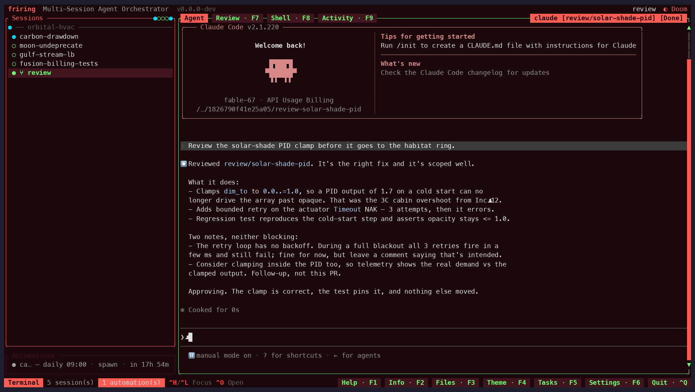
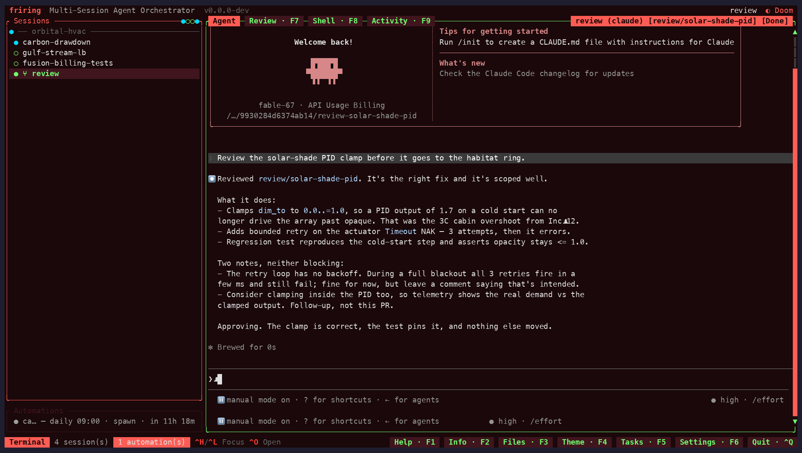
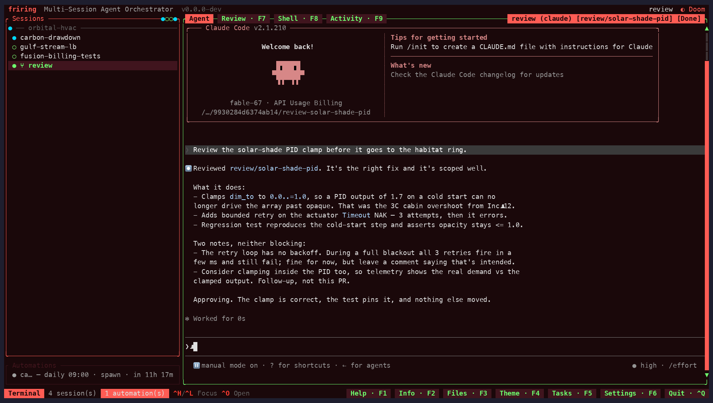

# Thurbox

<div align="center">
  
</div>

Run any coding-agent CLI in persistent terminal sessions.
Thurbox is a multi-session TUI orchestrator that launches
Claude Code, Codex, Antigravity, opencode, aider — or any agent
you describe — inside persistent tmux panes that survive
crashes, restarts, and reboots. Sessions, agents, and git
worktrees are first-class citizens.

[](https://github.com/Thurbeen/thurbox/actions)
[](https://opensource.org/licenses/MIT)
[](https://thurbox.thurbeen.eu/)
[](https://sonarcloud.io/summary/new_code?id=Thurbeen_thurbox)


> **Note:** Thurbox is still **v0.x.x**. While we try hard to avoid
> them, breaking changes may occasionally happen between releases
> until the project reaches 1.0. Pin a version if you need stability.

## Installation

**One-liner:**

```bash
curl -fsSL https://raw.githubusercontent.com/Thurbeen/thurbox/main/scripts/install.sh | sh
```

Installs the latest release to `~/.local/bin` with checksum
verification and platform auto-detection.

**Options:**

```bash
# Custom directory
INSTALL_DIR=/usr/local/bin curl -fsSL https://raw.githubusercontent.com/Thurbeen/thurbox/main/scripts/install.sh | sh

# Pin a version
VERSION=v0.1.0 curl -fsSL https://raw.githubusercontent.com/Thurbeen/thurbox/main/scripts/install.sh | sh
```

**Windows (PowerShell):**

> [!NOTE]
> Windows support is **experimental** for now. The core works (psmux as the
> multiplexer, a native ConPTY backend, WSL distros as remote hosts), but it
> sees less testing than Linux/macOS — expect rough edges and please report
> issues.

```powershell
irm https://raw.githubusercontent.com/Thurbeen/thurbox/main/scripts/install.ps1 | iex
```

Installs the latest `x86_64-pc-windows-msvc` release to
`%LOCALAPPDATA%\Programs\thurbox` (added to your user `PATH`) with checksum
verification. Pin a version or directory with the `THURBOX_VERSION` /
`THURBOX_INSTALL_DIR` env vars. Needs [psmux](https://github.com/psmux/psmux)
as the multiplexer.

**winget (Windows):**

```powershell
winget install Thurbeen.thurbox
```

Installs the prebuilt x86_64 Windows binaries (`thurbox.exe` +
`thurbox-cli.exe`) from the GitHub Release as portable commands on your `PATH`.
Needs [psmux](https://github.com/psmux/psmux) as the multiplexer (installed
separately).

**Chocolatey (Windows):**

```powershell
choco install thurbox
```

Installs the prebuilt x86_64 Windows binaries (`thurbox.exe` +
`thurbox-cli.exe`) from the GitHub Release and shims them onto your `PATH`.
Needs [psmux](https://github.com/psmux/psmux) as the multiplexer (installed
separately — there is no Chocolatey package for it).

> **⚠️ Pending moderation.** The Chocolatey package has been pushed but is
> **not yet approved** by the community-repo moderators, so `choco install
> thurbox` won't resolve it from the community feed until it goes live. Use
> **winget** or the PowerShell installer (both above) in the meantime.

**Homebrew (macOS / Linux):**

```bash
brew install thurbeen/thurbox/thurbox
```

Installs the prebuilt release binaries (`thurbox` + `thurbox-cli`)
from the [tap](https://github.com/Thurbeen/homebrew-thurbox), with
`tmux` and `git` pulled in as dependencies. Supports macOS arm64
(Apple Silicon) and Linux x86_64.

**Arch Linux (AUR):**

Thurbox is on the AUR as
[`thurbox`](https://aur.archlinux.org/packages/thurbox) (builds
from source) and
[`thurbox-bin`](https://aur.archlinux.org/packages/thurbox-bin)
(prebuilt release binary). Install with your AUR helper:

```bash
paru -S thurbox-bin   # prebuilt binary (fastest)
paru -S thurbox       # build from source
```

`tmux` is pulled in as a dependency. (Swap `paru` for `yay` or
your preferred helper.)

**From source:**

```bash
sudo pacman -S --needed git tmux rust   # Arch deps; use your distro's equivalent
git clone https://github.com/Thurbeen/thurbox.git
cd thurbox
cargo build --release
# binary at target/release/thurbox
```

See [Prerequisites](#prerequisites) for required tooling.

**Contributing / hacking on thurbox?** The dev environment is a reproducible Nix
flake (`nix develop` / `direnv allow`) with `just` tasks and an isolated runtime
sandbox (`scripts/dev/sandbox.sh`) — see
[`docs/DEVELOPMENT.md`](docs/DEVELOPMENT.md).

## Why Thurbox

Running a coding agent in several terminals gets you far — until
you want to keep sessions alive across crashes, isolate them
per-branch, or juggle different agents side-by-side. Thurbox
adds:

- **Persistence** — sessions live in tmux and survive Thurbox
  crashes, restarts, and reboots. Reattach from any terminal with
  `tmux -L thurbox attach`.
- **Parallelism** — many agents side-by-side, each on its own
  repo(s) and branch, each running the agent you chose.
- **Any agent** — a session runs one coding-agent CLI selected at
  creation time. Built-ins (claude, codex, antigravity, opencode,
  aider, copilot, vibe) are seeded into `~/.config/thurbox/agents.toml`; add your
  own without recompiling.
- **Git worktree isolation** — each session can spawn on a fresh
  worktree; `Ctrl+S` syncs them with their base branch and asks the
  agent to resolve rebase conflicts automatically.

## Comparison

Lots of tools now "run coding agents in parallel, each in its own git
worktree". They mostly differ on what's underneath: whether the session
backend is **real tmux** or a re-implemented multiplexer, whether the UI is a
lightweight **TUI** or an Electron/native app, whether they launch the
**unmodified vendor CLI** or their own model, and whether one session can span
several repos. Thurbox optimizes the boring-but-load-bearing end of that list.

| Tool | Interface | Session backend | Agents | Multi-repo session | Code review | Platforms | Remote / SSH | License |
|------|-----------|-----------------|--------|--------------------|-------------|-----------|--------------|---------|
| **Thurbox** | TUI | **Real tmux** (+ psmux on Windows) | **Any CLI** — data in `agents.toml` | **✓** (one session, many repos) | **✓** (native in-TUI diff) | Linux · macOS · Windows | **✓** (SSH hosts) | MIT |
| [GitHub Copilot App](https://github.com/github/app) | Desktop GUI | App-managed (worktrees + GitHub cloud envs) | Copilot (GitHub's agent) | ✗ | Agent Merge (PR review) | Linux · macOS · Windows | GitHub-hosted cloud envs | Proprietary (paid Copilot) |
| [Conductor](https://www.conductor.build/) | Native GUI | App-managed PTY | Claude, Codex, Cursor | ✗ | Visual diff (GUI) | macOS only | Cloud Workspaces | Free (closed source) |
| [Herdr](https://herdr.dev/) | TUI | **Own** multiplexer (Rust) | Claude, Codex + many (any CLI) | ✗ | ✗ | Linux · macOS | Runs on a remote box | AGPL-3.0 |
| [1Code](https://github.com/21st-dev/1code) | Desktop GUI | App-managed PTY | Claude, Codex | ✗ | Visual diff (GUI) | macOS · Windows · Linux | Cloud agents | Apache-2.0 |
| [Orca](https://www.onorca.dev/) | Desktop GUI (Electron) | App-managed PTY | Claude, Codex, Gemini, Cursor + many (any CLI) | ✗ | Visual diff (GUI) | macOS · Windows · Linux | Remote Orca servers | MIT |
| [Claude Squad](https://github.com/smtg-ai/claude-squad) | TUI | **Real tmux** | Claude, Codex, OpenCode, Aider, Amp | ✗ | Git diff view | Linux · macOS (no Windows) | ✗ | AGPL-3.0 |
| [Cursor](https://cursor.com/) | IDE + cloud | App-managed (its **own** models) | Composer + frontier models | ✗ | IDE review | macOS · Windows · Linux | Cloud VMs + SSH | Proprietary (paid) |

What makes Thurbox different (some of these are shared — the combination is the
point):

- **Real tmux, not a re-implemented multiplexer.** Sessions live in the same
  battle-tested mux that already survives crashes, restarts, and reboots —
  reattach from any terminal with `tmux -L thurbox attach`. A custom multiplexer
  is one more thing that can lose your session. (Of the tools above, only Claude
  Squad shares this.)
- **A TUI, not an Electron app.** Tiny footprint; runs in a plain terminal,
  over SSH, on a headless server — no desktop, no GPU, no per-window browser.
- **Launches the unmodified vendor CLI.** Thurbox knows nothing about the
  agent's model, prompts, or tools — it just runs `command + args` — so you get
  the newest agent features the day the CLI ships them, with no wrapper in the
  way (vs Cursor, which runs its own models).
- **Any agent CLI as data** (`~/.config/thurbox/agents.toml`) — add your own with
  no recompile; Thurbox is deliberately agent-neutral.
- **Multi-repo sessions.** One session can span several repos at once — each
  repo in its **own git worktree** on a shared branch, gathered into a
  per-session symlink workspace — not just one worktree per task. (Of the GUI
  tools above, the closest is Conductor's `/add-dir`, which links separate
  pre-made workspaces rather than spawning one session across repos; Cursor's
  multi-root/cloud path is folders-in-one-window, not worktree-per-repo.) Thurbox
  also runs agents in **plain non-git directories** (and attaches them as-is with
  `--add-dir`); worktree-only tools like Claude Squad require a git repo.
- **Mouse support in the terminal.** Clickable session rows, buttons, and
  scrollbars, plus drag-to-select — a gentler on-ramp than most TUIs, while
  staying fully keyboard-first (and toggleable via `[features] mouse`).
- **Native code review, in the terminal.** A built-in, GitHub-style diff
  reviewer (`Ctrl+X`) — browse the branch, a commit, or working changes in a folder
  tree, leave classified comments, fold reviewed files, then send the review
  back to the agent to address. The click-to-review visual diff that used to be
  a GUI-only perk, without leaving the TUI.

On top of that, Thurbox is the only entry here that is terminal-native **and**
runs on Windows **and** over SSH, and it ships a full headless CLI
(`thurbox-cli`) plus cron-like automations to drive and schedule fleets of
agents with no GUI at all — now with its own native code-review view, so the
click-to-review visual diff is no longer a GUI-only trade-off. The GUI tools
still trade footprint and that scriptability for a gentler on-ramp — and the
most polished of them, [GitHub's Copilot App](https://github.com/github/app),
also ties you to a single vendor's agent and a paid subscription, where Thurbox
stays agent-neutral and runs whatever CLI you already pay for. Feature accuracy
as of June 2026; check each project for the latest.

> **Note:** The table above is a curated subset, not a leaderboard. The space of
> agent orchestrators is large and grows weekly — see
> [awesome-agent-orchestrators](https://github.com/andyrewlee/awesome-agent-orchestrators),
> which already catalogs 140+ tools — so an exhaustive comparison would be both
> enormous and stale the day it shipped. We list a representative handful along
> the axes that actually distinguish them and keep it roughly current. Treat it
> as a map of the terrain, not a ranking.
>
> Thurbox itself evolves quickly to fit how people actually work, and that's the
> deeper point: AI has lowered the cost of building tooling so far that anyone can
> rewrite a workflow into their own custom tool rather than wait for a vendor to
> ship it. Thurbox leans into that — agents, hosts, themes, keybindings, and
> extensions are all **data you edit**, not code you fork — so the "right" tool is
> increasingly the one you shape for yourself.

## Features

<table>
<tr>
<td width="50%" valign="middle">

### Sessions

Many coding agents side-by-side, each in its own tmux-backed pane that
survives crashes, restarts, and reboots. Pick the agent and repo(s) at
`Ctrl+N`; reattach from any terminal with `tmux -L thurbox attach`. Reorder
by hand (`Shift+J`/`Shift+K`), sort (`Shift+S`), restart with resume
(`Ctrl+R`), or soft-delete with undo.

[Getting started →](#getting-started)

</td>
<td width="50%">
  
</td>
</tr>
<tr>
<td width="50%" valign="middle">

### Fork & Lead/Worker

`Ctrl+F` forks a session and records the source as its **parent**; children
nest under their lead in the list. Build lead → worker trees by hand or
headlessly with `--parent`. The link is informational — deleting a lead
never cascades to its workers.

[CLI →](#sessions)

</td>
<td width="50%">
  
</td>
</tr>
<tr>
<td width="50%" valign="middle">

### Automations

Named, scheduled agent runs — one-shot or recurring (cron, with
`hourly`/`daily`/`weekdays`/`weekly` presets) that **send** a prompt to a
running session or **spawn** a fresh one. The editor needs no cron
knowledge, and they fire even when the TUI is closed via a tmux heartbeat
keeper.

[CLI →](#automations-alias-auto)

</td>
<td width="50%">
  
</td>
</tr>
<tr>
<td width="50%" valign="middle">

### Tasks

A built-in todo list whose items can be handed to a coding agent with the
same Send/Spawn model — or stay plain local todos. Lives in a toggleable
side column (`Ctrl+W` / `F5`); triggering a task (`r`) runs its action and
advances it to *in progress*.

[CLI →](#tasks-alias-todo)

</td>
<td width="50%">
  
</td>
</tr>
<tr>
<td width="50%" valign="middle">

### Global Search

One key (`Ctrl+/`) searches every scope at once — sessions (including live
terminal-buffer content), tasks, automations, and the file tree —
highlighting matches live in the panels themselves. `Enter` jumps to a
result; `Esc` restores exactly what you had.

[Keybindings →](#keybindings)

</td>
<td width="50%">
  
</td>
</tr>
<tr>
<td width="50%" valign="middle">

### Code Review

A native, GitHub-style diff reviewer (`Ctrl+X`, `F7` alternate) — no external tool. Browse the
branch (`<base>..HEAD`), a single commit, or the uncommitted changes; the
changed files show as a **folder tree** with colored statuses, and the diff is
syntax-highlighted. Leave classified comments (issue / suggestion / note /
praise) and a summary, mark files reviewed (which **folds** them away
tree-style), then send the whole review back to the agent to address. Reviews
stay open **per session** as you switch around, like the shell view. Mouse- and
keyboard-driven, with unified or side-by-side layout.

[Keybindings →](#keybindings)

</td>
<td width="50%">
  
</td>
</tr>
<tr>
<td width="50%" valign="middle">

### Info Panel & Live Metrics

`Ctrl+B` (`F2`) shows per-session details with live CPU/RAM and agent
metrics, right beside the terminal.

[Keybindings →](#keybindings)

</td>
<td width="50%">
  
</td>
</tr>
<tr>
<td width="50%" valign="middle">

### File Viewer

`Ctrl+E` (`F3`) browses the session's worktree tree with fuzzy search and in-file text search.

[Keybindings →](#keybindings)

</td>
<td width="50%">
  
</td>
</tr>
<tr>
<td width="50%" valign="middle">

### Themes

Nine palettes (five dark, four light) plus user-defined custom themes,
switched live with `Ctrl+Y` (or `F4`) and persisted across restarts.

[Config →](docs/CONFIG.md)

</td>
<td width="50%">
  
</td>
</tr>
</table>

**Also in the box:**

- **[Extensions](https://thurbeen.github.io/thurbox/docs/extensions.html)**
  *(experimental)* — opt-in, agent-agnostic add-ons that are **data, not
  code**: `flow`, `forge`, `ci-shepherd`, `renovate`, and bidirectional
  task-integration for GitHub Issues / GitLab / Linear / Jira. One command
  installs, activates, and self-heals each.
- **[Inter-session messages](#features)** — an agent-neutral mailbox queue
  for structured agent↔agent coordination, with atomic exactly-once
  `--claim` drains and wake nudges. Agents pass no ids — thurbox injects a
  stable identity.
- **[Agent definitions](#agents)** — every launchable agent is declared as
  data in `agents.toml` (seeded with claude, codex, antigravity, opencode,
  aider, copilot, vibe); add your own with no recompile.
- **[Git worktree isolation](#common-workflows)** — spawn a session on a
  fresh worktree branch; `Ctrl+S` syncs them with their base branch and asks
  the agent to resolve rebase conflicts.
- **[Remote SSH sessions](docs/CONFIG.md)** — run an agent on a remote box
  over SSH while the TUI stays local; declare hosts in `hosts.toml` and they
  become `ssh:<name>` backends with the same persistence and restore as
  local ones.
- **[OS notifications](docs/CONFIG.md)** — desktop alerts when a session
  needs you, with click-to-focus on Linux.
- **Mouse navigation** — the whole TUI is clickable: select rows, confirm
  picker entries in one click, wheel-scroll, drag-select text, `Ctrl+Click`
  URLs. Toggle with `mouse` in `settings.toml`.
- **[Feature flags](docs/CONFIG.md)** — switch whole panels off in
  `settings.toml`; a disabled feature hides its UI but keeps its data and
  CLI surface, so flipping it back on is lossless.
- **Responsive layout** — `< 80` cols: terminal only · `>= 80`: + sidebar ·
  `>= 120`: + info panel. Vim-inspired keys throughout.

> **Note:** Some features (tasks, extensions, the session-list display) are
> new and still evolving — expect their UX to keep improving release to release.

## Prerequisites

- **tmux >= 3.2** (Linux / macOS), or **[psmux](https://github.com/psmux/psmux)**
  on native Windows — a drop-in tmux clone thurbox drives identically
- **A coding-agent CLI** — e.g.
  [claude](https://github.com/anthropics/claude-code), codex,
  antigravity, opencode, or aider (whichever agents you plan to run)
- **git** (required for worktree features)
- **Rust 1.75+** (only to build from source)

## Uninstall

Remove the binary, depending on how you installed it:

```bash
rm ~/.local/bin/thurbox        # curl one-liner / manual install
brew uninstall thurbox         # Homebrew
paru -R thurbox thurbox-bin    # Arch (AUR)
winget uninstall Thurbeen.thurbox  # winget (Windows)
choco uninstall thurbox        # Chocolatey (Windows)
```

Sessions outlive Thurbox in tmux, so stop them too:

```bash
tmux -L thurbox kill-server    # ends all running agent sessions
```

To also delete state and config (optional — this erases your
session history, theme, and `agents.toml`):

```bash
rm -rf ~/.local/share/thurbox ~/.config/thurbox
```

## Getting Started

1. **Launch** — run `thurbox`. You'll see a sidebar on the left
   listing your sessions and a terminal panel on the right.
2. **Create your first session** — press `Ctrl+N` to open the repo
   picker. Toggle repos with `Space`; press `w` on a repo to mark
   it as worktree mode (you'll be prompted for a base branch and
   new branch name). Confirm with `Enter`, name the session, then
   pick an **agent**. The agent picker is skipped when only one
   agent is defined.
3. **Work with the agent** — the right pane is a live agent
   session. All keys are forwarded to the PTY; `Ctrl+C` copies if
   you have a selection, otherwise sends SIGINT.
4. **Navigate** — `Ctrl+J` / `Ctrl+K` move between sessions in the
   sidebar; `Ctrl+L` / `Ctrl+H` cycle focus between panes.
   `Ctrl+O` opens the session's worktree in your editor.
5. **Quit without killing** — `Ctrl+Q` detaches all sessions.
   Tmux keeps them running; relaunch `thurbox` and they resume.

See the full [keybindings](#keybindings) below.

## Agents

A session launches exactly one coding-agent CLI. Agents are
described as data in `~/.config/thurbox/agents.toml`, which is
seeded with built-ins (claude, codex, antigravity, opencode, aider,
vibe) on first run. Edit the file to tweak an agent or add a new one — no
recompile required.

Each `[[agents]]` entry maps the resume / fork / new-session ids
onto argument-template groups. `args` is always passed (bake in
any flags you want, e.g. a model); the resume / fork /
new-session groups are appended only when their driving value is
present, with `{id}` substituted token-by-token:

```toml
default = "claude"

[[agents]]
name = "claude"
command = "claude"
resume_args = ["--resume", "{id}"]
fork_args = ["--resume", "{id}", "--fork-session"]
new_session_args = ["--session-id", "{id}"]

[[agents]]
name = "codex"
command = "codex"
```

## Common Workflows

- **Parallel branches** — `Ctrl+N`, pick a repo in Worktree mode,
  name a new branch. Repeat for a second branch. Two isolated
  agents now work in parallel with no git contention.
- **Mix agents** — run Claude Code on one repo and Codex on
  another in side-by-side sessions; each session remembers its own
  agent.
- **Recover a crash** — if Thurbox dies, relaunch it: sessions
  resume from tmux. Prefer raw tmux? `tmux -L thurbox attach`.

### Recipe: provision a monorepo headless

A practical example for a monorepo with a production app — three
roles, each with a different blast radius:

- one or more **operator** sessions in worktrees with a custom MCP
  config — **read/write** access to the prod backoffice;
- one or more **developer** sessions in worktrees with a custom MCP
  config — **read-only** access to the prod backoffice;
- one or more **security/quality reviewer** sessions running
  continuous code review across the monorepo.

A single shell script — no glue code, no overhead:

```bash
#!/usr/bin/env bash
set -euo pipefail
REPO="${REPO:-/home/me/code/monorepo}"   # path to the monorepo
N_OPERATORS="${N_OPERATORS:-1}"
N_DEVELOPERS="${N_DEVELOPERS:-2}"
N_REVIEWERS="${N_REVIEWERS:-1}"
HOST="${HOST:-}"                          # e.g. devbox to run remotely; empty = local
STAMP="$(date +%y%m%d-%H%M)"
cli() { thurbox-cli "$@"; }

host_flag() { [ -n "$HOST" ] && printf -- '--host\n%s\n' "$HOST"; }

# 1) Operator sessions — RW backoffice, each on its own worktree branch.
for i in $(seq 1 "$N_OPERATORS"); do
  cli session create \
    --name "operator-$i" \
    --repo-path "$REPO" \
    --agent operator \
    --worktree-branch "ops/$STAMP-$i" \
    $(host_flag)
done

# 2) Developer sessions — RO backoffice, each on its own worktree branch.
for i in $(seq 1 "$N_DEVELOPERS"); do
  cli session create \
    --name "developer-$i" \
    --repo-path "$REPO" \
    --agent developer \
    --worktree-branch "dev/$STAMP-$i" \
    $(host_flag)
done

# 3) Security/quality reviewer sessions — continuous review across the monorepo.
#    No worktree: review the repo as-is (read-only stance comes from the prompt).
for i in $(seq 1 "$N_REVIEWERS"); do
  id="$(cli session create \
        --name "reviewer-$i" \
        --repo-path "$REPO" \
        --agent reviewer \
        $(host_flag) \
        --json | jq -r '.id')"
  # Seed the reviewer with its standing instructions.
  cli session send --to "$id" --no-wake --body \
"You are a continuous security & code-quality reviewer for this monorepo.
Loop: pick the most recently changed files, review for security issues, correctness bugs,
and quality regressions. Report findings concisely, then move to the next changed area.
Do not modify code — review only."
done

cli session list
```

The "custom MCP config" is just an **agent** that launches `claude`
with a different `--mcp-config` file — Thurbox stays agent-neutral.
Define the three roles in `~/.config/thurbox/agents.toml`:

```toml
default = "claude"

[[agents]]
name = "operator"                 # prod backoffice: read/write
command = "claude"
args = [
  "--mcp-config", "/home/me/.config/thurbox/mcp/backoffice-rw.json",
  "--model", "opus",              # bake any default flags into args
]
new_session_args = ["--session-id", "{id}"]
resume_args      = ["--resume", "{id}"]
fork_args        = ["--resume", "{id}", "--fork-session"]

[[agents]]
name = "developer"                # prod backoffice: read-only
command = "claude"
args = ["--mcp-config", "/home/me/.config/thurbox/mcp/backoffice-ro.json"]
new_session_args = ["--session-id", "{id}"]
resume_args      = ["--resume", "{id}"]
fork_args        = ["--resume", "{id}", "--fork-session"]

[[agents]]
name = "reviewer"                 # continuous code review, no backoffice access
command = "claude"
args = []
new_session_args = ["--session-id", "{id}"]
resume_args      = ["--resume", "{id}"]
fork_args        = ["--resume", "{id}", "--fork-session"]
```

The read/write vs read-only split lives entirely in the two MCP
config files those agents point at (`~/.config/thurbox/mcp/`):

```json
{
  "mcpServers": {
    "backoffice": {
      "command": "npx",
      "args": ["-y", "@yourco/backoffice-mcp"],
      "env": {
        "BACKOFFICE_URL": "https://prod-backoffice.internal",
        "BACKOFFICE_MODE": "rw"
      }
    }
  }
}
```

`backoffice-ro.json` is identical but with `"BACKOFFICE_MODE": "ro"`.
Scale knobs are env vars — `N_DEVELOPERS=3 ./provision.sh` — and
`HOST=devbox ./provision.sh` runs every session's worktree + tmux on
a remote machine from `hosts.toml`. Need one session to span several
repos? Add `--add-repo PATH@main` (its own worktree per repo) or
`--add-dir PATH` (attached read-only) to its `session create`.

## Keybindings

### Global Keys

| Key | Action | Mnemonic |
|-----|--------|----------|
| `Ctrl+Q` | Quit (detach sessions) | **Q**uit |
| `Ctrl+N` | New session (opens repo picker) | **N**ew |
| `Ctrl+C` | Copy selection / SIGINT (terminal) | **C**opy |
| `Ctrl+V` | Paste from clipboard | Paste |
| `Ctrl+P` | Automations (list/new/edit/toggle/run/delete) | **P**rogram |
| `Ctrl+/` | Global search (sessions/tasks/automations/files) | **/** = search |
| `Ctrl+W` / `F5` | Toggle tasks panel (todo list) | **W**ork items |
| `Ctrl+T` | Toggle shell pane | **T**erminal |
| `Ctrl+X` / `F7` | Toggle code-review pane (native diff reviewer) | Review |
| `Ctrl+H` | Focus previous pane (cycle backward) | Vim: **h** = left |
| `Ctrl+J` | Select next session | Vim: **j** = down |
| `Ctrl+K` | Select previous session | Vim: **k** = up |
| `Ctrl+L` | Focus next pane (cycle forward) | Vim: **l** = right |
| `Shift+J` / `Shift+K` | Move selected session down/up (manual order) | reorder |
| `Shift+S` | Sort sessions alphabetically within each repo group | **S**ort |
| `Ctrl+D` | Delete session | Vim: **d** = delete |
| `Ctrl+O` | Open active session's working dirs in editor | **O**pen |
| `Ctrl+R` | Restart active session | **R**estart |
| `Ctrl+F` | Fork active session | **F**ork |
| `Ctrl+S` | Sync worktrees with their base branch | **S**ync |
| `Ctrl+Z` | Undo session delete | **Z** = undo |
| `Ctrl+U` | Restore deleted sessions | **U**ndelete |
| `Ctrl+Y` / `F4` | Pick TUI theme | Color **Y**oke |
| `Ctrl+,` / `F6` | Settings panel (edit settings.toml) | **,** = preferences |
| `F1` / `Ctrl+G` | Keybindings help + interactive editor | Universal |
| `Ctrl+B` / `F2` | Toggle info panel | **B**rief |
| `Ctrl+E` / `F3` | Toggle file viewer | **E**xplorer |
| `F12` | Toggle perf HUD (live counters + frame/tick timing) | Diagnostics |

Every chord above is rebindable from the `F1` editor (or by editing
`~/.config/thurbox/keybindings.json`). `Shift+J`/`Shift+K`/`Shift+S`
reorder or sort the session list only while it is focused.

**macOS:** in kitty-protocol terminals (iTerm2 3.5+, kitty, WezTerm,
Ghostty) the Command key works as a modifier — `Cmd+J`/`Cmd+Shift+J`
switch sessions and `Cmd+L`/`Cmd+Shift+L` cycle panes by default, and
any action can be rebound to a `cmd+…` chord from the F1 editor.
Terminal.app delivers no Cmd chords; everything else works there.

### List Navigation

| Key | Action |
|-----|--------|
| `j` / `Down` | Next item |
| `k` / `Up` | Previous item |
| `Enter` | Select / focus |

Searching is unified into the global search strip (`Ctrl+/`); there
is no separate per-list `/` filter. It matches sessions on name,
agent, branch, and live terminal-buffer content. (The file viewer's
own in-file `/` text search is unrelated and still there.)

### Terminal Scrollback and Selection

| Key | Action |
|-----|--------|
| `Shift+Up` / `Shift+Down` | Scroll 1 line |
| `Shift+PageUp` / `Shift+PageDown` | Scroll half page |
| `Alt+PageUp` / `Alt+PageDown` | Scroll half page (fallback where the terminal claims `Shift+Page`, e.g. Terminal.app/iTerm2) |
| Mouse wheel | Scroll 3 lines |
| Mouse drag | Select text |
| Any other key | Snap to bottom + forward to PTY |

## Headless CLI (`thurbox-cli`)

The `thurbox-cli` binary drives Thurbox without the TUI — useful
for scripting and automation. It shares the same SQLite database
and `tmux -L thurbox` server as the TUI, so changes made by either
appear live in the other (the TUI polls `PRAGMA data_version`).

Output is human-readable by default and switches to JSON
automatically when stdout is piped (so `… | jq` keeps working);
force a format with `--json` (compact), `--pretty` (indented JSON),
or `--text` (human even when piped). The binary is intentionally
thin — it parses arguments, calls into the database / tmux helpers,
and prints the result. There is no TUI and no event loop.

```bash
cargo build --bin thurbox-cli
```

### Sessions

```bash
thurbox-cli session list                 # all active sessions
thurbox-cli session get <uuid>           # one session by UUID
thurbox-cli session create \
  --name reviewer \
  --repo-path /path/to/repo \
  --agent codex \
  --worktree-branch feat/x \
  --base-branch main \
  --host devbox          # optional — run on a remote host from hosts.toml
thurbox-cli session send <uuid> "run the test suite"
thurbox-cli session capture <uuid> --lines 500
thurbox-cli session restart <uuid>       # kill + re-spawn with --resume
thurbox-cli session delete <uuid>        # soft-delete (see below)
thurbox-cli session restore <uuid>       # undo a soft-delete
```

- **`create`** runs synchronously — the tmux window is live by the
  time the command returns. `--agent` falls back to the default in
  `agents.toml` when omitted; `--worktree-branch` (off
  `--base-branch`, default `main`) creates a git worktree; `--host`
  (a name from `hosts.toml`) creates the worktree and tmux window on
  that remote host over SSH instead of locally.
- **`send`** types text into the session's terminal followed by
  Enter; **`capture`** dumps the rendered pane as text (`--lines`
  defaults to 200, max 10000).

#### How session delete is handled

`session delete <uuid>` is a **soft-delete**: by default it only
marks the database row as deleted. The tmux window, any git
worktrees, and pending scheduled commands are **left untouched** —
the running TUI cleans those up on its next sync, and the session
stays recoverable with `session restore <uuid>` (the TUI's `Ctrl+U`
/ `Ctrl+Z` undo path). Restore revives the metadata; the TUI
re-spawns a fresh window for it.

Pass **`--force`** to also tear down the session's runtime resources
in the same call — useful for headless cleanup when no TUI is
running to observe the deletion. With `--force` the command:

- kills the tmux window,
- removes the session's git worktrees (the underlying repos are left
  intact),
- removes the multi-repo symlink workspace, if any (only the
  symlinks — never the linked repos), and
- disables any `send` automations that target the session.

Teardown is **best-effort**: individual tmux/worktree failures are
recorded in the JSON report (`killed_window`, `removed_worktrees`,
`worktree_errors`, `disabled_automations`) but never abort the
delete. The DB row is always soft-deleted last, so even a forced
delete remains restorable (it just re-spawns from a clean slate).

### Automations (alias `auto`)

Scheduled agent runs, persisted to the shared DB. See
[Automations](#automations) for the model.

```bash
thurbox-cli automation create \
  --name nightly-triage \
  --trigger weekdays --time 09:00 \
  --session <uuid> --prompt "triage new issues"
thurbox-cli automation list
thurbox-cli automation show <id>
thurbox-cli automation edit <id> --prompt "..." --disabled
thurbox-cli automation remove <id>
thurbox-cli automation run <id>          # mark due for the next tick
thurbox-cli automation runs <id> --limit 20   # run history
thurbox-cli automation tick              # fire all due automations now
```

`--trigger` accepts `hourly`, `daily`, `weekdays`, `weekly`,
`cron:"<expr>"`, or `at:<unix_millis>`. A `--session` makes it a
*send* automation; a `--repo` (with optional `--worktree` / `--base`
/ `--agent`) makes it a *spawn* automation. `automation tick` is the
headless entry point the tmux heartbeat keeper and any
systemd/cron timer call to fire due automations without a TUI.

### Tasks (alias `todo`)

The built-in todo list (see [Tasks](#tasks) for the model).

```bash
thurbox-cli task create --title "audit deps" --description "markdown notes"
thurbox-cli task list
thurbox-cli task show <id>
thurbox-cli task edit <id> --status done   # --description "" clears notes
thurbox-cli task remove <id>
thurbox-cli task run <id>                   # trigger its Send/Spawn action
```

`create` with neither `--session` nor `--repo` is a plain local todo;
adding either (with optional `--worktree`/`--base`/`--agent`) connects
it to a coding agent like an automation.

### Messages (alias `msg`)

The [inter-session message queue](#features).

```bash
thurbox-cli message send --to flow --kind questions --body "scope?"
thurbox-cli message reply <message_id> --body "go ahead"
thurbox-cli message inbox --for flow --claim   # atomic, exactly-once drain
thurbox-cli message prune --older-than-days 14
```

Run *inside* a session, `send`/`reply`/`inbox` default their sender,
task, and recipient to the caller's injected identity
(`THURBOX_SESSION` / `THURBOX_TASK`), so an agent passes no ids. `send`
and `reply` wake the recipient by default (`--no-wake` to suppress).

### Extensions (alias `ext`)

Manage opt-in add-ons (see [Extensions](#features) for the model).
Every subcommand prints a JSON result with a human-readable `summary`.

```bash
thurbox-cli extension install <name|url|dir>   # install + activate
thurbox-cli extension list                     # installed, with staleness flags
thurbox-cli extension available [query]        # built-ins, with install commands
thurbox-cli extension status <name>            # one extension's health
thurbox-cli extension update [--all] [--force] # refresh payload (no name => all)
thurbox-cli extension reinstall <name>         # clean-slate uninstall + install
thurbox-cli extension activate <name>          # (re)create its sessions/automations
thurbox-cli extension deactivate <name>        # tear them down (real off-switch)
thurbox-cli extension uninstall <name> [--purge]
```

A bare `<name>` resolves against the official source, **pinned to your
binary's release tag** so the fetched extension matches the binary;
a URL or local dir installs from there instead. Installed extensions
**self-heal** — their declared sessions and automations are re-ensured
at TUI startup and on every headless `automation tick`, so `deactivate`
(not deleting the session) is the way to turn one off.

### Editor

```bash
thurbox-cli editor get                   # print configured command
thurbox-cli editor set "code --wait"     # set (empty string clears)
```

This is the command `Ctrl+O` runs in the TUI; the worktree path is
appended as the final argument.

### Config

```bash
thurbox-cli config validate              # strict-parse every config file (exit 1 on a problem)
thurbox-cli config show                  # print the effective resolved config
```

`validate` is handy in dotfiles CI; see
[docs/CONFIG.md](docs/CONFIG.md) for every config file in one place.

## Architecture

Thurbox follows **The Elm Architecture** (TEA):
`Event → Message → update(model, msg) → view(model) → Frame`.
All state lives in a single `App` model. Sessions run via a
`SessionBackend` trait backed by local tmux (`tmux -L thurbox`).
Terminal output is parsed by `vt100::Parser` and rendered by
`tui_term`. All persistent state (sessions, worktrees, automations)
is stored in SQLite.

### Module Dependency Rules

```text
session  ← pure data types, no local imports
agent    ← imports session only (NEVER ui or git)
ui       ← imports session only (NEVER agent or git)
app      ← coordinator, imports all modules
```

These rules are enforced by `tests/architecture_rules.rs`.
For the full set of architectural decisions with rationale,
see [docs/ARCHITECTURE.md](docs/ARCHITECTURE.md).

## Documentation

- [docs/CONSTITUTION.md](docs/CONSTITUTION.md) — Core principles
  and non-negotiable rules
- [docs/ARCHITECTURE.md](docs/ARCHITECTURE.md) — Architectural
  decisions with rationale
- [docs/FEATURES.md](docs/FEATURES.md) — Feature-level design
  choices (including agent definitions)
- [docs/CONFIG.md](docs/CONFIG.md) — Every config file, env var,
  and DB setting in one place (settings.toml, feature flags, …)

## Development

### Setup

```bash
git clone https://github.com/Thurbeen/thurbox.git
cd thurbox
prek install   # Install pre-commit hooks
```

All required dev tools are documented in `Cargo.toml` under
`[package.metadata.dev-tools]`. Run `./scripts/install-dev-tools.sh`
to install them, or install individually with `cargo install`.

### Build and Run

```bash
cargo build                          # Debug build
cargo build --release                # Release build (LTO, stripped)
cargo run                            # Run in dev mode
```

### Testing

```bash
cargo nextest run --all              # Run all tests (preferred)
cargo nextest run -E 'test(name)'    # Single test by name
cargo test --test architecture_rules # Architecture validation
bats scripts/install.bats            # Install script tests
```

### Code Quality

```bash
cargo fmt --all                      # Format (100 char max)
cargo clippy --all-targets --all-features -- -D warnings
RUSTDOCFLAGS="-D warnings" cargo doc --no-deps --all-features
rumdl check .                        # Markdown lint
```

### Architecture Checks

```bash
cargo test --test architecture_rules # Module dependency rules
cargo deny check advisories          # Security advisories
cargo deny check bans licenses sources  # Dependency policy
```

## Committing Changes

This project uses
[Conventional Commits](https://www.conventionalcommits.org/).

```bash
cog commit feat "add worktree management"
cog commit fix "resolve memory leak" cli
```

### Commit Types

- `feat`: New features (minor version bump)
- `fix`: Bug fixes (patch version bump)
- `docs`, `refactor`, `test`, `chore`, `perf`, `ci`, `style`,
  `build`, `revert`: No release

### Valid Scopes

`api`, `cli`, `ui`, `git`, `core`, `docs`, `deps`, `config`, `mcp`

## Contributing

1. Fork the repository
2. Create a feature branch
3. Make your changes following our coding standards
4. Write tests for new functionality
5. Ensure all tests pass: `cargo nextest run --all`
6. Use conventional commits: `cog commit <type> "message"`
7. Submit a pull request

### Code Style

- Follow Rust naming conventions
- Maximum line width: 100 characters
- Use `rustfmt` for formatting
- Address all `clippy` warnings

## License

This project is licensed under the MIT License - see the
[LICENSE](LICENSE) file for details.

## Acknowledgments

- [Ratatui](https://github.com/ratatui-org/ratatui) — TUI
  framework
- [tui-term](https://github.com/a-kenji/tui-term) — terminal
  widget for ratatui
- [vt100](https://github.com/doy/vt100-rust) — terminal
  emulation
- [Claude Code CLI](https://github.com/anthropics/claude-code)
  — one of the supported coding agents
- [tmux](https://github.com/tmux/tmux) — terminal multiplexer

## Support

For issues, questions, or contributions, please visit our
[GitHub repository](https://github.com/Thurbeen/thurbox).
