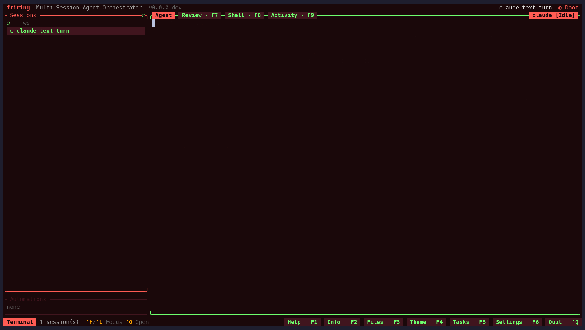
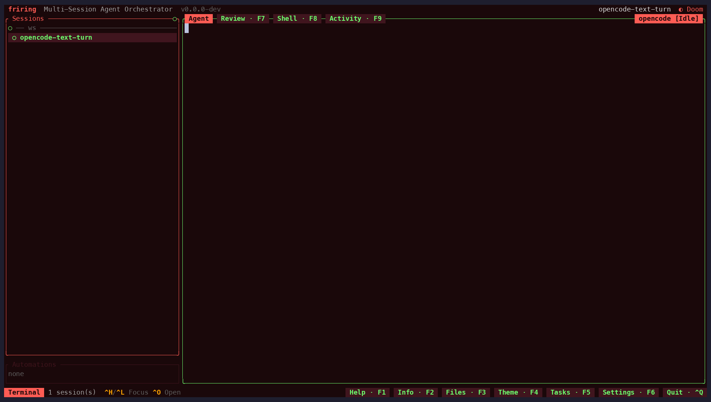

# Real-agent e2e & scenario demos

Friring's deepest integration risk is the one nothing in `cargo nextest` exercises: a **real
coding-agent binary** doing real work inside a Friring-managed tmux pane. This harness
(`scripts/dev/agent-e2e/`) closes that gap. A feature is described **once** as a *scenario*, and
that one description runs two ways:

```bash
just agent-e2e                        # asserting, hermetic, offline e2e suite (bats)
just agent-demo claude-tool-loop      # the same scenario, recorded as a demo clip
```

The agent binaries are real (Claude Code is the reference agent; codex and opencode are covered
too); the **model API is stubbed locally**, so runs are deterministic, fully offline, and free.
The same stubs also drive the demo recordings — see `docs/DEVELOPMENT.md` § Demo video. See ADR-23
in `docs/ARCHITECTURE.md` for the decision record.

The suite covers the app's **core feature surface**, not just agent smoke: tmux-persistence
re-adoption, the ghost lifecycle (unload → frozen frame → load-resume, plus lazy restore after
the agent window dies — on claude, codex, opencode *and* the scripted agent), the
`lazy_session_restore = false` opt-out and a ghost's survival of a terminal shrink,
hook-driven status incl. the real permission→blocked path and the modal guard that
keeps a headless send from answering it, restart-resume / fork /
conversation import (all riding claude's `--session-id {id}` pinning), worktree sessions and
`Ctrl+S` sync incl. the conflict handoff, code-review export, automations, tasks, messages,
extensions, global search, the F9 activity view, the four headless agent-metrics commands
(statusline / process tree / transcripts / account usage), both wizard flows, and the polish surface
(themes, settings live-reload, keybinding editor, shell pane, clipboard — in-pane OSC 52
copies asserted against a sandboxed outer clipboard, plus raw kitty-protocol Cmd+C
injection — soft delete, attention navigation). Scenarios that need no model at all run on
the **`scripted` agent** — a bash script registered through the ordinary `agents.toml`
machinery (see Agent profiles below) — so they execute in seconds on any machine, real
binary or not.

## The seam: stub the model at the HTTP boundary

The stubs (`stub/*-stub.mjs`, zero-dependency node ≥ 18 sidecars — deliberately outside the Rust
dependency graph) speak the agents' model APIs on loopback. Plain HTTP works against every pinned
binary; no TLS games. One stub per **wire dialect**, not per agent, because several CLIs speak the
same API:

| Dialect | Endpoint(s) | Pointed at it by | Agents |
|---|---|---|---|
| `anthropic` | `POST /v1/messages` (SSE; `tool_use` + `input_json_delta`) | `ANTHROPIC_BASE_URL` | claude |
| `openai` | `POST /v1/responses` (SSE) · `POST /v1/chat/completions` (SSE) | provider entry in the CLI's own config | codex · opencode |

What that buys is easier to see than to describe. Below are the `claude-text-turn` and
`opencode-text-turn` scenarios recorded as clips: two different vendor CLIs, unmodified, each
running a real turn inside a Friring pane — one talking the `anthropic` dialect, one the `openai`
one, both answered by a stub on `127.0.0.1` from the same fixture vocabulary. Neither is logged
in to anything, and the model each one names does not exist.





They are also the harness's own smoke test: the pair is what fails first, and most legibly, when
a CLI update changes its onboarding, its trust dialog, or its wire format.

`stub-core.mjs` holds everything dialect-agnostic — CLI args, the fixture matcher, the journal,
the HTTP skeleton — so a dialect stub contributes only what genuinely differs: how to summarize a
request body into the shared match shape, and how to encode a reply in that API's wire format.
Adding a dialect is one file; the fixture vocabulary below is identical across all of them, so
scenarios and demo content never care which API a CLI speaks.

Responses come from **hand-curated semantic fixtures** (`fixtures.json` per scenario), not
recorded cassettes: tool-use loops make raw record/replay brittle (request bodies grow
cumulatively and embed machine-specific tool results). A fixture matches on stable turn shape —
`modelContains`, `promptContains` / `anyUserContains` (last / any user message), `systemContains`
(the system prompt), `hasToolResult`, `toolResultFor` (a pinned `tool_use` id) — first match wins,
`{{WS}}` is substituted with the run's workspace path and `{{ROOT}}` with the sandbox root (for
`scenario_setup`-created dirs beside it). `ambient: true` marks background traffic
(e.g. side-model calls) that is answered but not required; `maxUses` guards against loops;
`delayMs` paces SSE deltas for demos. **List `ambient` fixtures first**: an ambient call is keyed
on something the primary fixture doesn't pin (`modelContains: "haiku"` for claude's side calls,
`systemContains: "title generator"` for opencode's per-session title call), and an ambient-first
order catches it before a primary fixture whose prompt text it happens to echo can shadow it —
opencode's title call replays the user's prompt verbatim, so it would otherwise match. There is
deliberately no catch-all default — it would answer surprise calls `200` and silently disable the
strictness the `UNMATCHED` marker enforces.

`reply.toolUse` is an `anthropic`-dialect feature: the tool-use loop is conformance-tested against
Claude Code, while the `openai` dialect exists to render text turns (scenarios and demo panes).
The `anthropic` stub also serves an account-usage route (`GET /api/oauth/usage`) when the fixture
file carries a top-level `usage` key (reset times are minutes-from-now, converted at request
time); friring's info panel reaches it via `FRIRING_CLAUDE_USAGE_URL` — the demo recorder uses
this so its clips show real usage gauges instead of "not logged in", and the
`claude-metrics-cli` scenario asserts `friring-cli usage` against it (seeding
`$CLAUDE_CONFIG_DIR/.credentials.json`, without which the fetch reports "not logged in" and
never reaches the stub at all).

Strictness is enforced **at assert time, not response time**: an unmatched model call gets a
benign marker reply (so the pane stays alive and debuggable) plus an `UNMATCHED` journal entry,
and the post-run invariant fails the scenario on any `UNMATCHED` — or on any non-ambient fixture
that was never exercised. The journal (`journal.jsonl` + raw request bodies) is both the top
assertion layer and the failure artifact.

## Three drive depths

The same scenario runs at three depths, so a failure localizes itself:

1. **protocol** — the agent's own print/exec mode against the stub (`agent_print_args`: `claude
   -p`, `codex exec`, `opencode run`). No tmux, no Friring. Proves the binary↔stub contract
   (streaming, tool loop, auth/onboarding bypass).
2. **interactive** — the agent's own TUI in a bare tmux pane. Proves interactive-mode behavior
   (extra traffic, trust dialogs) without Friring in the loop.
3. **full scenario** — through the real Friring TUI: headless `session create`, TUI boot +
   adoption, keystrokes forwarded through the session panel, status hooks, pane rendering.

Assertion layers, most → least semantic: stub journal (every expected call matched, no
surprises) → workspace filesystem/git side effects → session `hook_state` transitions (via
`friring-cli session get --json`; the raw persisted value, deliberately not the TUI's derived
status) → targeted pane text. Waits are always bounded event-polls; **`step_sleep` is a no-op in
test mode** (demo pacing only), so a scenario physically cannot lean on a fixed sleep to pass.

## Hermeticity & offline model

- `tbx_sandbox_init_full fresh` (shared `scripts/dev/lib/sandbox-env.sh`): throwaway
  `HOME`/`XDG_*`/`TMUX_TMPDIR`, dev `friring-dev` socket in a private dir. Nothing touches the
  real `~/.claude`, `~/.config/friring`, or any running tmux server. Leaked `FRIRING_*` identity
  vars (from running inside a Friring session) are scrubbed. Three details are load-bearing: the
  root is **canonicalized** (`/tmp` is a `/private/tmp` symlink on macOS, and the agents resolve
  their cwd to the real path — a folder-trust seed under the symlinked path misses, and the agent
  boots into a trust dialog instead of a usable UI); it sits under **`/tmp`, not `$TMPDIR`**,
  because macOS's per-user `$TMPDIR` (`/var/folders/<2>/<28>/T/`) makes the workspace path ~60
  characters before it reaches `ws/` — and that path is *on camera* in demo recordings and sets
  how wide a pane a scenario needs to read a file name off it (`claude-activity-view` needed a
  220-column pane for exactly this, and now runs at the 175 default); and the fresh `TMUX_TMPDIR`
  is a **sibling** of the root rather than inside it (a nested socket path overflows the
  ~104-byte AF_UNIX limit).
- The sandbox `settings.toml` is seeded with `[features] notifications = false` before the TUI
  boots: a session flipping to Blocked would otherwise fire a **real desktop banner** on the
  host (macOS delivers via osascript/terminal-notifier). Tests must never touch the user's
  desktop; a scenario that rewrites `settings.toml` must keep notifications off.
- Agent env (`ANTHROPIC_BASE_URL`, `CODEX_HOME`, `OPENCODE_CONFIG`, dummy tokens, telemetry
  kill-switches) is exported **before the first tmux command** — panes inherit the tmux *server*
  environment, which freezes at server start. That ordering is load-bearing; it is how the stub
  URL reaches the agent with zero core changes. The vars are per-agent by name, so one shared
  server env carries several agents at once without collision (only claude takes its base URL from
  the environment; codex and opencode read theirs from their seeded config files).
- Offline enforcement is app-level: `http(s)_proxy` point at a dead loopback port with
  `no_proxy=127.0.0.1,localhost` (**mandatory** — without it the loopback stub call is proxied to
  the dead port too), and the tool-use loop is proven to survive that, so nothing external is
  load-bearing. A kernel-level egress block (netns/iptables) would be a CI hardening step on top,
  not a replacement.
- Teardown (bats `teardown()`, runs on failure too) reaps the stub by PID, the driver tmux
  server, and the `friring-dev` server (which kills the agent panes), then wipes the sandbox
  root. On failure, artifacts land in `target/agent-e2e/artifacts/<scenario>-<ts>/`: both panes,
  journal + raw bodies, `agents.toml`, workspace diff, redacted env, versions.

## Scenario anatomy

```text
scripts/dev/agent-e2e/scenarios/<name>/
  scenario.sh     metadata + scenario_steps() + assertions (plain bash, no DSL)
  fixtures.json   the stub's semantic model script
  workspace/      optional seed files for the git workspace
```

`scenario.sh` sets `SCENARIO_*` vars (`AGENT`, `PROMPT`, `AGENT_READY`, `DONE_PATTERN`, …) and
defines `scenario_steps()` plus `scenario_assert_effects()` (mode-independent: journal, files)
and `scenario_assert_ui()` (pane/status). Two optional boot hooks cover workspace state the
static seeds can't express. `scenario_setup()` runs during boot — after the seed workspace
exists, before the stub and agent config — for extra repos or dirs (`claude-named-workspace`
uses it for a second member repo); it may also fill `SCENARIO_TRUST_DIRS` with launch dirs
beyond `$E2E_WS` that the agent profile must pre-trust. `scenario_prepare()` runs later — after
the full boot, before any keystroke, in every drive depth — for an **uncommitted** edit:
`e2e_boot` commits everything under `workspace/`, so the working-tree change a Working-target
review shows (see `claude-review-loop`) can only be made here. `SCENARIO_PRECREATE=0` skips the
headless `session create` so the steps can drive the new-session wizard itself; such a scenario
calls `step_resolve_session <name>` once the wizard has spawned, which binds `E2E_SESSION_ID`
for state waits and CLI probes (a no-op in demo mode, like `step_wait_state`). Steps use a small
dual-mode vocabulary — `step_type`, `step_key`, `step_wait_pane`, `step_wait_state`,
`step_sleep`, `step_resolve_session` — that either drives the driver tmux and polls (test mode)
or emits tape lines (demo mode; `step_wait_pane` becomes `Wait /regex/ <timeout>s`).
Keep steps a flat list: no branching, loops, or variables — the moment a scenario needs logic,
that logic belongs in the assert functions or the harness, not in a grown-by-accident DSL.

Scenario keystrokes go wherever the TUI routes them: an adopted session boots with **Terminal
focus**, so plain typing lands in the agent pane; chords in the terminal-passthrough set are
forwarded to the agent, and `Ctrl+H` cycles focus back to the session list for Friring-UI
actions. Two focus facts scenarios keep tripping over: `Ctrl+H` is a focus *cycle*, not
"go to list" — pressing it from list focus leaves the list — and a session created
**externally while the TUI is already running** (mid-steps `friring-cli session create`) is
adopted with the session list focused, unlike the pre-boot create; from there `Esc` (or
`Enter` on the row) drops into the terminal. Assert focus from the pane when in doubt (footer
focus pill / terminal pane title) instead of assuming it. Any key tmux can send is recordable, so
`SCENARIO_DEMO_KEYS` exists only to make an invisible chord legible on camera (see Demo mode).

Steps run in the bats process with the full sandbox env, so a scenario may also drive
`friring-cli`, `git`, and the two tmux servers directly from `scenario_steps` — that is how
multi-session set-ups, external-instance mutations (the multi-instance-sync asserts), and the
TUI-relaunch adoption test are built (`3>&-` on any call that can start a tmux server, like the
harness's own). Where no pane string exists to wait on, a **bounded poll helper** mirroring
`e2e_wait_pane` (fixed tries, small sleep, `e2e_die` on exhaustion) is the sanctioned escape
hatch — never an open-loop sleep. Everything in `scenario_steps` that is *not* a `step_*` runs at
tape-**generation** time in demo mode, before the TUI boots: one-shot setup (a `session create`, a
seeded task) just lands before the first frame and records fine, but a mid-step poll burns its
whole timeout against a state that can only happen later, and a mid-step `tmux kill-window` or TUI
relaunch destroys what the clip was meant to show. Scenarios built on those are **test-only**:
they say so in their header comment and are simply never listed as demos; `SCENARIO_PRECREATE=0` +
`step_resolve_session` remains the wizard-flow pattern.

## Agent profiles

`agents/<name>/profile.sh` is the whole per-agent surface — adding an agent is a profile plus
(if it speaks a new API) a stub dialect, never a harness change:

| Contract item | Meaning |
|---|---|
| `AGENT_NAME` | `agents.toml` entry name (hooks patch by name — `claude` is load-bearing) |
| `AGENT_STUB_DIALECT` | which `stub/<dialect>-stub.mjs` to boot (`anthropic`, `openai`), or `none` |
| `AGENT_HAS_STATUS_HOOKS` | `1` if the built-in hooks extension wires this agent's signals |
| `AGENT_LAUNCH_ARGS` | flags shared by all three drive depths |
| `AGENT_MODEL` | the (often fictional) model id the CLI runs and displays |
| `agent_binary` / `agent_version` | discovery (env-var pin override → `PATH`); version via `e2e_bin_version` |
| `agent_print_args <prompt>` | argv for the agent's one-shot headless mode (protocol depth) |
| `agent_env` | `KEY=VALUE` lines exported before any tmux server starts |
| `agent_seed_config <ws>…` | pre-seed config so the binary runs non-interactively; trusts every launch dir passed (`$E2E_WS` + `SCENARIO_TRUST_DIRS`) |
| `agent_agents_toml_entry` | the `[[agents]]` entry (absolute binary path) |

`agent_version` must route through the harness's `e2e_bin_version` (bounded): it runs on teardown
and artifact paths that execute for *every* test, so an agent binary that hangs instead of
answering would take the whole suite down with it rather than failing one scenario. `require_agent`
uses the same probe as its usability gate — a binary that can't print `--version` in time is
skipped exactly like a missing one, since it could never run a scenario either.

`AGENT_STUB_DIALECT="none"` **declares** an agent unstubbable (e.g. a CLI hard-wired to GitHub
auth): its scenarios refuse to run offline with a clear message instead of faking anything.
Status hooks are likewise a declared capability, not a framework assumption — `step_wait_state`
errors on an agent that never signals.

The Claude profile pins down what a new profile typically needs: `ANTHROPIC_AUTH_TOKEN` (Bearer;
the API-key path prompts interactively), a seeded `.claude.json` with `hasCompletedOnboarding`,
`bypassPermissionsModeAccepted` and per-workspace `hasTrustDialogAccepted`, and the
nonessential-traffic kill switches. Its `agents.toml` entry mirrors the production template
verbatim (`new_session_args = ["--session-id", "{id}", "-n", "{name}"]`, `resume_args`,
`fork_args`) — a user agents.toml **replaces** the built-ins, so without the templates the e2e
claude would self-mint its conversation id and restart-resume, fork, conversation import, and
the F9 activity view would all be untestable. `SCENARIO_CLAUDE_PERMISSIONS=default` in a
scenario drops `--dangerously-skip-permissions` for that run — the only way to reach the real
permission dialog and its Notification→blocked hook signal.

The `scripted` profile is the deliberate outlier: its "binary" is a bash script written into
the sandbox at boot that prints `SCRIPTED-READY mode=<new|resume|fork> id=… name=…` (the
`{id}`/`{name}` templates, expanded — the registry e2e-tests itself) and then echoes stdin
lines back as `GOT:<line>`, which cleanly separates "typed into the PTY" from "received by the
agent". It declares the `anthropic` dialect with an empty `{"responses": []}` fixture file, so
the strict-offline invariant doubles as proof the agent made zero model calls; `require_agent
scripted` never skips (bash is always present), keeping the pure-UI scenarios green on any
machine and in CI.

That `GOT:` echo is what makes the keyboard scenarios meaningful rather than decorative. The
leader-key scenario (`scripted-leader-key`) uses it to assert a *negative*: after a mistyped
leader sequence the echoed line must be exactly the probe, proving the swallowed key never
reached the agent's prompt. It is also the only place the leader chord is tested through the
real transport — the acceptance tests drive `App::update` directly, so they prove the state
machine but not that `Ctrl+F` (byte `0x06`) survives driver-tmux → friring → session-tmux.
That distinction is not theoretical: opencode's `ctrl+x` leader is documented as arriving as a
literal `^X` under tmux (sst/opencode#4097).

## Demo mode

`run.sh --demo <scenario>` boots the *same* hermetic env + stub (env inheritance mirrors
`scripts/demo/record.sh`: everything exported before the `session create` that starts the
`friring-dev` server), generates a tape, and then records it exactly the way the shipped
`docs/media` clips are recorded: **asciinema** captures the TUI's terminal byte stream while
`scripts/demo/lib/drive-tape.mjs` replays the tape into the driver tmux, and **agg** renders the
cast offline. Output is `target/agent-e2e/demos/<name>.{gif,mp4}`.

`SCENARIO_DEMO_THEME` seeds `metadata.active_theme` like `record.sh` does — it defaults to
**`doom`**, so a set of clips reads as one product, and a scenario overrides it only when the
theme is itself the subject. Scenario prompts, stub replies and agent model ids follow
`scripts/demo/demo-content.json`'s register: planetary-infrastructure ops treated as routine,
answered by models that do not exist (`fable-67`, `gpt-6.2`, `tempest-oss-140b`). That is not
decoration — a fictional model id keeps a real product name off camera, and off a clip that
would otherwise date itself. (Its one cost: Claude Code cannot know an unknown model's context
window and says so across six lines of the pane, so the profile answers with
`CLAUDE_CODE_MAX_CONTEXT_TOKENS`.)

**Why bytes and not pixels.** This path used to drive `vhs`, which screenshots a headless
Chromium. Grabbing pixels costs real time per frame, so the capture starves the moment the box
cannot rasterize fast enough — and vhs writes the gif at the *nominal* rate regardless, so a
starved capture does not degrade quality, it **compresses time**. Measured: 8s of scripted
`Sleep` recorded as 0.84s at 1920x1080, 2.08s at 1280x720, and the full 7.6s at 700x300. The
sustainable rate at demo size was ~5fps, which also meant typing arrived in visible chunks of
five or six characters — a paste, not a person. Capturing the byte stream costs nothing: every
paint is kept with its true timestamp and the render can take as long as it likes.

**Waits film, and they fail the take.** `step_wait_pane` becomes a `Wait /re/` that polls the
same pane the asserting test polls, so a clip carries the app's real latency — the spinner, the
boot, the turn — and a wait that never resolves aborts the recording by line number instead of
producing a clip that ran to the end having skipped what it came to film. Each wait is followed
by a short dwell (`Sleep 300ms`), because a wait ends the instant its marker paints and the
frame it resolved on would otherwise last as long as it takes to send the next key. Keep
explicit `step_sleep` beats under the 1s max-held-frame budget.

**The demo presses what the test presses.** `step_key` emits `Key <tmux-key>`, handed straight
to `tmux send-keys` — there is no translation table, so no key is unrecordable (F-keys, `M-u`,
`C-\`), and a name tmux does not know fails the take. `SCENARIO_DEMO_KEYS` still exists, but as
an **editorial** choice rather than a workaround: an Alt chord is invisible on camera, so
`"M-u=C-f U"` unloads through the fork's leader and the which-key overlay shows the viewer what
was pressed. Whether a substitution preserves what the clip *shows* is the scenario's
judgement, never the harness's — `scripted-info-keybind` presses F2 to prove it does **nothing**
after a rebind, so routing it to that action's leader key would record the opposite of the
feature.

Press the leader with **`step_leader <key>`**, not two `step_key`s. A leader chord is two
keystrokes the app has to see as two events; test mode gets that gap for free (each `step_key`
is its own process) and a tape does not. It is also the only reason the which-key overlay is
ever on camera. `scripts/demo`'s hand-written tapes sleep 500ms in the same place.

Typing runs at `E2E_DEMO_TYPING_MS` (16ms/character) rather than the 50ms VHS default the
hand-written tapes inherit: a scenario prompt is a whole sentence of agent instruction, and at
50ms those read as dictation. `drive-tape.mjs` charges each keystroke's own `tmux send-keys`
spawn against the interval instead of adding to it — at 10-20ms per spawn on macOS, not doing
so typed at roughly half the nominal speed.

**Two boot-state traps**, both of which make a scenario pass as a test and film the wrong thing:

- Anything in `scenario_steps` that is not a `step_*` runs at tape-*generation* time — so a
  fleet scenario's `friring-cli session create` calls land **before the TUI starts** in demo
  mode and **while it is already running** in test mode.
- Which follows from that: the TUI focuses the terminal when it boots with a session and the
  session list when it boots empty, and it opens on the *last* session in the DB. So a scenario
  that starts by typing, or that navigates relative to whatever is active, must pin both —
  precreate at least one session (`SCENARIO_SESSION_NAME` names it), wait on the footer's
  focus field, and jump to a known row before the first relative move.

`scripts/demo/lib/check-pacing.mjs` runs over the result and **reports without gating**. Its
budget is calibrated for the hand-written tapes, which film a seeded TUI and no agent latency at
all; these clips film real CLIs booting and answering, so a held frame here is often the app
being honestly slow — which is usually the thing the scenario came to show. Its **opening**
metric is the least trustworthy of the lot: it shells out to ffmpeg `freezedetect`, which by its
own header cannot tell a stall from typing. Read the first frame before believing it.

Recordings land under `target/`. A handful are committed — the clips this doc and
`docs/FEATURES.md` / `FORK.md` embed — and those live in **`docs/media/fork/`**, where CI gates
them with `--profile=agent`: the held-frame and opening budgets relax to a measured ceiling, the
size cap and the blank-final-frame backstop do not relax at all. The recorder prints that same
profile, so what it shows is what CI will enforce. `docs/media/fork/README.md` has the numbers
and says which clip is linked from where.

**Keep the agent's boot off camera.** `SCENARIO_DEMO_PREROLL` is a pane pattern the recorder
waits for *before* filming starts, defaulting to the scenario's own `SCENARIO_AGENT_READY`. A
CLI booting shows an empty pane, and it lands on the opening frame — which is the README preview
and the whole of an autoplay impression — so it is the one wait worth taking off camera. A
scenario whose narrative *is* the boot sets it to `""`. Do not follow it with a `step_sleep`: the
pre-roll has already settled the pane, so a beat there just holds the opening frame.

The closing beat is a lingering `Sleep`, deliberately **not** `Ctrl+Q`: quitting inside the
recording ends the clip on ~1s of bare shell, which `check-pacing.mjs` rejects as a leaked
teardown (measured 0.07-0.09% ink against the 3.4-9.0% of a good final frame). Recording ends by
**detaching** the filmed client with the TUI still up, and `trim-cast.mjs` drops the detach's own
teardown from the tail — and normalizes U+00A0, which Claude Code pads with and agg is alone in
drawing as a visible icon (Meslo has no glyph for it, so the fallback chain answers with a Nerd
Font one that overlaps the next character). The TUI is reaped by `e2e_teardown` afterwards, off
camera.

The terminal is sized from the scenario's `SCENARIO_COLS`/`SCENARIO_ROWS`, and agg rasterizes
that grid at `E2E_DEMO_FONT_SIZE` in the same face the shipped clips use — which it is asked to
confirm up-front, because agg falls back silently when a family is missing. **That geometry is
the aspect ratio**, since there is no canvas to fit the grid into: the 175x42 default is
`record.sh`'s `DEMO_COLS`/`DEMO_ROWS` and renders 1918x1084, pixel-identical to every shipped
clip. A scenario that overrides it records at its own ratio, which is right when the size is the
subject and a mistake otherwise.

Tape generation is factored out of recording (`e2e_emit_tape`): `run.sh --emit-tape <scenario>`
writes the `.tape` and prints its path **without** booting a session or rendering anything —
pure step→tape mapping, so it works offline with no agent binary and is unit-tested
(`unit.bats`, which parses the result with the real driver).

## Running & knobs

```bash
just agent-e2e                              # whole suite (builds dev binaries first)
just agent-e2e 'tool-use loop'              # filter by TEST NAME (bats --filter regex)
just agent-demo claude-text-turn            # record a scenario as gif+mp4
scripts/dev/agent-e2e/run.sh --emit-tape claude-text-turn  # .tape only, offline
scripts/dev/agent-e2e/run.sh --list         # list scenarios
```

The suite runs `unit.bats` (pure-shell harness tests — the strict-offline invariant and the tape
generator, no agent binary) before `suite.bats` (the real-agent scenarios), so a green run always
verified the harness logic even where claude is absent. The `--filter` matches bats *test names*,
not scenario directory names — a non-matching filter runs zero tests and still exits green (bats
semantics), so check the `1..N` line when filtering.

`FRIRING_E2E_{CLAUDE,CODEX,OPENCODE,ANTIGRAVITY}_BIN` pin a binary per agent; `FRIRING_E2E_KEEP=1`
keeps the sandbox for post-mortem; `FRIRING_E2E_SKIP_BUILD=1` skips the cargo build. Requires tmux,
node ≥ 18, jq, git, curl, coreutils `timeout` (**`gtimeout` is preferred** — third-party `timeout`
shims exist on `PATH` in the wild and silently break TUI children), bats (tests) /
asciinema + agg + ffmpeg + sqlite3 (demos). An agent binary that is missing — or present but
unresponsive — makes only *that* agent's scenarios **skip**, not fail, so a machine with any
subset of the CLIs stays green; missing infrastructure tools are hard errors.

CI: the `agent-e2e` job (`.github/workflows/ci.yml`) installs tmux + bats + the **pinned**
`@anthropic-ai/claude-code` and runs the suite. It is path-gated like every job and deliberately
**not** in `all-checks.needs` — it exercises an externally-pinned binary, so its failures need a
human eye (conformance drift vs real regression) and must never block a merge.

## Performance scenarios

A scenario with `SCENARIO_PERF=1` doubles as a **benchmark rig**: the whole real pipeline (tmux →
control-mode reader → `vt100` → `tui_term`) under an exactly reproducible load — the stub's
`flood` fixture field generates large streamed replies (`{"line": "…", "count": 1200}` ≈ 85KB in
1KiB SSE chunks) without megabytes of hand-written JSON. The harness exports `FRIRING_PERF_LOG=1`
to the TUI, records wall-clock marks (`perf_mark`, ~100ms resolution), and writes a report to
`target/agent-e2e/perf/<scenario>-<ts>/`: mark deltas, plus the TUI's own published snapshot
(`friring-cli perf` — counters, frame/tick percentiles, startup breakdown, slow ops).

Reports are benchmarks, **not gates**: the test passes/fails on functional asserts and on the
perf-publishing chain working (a missing snapshot fails the scenario), never on timing thresholds
— wall-clock gates flake on shared runners, and counter-based regression *gating* stays with the
`perf_*` tests (`docs/PERFORMANCE.md`). Numbers from the default debug build are for plumbing
only; for measurements, point the harness at a release build:

```bash
cargo build --release --bins
FRIRING_E2E_BIN=target/release/friring just agent-e2e 'perf'
```

The shipped `claude-perf-flood` scenario is the template: flood turn through the pane, marks at
ready / prompt-sent / flood-rendered / turn-done, snapshot polled after the turn (the TUI
publishes once per ~1000-tick perf window, so the report waits up to 30s for it).

## Updating the pinned agent binary

The npm pin in the CI job is the version the fixtures are conformance-tested against (not
tracked by renovate — it lives in a run command on purpose). To bump: update the pin and run
`just agent-e2e` locally against that version. Two drift signals catch new traffic for you: a new
**model / side-model call** with no matching fixture is `UNMATCHED` — a hard failure — so cover
genuine new background traffic with an `ambient` fixture; a new **non-message endpoint** (a
telemetry or config probe) is harmless (a custom `ANTHROPIC_BASE_URL` proxy ignores it too), so
it doesn't fail the run but is surfaced to `target/agent-e2e/unexpected-endpoints.log` and a CI
`::warning::` annotation — review it, and extend the allowlist in
`e2e_surface_unexpected_endpoints` if it's expected.

## Conformance status

Everything below is proven empirically against the pinned versions; each agent's quirks live in
its profile, not in the harness.

**claude 2.1.215** — plain-HTTP loopback `ANTHROPIC_BASE_URL`; SSE streaming required; full
tool-use loop (real `Write` executed, `tool_result` posted with the pinned id); `-p` and
interactive modes; traffic is `HEAD /` + `POST /v1/messages?beta=true` only (no `count_tokens`,
no side-model calls, with or without the nonessential-traffic switch, in these flows); the whole
loop survives dead-proxied egress; interactive mode makes **no** model calls before the first
prompt. The `❯` input-box glyph is the ready marker; the footer text varies by permission mode.
`ANTHROPIC_MODEL` sets the model it sends *and* displays, so a fictional id renders in its header.
Also proven on this version: `--session-id {id}` / `-n {name}` are accepted at spawn (the
transcript lands under `projects/<slug>/<id>.jsonl`, which is what the restart / fork / import /
activity scenarios ride); `--resume <id>` and `--resume <id> --fork-session` replay that
transcript **locally with zero model calls** (the journal count is the assert); and in default
permission mode a stubbed `Bash` tool_use raises the permission dialog — its Notification hook
payload contains "permission" (→ `blocked`), the question line greps as "Do you want", and a
plain `Enter` approves the pre-selected "Yes".

**codex 0.144.4** — a custom `[model_providers.*]` needs **no login at all**: the ChatGPT auth flow
only guards the built-in `openai` provider, and with no `env_key` codex sends no auth header (with
one set, the var must be non-empty or it hard-errors). `wire_api = "chat"` is **removed** in this
version — it errors at startup, so the stub speaks Responses. Fictional model ids are accepted with
only a "Model metadata not found" warning, and render in both the header box and the footer. The
prompt glyph `›` is the ready marker (the composer's placeholder text rotates — never match it).
Gotchas: the TUI **rewrites `config.toml` on startup**, so seed it fresh per run and never assume
it stays byte-identical; `codex exec` appends piped stdin to the prompt, hence the harness's
`< /dev/null`; and the release banner is interactive, so the profile seeds
`check_for_update_on_startup = false` (a stray Enter on it launches a real package-manager
upgrade). Zero non-stub calls under dead proxies. Also proven (0.145.0): `codex resume
--last` in the session cwd re-renders the prior conversation **locally with zero model calls**
(the ghost-unload scenario's journal assert), which is what friring's restart and ghost-load
paths ride.

Status hooks are covered on codex too (0.145.0), which needs three things no other profile does.
`CODEX_HOME` points at the sandbox HOME's **`.codex`** — the literal path the hooks extension
merges into (`requires_dir = "~/.codex"`), so friring and codex share one file instead of friring
writing hooks the binary never reads; the dir is created by `agent_seed_config`, which runs before
the harness activates the extension (a missing dir silently skips the merge). Every launch carries
**`--dangerously-bypass-hook-trust`**: codex won't run a hook until its command string is accepted
at an interactive "Hooks need review" prompt, and the hash it persists isn't something the harness
can pre-seed. And `codex-text-turn` asserts `idle → working → done` **plus** the absence of any
hook cell in the pane — codex parses hook stdout strictly and rejects anything but empty or valid
JSON, and since a rejected hook still *ran* its command, the DB state alone cannot catch it.

Codex is also the reference agent for **pane scrollback** (`codex-scrollback`, 0.146.0), because
it is the only covered agent that renders on the *normal* screen: `alternate_on` stays 0 and it
enables no mouse tracking at all, so its transcript really scrolls out of the top of the pane
instead of being repainted in place. It grows that transcript the way ratatui's inline viewport
does — pin a `DECSTBM` region anchored at row 1, scroll inside it, reset — which is precisely what
stock vt100 refuses to keep (see "Which vt100" in `docs/ARCHITECTURE.md`). The scenario stubs a
reply taller than any pane the harness renders, waits for its head to leave the screen, and then
presses `Shift+Up` until the head comes back; against stock vt100 the view never moves. It is
test-mode only: `Shift+Up` is recordable (`Key S-Up`), but every codex demo currently stalls
waiting for the pane's ready glyph — see `docs/media/fork/README.md`.

**opencode 1.17.15** — the `@ai-sdk/openai-compatible` runtime is bundled in the binary (nothing is
fetched from npm) and a cold cache works offline, so no warm-up step is needed; the models.dev
catalog fetch is best-effort and disabled anyway. Fictional model ids pass with no catalog
validation. One **ambient** call: title generation on each session's first message, to the same
model, keyed by its "title generator" system prompt — its reply becomes the visible session title.
No trust/onboarding dialogs. Ready marker: the input-box footer `Build · <model> <provider>`.
Also proven: `opencode --continue` in the session cwd re-renders the prior session **locally with
zero model calls** (the ghost-unload scenario's journal assert) — friring's restart and
ghost-load paths ride it.

**antigravity (`agy`) 1.1.2 — unstubbable, declared `none`.** Not the Gemini CLI and it does not
share its auth surface: a Go binary that forces interactive Google OAuth
(`accounts.google.com`, cloud-platform scope) before any model traffic. There is no API-key path
and no base-URL env that bypasses the gate (`CLOUD_CODE_URL` exists but is only consulted after
auth); `GEMINI_API_KEY` / `gemini-api-key` appear nowhere in the binary. A local stub receives
**zero** requests, proxied or not, so its scenarios refuse to run offline rather than fake a login.
It is featured logged-out in the demos instead — which also keeps a signed-in account's email off
camera.
