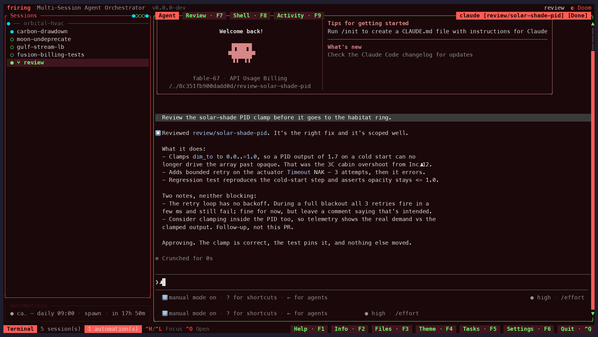
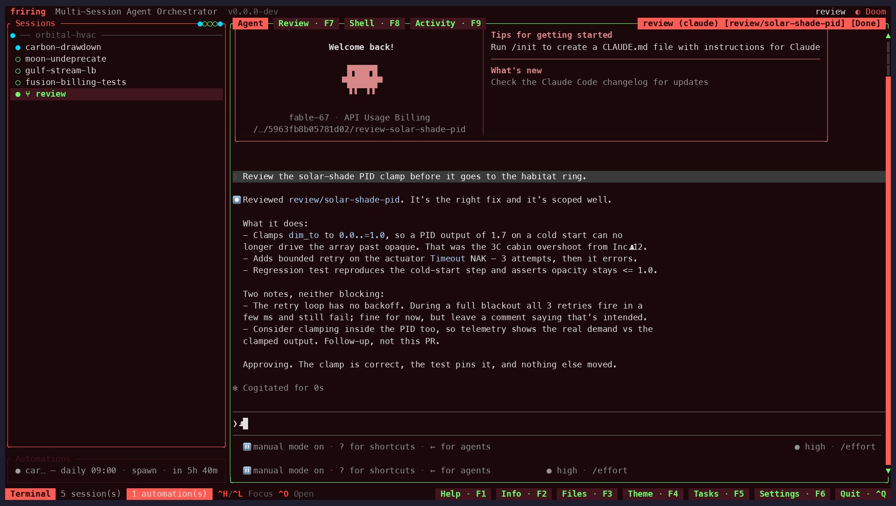

# Feature Decisions

Design rationale for user-facing behavior.
For architectural choices, see [ARCHITECTURE.md](ARCHITECTURE.md).

---

## Session Sidebar

### Single session list

The left sidebar holds a single flat list of sessions — there is no
project grouping layer above it. Sessions are top-level, identified
by a UUID v4, and labeled with their name, agent, branch (when in a
worktree), and cwd.

**Why no projects?**

- An earlier design grouped sessions under projects (one project →
  many sessions, with shared repos). In practice users tended to
  create one session per task, so the project layer was pure
  overhead: an extra navigation level, an extra creation step, and
  an extra deletion guard.
- Removing the project layer (storage migration v16 dropped
  `projects` and `project_repos`) collapses the model to "sessions
  own their own configuration". Each session picks its own agent
  and repos at creation time.

**Why a sidebar at all instead of a popup?**

- Sessions are persistent context, not transient selections. An
  always-visible list shows each session's status and live agent
  activity at a glance — useful for monitoring multiple parallel
  agent sessions.
- The sidebar fits cleanly into the existing 3-tier responsive
  layout (`<80`, `>=80`, `>=120`); a popup would require its own
  open/close keybinding and dismissal logic.

### Fuzzy search

Searching is unified into the **global search** (`Ctrl+/`) — see the
*Global Search* section below. There is no separate per-list `/`
filter; instead the global popup highlights matches live across the
session list, tasks panel, and automations pane at once. Sessions are
matched on name, agent, branch name, and cwd.

**Why all four fields?** Users remember sessions by whichever
attribute is most distinctive — sometimes the branch name, often
the agent ("the codex one"), occasionally the repo path. Indexing
all four makes the search hit on the first attempt without forcing
the user to remember which field to type into.

### Live status & "needs attention"

Each row is a single line: `<status-dot> <name> [<agent-status>]`
(worktree sessions get a `⑂` mark before the name). The agent's live
activity title (the OSC `0`/`1`/`2` window title it sets, e.g. Gemini's
`◇ Ready`) is appended after the name when present, muted and truncated
with `…` to fit the panel. The repo/branch and agent live in the info
panel, not the list row.

The colored **status dot** is driven by **agent hooks**, not output
heuristics. Each agent CLI's lifecycle hooks call `friring-cli session
signal --state <working|blocked|done|idle>` (identity from the injected
`FRIRING_SESSION`), and `refresh_session_statuses` maps the persisted
state to one of six `SessionStatus` values once per tick:

| State | Colour | Glyph | Meaning |
|-------|--------|-------|---------|
| `Working` | yellow | braille spinner (`⠋⠙⠹…`; static `◐`) | agent is actively running |
| `Blocked` | red | `◆` | agent needs input or approval |
| `Done` | blue | `●` | a turn just finished; shown until you switch away |
| `Idle` | green | `○` | acknowledged, never active, or at rest |
| `Error` | red | `✗` | reserved for a crashed agent (not derived yet) |
| `Unreachable` | muted grey | `⊘` | remote host is down/offline; placeholder row awaiting reconnect |

A `Done` session becomes `Idle` once you move focus off it (you've
acknowledged it); a `working` session that goes quiet for 10 s is
treated as `Idle` so an interrupted turn never spins forever. A remote
session whose host is unreachable is shown as a **placeholder** tagged
`Unreachable` — it never silently vanishes from the list, and the host
is retried in the background (or on demand via restart) until the session
reconnects and adopts in place. This covers both a host that is down at
restore *and* a live session whose host dies mid-run (detected via the
control-mode connection dropping). Status only **recolors** the dot — the
manual order is never disturbed (see *Smart ordering* below). Repo groups
roll up to their most-urgent member
(`Blocked > Error > Working > Done > Unreachable > Idle`).

**Navigating to what needs you.** `F10` (rebindable `NextBlockedSession`)
jumps to the next `Blocked` session — scanning forward from the active one
in rendered order, wrapping — and lands focus in the terminal, so pressing
it repeatedly walks the attention queue top-to-bottom, answering each
prompt in turn. `Alt+A` (rebindable `JumpToBlocked`) numbers only the
blocked sessions `1`–`9` in the list and a digit jumps straight to that
one — fewer, lower digits than the all-session `Alt+digit` numbering when
the list is long. Held with Alt (kitty-protocol terminals) the numbers
live until Alt is released; tapped (legacy terminals) they stay until a
digit, `Esc`, or any other key. The blocked count is surfaced twice: a
`◆N` badge ahead of the status dots in the session list's title bar, and
a `◆ N blocked · F10` badge in the footer (carrying the live shortcut),
so attention stays visible even when the sidebar is hidden on a narrow
terminal.

The hooks are wired automatically by the built-in **hooks** extension
(auto-activated on first run; opt out with `friring-cli extension
deactivate hooks`). How much each agent can report depends on the
lifecycle surface its CLI exposes — claude, opencode, and antigravity
report the full range, codex reports idle/working/done, aider reports
blocked, and vibe is experimental. See the per-agent matrix in
`extensions/hooks/README.md` (and the website's *Agent hooks* page).

### Status internals (hooks, persistence, derivation)

`SessionStatus` (`src/session/mod.rs`) is the six-state enum above. The
implementation anchors:

- **The callback.** Agents report transitions with `friring-cli session
  signal --state <working|blocked|done|idle>` (`cli::sessions::Action::Signal`);
  identity is the injected `FRIRING_SESSION` (falling back to a lookup by
  `agent_session_id` / `FRIRING_SESSION_ID`), so a hook passes no id. It writes
  the persisted state and the TUI picks it up via `PRAGMA data_version` — works
  headless. **Remote** sessions can't run the CLI, so the materialized hook
  file instead sets a tmux pane user option (`@friring_state`) delivered over
  the control-mode subscription into the same columns (see *Remote SSH & WSL*).
- **Persistence.** `sessions.hook_state` / `hook_state_at` / `seen_at` (schema
  **v34**), with targeted-UPDATE accessors `set_hook_state` /
  `mark_session_seen` / `load_hook_states` (`storage/sessions.rs`).
  `upsert_session` deliberately **never** lists the hook columns, so the TUI's
  full-row write-back can't clobber a state a headless hook set. A fresh spawn
  seeds **nothing** — a never-reported session is `Idle`, and the agent's hooks
  drive it from there.
- **Derivation.** `App::refresh_session_statuses` (`src/app/mod.rs`) derives
  each session's status every tick (exited → `Idle`; else the persisted state).
  Rows are **cached** (`App::cached_hook_states`) and reloaded only when `PRAGMA
  data_version` moves (ADR-P6); same-connection writes apply write-through.
  `done` shows as `Done` whether focused or not and becomes `Idle` only when
  you move focus off it — the change vs. `last_active_session_id` marks the
  just-left `done` session `seen` (persists `seen_at`, one-shot).
- **Stuck-`working` fallback.** Claude Code fires no hook on interrupt
  (Esc/Ctrl+C) or on return to the idle prompt, so `derive_session_status`
  guards with an **output-quiescence fallback** (`WORKING_OUTPUT_STALE_MS`,
  10 s): a `working` session with no terminal output for that long is treated
  as `Idle`. Only `working` is time-gated (a live turn animates its progress
  line, e.g. Claude's `(Xs · esc to interrupt)`); the DB row is untouched.
- **Animation & glyphs.** The list animates the `Working` spinner
  (`ui::SPINNER_FRAMES`, `App::spinner_frame` from `tick_count`, ~8 fps,
  repainted only while something works); `ui::status_glyph(status, spinner)`
  picks the frame (filled `●` Done vs hollow `○` Idle), the static `icon()`
  serving non-animated contexts (info panel).
- **Unreachable placeholders.** An unreachable remote session is inserted as a
  `Session::placeholder` (`src/agent/backend.rs`) — no live pane, reader/writer
  never spawned, keystrokes dropped, and `resize`/`kill`/`detach`/`save_state`
  skip it. `App::poll_remote_restore` / `maybe_retry_remote_restore` retry a
  down host every `REMOTE_RETRY_INTERVAL` (20 s) — or immediately on `Ctrl+R` —
  and replace the placeholder **in place** (same `SessionId`, order signature
  unchanged). Mid-session loss is caught by `App::detect_lost_remote_sessions`
  via `has_exited()`: because tmux runs `remain-on-exit=on`, a reader EOF means
  the SSH connection dropped (not a clean exit), so the session flips to
  `Unreachable` + `enqueue_remote_reconnect`. This composes with
  `crate::shell::SSH_HARDENING_OPTS` (`BatchMode=yes` + `ConnectTimeout` +
  `ServerAlive*`) so a broken host never prompts for a password or hangs the
  render loop.
- **Rollup & colours.** Repo groups roll up to their most-urgent member
  (`Blocked > Error > Working > Done > Unreachable > Idle`) via
  `ui::project_list::group_status` + `group_header_line`; status only recolors,
  never reorders. The dot colours are tunable theme fields
  (`status_working`/`status_blocked`/`status_done`/`status_idle`/`status_error`
  in `session::theme_config`, all 15 presets + custom overrides), mapped by
  `ui::status_color`.

### Smart ordering & repo groups

The list is **grouped by repository** under subtle headers
(`── webapp ─────`), and within a group sessions follow their **manual
order** (`display_order`, see *Manual ordering* below). Manual order is
authoritative: once a row has been placed, a status change only
**recolors its dot**, it never moves the row. Sessions that were never
moved fall back to creation order:

- Sessions with no manual order render after ordered ones in stable
  insertion order. `Busy` and `Waiting` deliberately **share one
  "running" status**: a live agent flickers across the ~1s output
  boundary every tick, so they share a single dot colour rather than
  jittering between two. Ordering is a pure function of *manual order*
  and *stable order*, never of live timing — so the list never re-sorts
  itself, even when a session needs attention or exits.
- Groups are ordered by their **lowest member `display_order`**, then by name
  for determinism — so moving a session to the top of its group can pull the
  whole group up, but a status change never reshuffles the groups.
- The group key is the **set of repos a session spans** (order-independent), so
  a multi-repo session forms its own group with a combined header
  (`webapp + infra`) rather than being filed arbitrarily under one repo;
  sessions touching the same set cluster together. Sessions with no repo share a
  `(no repo)` group.

**Why group by repo?** With several parallel agents the dominant question
is "which project is this?" — clustering same-repo sessions answers it at a
glance, and a stable manual order means a row stays where you put it (a
blinking status dot still flags urgency without yanking the row around). A
single comparator (`ui::project_list::compute_session_order`) drives both
rendering and `Ctrl+J`/`Ctrl+K` navigation, so the keyboard always steps
through the exact order shown.

**Why signals instead of guessing?** Pure output-timing can only say
"quiet for >1s"; it can't tell a thinking pause from "done" or "needs
you". The agents already emit these signals — we just read them. This
mirrors how dashboards like Orca surface working / waiting / finished.

**Caveat (Claude in tmux):** Claude Code only emits the OSC 9 desktop
notification for Ghostty/Kitty/iTerm2, so inside friring's tmux pane
set `claude config set --global preferredNotifChannel terminal_bell`
to get the bell we can detect. We capture bell + OSC 9 + OSC 777,
whichever the agent produces.

### Manual ordering & alphabetical sort

The list is manually orderable. With the session list focused,
`Shift+J`/`Shift+K` move the selected session one row down/up
(rebindable `SessionListMoveDown`/`SessionListMoveUp`). A move swaps two
adjacent **blocks** — a row plus its nested children, so a parent drags
its whole subtree: root rows swap within their repo group, the **whole
group** swaps past a group edge, and nested children move among their
siblings only. `Shift+S` (rebindable `SessionListSortAlphabetically`)
sorts every group's sessions alphabetically by name in one shot,
preserving group order and parent/child nesting.

Both paths densely renumber every session's `display_order` `0..n` and
persist it, so the order survives restarts and syncs across instances
via the existing `data_version` polling. The pure helpers
(`ui::project_list::move_in_order` / `sort_alphabetically_within_groups`)
back `App::move_active_session` / `sort_sessions_alphabetically`; storage
is the nullable `sessions.display_order` column (schema v31, `None` =
never moved).

**Why manual order wins over status.** Earlier the list re-sorted itself
by status, which meant a row jumped around under your cursor every time
an agent finished or started thinking. Letting the user pin the order —
and only recoloring the status dot in place — keeps the list a stable
spatial map you can build muscle memory against.

---

## Session Creation



`Ctrl+N` walks through a series of modals to configure a new
session. Each step has a sensible default and can be skipped when
not applicable. `Esc` steps **back** one step with your choices
preserved (the repo palette returns exactly as you left it); on the
first step it cancels. Two exceptions stay full cancels: the agent
picker while its worktrees are still being created (they're kept on
disk), and a fork — it has no prior step.

1. **Host picker** — choose where the session runs: `local`, or any
   remote SSH host defined in `hosts.toml`. Skipped entirely when no
   remote hosts are configured (preserving the local-only flow). For
   a remote host the repo picker shows the repos previously used *on
   that host* (bookmarks are host-scoped, schema v39); new paths are
   typed (`Tab` lists the remote directory once over ssh — filling
   the candidate list and completing — `~` resolves to the remote
   home, and existence is verified on Enter; typing never triggers
   remote IO) and the worktree + tmux window are created on that
   host over SSH.
2. **Repo picker** — an always-type palette: one focused input over
   the recency-sorted bookmark list. Typing fuzzy-filters the list;
   typing a path (`~`, `/`, `./`, `../` prefix) switches the list to
   **live directory candidates** (git repos marked `(repo)`) with
   `Tab` completion — `Tab` only ever completes, it never moves
   focus. `↑`/`↓` browse the candidates; `Enter` on a repo candidate
   bookmarks + opens it, on a plain directory drills in, and on the
   typed path itself (no highlight) adds + opens any existing dir.
   In filter mode `Enter` opens the highlighted repo directly
   (single-keystroke fast path) or confirms the picked set. `Space`
   (while the input is empty) or `Ctrl+Space` (always) picks
   additional repos, `Ctrl+T` marks a repo as a worktree base, and
   `Del` (input empty) forgets a bookmark. A pinned `start in ~`
   row makes the no-repo session an explicit choice, and a first
   run with no bookmarks offers one-key imports of common project
   folders (`~/code`, `~/src`, …). The first picked repo becomes
   the session's `cwd`; the rest may be exposed to the agent
   depending on the agent's own flags.
3. **Base branch selector** — worktree mode only; titled with the
   repo it lists (`New Session — Base Branch (friring)`).
   Type-to-filter (see below).
4. **Session name** — the sidebar identifier, prefilled from the
   repo basename (deduped `-2`, `-3`, … against existing sessions)
   so the common case is Enter-through; edit or clear it freely.
   Shows a muted breadcrumb of the choices so far. When the pending
   spawn is **multi-repo and local**, `Ctrl+O` reveals an optional
   **workspace dir** field (`Tab` switches between the two fields,
   `Ctrl+O` again hides it): a bare name places the symlink
   workspace at `~/.local/share/friring/workspaces/<name>`, a `~`
   or absolute path places it exactly there — so the agent's cwd
   can be a browsable, named directory instead of a UUID. Left
   empty (the default) the id-derived path is used. A value
   containing any `..` component is rejected rather than
   normalized. The target must be missing, empty, or a previous
   symlink-only workspace —
   `Enter` refuses anything else, and friring only ever deletes
   symlink-only directories there (never real files).
5. **New branch name** — worktree mode only, prefilled from the
   session name (`/` preserved as a hierarchy separator).
6. **Agent picker** — choose which coding agent runs in this
   session. Skipped when only one agent is defined in
   `agents.toml`. Type-to-filter (see below).

**Type-to-filter selectors.** The host, base-branch, and agent
pickers are single-key fuzzy-filterable: printable keys build a
query (a subsequence match over the row label — `ma` → `main`, `cl`
→ `claude`), matched characters are accent-highlighted, and the
cursor snaps to the first match. Because printable keys type,
navigation is `↑`/`↓` (or `Ctrl+N`/`Ctrl+P`) rather than `j`/`k`;
`Backspace` narrows the query, `Enter` picks the highlighted match,
and `Esc` clears an active query before it closes the modal. The
match runs in microseconds (`fuzzy::FuzzyFilter`, the same greedy
scan the repo/conversation pickers use), so it never blocks a
frame — the base-branch query even survives the background branch
load (ADR-P12), applying the moment the list arrives.

A session is fully described by its repos and agent. There is no
per-session model selection, permissions, prompt, tool, or skill
configuration — those concerns belong to the agent CLI itself,
which runs with its own default config.

**Why per-session repo selection?** Each session is its own context,
so it makes sense to pick repos at creation time rather than
inheriting from a parent grouping. Mixed sessions are supported:
some repos may be worktree-based (new branch created) while others
are added as-is.

**How does one agent reach multiple repos?** Agent CLIs disagree on
how (or whether) to accept extra directories, so friring stays
agent-neutral: a multi-repo session is launched in a per-session
**symlink workspace** (`~/.local/share/friring/workspaces/<agent_session_id>/`)
holding one symlink per repo, with the agent's cwd set there. Every
agent then sees each repo as a subdirectory — no per-agent flags and
no `agents.toml` changes. The workspace is only symlinks, rebuilt
idempotently on each launch (`workspace::ensure_workspace` /
`remove_workspace` in `src/workspace.rs`) and removed (without touching the
repos) when the session is deleted. `SessionInfo.cwd` keeps the **primary**
repo (for display / editor / git context); the workspace is a spawn-time
process-cwd detail, derived on every launch from the persisted members and
not stored — except a **user-chosen workspace dir** (the name step's
`Ctrl+O` field, local sessions only), which can't be re-derived from the id
and is persisted as `SessionInfo.workspace_dir` (schema v41) so restart, the
shell pane, and delete resolve the directory the agent actually launched in
(`workspace::ensure_workspace_at` / `remove_workspace_at`, both refusing a
directory holding anything but symlinks). The member set is the single
`App::session_member_dirs` list that also feeds the rendered repo names, and
`App::resolve_process_cwd` picks workspace-vs-primary. Single-repo sessions
launch directly in the repo as before.

**Headless multi-repo.** The same shape is reachable without the TUI.
`friring-cli session create` (and `task create`) take repeatable
`--add-repo PATH[@BASE]` — each gets its **own isolated worktree** on
the spawn's shared `--worktree-branch`, off its own base — and `--add-dir
PATH`, which attaches a repo **as-is** (no branch). This travels as
`SpawnRequest.extra_repos: Vec<ExtraRepo>` (`session/automation.rs`), where
each `ExtraRepo { repo_path, worktree: bool, base_branch }` either gets its
own worktree or attaches as-is; `session_ops::spawn::resolve_dirs` builds the
worktrees + dirs and `resolve_launch_cwd` mirrors the TUI's
`resolve_process_cwd` (symlink workspace when ≥2 members). A spawn with two
or more members lands in the same symlink workspace the TUI builds, so every
agent sees each repo as a subdirectory. `AutomationAction::Spawn` persists
the extra-repo list as JSON in the `action_extra_repos` column (schema v33,
on both `tasks` and `automations`; `NULL`/empty = single-repo, so old rows
are byte-identical) so a restored session rebuilds the identical workspace.
The flow extension's `create-task.sh` forwards these flags.

**Why per-session agent?** Different tasks suit different agents.
Choosing the agent at creation time keeps each session
self-describing and lets you mix agents across the sidebar
(Claude here, Codex there) with no shared global configuration.

**Why a bookmark list rather than a path picker every time?** Users
work on the same handful of repos repeatedly. Bookmarks make the
common case a type-and-Enter selection while still allowing
arbitrary paths through the same input. Bookmark deletion (`Del`)
keeps the list from accumulating stale entries.

### Agent definitions

The set of available agents is **data**, not code. On first run
Friring seeds `~/.config/friring/agents.toml` with built-in
definitions for claude, codex, antigravity, opencode, aider, and vibe
(`agent::agent_config::load_or_seed`). Editing the file — adding an
`[[agents]]` entry or tweaking an existing one — extends the agent
picker with no recompile.

Each definition (`session::AgentDef`) carries:

- `name` — display + lookup key, unique in the registry.
- `command` — the CLI executable to launch.
- argument-template groups: `args` (always passed — bake in flags
  like a model here if you want) and `resume_args` / `fork_args` /
  `new_session_args` (with `{id}` / `{name}`).
- `resume_latest` — when true, restart resumes the agent's most
  recent session in the launch directory via **id-less** flags
  (see below).

`agent::GenericProvider` builds the launch arguments by appending
each group **only when its driving value is present**, substituting
`{id}` and `{name}` token-by-token. Selection precedence is fork >
resume > new-session id; static `args` follow. A group with no value
is simply omitted — no unresolved-placeholder heuristics. `{name}` is
the friring session name, for agents whose CLI can name a session at
launch: the seeded claude entry passes `-n {name}` on fresh spawns and
forks (never on resume, so an in-agent rename survives a restart), and
a name-less launch drops the `{name}` token together with its
preceding flag. See `docs/CONFIG.md` → agents.toml for the full rules.

Only `claude` accepts the friring-generated id at creation
(`--session-id {id}`), so only it resumes/forks by that exact id.
The other built-ins can't pin or report their session id, so they
set `resume_latest = true` and resume/fork via id-less, cwd-scoped
flags (`codex resume --last`, `opencode --continue`, `agy
--continue`, `aider --restore-chat-history`); the agent
resolves "the last session in this directory" itself, which works
because restart reuses the session cwd and a single-repo fork reuses
the parent cwd. Agents that declare no `resume_args` start fresh on
restart instead of resuming.

Example:

```toml
default = "claude"

[[agents]]
name = "claude"
command = "claude"
resume_args = ["--resume", "{id}"]
fork_args = ["--resume", "{id}", "--fork-session", "-n", "{name}"]
new_session_args = ["--session-id", "{id}", "-n", "{name}"]

[[agents]]
name = "codex"
command = "codex"
resume_args = ["resume", "--last"]   # id-less: last session in cwd
fork_args = ["fork", "--last"]
resume_latest = true
```

### Remote SSH & WSL sessions

Like agents, off-local hosts are **data**. A session can run on a
remote machine over SSH, or inside a local **WSL distro**, while the
TUI stays local. Hosts are declared in
`~/.config/friring/hosts.toml` (seeded commented-out, so a fresh
install has none and behaves exactly as before) — **and WSL distros
are auto-discovered on Windows** (`wsl.exe -l -q`), so they need no
entry at all:

```toml
[[hosts]]
name = "devbox"            # selectable as backend "ssh:devbox"
destination = "me@devbox"  # resolved via ~/.ssh/config
ssh_opts = ["-o", "ControlMaster=auto", "-o", "ControlPersist=10m"]

# Only needed to override an auto-discovered WSL distro's defaults:
[[hosts]]
name = "ubuntu"            # selectable as backend "wsl:ubuntu"
kind = "wsl"
distro = "Ubuntu-22.04"    # defaults to `name`
```

Each `[[hosts]]` entry (`session::HostDef`) — the seeded `hosts.toml`
documents each field inline:

| Field | Required | Default | Meaning |
|-------|----------|---------|---------|
| `name` | yes | — | unique id; registers the backend `ssh:<name>` / `wsl:<name>` and is what `--host` expects |
| `kind` | no | `ssh` | transport: `ssh` (remote machine) or `wsl` (local distro) |
| `destination` | for ssh | — | ssh target (`user@host` or a `~/.ssh/config` alias) |
| `distro` | no | `name` | WSL distro name (`kind = "wsl"` only) |
| `ssh_opts` | no | `[]` | extra `ssh` flags, one token per array element; no `~` expansion (use absolute paths) |
| `socket` | no | `friring` | host `tmux -L` socket name |
| `session` | no | `friring` | host tmux session name |
| `worktrees_dir` | no | `$HOME/.local/share/friring/worktrees` | absolute dir on the host/distro for git worktrees |

Each host becomes a session backend named `ssh:<name>` / `wsl:<name>`.
For **SSH**, friring shells out to the system `ssh` binary, so
authentication, keys, and connection multiplexing come from your
`~/.ssh/config` — friring never handles credentials. A **WSL distro**
is reached with `wsl.exe -d <distro>` (no credentials, no network);
`wsl.exe` forwards whitespace-free tokens to the in-distro shell like
`ssh` does, so the *same* tmux control-mode protocol, POSIX quoting,
and worktree layout apply — only the launch prefix differs (multi-word
`sh -c` scripts go through `wsl.exe --exec`, which hands argv over
verbatim; see `shell::wsl_command`). So off-local
sessions get identical persistence, multi-instance sharing, and
restore-on-startup as local ones; the worktree and agent process live
on the remote host / inside the distro (a WSL distro's worktrees stay
in its own Linux filesystem, not on `/mnt/c`). In the session list an
off-local session is marked with a `☁` glyph (and the info panel shows
its `Host:`), mirroring the worktree `⑂` mark.

**Why a config file rather than ad-hoc destinations?** Named hosts
give the picker stable, readable entries and let `backend_type`
round-trip cleanly through the database so a remote session re-adopts
on the correct host after a restart.

**Why lean on `~/.ssh/config`?** Re-implementing SSH auth, agent
forwarding, and ControlMaster multiplexing would be a large, fragile
surface. Deferring to the system `ssh` keeps friring out of the
credential path and inherits whatever the user already configured.

Headless: `friring-cli session create --host devbox --repo-path
/srv/repo --worktree-branch feat/x` does the same over the CLI.

---

## Keybinding Design

### Philosophy: Ctrl = global, everything else = PTY

When the terminal panel is focused, **all keys are forwarded to the
PTY** except those with a `Ctrl` modifier (intercepted as global
commands) and `Shift+arrow/page` / `Alt+page` keys (intercepted for
scrollback).

**Why Ctrl, not Alt?**

- Coding-agent CLIs and shell programs heavily use Alt-key
  combinations. Intercepting Alt would break readline, vim, and the
  agent's own keybindings.
- Ctrl has well-established precedent for "meta" actions in
  terminal multiplexers (tmux uses `Ctrl+B`, screen uses `Ctrl+A`).
- Ctrl combos are easier to type one-handed, which matters for a
  tool used alongside other terminals.

**The one deliberate Alt exception: session jumps.** The Ctrl namespace is
full, and "hold a modifier to peek at jump targets" only works on a
modifier the app owns — so `Alt+1`–`9` jump to the numbered session,
**holding Alt** paints those numbers on the session list (kitty-protocol
terminals; after a short delay so readline's `M-b`/`M-f` passing through
the terminal never flash it), and `Alt+A` numbers only the *blocked*
sessions (see *Live status*). Every other Alt chord still forwards to the
PTY, and the shadowed readline bindings (`M-digit` argument prefixes,
`M-a`) are rare enough to spend. `Alt+A` is rebindable; the digits are
fixed. Some terminal emulators claim `Alt+digit` for their own tabs —
their setting wins; rebind or disable it there.

### The leader key (`Ctrl+F`)

The Ctrl namespace ran out. Every bare `Ctrl+<letter>` is bound or reserved,
`F1`–`F10` and `F12` are spent, and the chords friring *does* hold are ones the
inner agent CLI wants back — `Ctrl+L` (clear screen), `Ctrl+Z` (suspend),
`Ctrl+V` (image paste in Claude Code and Codex), `Ctrl+G` (external editor).
A tmux-style leader solves both: one key buys a whole fresh namespace.

Press `Ctrl+F` and a **which-key overlay** lists everything reachable, grouped
by what it does; the next key runs it. The armed state also shows as a badge in
the footer. Nothing times out — tmux waits indefinitely after its prefix, and
so do we, because friring is normally driven over SSH where a 1-second timeout
(WezTerm's default) turns "I paused to read the overlay" into "my keystroke
went to the agent". `Esc` or `Ctrl+C` backs out.

Leader keys **mirror each action's own `Ctrl` letter** — `Ctrl+N` new session
becomes `<leader> n` — so the table is learnable as "your chords, one key
later" rather than a second vocabulary. Four cases can't mirror: `r` goes to
`RestartSession` (bare `Ctrl+R`) with `Shift+R` for `ReloadApp`; `LastSession`
moves to `Tab` because digits belong to session selection; and the F-key-only
actions take `v` (acti**v**ity), `]` (next blocked) and `m` (**m**etrics /
perf HUD). `Copy`/`Paste` are deliberately **not** on the leader — they are
routed ahead of every modal so paste reaches text inputs, which a leader route
cannot do.

**Reordering by distance.** `<leader> K` then `1`–`9` moves the active session
that many places toward the top; `<leader> J` moves it down. Rows shift around
it — nothing is swapped — and the distance clamps at the ends rather than
erroring, since a generous digit means "as far as it goes". While the move is
pending the session list **renumbers by distance from the active session**, so
the digit you read is the digit you need; the footer badge reads
`move up 1-9`. Any non-digit cancels.

**What the leader unlocks: session selection by number.** `<leader> 1`–`9`
jumps straight to that session, and `<leader> a` then a digit jumps to the
*Nth blocked* session. Unlike `Alt+1`–`9` this works everywhere — GNOME
Terminal, Konsole, Tilix, xfce4 and Ghostty-on-Linux all bind `Alt+<digit>` to
their own tabs, and macOS terminals ship with Option-as-Meta **off**, so the
Alt route is unavailable to a large share of users by default.

`<leader> <leader>` sends the leader's own byte to the agent — the universal
convention (tmux `send-prefix`, screen `C-a a`, nvim `CTRL-\ CTRL-\`, ssh
`~~`). Without it `Ctrl+F` would be permanently unreachable by the inner CLI,
and friring unusable inside itself. The leader table also accepts its keys with
`Ctrl` still held — `<leader> Ctrl+B` works like `<leader> b` — so a sequence
never requires releasing the modifier mid-way (GNU screen ships the same
convention).

**Three modes** (`[prefix] mode` in `settings.toml`):

| Mode | Behaviour |
|---|---|
| `off` | No leader at all — the pre-leader behaviour exactly. `F12` goes back to the perf HUD. |
| `both` *(default)* | Direct chords **and** the leader. Nothing you already know stops working. |
| `prefix-only` | Direct global chords are disabled; the leader is the only way in. This is the mode that pays for the feature — with no global `Ctrl` chords, every bare `Ctrl+<letter>` reaches the agent CLI untouched. Pane-scoped keys (session-list `j`/`k`, file-viewer nav) are unaffected. |

**Why `Ctrl+F`?** Because of one property no other candidate has: **every
program that claims it, claims it for something that already has a non-`Ctrl`
route.** Claude Code leaves `Ctrl+F` unbound entirely; Codex, aider and
opencode bind it only to cursor-right, co-bound to `→`. That is the cheapest
collision available — unlike `Ctrl+R` (reverse-i-search, no alternative),
`Ctrl+C`/`Ctrl+D` (reserved and unrebindable in both major agents), or
`Ctrl+G` (external editor in Claude Code *and* Codex).

It also survives the constraints that eliminate the obvious alternatives:

- **Ergonomics.** `f` is the left-index home key — the resting position, a
  different finger from the modifier.
- **Layout.** Home row on QWERTY, QWERTZ, **AZERTY** and Nordic alike.
  `Ctrl+\`, `Ctrl+]` and `Ctrl+^` need AltGr or a dead key on German, French
  and Nordic layouts; `Ctrl+/` is `Ctrl+Shift+7` on German *and* emits the same
  byte as `Ctrl+_` and `Ctrl+7`.
- **Transport.** Byte `0x06` is plain C0 — no kitty-protocol negotiation
  through terminal → ssh → tmux, unlike `Ctrl+;` or `Ctrl+Enter`, which a
  legacy terminal cannot express at all.
- **No destructive near-miss.** A slip to `Cmd+F` opens a find bar. This is
  what rules out `Ctrl+Q`, which sits under `Cmd+Q`.
- **No multiplexer has ever claimed it**, so there is never ambiguity about
  which layer answered when friring is nested inside a `C-a`/`C-b` tmux.

Its costs, stated plainly: `Ctrl+F` reads as "find" to most people (hence
`<leader> /` for search), and vim/less page-forward is shadowed inside a pane —
which is what `<leader> <leader>` exists to recover. `ForkSession` keeps
`Ctrl+F` as its direct chord and is reachable as `<leader> f`; when the leader
is off, the direct chord takes over again.

`prefix.key2` (`F12` by default) is the second door: layout-independent, and
unaffected by an outer multiplexer. Both are rebindable, and every leader key
is reachable unshifted (except the deliberate `Shift+R`), because terminals
encode shifted punctuation inconsistently.

### Focus model: terminal-first

The terminal is where keystrokes belong; the session list is a glanceable
dashboard, not a destination. Selection *is* activation (the list has no
separate cursor — the highlighted row is the active session), so every
"go to this session" gesture lands focus in the terminal: startup (when
sessions were restored), clicking a session row, `Enter` in the list, a
notification click, and a global-search jump. The list is only focused
deliberately — `Ctrl+H`, or a click on its empty area — for management
work like reordering or import, and `Esc` backs out of it in one
keystroke.

### Keybinding Table

All global keybindings use `Ctrl` and follow Vim conventions where
applicable: `h/j/k/l` for navigation, semantic letters for actions
(`D`=delete, `N`=new, `R`=restart, `Q`=quit).

| Key | Context | Action | Mnemonic |
|-----|---------|--------|----------|
| `Ctrl+Q` | Global | Quit Friring (detach sessions) | **Q**uit |
| `Ctrl+N` | Global | New session (opens repo picker) | **N**ew |
| `Ctrl+C` / `Cmd+C` | Terminal | Copy selection, or send SIGINT if none (`Cmd+C` never SIGINTs; macOS, needs a terminal that forwards it — see [macOS](#macos)) | **C**opy |
| `Ctrl+V` / `Cmd+V` | Terminal | Paste from clipboard into PTY | Paste |
| `Ctrl+P` | Global | Automations (scheduled agent runs) | **P**rogram |
| `Ctrl+W` / `F5` | Global | Toggle tasks panel (todo list) | Work items |
| `Ctrl+/` / `Shift Shift` | Global | Global search across every scope | **/** = search; JetBrains double-shift |
| `Ctrl+T` / `F8` | Global | Toggle shell pane alongside the agent session | **T**erminal |
| `Ctrl+X` / `F7` | Global | Toggle the native code-review view | Review |
| `Ctrl+H` | Global | Focus previous pane (cycle backward) | Vim: **h** = left |
| `Ctrl+J` / `Alt+J` | Global | Select next session (`Ctrl+J` defers to the agent in a focused terminal — it doubles as a legacy `Ctrl+Enter`; use `Alt+J` there) | Vim: **j** = down |
| `Ctrl+K` / `Alt+K` | Global | Select previous session (`Ctrl+K` defers likewise — readline kill-to-end) | Vim: **k** = up |
| `Alt+N` / `Alt+P` | Global | Select next / previous **loaded** session (skips ghosts and unreachable placeholders) | **N**ext / **P**revious, Alt like the other session-cycling chords |
| `Ctrl+L` | Global | Focus next pane (cycle forward) | Vim: **l** = right |
| `F10` | Global | Jump to next blocked session (wraps, focuses terminal) | Attention |
| `Ctrl+6` / `Ctrl+^` | Global | Toggle between the two most recent sessions | vim alternate buffer |
| `Alt+1`…`9` | Global | Jump to the Nth session (rendered order); fixed, not rebindable | tmux `Alt+digit` |
| hold `Alt` | Global | Paint the jump numbers on the session list (kitty protocol) | Peek |
| `Alt+A` | Global | Number only *blocked* sessions; a digit jumps to that one | **A**ttention |
| `1`…`9` / `Esc` | Blocked-jump overlay | Jump to that blocked session / dismiss | |
| `Ctrl+D` | Session list | Delete selected session | Vim: **d** = delete |
| `Ctrl+O` | Global | Open active session's worktrees in editor | **O**pen |
| `Ctrl+R` | Global | Restart active session (on a ghost: load it) | **R**estart |
| `Alt+U` | Global | Unload active session — save its ghost frame, kill the agent process, keep the greyed pane | **U**nload |
| `Ctrl+Alt+R` | Global | Reload friring in place (quit + re-exec the on-disk binary) | **R**estart, one modifier up |
| `Ctrl+F` | Global | Fork active session | **F**ork |
| `Ctrl+S` | Global | Sync all worktree sessions with their base branch | **S**ync |
| `Ctrl+Z` | Global | Undo session delete | **Z** = undo |
| `Ctrl+U` | Global | Restore deleted sessions list | **U**ndelete |
| `Ctrl+Y` / `F4` | Global | Pick TUI theme | Color **Y**oke |
| `Ctrl+,` / `F6` | Global | Settings panel (edit settings.toml) | **,** = preferences |
| `F1` / `Ctrl+G` | Global | Keybindings help + interactive editor | Universal help |
| `Ctrl+B` / `F2` | Global | Toggle info panel | **B**rowse info |
| `Ctrl+E` / `F3` | Global | Toggle file viewer | **E**xplore files |
| `<leader> m` | Global | Toggle perf HUD (live counters + frame/tick timing). `F12` when `[prefix] mode = "off"`; otherwise `F12` is the second leader | **M**etrics |
| `Shift+J` | Session list | Move selected session down | Reorder |
| `Shift+K` | Session list | Move selected session up | Reorder |
| `Shift+S` | Session list | Sort sessions alphabetically within repo groups | **S**ort |
| `j` / `k` | F1 editor | Select action to rebind | |
| `Enter` / `r` | F1 editor | Capture a new chord for the selected action | **R**ebind |
| `d` | F1 editor | Reset selected action to its default chord(s) | **D**efault |
| `Shift+D` | F1 editor | Reset all actions to their defaults | Reset all |
| `Esc` | F1 editor | Close (or cancel an in-progress capture) | |
| `j` / `Down` | Lists | Next item | |
| `k` / `Up` | Lists | Previous item | |
| `Enter` | Global search | Jump to selected result | |
| `Esc` | Global search | Close search | |
| `Enter` | Session list | Focus terminal | |
| `Esc` | Session list | Focus terminal (back out of the list) | |
| `↑` / `↓` / `PgUp` / `PgDn` | Repo picker | Move the highlight (typing always goes to the input) | |
| `Space` (input empty) / `Ctrl+Space` | Repo picker | Pick/unpick the highlighted repo, fold a parent | |
| `Ctrl+T` | Repo picker | Toggle worktree mode for the highlighted repo | |
| `Del` (input empty) | Repo picker | Forget the highlighted bookmark | |
| `Tab` | Repo picker | Complete the typed path (never moves focus) | |
| `Ctrl+P` | Repo picker | Import the typed folder's repos as a parent | |
| `Enter` | Repo picker | Open picked repos / the highlighted row; add + open a typed path | |
| `Ctrl+O` | Name step (multi-repo, local) | Show/hide the optional workspace-dir field | |
| `Tab` | Name step (field shown) | Switch focus between name and workspace dir | |
| `Esc` | New-session wizard | Back one step (first step cancels) | |
| `Shift+Up` | Focused terminal | Scroll up 1 line | |
| `Shift+Down` | Focused terminal | Scroll down 1 line | |
| `Shift+PageUp` / `Alt+PageUp` | Focused terminal | Scroll up half page | |
| `Shift+PageDown` / `Alt+PageDown` | Focused terminal | Scroll down half page | |
| Mouse wheel | Focused terminal | Scroll up/down 3 lines | |
| Click | Session row | Select the session and focus the terminal | |
| Click | Task/automation/file row | Select the row and focus its pane | |
| Click | Any pane | Focus the pane under the cursor | |
| Click | Picker modal row | Select and confirm (Enter; repo picker: pick/fold, not confirm) | |
| Hover | Clickable rows | Underline the row a click would hit | |
| All other keys | Focused terminal | Forwarded to PTY (snaps to bottom if scrolled) | |

### Customizing shortcuts

Nearly every shortcut can be remapped, including copy/paste, file-viewer
navigation, session-list navigation, and terminal scroll. The F1 panel doubles
as a live editor: select an action with `j`/`k`, press `Enter`/`r`, then press
the chord you want — the next physical keypress (including chords like
`Ctrl+Q`) becomes that action's sole binding. `d` restores the selected
action's defaults, and `Shift+D` resets every action at once (removing the
override file). If the chord conflicts it is reassigned from the other action
and a status toast reports the move. Changes persist immediately to
`~/.config/friring/keybindings.json` (`Action` name → chord strings, e.g.
`{ "QuitApp": ["ctrl+q"] }`) and take effect on the next keystroke — no
restart. The file can also be hand-edited directly.

**Context-scoped keys.** Each action belongs to a `KeyContext` — `Global`,
`SessionList`, `Automations`, `Tasks`, `FileViewer`, or `Terminal`. Global
actions fire anywhere; scoped actions fire only while their pane is focused, so
the same single-letter key (e.g. `j`) can drive the file viewer, session list,
automations pane, and tasks pane independently while the terminal still forwards
it to the shell. `handle_key` resolves keys via
`KeyBindings::lookup_in(App::focus_key_context(), …)` dispatched through
`dispatch_action`; conflict detection (`KeyBindings::rebind`) only steals a
chord between actions whose scopes overlap (`contexts_overlap`). Capital/
shift-letter chords are canonicalized via `KeyChord::normalized` (e.g. `Shift+N`
→ `{shift, n}`) so capture, lookup, and the JSON round-trip agree. **Copy/Paste**
are global rebindable actions handled early in `handle_priority_key` (so Paste
reaches modal text inputs). A handful of stateful keys stay fixed (shown in the
F1 panel under *Fixed (not rebindable)*): modal selectors (`j`/`k`/`Enter`/`Esc`),
the automation run-history sub-mode, the file-viewer search sub-mode, and the
terminal's catch-all PTY forwarding. The automations and tasks panes themselves
are **rebindable** scoped contexts (`KeyContext::Automations`/`Tasks`),
mirroring the session list.

**Terminal PTY passthrough.** friring's global chords share the `Ctrl+<letter>`
namespace with readline / shell line editing (`Ctrl+A` = start-of-line, `Ctrl+E`
= end-of-line, `Ctrl+W` = delete-word, `Ctrl+U` = kill-line, `Ctrl+R` =
reverse-search, `Ctrl+D` = EOF, …). So when a session **terminal is focused**,
the actions flagged by `Action::terminal_passthrough` (`ToggleInfoPanel` /
`DeleteSession` / `ToggleFileViewer` / `ForkSession` / `NextSession` /
`PreviousSession` / `OpenInEditor` / `OpenAutomations` / `RestartSession` /
`StartSync` / `OpenRestoreSessions` / `FocusTasks` / `ToggleReview`) **defer to
the agent CLI** — `handle_key` skips `dispatch_action` and falls through to
`handle_terminal_key`, forwarding the bytes to the PTY (so e.g. `Ctrl+X` reaches
emacs's prefix key). The friring command stays reachable from the **session
list** (and via its alternate where one exists — `F2`/`F3`/`F5`/`F7`,
`Alt+J`/`Alt+K`). The deferral is gated on the bound chord still being a bare
`Ctrl+<letter>` (`is_ctrl_letter_chord`), so rebinding a passthrough action to a
non-conflicting key keeps it working in the terminal. Navigation / app-control
chords (`Ctrl+H`/`Ctrl+L`, `Ctrl+Q`, `Ctrl+N`, …) are **not** deferred — they
are the keyboard escape route out of the terminal, so they keep working there
even though a few collide with readline.

**Modifier-Enter reaches the agent as a newline.** `Ctrl+J`/`Ctrl+K` deferring
(a fork divergence — upstream keeps them as session nav) is what makes
`Ctrl+Enter` insert a newline in the inner agent: a legacy terminal (Windows
Terminal, or anything behind an outer tmux, which strips the kitty protocol)
encodes `Ctrl+Enter` as the LF byte `0x0A`, which crossterm decodes as `Ctrl+J`.
Forwarded to the PTY it is exactly the `Ctrl+J` newline shortcut Claude Code and
friends understand. On kitty-protocol terminals the disambiguated
`Shift+Enter`/`Ctrl+Enter` never had a chord conflict and are forwarded as CSI-u
(`ESC [13;<mod> u`, `agent::input::key_to_bytes`) so the modifier survives;
`Alt+Enter` forwards as the legacy `ESC CR`.

**Readline editing in modal text fields.** Friring's own text inputs
(session / branch name, repo-picker path & search, automation editor,
task title / description) accept the standard emacs/readline
line-editing chords, so the muscle memory that works in a terminal works
there too: `Ctrl+A`/`Ctrl+E` (line start/end), `Ctrl+B`/`Ctrl+F` (move
by char), `Ctrl+H`/`Ctrl+D` (delete before/under the cursor),
`Ctrl+W` (delete word), `Ctrl+U`/`Ctrl+K` (kill to line start/end). The
dispatch lives in one place (`modals::apply_ctrl_line_edit` over the
`LineEdit` trait), and **every** `Ctrl`+letter is consumed (mapped or
swallowed) so a bare control letter never leaks into the field.

### macOS

Ctrl chords pass through macOS terminals unchanged (raw mode disables
flow control; the `Ctrl+Y` DSUSP quirk is why the `F4` alternate
exists). Beyond that:

- **Cmd as a modifier.** Friring enables the kitty keyboard protocol
  when the terminal supports it (`main.rs` pushes
  `DISAMBIGUATE_ESCAPE_CODES | REPORT_EVENT_TYPES | REPORT_ALTERNATE_KEYS |
  REPORT_ALL_KEYS_AS_ESCAPE_CODES`, gated on
  `supports_keyboard_enhancement()`, popped on shutdown and in the panic
  hook — the event-type/all-keys flags also power the Alt-hold session-jump
  overlay), so the Command key is a first-class modifier: write `cmd+j` in
  `keybindings.json` (`super`, `command`, and `win` parse as aliases; `cmd`
  is canonical) or capture a Cmd chord live in the F1 editor. Supported by
  iTerm2 3.5+, kitty, WezTerm, and Ghostty; Terminal.app lacks the protocol,
  so Cmd chords never arrive there (everything else degrades gracefully).
  Note the emulator consumes its own Cmd shortcuts (`Cmd+Q/W/N/T`,
  `Cmd+K` clear, `Cmd+H` hide, `Cmd+digit` tabs) before Friring can
  see them — only unclaimed chords are bindable.
- **macOS default alternates.** On macOS builds six Cmd chords are
  appended after the Ctrl primaries via `Action::default_chords_for(macos)`
  (the `cfg!(target_os = "macos")` decision lives in `default_chords()`;
  Linux defaults are byte-identical): `Cmd+J` / `Cmd+Shift+J` select the
  next/previous session, `Cmd+L` / `Cmd+Shift+L` cycle pane focus
  forward/backward, and `Cmd+C` / `Cmd+V` copy the selection / paste. The
  pattern is "Cmd mirrors the Ctrl primary, Shift reverses" — `Cmd+K` and
  `Cmd+H` themselves are unusable (see above). `Cmd+C`/`Cmd+V` are the one
  deliberate overlap with emulator-claimed chords, because both layers mean
  the same action: under Friring's mouse capture the emulator never has its
  own selection, so a terminal that forwards an unperformable copy (Ghostty's
  `performable:` defaults; kitty/WezTerm/iTerm2 need the user to unbind or
  pass the chord through) delivers `Cmd+C` here, where it copies the Friring
  selection — and unlike `Ctrl+C` it can never double as SIGINT. Where the
  emulator does consume them, nothing changes: its copy copies *its* (empty)
  selection, its paste arrives as a bracketed paste.
- **Unbound Cmd chords are swallowed**, never forwarded to the PTY
  (`agent::input::key_to_bytes` returns `None` for SUPER): injecting the
  bare letter into the agent would corrupt its input.
- **F-keys** (`F1`–`F5` alternates) require `Fn` on Mac laptops
  unless function keys are set to standard; `Cmd+V` also pastes
  through the terminal's native paste → bracketed paste path.

---

## Session Lifecycle

```text
Create (UUID v4) → Running → Idle / Error
                      ↓
                  Shutdown (SIGHUP)
```

### States

- **Running**: PTY is alive, read loop is active, output is
  streaming to the terminal widget.
- **Idle**: the agent CLI has exited cleanly (exit code 0). Session
  is still displayed but no longer accepts input.
- **Error**: PTY or the agent CLI exited with a non-zero code. Error
  details shown in status bar.
- **Shutdown**: Triggered by the user closing a session or quitting
  the app. Sends `SIGHUP` to the PTY child process, then waits for
  clean exit before dropping resources.

### Session Restart (`Ctrl+R`)

Restarts the active session's tmux pane while preserving the
conversation history. The session is killed and respawned with the
agent's resume arguments (e.g. `--resume <id>` for Claude, or
id-less `resume --last` for a `resume_latest` agent like codex),
reusing the session's stored agent. Agents that define no
`resume_args` simply start a fresh conversation.

**Why restart instead of close + new?**

- Closing destroys the agent's session ID. Restarting uses the
  agent's resume arguments so the conversation context is
  preserved (when the agent supports it).
- The session's `SessionInfo` (ID, name, agent, repos)
  stays intact — only the backend pane and I/O are replaced.

### Why UUID v4?

Sessions need unique identifiers for the lifetime of the process.
UUIDs are collision-free without coordination, simple to generate,
and usable as map keys. Sequential IDs would work too, but UUIDs
prevent bugs where an old session ID accidentally refers to a new
session after recycling.

### Reload friring in place (`Ctrl+Alt+R`)

Where `Ctrl+R` restarts the active *session*, `Ctrl+Alt+R`
(`Action::ReloadApp`) restarts *friring itself*: a normal quit —
state saved, every session detached, tmux left running — followed by
an `exec` of the on-disk binary, argv and env carried over. The new
process image re-adopts the detached sessions on startup like any
other launch, so nothing is lost; the terminal never returns to the
shell in between. Its purpose is the dev loop: rebuild, hit the
chord, and the running instance becomes the new build while keeping
every live session (`just dev-live`, see `docs/DEVELOPMENT.md`).
The exe path is resolved at startup (a rebuild that replaces the
file mid-run would poison `/proc/self/exe` on Linux), and on
Windows — which has no `exec(2)` — the chord degrades to a plain
quit with a hint. Not a bare `Ctrl+<letter>`, so it dispatches from
a focused terminal without colliding with the PTY.

---

## Editor Integration (`Ctrl+O`)

`Ctrl+O` opens the active session's working directories in a
configured external editor. The editor command is a global setting
stored in SQLite, defaulting to a sensible value on first run.

**Terminal editors are first-class.** A terminal editor (vim, nano,
`ttt`, helix, micro, …) needs a controlling TTY, which the old
fire-and-forget detached spawn did not provide. So `Ctrl+O` now runs
terminal editors with a real TTY: when friring is **inside tmux** the
editor floats in a `tmux display-popup` (the TUI keeps running
underneath, the popup closes on editor exit), and when it is **not**
the TUI is suspended and the editor inherits the terminal (the
git/sudoedit pattern — the TUI resumes on editor exit). GUI editors
(`code`, `zed`, …) keep spawning detached as before, so they still pop
their own window while the TUI stays interactive.

**Auto detection + override.** In the default `auto` mode the launch
path is chosen from the command name (curated terminal/GUI lists;
`emacs -nw` and `--tty`-style flags force the terminal path). Force it
explicitly with `friring-cli editor mode terminal` (TTY path for every
editor) or `gui` (detached spawn for every editor — the pre-terminal
behavior).

**Why a configurable command rather than just `$EDITOR`?** A separate
setting lets users point at `code`, `cursor`, `idea`, etc. without
disrupting their shell environment; `$VISUAL`/`$EDITOR` are still
honored as the fallback when no command is set.

**Why all worktrees, not just cwd?** Multi-repo sessions touch
several directories at once; opening only the cwd would hide the
rest. The editor command receives every working path so the user's
editor of choice can open them as a workspace.

---

## Code Review (native)

Friring ships a **native, built-in** tuicr-like review view (`Ctrl+X`, `F7`
alternate; rebindable `Action::ToggleReview`, gated by `[features]
code_review`): a GitHub-style continuous diff of the active session's worktree
(`<base>..HEAD`) with classified comments (note / issue / suggestion /
question / praise — Tab cycles them in the compose box, `Question` asks the
agent to answer rather than change code), per-file/hunk "reviewed" marks,
and a review summary — rendered
directly by friring and persisted in SQLite. `Ctrl+X` is in
`terminal_passthrough` (the emacs prefix key), so in a focused terminal it
reaches the agent and `F7` opens the review.

**Why native, not the external `tuicr` binary?** An earlier attempt
launched `tuicr` inside a tmux pane. Nesting a full ratatui TUI inside
friring's vt100 parser is janky (double-render, input quirks), needs the
binary installed, and the feedback loop was clunky. Rendering the diff
ourselves makes it a first-class panel: instant toggle, real mouse
support, and direct access to the session's git state and agent.

**Why a central-pane view with its own focus (not a `TerminalView` like
the shell)?** The shell pane forwards keystrokes to a PTY; a review view
must *capture* keys (navigation, commenting). So it gets its own
`InputFocus::CodeReview` and owns the central pane while open, modeled on
the file-viewer/task panels rather than the shell toggle.

**Why a changed-files list in the file-viewer column?** A large diff is
hard to navigate as one stream, so the file-viewer column lists the
changed files (forced visible while a review is open); it tracks the file
under the cursor and clicking a row jumps the diff to that file. The
diff stays a single continuous stream (closest to tuicr) — the list is a
jump aid, not a separate per-file view. `{`/`}` jump files and `[`/`]`
jump hunks, matching tuicr.

**Why selectable review targets?** Like tuicr (`-r`/`-w`/a commit), the
diff can show the whole branch (`<base>..HEAD`), the uncommitted working
changes (`git diff HEAD` + untracked files), the staged changes only
(`git diff --cached`, index vs HEAD — review exactly what the next commit
will contain), or a single commit (`git show`). `t` (or the Target footer
button) opens an in-view picker listing Working, Staged, Branch, and
each commit in the range; selecting one — keyboard ↑/↓/Enter **or a mouse
click** (`render_target_picker` returns a `RowHitbox` per entry →
`ClickAction::ReviewTarget(i)` → `App::cr_select_target`) — recomputes the
diff (`ReviewTarget`, `build_target_diff`, `git::{diff_working_on,
diff_staged_on, show_commit_on, list_commits_on}`). A session with no
resolvable base defaults to the working-changes target, so even a bare
checkout reviews.

**Working = staged + unstaged + untracked.** `git diff HEAD` never shows
untracked files, so the Working target synthesizes an all-added entry per
untracked file (`git ls-files --others --exclude-standard`, honored over the
same remote transport) with a distinct `?` glyph — a brand-new file is
exactly what a review must not miss. Guards: files over 1 MiB and binary
content (NUL sniff) degrade to a placeholder row (`(untracked file not
shown: …)`) instead of a body; ignored files stay out. Untracked files are
commentable and markable like any other file. Local worktrees read the file
directly; remote ones go through `git diff --no-index` per file.

**Binary diffs explain themselves.** The parser flags a `Binary files …
differ` / `GIT binary patch` body (`DiffFile::binary`) and the build renders
one info row under the header instead of a bare `+0 -0`: `(binary file,
12 KiB)` where the size is free (a local Working target stats the worktree
file), plain `(binary file)` in other targets — sizes there would cost an
extra git subprocess per file.

**Why review all repos at once?** A friring session can span several
repositories (and flow opens a PR per repo), so a review that only saw the
primary repo would miss most of the change. A multi-repo session reviews
every worktree in one stream (`Vec<ReviewRepo>` on `CodeReviewState`, the
diff assembled by `build_files`): each repo's diff is built and concatenated,
with file paths namespaced `<repo>/<path>` so files, comments, and
reviewed-marks never collide across repos. Each repo resolves its own base
(the session base if that branch exists there, else its own default
branch); the commit target lists commits across all repos, repo-tagged, and a
commit target scopes to its one repo.

**Context expansion (`=` / `+`).** Cycles the diff context `3 → 10 → 25 →
3` lines, rebuilding the current target with `-U<n>` through the same
build worker (refused while a build is in flight). A non-default width
shows in the title (`· U10`). Comment/mark anchors are unaffected —
new-side line numbers are absolute regardless of context. Per-hunk
GitHub-style incremental expansion is deliberately not offered.

**Word-level intra-line diff.** Each aligned deletion/addition pair (the
same positional `del[k] ↔ add[k]` pairing in both layouts) is token-diffed
(`session::review::word_diff`: alphanumeric/`_` runs vs symbol runs,
whitespace excluded, token-level LCS) and the changed tokens render with a
stronger background (`diff_added_word_bg` / `diff_removed_word_bg`, see
`docs/CONFIG.md` themes) so the exact edit pops out of the tinted line.
Pairs sharing under 30% of their tokens (revdiff's gate) fall back to the
whole-line tint — unrelated lines as confetti would read worse. Composes
with syntax highlighting (word bg under token fg) and yields to
search-match highlighting.

**Why unified *and* side-by-side?** tuicr offers both (its `diff_view`);
`v` toggles them. The side-by-side layout is **true paired** — a deletion
(left) and its aligned addition (right) sit on the *same* screen row
(positional `del[k] ↔ add[k]` alignment, `session::review::pair_hunk`),
so a modified block reads as N rows instead of the 2N a stacked layout
takes. The core invariant is preserved: a paired row is still **one
selectable unit** (the pairing is a rendering concern; `ReviewRow::Line`
stays row-granular), and which side a comment attaches to is resolved at
compose time (`CodeReviewState::selected_anchor`) — keyboard defaults to New
(the addition), a mouse click uses the column it hit (`App::cr_click_row` →
`click_side`; left = Old, right = New). Alignment is positional
(dependency-free, matching the heuristic syntax highlighter);
horizontal-scroll in the paired layout remains a follow-up (wrap works in
both layouts — see below).

**Why syntax highlighting?** Plain diffs are hard to skim. A small,
dependency-free lexer (`ui::syntax`) colours comments / strings / numbers
/ keywords / type names from the theme palette, so code reads like code —
in the unified body and in each half of the paired layout (both render
through the same `diff_body_spans`). Add/remove stays on the gutter
`+`/`-` and the row tint, leaving the text free to carry syntax colour.
It's heuristic + language-agnostic (no grammar engine, no heavy
dependency); a grammar-aware upgrade is a follow-up.

**Why mouse-first, no vim modal?** To match friring's own interaction
model (clicks, buttons, scrollbars, wheel) rather than tuicr's heavy vim
modes — though the tuicr movement keys work too (`j`/`k` + arrows,
PageUp/Down + `Ctrl+D`/`U`, `g`/`G`, `{`/`}` or Tab next/prev file, `[`/`]`
next/prev hunk). Every footer button is labelled with its key (`Comment·c`,
`Send→Agent·e`, `Find·/`, …) so the shortcuts are discoverable. A comment
(line / file / review-summary level, each with a classification) is composed
in an in-view box that **floats inline at the line** being commented
(`render_compose_inline` anchors it to the line's screen row, falling back
above/below as room allows — a `ComposeState` sub-mode on
`app::code_review::CodeReviewState`, not a separate modal), so the edit
happens where you're looking. "Mark reviewed" (`r` / `R` toggle a file /
hunk, `✓`) works from **any** row in the file — line, hunk, header, or a
comment — not just its header.

**Range comments (`V`).** `V` on a diff line starts a range selection:
`j`/`k` grow the span (tinted like an extended selection), `c` composes
the comment for it, and Esc/`V` (or a mouse click, or any diff rebuild)
cancels. A range lives on **one side of one file** — extension passes
over rows with no number on the range's side (the deletions between two
kept new-side lines, say) and stops at the file boundary, so every
reachable endpoint is valid. The anchor persists as
`line_no..=line_end` (nullable `line_end` on `review_comments`, schema
v43); the comment row sits at the span's **last** line labelled with the
full span (`(new:10-24)`), the compose header reads `lines new:10-24`,
and the structured handoff record becomes
`### C<id> [Class] new:10-24, in `\`heading\`` quoting the span's first
and last lines with a `> …` elision between them (old-side ranges are
marked `(lines were removed)`).

**Why persist a base branch?** Reviewing `<base>..HEAD` needs the fork
point, which friring didn't store. A write-once `sessions.base_branch`
column (schema v38, like the hook columns) records it at spawn; legacy
rows fall back to the repo's default branch.

**Why a folder tree + fold-on-reviewed?** A flat changed-files list
buries structure in a large diff, so the file-viewer column renders the
changes as a **folder tree** (directories as headers, files indented,
grouped by path; multi-repo nests the repo as the top folder) with
colored status glyphs (`M`/`A`/`D`/`R`) and `+`/`-` counts. Marking a
file reviewed (`r`) **folds** its diff to just the header — tree-style —
so reviewed code collapses out of the way; `Enter` expands/collapses any
file manually (`is_file_folded` = `reviewed XOR fold_override`).

**Why keep reviews open per session?** A review is per-session state
(`App::code_reviews`, keyed by `SessionId`), exactly like the shell
view: switching to another session hides it and switching back restores
it open + focused (`sync_review_focus` keeps the central-pane focus
aligned). The file-viewer column toggles with it.

**Manual reload (`F5` / `Ctrl+R` / the `Reload` footer button).** The diff
is a snapshot; after the agent edits (the review → agent → re-review loop),
`F5` rebuilds the **current** target through the same background build
worker (`App::cr_reload`, refused with the usual toast while a build is in
flight). Unlike a retarget — which resets to the top — a reload preserves
your place: the exact row when it still belongs to the same file, else the
previously selected file's header.

**Open in `$EDITOR` (`E`).** Opens the selected row's file at its line in
`$VISUAL` (falling back to `$EDITOR`; toast when neither is set), using the
`+<line> <file>` convention — a deletion row opens at the nearest line
still present on the new side. The app queues an `EditorRequest`; the
**main loop** (which owns the terminal) tears the TUI down, runs the editor
to completion, rebuilds the terminal + forces a full repaint, and a
Working-target round-trip then auto-reloads the diff (other targets show
committed content the edit can't change, so they open without reloading).
Local sessions only — a remote session toasts `"Editor round-trip is local
only"`.

**Re-review nudge on agent idle.** Sending a review (`e`) watches that
session (`App::review_nudge_watch`, seeded with its current status): when
the agent later crosses a `Working → Idle/Done` edge — it finished
addressing the review — a status toast nudges `"Agent idle — F7 to
re-review, F5 to reload"` (session-named when it isn't the active one).
One nudge per send, no auto-rebuild; `[review] nudge_on_idle = false`
(`docs/CONFIG.md`) silences it.

**Reviewed marks self-invalidate.** Every mark stores a **semantic
fingerprint** of what was marked (`session::review::{file,hunk}_fingerprint`
— an FNV-1a hash of the `+`/`-` line contents *with signs*, excluding `@@`
positions and context, so a pure line-shift from an unrelated edit above
keeps the mark while a content change drops it). On every completed build
(open, retarget, reload) each stored mark is compared against the fresh
diff: mismatches are **deleted** (not hidden) and summarized in one toast
(`"3 reviewed marks cleared (content changed)"`); pre-v42 rows with no
fingerprint are honored once and backfilled (`review_marks.fingerprint`,
schema v42).

**Export is the agent, not GitHub.** GitHub/GitLab submit is out of
scope; the payoff of reviewing *inside* an orchestrator is closing the
loop — `e` (Send→Agent) pastes the compiled review into the session's agent
to address, and `y` (Copy) yields the same markdown. The default
**structured handoff** (`[review] handoff = "structured"`, see
`docs/CONFIG.md`) leads with a ~7-line in-band semantics preamble (friring
is agent-neutral — no skill/system prompt can be assumed on the other CLI)
and renders one `### C<id> [Class] <side>:<line>` record per comment: `C<id>`
is the comment's SQLite id (stable across re-sends, so the agent can report
per-comment outcomes), the enclosing hunk's section heading is appended as
`, in `\`heading\``, and the anchored diff line is quoted as a `> ` locator
(truncated to 200 chars). Quoted lines are **locators, not context** — line
numbers rot as soon as the agent edits, so the verbatim content is the
grep-able key; old-side anchors are marked `(line was removed)` since that
content no longer exists in the tree. An anchor the current diff can't
resolve (rebuilt since the comment was written) omits its quote rather than
guessing. `handoff = "legacy"` reproduces the original bullet format
byte-for-byte. Diff data types (`DiffFile` /
`DiffHunk` / `DiffLine`, `Classification`, `CommentAnchor`, `ReviewComment`)
and the unit-tested `parse_unified_diff` live in `session::review` (pure, so
`ui` renders them without importing `git`); `git::diff_against{,_on}` runs
`git diff` (local or over SSH); persistence in `storage::review`
(`review_comments` + `review_marks` tables, schema **v38**). The
worktree's fork point is the write-once `sessions.base_branch` column (set at
spawn; legacy/NULL falls back to the repo's default branch), and reviews are
kept open per session across switches (`App::code_reviews`), like the shell
view. The diff pane is its own `InputFocus::CodeReview` (unlike the shell
pane's `TerminalView`, it *captures* keys); `Esc`/`Ctrl+X` (or `F7`) close it.

### Changed-files pane (focusable)

The changed-files list in the file-viewer column (forced visible while a
review is open via `layout_for`; `ui::code_review::render_files_list`) is
itself a **focusable pane** (`InputFocus::ReviewFiles`, its ring stop while a
review owns the column, replacing the plain `FileViewer`). Focus it via
`Ctrl+L`/`Ctrl+H` or a click, then `j`/`k` (+ arrows) walk file→file with the
diff following, `g`/`G` jump to the first/last file, `Ctrl+D`/`U` + PageUp/Down
half-page, `Enter`/`l` drop into the diff at the selected file, `r`/`R` toggle
the file/hunk reviewed mark, and `Esc` closes the review
(`App::handle_review_files_key`, captured before the global lookup like the
diff pane). Clicking a row jumps the diff (`ClickAction::ReviewFile` →
`cr_jump_to_file`).

**Comment navigation (`(` / `)` / `@`).** `)`/`(` jump to the next/previous
comment row across files, wrapping — the jump is **fold-independent**
(`comment_positions` orders comments without regard to folding), so a
comment inside a folded reviewed file is reached by unfolding that file
first (via the fold override, leaving its reviewed mark alone). `@` opens
an all-comments popup (the target-picker overlay pattern): one row per
comment (`C<id> [Class] <file>:<line> — body head`), ↑/↓ + Enter jumps,
Esc closes.

**Review info popup (`i`).** A read-only overlay over the diff body (the
picker pattern): the target and each repo's resolved base, file counts by
status (untracked counted apart), aggregate `+`/`-`, the active filter +
context width, and the commit list of the reviewed range (reusing the
commits already loaded for the target picker — no extra git call,
repo-tagged in multi-repo). `j`/`k` scroll, Esc/`i` close.

**File filter (`o`, both panes).** Cycles `All → Unreviewed → Commented`
(`ReviewFilter`), narrowing the tree **and** the `}`/`{` file jumps — the
diff body always shows every file, so filtering never changes what "the
review" covers. The active filter shows in the tree header (`Changed files ·
unreviewed`); an empty result renders a hint line, never a bare pane. In
`Unreviewed`, marking a file reviewed auto-advances the selection to the
next unreviewed file — the "work the list down" flow.

### Long lines: horizontal scroll & wrap

A diff line wider than the pane doesn't get lost. By default the body scrolls
horizontally with `Left`/`Right` (or `h`/`l`) while the line-number gutter
stays pinned (`CodeReviewState::h_scroll`, stepped by `App::cr_scroll_h`,
clamped to the longest line). A **wrap toggle** (`w` / the `Wrap`/`NoWrap`
footer pill, `CodeReviewState::wrap`, `App::cr_toggle_wrap`) soft-wraps long
lines onto extra screen rows instead. **Wrap works in both layouts** — a
unified line wraps its body; a paired side-by-side row wraps each half
independently and the taller half drives the visual-row count. Horizontal
scroll stays unified-only (side-by-side pins `h_scroll = 0`). The core
invariant — **1 logical diff row = 1 selectable unit** — is preserved:
selection, comment anchoring, click hitboxes, and the scrollbar stay logical;
wrapping only expands the *visual* rows in `render_rows`, each visual sub-row
carrying its parent's logical index. Rendering: `unified_diff_line`
(h-scroll) / `unified_diff_line_wrapped` (wrap) / `paired_diff_line`
(side-by-side, wrap-aware), with `visual_line_count` / `paired_visual_count`
for the scroll walk.

### Find in diff (`/`)

A `/`-triggered find sub-mode (also the `Find·/` footer button, and `/` from
the changed-files pane) searches every visible row's text — file paths, hunk
headings, diff line bodies, comment bodies (case-insensitive literal
substring) — via the pure `CodeReviewState::{row_text, search_matches}`. It
**mirrors the file viewer's find**: a bar at the top shows the `/`-prefixed
query, match position / count, and hints; typing is incremental (the selection
jumps to the first match live), `Enter`/`Ctrl+N` step next and `Ctrl+P`
previous while typing, `Tab` commits (the bar stays for highlighting), and
after committing `n`/`N` step matches relative to the cursor
(`cr_search_step` scans + wraps). `↑`/`↓` in the bar recall **search
history** — committed queries per session, newest first, in-memory only
(`App::review_search_history`, capped at 50): the first `↑` stashes the
live query, `↓` past the newest restores it (readline behavior), and any
edit turns a recalled entry back into a live query. The history outlives
the review view itself, which closes on every Send→Agent. `Esc` clears the
search (a second `Esc` closes the review). Matched runs highlight in place
with the shared `ui::highlight` emphasis. State is
`CodeReviewState::search: Option<ReviewSearch>`,
captured before the global keybinding lookup. Side-by-side rows navigate but
aren't substring-highlighted (a v1 follow-up); folded (reviewed) files
contribute only their header to the search until expanded.

### Diff colours & async build

Dedicated theme keys `diff_added`/`diff_removed` (line fg) and
`diff_added_bg`/`diff_removed_bg` (a subtle full-row tint) are added to
`ThemePalette` (all 15 presets derive them, bg blended toward `app_bg` via
`blend_rgb`) and overridable per custom theme; classification badges reuse the
status/accent/danger palette colours. Opening or retargeting a review runs its
git pipeline (base resolution, commit listing, the diffs — over SSH for a
remote session) on a **background worker** with a "Building diff…" loading
state, applied by `App::poll_review_build` per tick, so the pane opens
instantly (ADR-P8, `docs/PERFORMANCE.md`).

### v1 follow-ups

Named, not silently dropped: grammar-aware syntax highlighting (the lexer is
heuristic + language-agnostic); horizontal scroll in the **side-by-side**
layout (wrap works there; paired rows pin `h_scroll = 0`); per-side
search-match highlighting in side-by-side (navigates but doesn't
substring-highlight paired rows); auto-revealing a horizontally-scrolled-off
search match; and search-match highlight across a wrap-boundary seam.
(Range comments and word-level intra-line diffs, once on this list, have
since landed.)

---

## Automations

`Ctrl+P` opens the automations list. An **automation** is a named,
enable/disable-able task that fires on a schedule (one-shot or
recurring) and, when it fires, either pastes a prompt into an
existing session (**send**) or spawns a new session — optionally on
a fresh git worktree — and prompts it (**spawn**). This is the
Friring analogue of "scheduled agent runs": queue follow-up
prompts, run nightly maintenance, or kick off a fresh triage
session every weekday morning.

Automations replace the older one-shot "scheduled commands"
feature; a one-shot is simply an automation with a `once` schedule.

### Schedules

A schedule is either:

- **once** — fire a single time at an absolute timestamp
  (`at:<unix_millis>`), then disable itself.
- **cron** — a standard 5-field Unix cron expression (day-of-week
  `0`–`6`, `0` = Sunday). Friendly presets compile to cron:
  `hourly`, `daily`, `weekdays`, `weekly`, combined with an
  `HH:MM` time and optional IANA timezone (DST-correct via
  `chrono-tz`; defaults to system local time).

`next_run_at` (unix millis) is computed from the schedule and is
the dispatcher's scan key. After each fire it is recomputed; a
spent one-shot clears it and disables the automation.

### Prompt steps

An automation delivers an **ordered list of prompts**, not one string. Each
step is a *separate* bracketed paste followed by its own Enter, with a settle
delay in between. This is not cosmetic: a bracketed paste containing newlines
submits as **one** prompt, so the headline use case — configure the agent, then
give it work — only works as separate submissions:

```text
step 1   /model opus
step 2   /effort high
step 3   Summarize my email history and file anything actionable.
```

- **Settle delay.** The gap has to outlast the agent CLI reacting to the
  previous submission — above all a slash command, which opens an autocomplete
  popup that must close before the next paste lands (otherwise step 2 is typed
  into step 1's filter). The default is **1200 ms**
  (`session::automation::DEFAULT_STEP_DELAY_MS`), overridable per step (the
  delay is stored *after* the step it follows; the last step's is never waited
  on). The TUI editor, the stored model and the `[[automations.steps]]` manifest
  form all carry a genuine per-step value; `--step-delay` is the one coarse
  surface, applying a single value to every gap.
- **Storage.** The list is JSON in the `prompt_steps` column (schema **v44**),
  `NULL` for a plain single-prompt automation — which keeps living in the
  existing `prompt` column, byte-identical to what a pre-v44 friring wrote
  (the `action_extra_repos` precedent). A multi-step automation *also* writes
  step 1 into `prompt`, so an older binary reading the row still finds a usable
  prompt. `Automation::steps()` is the single accessor every firing path uses,
  so single- and multi-step automations are one code path.
- **Delivery.** In the TUI, `App::send_prompt_steps_to_session` schedules
  paste/Enter pairs on the `deferred_inputs` tick queue (~10 ms per tick).
  Headless, `agent::tmux::send_prompt_steps_after_delay` emits the whole
  sequence as **one** `tmux run-shell` script with `sleep`s between steps —
  one script keeps sub-second delays (tmux's `run-shell -d` takes whole
  seconds only) and means a scheduling failure can't leave half a sequence
  queued.
- **Authoring.** Repeat `--prompt` on the CLI (`--step-delay <ms>` sets the
  gap), use the editor's `step` selector, or list `prompts = [...]` in a
  manifest.

### Actions

- **send** — deliver the prompt steps into an existing session. The target is
  either a session **id** (exact, but force-deleting the session disables the
  automation) or a session **name** (`--session-name`), re-resolved on every
  fire so it survives the session being closed and recreated. Skipped (and
  logged as such) if no matching session is running. Delivery follows the
  target session's **own** backend, so a session running on a remote host is
  reached there (`MuxTarget::for_backend`); a backend naming a host that is no
  longer in `hosts.toml` is an error run, never a delivery to the wrong
  machine.
- **spawn** — create a session, optionally on a worktree off a base branch,
  with the chosen agent, optionally on a remote **host**. The steps are
  delivered after a short boot delay so the agent CLI has time to start.
  Worktree provisioning is **idempotent**
  (`git::create_or_attach_worktree`): if the session was closed but its
  worktree/branch still exist, a later fire reuses them rather than failing
  with "branch already exists". Two session modes:
  - `reuse` (default, and the pre-v44 behavior) — one session named
    `auto-<id>`, reused on every fire including after a TUI restart, where it
    is restored from the database by name. Runs pile into one conversation.
  - `fresh` — a new session per fire, named `auto-<id>-<YYYYmmdd-HHMMSS-mmm>`
    (UTC fire stamp, milliseconds included so two claims inside one second can't
    derive one name). When a worktree branch is configured it is stamped the
    same way, because
    `create_or_attach_worktree` is idempotent and would otherwise hand the
    second live run the first run's checkout. A fresh automation is **capped at
    5 concurrently-open sessions** (`MAX_LIVE_FRESH_SESSIONS`): past that, a
    fire is skipped with a run explaining why, so an hourly job can't
    accumulate sessions and worktrees unboundedly.
- **exec** — run a shell command headlessly (`sh -c`, or `cmd /C` on
  Windows) with **no** agent or session; its exit status + tail-truncated
  output land in the run history. This is the deterministic scheduled-job
  action (the task-integration sync extensions use it). The shared runner is
  `session_ops::run_exec_command_with_timeout`; the command is stored in the
  `action_command` column (schema **v36**, on both `tasks` and `automations`),
  its kill deadline in `action_timeout_secs` (**v44**, default 900 s).
  Author one with `friring-cli automation create --command "<shell>"`
  (mutually exclusive with `--session`/`--session-name`/`--repo`), in the TUI
  editor (the action selector cycles Send → Spawn → Exec), or from an extension
  manifest (`[[automations]]` with a `command` field). `Task.action` shares the
  `AutomationAction` enum but tasks never carry an `Exec` (automation-only).

### Remote hosts

A `spawn` automation can target any host from `hosts.toml`
(`--host <name>`, or the editor's `host` selector; omitted = local). The
whole fire happens there: `session_ops::spawn` resolves the host into an
`ssh:<host>` / `wsl:<host>` backend, so the session, the tmux window **and**
the prompt delivery land on that machine.

**A remote spawn runs in the repo root, not a worktree.** Saving a host together
with a worktree branch (or a worktree extra-repo) is **rejected**, as is a `~`
in a remote path. The reason is the TUI: `App::spawn_and_prompt` provisions
through the local `git::create_or_attach_worktree` and expands `~` against the
local home, so a remote worktree spawn would build the checkout on the wrong
machine and hand the remote session a path that does not exist there. The
headless path could do it (`create_worktree_on` is host-aware), but an
automation that works from `automation tick` and quietly misbehaves from the TUI
is worse than one that is refused up front — the three firing paths are supposed
to be indistinguishable. Use an absolute path on the host and attach extra repos
as plain directories. `session_ops::validate_spawn_action` is the single check,
called by the editor, `automation create`/`edit`, `automation import`, and
extension activation alike.

Getting delivery right was the actual work. The headless one-shot helpers
(`window_exists`, `send_prompt_now`, the deferred-prompt timer) used to hardcode
`local_mux_command`, which made a remote automation spawn a session and then
type its prompt into a window that only exists on the *other* machine's server.
They now take a **`MuxTarget`** (`agent::tmux`) — a `TmuxTransport` + socket +
group session + the host's own multiplexer binary — resolved from the action's
host, so both paths reach the right server. The `run-shell` script the deferred
delivery schedules is executed by *that* host's tmux, so it names that host's
socket and binary — and is written in that host's shell dialect (`sh` for tmux,
PowerShell for a `multiplexer = "psmux"` host), chosen from the target rather
than the OS friring was built for. An unknown host name is an error **before**
the spawn, never a session nothing will ever prompt.

The TUI path needed only `config.backend` threaded through
`App::spawn_and_prompt`: `session.send_input(...)` already routes over the
session's backend.

### Exec runs off the tick thread

`process_automations` runs inside `tick_core`, so running a shell command
inline froze the render loop for as long as the command took. An `exec` fire
now:

1. records a run with the new **`running`** status (`AutomationRunStatus`,
   schema v44 adds `automation_runs.finished_at`),
2. hands the command to a worker (a detached thread in the TUI, inline in the
   headless `tick` — a `tick` process that detached would exit and strand the
   row), and
3. **updates that same row** with the final status/detail when the command
   exits. One fire keeps exactly one history entry; a long command shows as
   `running` in the history panel while it works.

The command is killed at its deadline (`--timeout`, default 900 s), with its
stdout/stderr drained on separate threads — polling the deadline while the
child fills a pipe buffer would deadlock. The kill takes the **whole process
tree**: the child is spawned into its own process group (`taskkill /T` on
Windows), because signalling only the `sh -c` leaves a backgrounded worker
(`worker & wait`) running *and* holding the pipe write-ends, so the read would
block for the grandchild's full lifetime — far past the deadline, with the run
row still `running`. Collecting the drained output is itself bounded (2 s grace)
so a descendant that escapes the group still cannot pin the worker.

A `running` row whose worker died
with its process (a crash) is closed out as `interrupted` by
`Database::reap_orphaned_automation_runs` — on the next TUI startup, and on
every headless `automation tick`, so a keeper-only install closes them out too.
The cutoff is per run — its own automation's timeout plus a grace period — so
neither a concurrent instance's healthy run nor a legitimately hour-long command
is ever yanked out from under it.

### Execution model

Automations fire from **three** places, all going through the same
`friring-cli automation tick` logic and made safe by **claim-based
firing** (see below):

1. **TUI tick loop** (`process_automations`, ~1 s cadence) — while
   the TUI is open. On startup it runs an immediate catch-up pass
   so runs missed while the TUI was down fire once on boot.
2. **tmux heartbeat keeper** — a detached `automation-heartbeat`
   window (armed on TUI startup and on `friring-cli automation
   create`) that loops `friring-cli automation tick` every 60 s.
   Because it is a live tmux window it also keeps the tmux server
   alive, so automations — **including spawn** — fire even after
   the TUI is closed and even with no other sessions open. This
   restores (and generalizes) the old scheduled-command behavior
   of firing while the TUI is shut down.
3. **Optional OS timer** — `packaging/systemd` / `packaging/launchd`
   units run the same `tick` for reboot-proof, tmux-independent
   firing. Opt-in.

**Claim-based firing (no double-fire).** Before acting, every firer
performs an atomic compare-and-swap
(`Database::claim_due_automation`): it advances `next_run_at` *only
if* the row still holds the value it observed as due. Exactly one
firer wins; the rest skip. So the TUI, the keeper, and an OS timer
can all run at once without an automation firing twice. Ordering is
claim-then-act (at-most-once): a crash between claim and side effect
loses a run rather than duplicating one.

**Headless send vs spawn.** `send` types into the still-alive tmux
window (`send_prompt_steps_now`). `spawn` creates the session headlessly
(`spawn_session_headless`); the prompt steps are delivered via a short
deferred `tmux run-shell` timer once the agent boots, and the TUI
adopts the `auto-<id>` session by name on its next startup. Both go through
the action's `MuxTarget`, so a remote spawn talks to its host's tmux server
rather than the local one (see Remote hosts above).

### Automations pane

A dedicated **Automations** pane sits beneath the session list in
the left column. It is **always present** (showing `none` when
empty) as long as the column is tall enough for both lists; its
height grows with the automation count (capped). Each row reads
`● name — schedule · action · next-run`. It is treated as **part of
the session pane**: it forms one continuous, **circular** vertical list with
the session list, so `j` past the last session drops focus into the
pane and `k` at the top automation hands focus back to the last
session — and the ends wrap too: `j` past the last automation loops to the
**top** of the session list, and `k` above the first session loops to the
**last** automation. It is **not** a separate stop in the `Ctrl+H`/`Ctrl+L`
cycle (which treats it like the session list). Once focused: `j`/`k` select,
`Space` toggle enabled, `r` run-now, `p` dry-run preview, `d` (or `Ctrl+D`)
delete, and **`Ctrl+N`/`n` create a new automation** (works even on an empty
pane).

The pane behaves **exactly like the session list**, with the
central pane as its terminal-equivalent: while the pane is focused,
the central pane shows a **single editor** for the selected
automation (a live, read-only-looking preview — no separate "info"
screen). Pressing **`Enter`** (or **`Ctrl+L`**, or `e`) moves focus
*into* that editor — just like `Enter`/`Ctrl+L` on a session focuses
its terminal — where you can change fields; **`Ctrl+H`** (or `Esc`)
returns to the list. `Enter` in the editor saves; `Esc` discards.
`Ctrl+E` toggles the automation's enabled flag from inside the
editor (the global file-viewer binding is suppressed there).

The scoped automation's **run history** (`db::list_automation_runs`, cached
in `App::cached_automation_runs`) is shown beneath the editor: each row reads
`<status> <clock time> <relative age> <detail>` with the status
(`ok`/`error`/`skipped`/`running`) colour-coded and bold. A `running` row is
an `exec` command still in flight — it is rewritten in place when the command
exits. Press `Ctrl+L` again (from
the editor) to focus the history panel (`InputFocus::AutomationRunHistory`),
then `j`/`k` to move the cursor over runs (`App::automation_run_index`); the
panel footer shows its shortcuts — **`r` runs the automation now**, **`Enter`
jumps to the session that run touched** (`App::open_run_related_session`
parses the session id out of the run's `detail` and switches to its terminal
when still open), `Esc` returns to the editor. While in this whole
context the session list above
de-emphasises itself (no accent border, no selected-row highlight)
since the active session is irrelevant there.

`Ctrl+L`/`Ctrl+H` cycle **within the current context's ring**
(`App::focus_ring`) — the automation ring is `Automations → editor → run
history` and wraps back to `Automations` (it never jumps off to a session;
returning to the list discards unsaved edits, just like `Esc`). The session
ring is the usual `SessionList → Terminal` (+ file viewer). Switching
*between* the two contexts is done with `j`/`k` in the left column,
not the focus cycle. Because the in-pane editor/history would otherwise lose
chords like `Ctrl+E` to global keybindings, `handle_key` captures input for
those two focuses **before** the global lookup. The whole pane is backed by
the persistent `App::automation_editor` state (kept in sync by
`App::sync_automation_editor`) and rendered by
`ui::automation_editor_modal::render_automation_editor_into` +
`ui::automation_detail::render_run_history`; the `Ctrl+P` list path opens the
same editor as a centered overlay (`Modal::AutomationEditor`), both sharing
`AutomationEditorModal::handle_key` + `App::save_automation`.

### Ctrl+P list + editor

`Ctrl+P` opens the same set over the full list (a modal, available
at any width). Keys: `n` new, `e`/`Enter` edit, `Space` toggle
enabled, `r` run-now, `p` dry-run preview, `d` delete, `Esc` close.

The editor avoids typing schedules by hand. **Trigger** is a
selector cycled with `←/→` — `once`, `hourly`, `daily`,
`weekdays`, `weekly`, or `cron` — and the form adapts to it:

- `once` → an **In** delay field (`30m`, `2h`, `1h30m`, `1d`).
- `hourly` → a **Minute** stepper.
- `daily`/`weekdays` → **Hour** + **Minute** steppers.
- `weekly` → a **Weekday** selector + Hour/Minute.
- `cron` → a raw expression field for power users.

**Timezone** is a free-text IANA name, but it is **validated on save**: an
unrecognized name used to fall through to system local time silently, turning a
typo into an automation that fires hours off with no signal.

**Action** is a `‹ send ›`/`‹ spawn ›`/`‹ exec ›` selector, and the rest of the
form follows it:

- **send** → a **Target** selector (cycled with `←/→`) picks which running
  session receives the prompt; it defaults to the active session and lists every
  session. Saving is rejected if none exist. (Targeting a session by *name*
  rather than id is CLI-only — `--session-name`.)
- **spawn** → **Repo**, **Worktree**, **Base** (fork point, default `main`),
  **Agent**, **Host**, **Session**, **+repos**, **+dirs**. A leading `~` in any
  path is expanded. **Agent** and **Host** are selectors over the live
  registries (`agents.toml` / `hosts.toml`) rather than free text, so a typo
  is impossible and an unknown name is a **save-time** error instead of a
  fire-time one hours later; an agent an automation still names but the
  registry no longer has is kept in the list rather than silently reset.
  **Session** cycles `reuse` / `fresh per fire`. **+repos** and **+dirs** are
  comma-separated multi-repo lists using the CLI's grammar (`path[@base]`
  worktree extras, plain paths attached as-is).
- **exec** → **Command** plus a **Timeout** in seconds (blank = the 900 s
  default). No agent, no session, no prompt.

Below the action come the prompt steps: a **step** selector showing `2/3`, an
optional **wait** field (the settle delay after this step, shown only when
there is more than one), and the **prompt** text for the selected step. On the
`step` row: `←/→` walk the list, `n` adds a step after the current one, `d`
removes it, `[`/`]` reorder. Blank steps are dropped on save.

`Hour`/`Minute`/`Weekday`/`Action`/`Target`/`Agent`/`Host`/`Session`/`Step` are
steppers/selectors (`←/→` adjust, wrapping); `Tab`/`↑↓` move between fields;
`Space` also adjusts the focused selector/stepper; `^E` toggles enabled;
`Enter` saves. A live **next:** line previews when the automation
will fire (or shows the validation error for the current input).
Editing an existing automation reverse-maps its cron back into the
structured fields where it matches a known preset shape; otherwise
it opens as raw `cron`.

### Dry run

`p` on a selected automation (in the pane or the `Ctrl+P` list) opens a
read-only overlay showing what the **next fire would do**, without firing it:
the resolved schedule and its next occurrence in the automation's timezone, the
resolved send target or spawn parameters (session name, worktree branch, agent,
host), and every prompt step in delivery order with the wait between them.
`Esc`, `Enter` or `q` dismisses it; other keys are ignored, so a stray
keystroke can't drop a plan mid-read.

`friring-cli automation dry-run <id>` prints the same plan — both call
`session::automation::dry_run_plan`, so the terminal and the TUI can't drift.

### Export / import

`friring-cli automation export [--id N]` prints automations as a TOML
`[[automations]]` document, and `automation import <file> [--replace]` creates
them back. The grammar is deliberately the **same one extension manifests use**
for their automations (`session::extension_def::ExtensionAutomation`), extended
rather than forked, so an exported block pastes into an `extension.toml`
unchanged — see `docs/CONFIG.md`.

Export writes the **narrowest form that round-trips faithfully**: `prompt` for a
single step, `prompts` + one `step_delay_ms` when every gap is the same, and the
per-step `[[automations.steps]]` table only when the delays differ. So an
exported single-step automation stays byte-identical to a hand-written entry,
and heterogeneous delays (500 ms then 2000 ms) survive instead of flattening.

Import matches on **name** (an extension's identity for its automations too): an
existing automation is skipped unless `--replace`. A `session_ref` imports as a
**name** target rather than a session UUID, so a transferred automation doesn't
carry another machine's session id.

### Persistence

Automations live in the `automations` SQLite table (`name`,
`enabled`, `schedule_kind`/`schedule_spec`, `timezone`,
`action_kind` plus action columns, `prompt`, timestamps,
`last_run_at`, `next_run_at`), with a partial index on
`next_run_at` (where enabled and non-null) for the due-scan. Each
fire appends to `automation_runs` (`status` =
success/skipped/error/running plus a free-text `detail` and a
`finished_at` stamp) for history.

Schema **v44** widened the model in one migration. Every column it adds is
nullable with no default, so a pre-v44 row decodes to exactly its old behavior
— an id `Send` target, a local single-session `Spawn`, an `Exec` on the default
timeout, one prompt step:

| Column | Table(s) | Meaning when `NULL` |
|---|---|---|
| `action_target_name` | `tasks`, `automations` | send by id (`target_session`) |
| `action_host` | `tasks`, `automations` | spawn locally |
| `action_session_mode` | `tasks`, `automations` | `reuse` one session |
| `action_timeout_secs` | `tasks`, `automations` | the default exec timeout |
| `prompt_steps` | `automations` | one step, from `prompt` |
| `finished_at` | `automation_runs` | the run never recorded one |

The four `action_*` columns land on **both** tables because `tasks` and
`automations` share one action-column group (`storage::ActionColumns`) — a
column missing on either side would break the shared encoder.

### Headless access (`friring-cli`)

`friring-cli automation` (alias `auto`) provides
`create`/`list`/`show`/`dry-run`/`export`/`import`/`edit`/`remove`/`run`/`runs`/`tick`
without the TUI, sharing the same tables. `run` marks an automation due;
`tick` fires all currently-due automations headlessly (this is what
the tmux keeper and the optional OS timers invoke).

`edit` takes the **same action flags as `create`** (a shared `ActionArgs`
group), so an action is editable in place instead of delete-and-recreate:
supplying `--session`/`--session-name`/`--repo`/`--command` *switches* the
action kind outright, while the rest amend the current one field by field
(`--agent x` on a spawn leaves its repo and worktree alone; an empty string
clears an optional field). See `docs/CLI.md` for the full flag list.

### Design note: chaining (not implemented)

Automation→automation dependencies were considered and **deliberately left
out**. The recorded reasoning, so it isn't re-litigated from scratch:

**What chaining would have to answer.** A `depends_on` edge is the easy part.
The hard parts are all semantics:

1. *Data flow.* Does `exec` stdout feed the next automation's prompt? That
   means a templating language (`{{prev.stdout}}`), a size cap, and a decision
   about what a `spawn` "outputs" at all — an agent session has no exit code and
   no completion event the scheduler can see. Without agent completion, B can
   only be chained to "A was *dispatched*", which is not what anyone means.
2. *Failure edges.* `on_success` / `on_error` / `always` multiplies the run
   model: B's own schedule now competes with A's trigger, and `next_run_at` —
   the single scan key the whole dispatcher is built on — stops describing when
   B runs.
3. *Cycles.* Rejecting them needs a graph walk on every save and on every
   import, in three authoring paths (TUI, CLI, manifest).
4. *At-most-once.* The claim CAS is per-row. A chained fire has no `next_run_at`
   to compare-and-swap against, so it needs a second, different exactly-once
   mechanism — the one invariant this subsystem most needs to keep.

**Why it doesn't earn that.** Multi-step prompts already cover the case chaining
was wanted for: "configure the agent, then give it work, then have it file the
result" is one automation with three steps, delivered in order to one session,
with no new persistence, no new firing path, and no new exactly-once problem.
The genuinely-remaining case — "run B only if A succeeded" — is a *shell*
concern, and `exec` already runs a shell: `a.sh && b.sh` chains with real exit
codes, real data flow, and semantics every user already knows.

**If it is ever revisited**, the cheapest honest version is a `then` list on
`Exec` only (where an exit code exists), fired inline by the same worker that
already owns the run, recorded as one run with a multi-step detail — no new
scheduler state, no new claim mechanism, no agent-completion problem. Anything
covering `Spawn` needs agent-completion signalling (the hooks pipeline that
drives session status) first, and that is a much larger feature than a
dependency edge.

---

## Tasks (todo list)

A **task list** of todo items (title + markdown description + status) that
can be **acted on by a coding agent**. The whole TUI surface is gated by
`[features] tasks` (disabled: `F5`/`Ctrl+W` toast, no task search results;
the CLI stays functional). Rather than authoring an action into the task,
the TUI uses a **trigger-time picker** (`r`): you choose *Send → a running
session* or *Spawn new session…* (the normal repo→agent flow) at the moment
you act. Either way the agent is seeded with a **full context prompt**, not
the bare title — `Task::agent_prompt()` builds an `id + # title + markdown
description` block plus self-service hints (`friring-cli task show <id>` to
read the record, `friring-cli task edit <id> --status done` to close it out).
The TUI seeds it via `App::task_agent_prompt` (bracketed-paste safe, so the
multi-line body never submits early); the headless `task run` path builds the
same string. Triggering advances the task `Todo → InProgress` (TUI:
`App::advance_task_to_in_progress`; CLI: `mark_in_progress`).

### Why mirror automations?

The agent linkage a task needs (*"send this to an agent"* / *"spin up
an agent for this"*) is exactly what `AutomationAction` already models,
so a task stores `Option<AutomationAction>` rather than a parallel
`TaskAction`. `Task.action` still exists for the CLI / external sync, but
the **TUI editor never sets it** — the action is chosen at trigger time
(above), not baked into the record.

### Where it lives in the UI

Tasks render in a **toggleable right-side column** that sits between
the terminal and the file viewer — it behaves exactly like the file
viewer pane. **F5**/`Ctrl+W` (`Action::FocusTasks`) shows and hides it
(showing it also focuses it); while visible it is a stop in the session
focus ring, so `Ctrl+L`/`Ctrl+H` cycle `SessionList → Terminal → TaskList →
FileViewer` (each extra column appears only when shown). The column is a
20% slice (`PanelAreas::tasks_panel`) added by `compute_layout`'s
`show_tasks_panel` at width ≥ 120, rendered by `ui/tasks_panel.rs`.

The panel is focusable (`InputFocus::TaskList`). Its title and border use
the shared `ui::focus_block` styling (highlighted title + accent border when
focused), matching the session list and file viewer. Checkbox glyphs show
status (☐ todo / ◐ in-progress / ☑ done). Rows whose task has an **open
related session** get a trailing accent `⇄` marker (`TaskPaneEntry::linked`).
Searching/filtering is handled by the global `Ctrl+/` search, not a
per-panel `/`.

**Editing happens in the central pane, like automations — not a modal**
(`view::render_task_workspace`). While the panel is focused
(`InputFocus::TaskList`) the central pane shows the selected task's
**full-screen, scrollable** read-only **details + markdown preview**
(`ui/task_detail`: agent linkage, related session(s), status, source,
created/updated, then the markdown-rendered description via
`ui/markdown::render_markdown`); `PageUp`/`PageDown` scroll it
(`App::task_preview_scroll`, reset on selection change). Entering the central
pane (`Enter`/`e` → `InputFocus::TaskEditor`) swaps to the **full-screen
editor** (`ui/task_editor_modal::render_task_editor_into`); `Esc` returns to
the preview. A task is just **title + description + status** (`TaskField`) —
the agent action is chosen at trigger time, not here; the `description` is a
**multi-line** `modals::TextArea` (`Enter` inserts a newline, `Up`/`Down`
move within the text, field nav is `Tab`), and **`Ctrl+S` saves from any
field**. Helpers: `sync_task_editor`, `new_task_in_pane`, `enter_task_editor`,
`refresh_task_view`, `build_task_editor`.

Focused keys: `j`/`k` select (live-preview), `PageUp`/`PageDown` scroll the
preview, `n` new, `e`/`Enter` open the central-pane editor, `Space` cycle
status, `r` open the **trigger-time action picker**, `o` **open the task's
related session** (`App::open_task_related_session` — jumps to the spawned
`<title> · #<id>` window or a Send target, else a status hint), `d`/`Ctrl+D`
delete, `Esc` back to the session list. In the editor: field nav +
`Enter`/`Ctrl+S` save, `Esc` discard; the editor captures its keys before
global bindings (so `e`/`d` edit text) via `handle_automation_pane_capture`.

### Trigger-time action picker (`r`)

`r` opens `Modal::TaskActionPicker` (`App::open_task_action_picker`, rendered
by `ui/task_action_picker_modal`, modeled on the theme picker): one **Send →
<session>** entry per running session plus **Spawn new session…**. *Send*
runs immediately (`App::send_task_to_session`); *Spawn* stashes
`App::pending_task_prompt = (task_id, title)` and reuses the normal
`open_repo_picker` → `do_spawn_session` flow, whose success tail delivers the
title (after `AGENT_BOOT_DELAY_TICKS`) and advances the task. The pending
prompt is cleared on a manual `Ctrl+N` so a cancelled task-spawn can't leak
into it. Both paths call `App::advance_task_to_in_progress`.

### Persistence

The `Task` data type (`session/task.rs`) is `id`, `title`,
`description: Option<String>` (`None` when blank), `status: TaskStatus`
{`Todo`/`InProgress`/`Done`}, `action: Option<AutomationAction>`, plus
`source`/`external_id`/`external_url`. Storage (`storage/tasks.rs`) is the
`tasks` table (added in schema **v25**; the markdown `description` column
followed in **v26**) mirroring the automation action columns (`action_kind`
nullable for local todos), with a `deleted_at` soft-delete marker and a
partial index on `status`. The `idx_tasks_external` index on `(source,
external_id)` (**v35**) backs the `get_task_by_external_id` upsert lookup.
CRUD: `create_task`, `get_task`, `get_task_by_external_id`, `list_tasks`,
`update_task`, `set_task_status`, `soft_delete_task`. Mutations are recorded
in `audit_log` under `EntityType::Task`. Tasks do **not** join the
cross-instance `SharedState` (like automations) and have **no** run-history
table.

### External sync

The `source`/`external_id`/`external_url` columns feed the per-provider
**task-integration extensions** (`github-issues`/`gitlab-issues`/`linear`/
`jira` — see *Extension Mechanism*). Native todos use `source = "local"`;
imported items carry a tracker tag, and the `(source, external_id)` pair is
the natural dedup key for the bidirectional sync.

### Headless access (`friring-cli`)

`friring-cli task` (alias `todo`) provides
`create`/`list`/`show`/`edit`/`remove`/`run`. `create`/`edit` take an
optional `--description` (markdown; `edit --description ""` clears it) and the
external-sync fields `--source`/`--external-id`/`--external-url` (an empty
`--external-id`/`--external-url` clears it; `create` defaults `source` to
`local`), and `task_to_json` emits a `description` field. `create` with
neither `--session` nor `--repo` is a plain local todo; `run` triggers the
task's Send/Spawn action headlessly (spawned sessions are named
`<title> · #<id>` via `Task::spawn_session_name` — the human title reads
straight in the session list while the trailing `· #<id>` tag keeps the
tmux window name unique and lets the task relink to its session — adopted
by the TUI on next startup; `Task::matches_spawn_session` recovers the
owning task from that tag and also recognizes the legacy
`task-<id>-<slug>` / bare `task-<id>` forms, so a since-edited title still
relinks).

---

## Flow Extension (experimental)

> **Status:** brand-new and under active testing — the spec, scripts,
> and installer are all expected to change between releases.

An opt-in add-on (`extensions/flow/`) that composes the task list,
sessions, worktrees, and automations into a **focus-protecting triage
workflow**: a dedicated cheap *flow session* captures brain-dumps into
tasks, dispatches the dispatchable ones to worker sessions, monitors
them, grooms the backlog, and ends every reply with the single next
thing to focus on (`🎯 Next: …`).

### Agent-agnostic by construction

Nothing in the extension names a vendor:

- The behavior is a plain context file, `FLOW.md`, installed into the
  flow home (`~/.config/friring/extensions/flow`) and surfaced to whichever CLI runs the session
  via symlinks to each CLI's context convention
  (`CLAUDE.md`/`AGENTS.md`/`GEMINI.md` → `FLOW.md`).
- The triager and workers are **agents.toml aliases** — `flow`,
  `flow-worker` (default), `flow-worker-heavy` (long/hard work) — that
  the installer seeds with defaults and the user remaps freely.
- All orchestration goes through `friring-cli` (`task create/run`,
  `session capture/send`, `automation create`) plus `jq`; the core
  binary has no flow-specific code.

### Dispatch model

Dispatch is **eager**: capture creates the task *and* spawns its
worker in one atomic helper call (`create-task.sh`); workers push a
`result` message back to the flow session when they finish so a freed
capacity slot dispatches the next task immediately. Flow is purely
event-driven — there is no scheduled automation; a manual `tick`
remains the safety net that catches crashed workers and stale state.
Workers always get a
`flow/<task-slug>` worktree branch on git repos, so they never dirty
the main checkout and parallelize per repo. Completion is detected by
task status (workers self-mark done) with an orchestrate-style
`===RESULT===` JSON sentinel as the fallback, parsed from
`session capture` output.

### Install

Flow installs with the generic extension installer —
`friring-cli extension install flow` — which reads flow's
`extension.toml` manifest: it lays down the flow home, registers the
agents.toml aliases, creates the dedicated `flow` session, and marks
the extension active so it **self-heals** if deleted. `extension
uninstall flow [--purge]` reverses it. The
`extensions/flow/install.sh` curl one-liner is now a thin shim over the
CLI. See the generic mechanism (manifest format, lifecycle commands,
self-heal) in `docs/CONFIG.md` and `extensions/flow/README.md`.

### Sibling extensions

Several more ship in `extensions/`, all built the same agent-agnostic way
(manifest + scripts + a dedicated session/automation that self-heals); each
carries a behavior spec (`FORGE.md` / `SHEPHERD.md` / `RENOVATE.md` / each
integration's `README.md`):

- **`forge`** *(experimental)* — a workflow analyst. A weekly `forge-scan`
  automation on the `forge` session mines your tasks/sessions/automations (and
  their run history) for **recurring patterns** and writes ready-to-apply
  `friring-cli automation` proposals; it *proposes, never imposes* — a scan
  only reads state and writes `proposals.jsonl` (rendered to `proposals.md`),
  and nothing is created until you `apply <slug>` (and `proposals.sh apply`
  refuses any command not starting with `friring-cli`). Spec: `FORGE.md`.
- **`ci-shepherd`** *(experimental)* — watches your open change requests
  (GitHub PRs / GitLab MRs / Bitbucket PRs; repos in `repos.md`) and dispatches
  a `shepherd-worker` fixer for each with **failing CI**, a
  **changes-requested review**, or a branch that is **behind its target**
  (needs rebase — the normalized `rebase` signal from `provider.sh`, surfaced
  as the `REBASE` flag by `scripts/classify.sh`; `dispatch-fix.sh --rebase`
  rebases onto the base and force-pushes before fixing). When **several PRs in
  one repo** are all REBASE-only, `classify.sh` **serializes** them — only the
  lowest-numbered keeps the live `REBASE` flag, the rest become
  `REBASE-QUEUED (behind #n)` — so the shepherd rebases one at a time (each
  merge advances the base for the next), clearing the stack in O(n) rebases
  instead of O(n²). A `shepherd` session monitors via a `shepherd-tick`
  automation; fixers are friring **tasks** (`fix #<n>: …`) that self-report
  with the same `===RESULT===` sentinel as flow. It is **forge-agnostic** —
  the only thing baked in is **git**; *how* to talk to a repo's host is decided
  by the agent each tick: built-in **fast paths** (github `gh` / gitlab `glab`
  / bitbucket REST via `scripts/provider.sh`) plus an **agent-driven** path for
  any other git forge (`provider.sh describe` hands the agent the remote +
  clients; it passes `--branch`/`--checkout-cmd`/`--feedback-cmd`/
  `--comment-cmd` to `dispatch-fix.sh`). Because friring's `--worktree` always
  runs `git worktree add -b` (which fails on an existing branch),
  `dispatch-fix.sh` adopts the request branch itself into a shepherd-owned
  worktree. It is also **session-aware**: `scripts/link-sessions.sh` joins each
  request's head branch against the live `session list`; a branch already owned
  by a **non-fixer** friring session is **not** dispatched (two worktrees would
  force-push the same branch) but is monitored and folded into the merge
  ordering, and when still actionable the shepherd **proactively nudges the
  live session** over the message queue (once per pending ask). Spec:
  `SHEPHERD.md`.
- **`renovate`** *(experimental)* — keeps local repos on up-to-date
  dependencies. A `renovate` session sweeps a `repos.md` watch list on a weekly
  `renovate-tick` automation and dispatches a `renovate-worker` per eligible
  repo; the worker runs **Renovate's `local` platform only**
  (`scripts/renovate-run.sh` hard-codes `--platform=local` — no hosted bot, no
  token, no Renovate-opened PR), tests the result, commits to a fresh
  `renovate/updates-<ts>` branch, and opens a review PR. Updaters are friring
  **tasks** (`update <repo> deps …`) with the same `===RESULT===` sentinel.
  Unlike ci-shepherd it starts a *new* branch, so `scripts/dispatch-update.sh`
  uses friring's native `--worktree` (no branch adoption). Version strategy is
  per-repo (`strategy` column: `patch`/`minor`/`major`/`all`, a `RENOVATE_CONFIG`
  overlay) plus a global `renovate-config.json`. Spec: `RENOVATE.md`.
- **Task integrations** (`github-issues`, `gitlab-issues`, `linear`, `jira`) —
  one per provider, each **bidirectionally** syncing an external issue tracker
  with the friring task list. **No agent/LLM**: a `*-tick` automation (every
  15 min) is a deterministic `AutomationAction::Exec` that runs
  `{home}/scripts/sync.sh`, which sources `{home}/credentials.env` (how
  Linear/Jira keys reach the headless run) then push-then-pull:
  `push-status.sh` (push friring status back — `done` closes the issue,
  reopening on revert; only `push_back=yes` rows), then per `trackers.md` row
  `fetch.sh "<query>"` (provider API → normalized JSON) `| upsert.sh --source
  <tag>` (dedup by `(source, external_id)`; the status rule treats only
  open-vs-done as authoritative, so a local `in_progress` is never clobbered).
  `sync.sh`/`upsert.sh` are byte-identical across all four bar the `SOURCE`
  tag. Watch list is a `trackers.md` seed (`| name | query | push_back |`,
  `query` interpreted per provider: `owner/repo` for github, project for
  gitlab, team key for linear, JQL for jira); backends are `gh`/`glab` CLIs,
  `curl` GraphQL (linear), `curl` REST v3 (jira). The only Rust support is the
  generic, tracker-neutral `task --source/--external-id/--external-url` flags,
  `get_task_by_external_id`, and the `Exec` automation action (ADR-20: no
  provider name in the binary). `friring-cli extension install <provider>`.

---

## Extension Mechanism (manifests, hooks, self-heal)

Extensions stay **data, not binary** (ADR-20): core friring knows a
declarative **manifest format**, never a specific extension. Each extension
ships an `extension.toml` (`session::ExtensionDef`, pure data in
`session/extension_def.rs`; loaded by `agent::extension_config`) with two
halves — an **install** spec (`home`, `[[agents]]` to register in
`agents.toml`, `[[files]]` payload, `[[symlinks]]`, `[[external_files]]`,
`[[agent_patches]]`, `[[config_merges]]`) and a **runtime** spec
(`[[sessions]]` + `[[automations]]` to ensure/self-heal). The `{home}` token
is substituted with the resolved home dir.

### Reaching outside the extension home

Three install-spec capabilities (added for the built-in hooks extension) let a
manifest touch files an agent owns:

- `[[external_files]]` places a file into an agent's own config dir (absolute
  / `~` / `{home}` path, guarded by `requires_dir` so it's skipped when that
  agent isn't installed).
- `[[agent_patches]]` appends args to an **existing** agent in `agents.toml`
  (`apply_agent_patches` via `toml_edit`, reversible — uninstall removes
  exactly the injected subsequence).
- `[[config_merges]]` **reversibly deep-merges** shipped JSON into an agent's
  own *shared* config file (`{path, source, requires_dir}`) — for agents whose
  hooks live in a file `[[external_files]]` would clobber (antigravity's
  `settings.json`). The merge (`agent::json_merge`) recurses objects, unions
  arrays by deep-equality, and leaves a user's conflicting value untouched;
  uninstall **prunes by marker** (every shipped hook command contains
  `friring-cli session signal`), so removal stays correct even after the
  payload schema changes across an update. Writes are skipped when unchanged
  (it re-runs every startup + heartbeat tick).

### Built-in `hooks` extension

`session_ops::builtin_hooks` (`extensions/hooks/`) is the one extension that
ships **embedded** in the binary and is **auto-activated by default**
(`ensure_builtin_hooks_extension` at TUI startup + headless tick), so the
default agent's status hook is pre-configured with zero setup. It materializes
its embedded assets to a local dir and installs through the ordinary
machinery, per agent: an `[[agent_patches]]` adds
`--settings {home}/claude.json` to `claude` (claude merges it, never
clobbering user settings); aider gets `--notifications-command` (blocked-only);
a `[[config_merges]]` deep-merges codex's claude-shaped hooks into
`~/.codex/hooks.json` (idle/working/done, *experimental*); an
`[[external_files]]` drops an opencode plugin into `~/.config/opencode/plugin/`
and a managed `~/.vibe/hooks.toml` for Mistral `vibe` (refused if a user file
exists) and a `~/.copilot/hooks/friring-status.json` for GitHub Copilot (both
`bash`+`powershell` commands); and a `[[config_merges]]` merges hook entries
into antigravity's shared `~/.gemini/settings.json` (`PreToolUse` → working,
`Notification` → blocked, verified against agy 1.0.9). Opt out with
`friring-cli extension deactivate hooks` (records a `builtin_hooks_optout`
metadata flag so self-heal won't resurrect it); `activate`/`install hooks`
clears it. (See *Status internals*
under Session Sidebar for the downstream `session signal` contract, and
`extensions/hooks/README.md`.)

### Install / uninstall / reinstall

`friring-cli extension install <name|url|dir> [--home <dir>] [--force]`
(`session_ops::install_extension`) resolves the source
(`agent::extension_config::resolve_source` — a bare name → the official source
`official_base()/<name>` over curl/wget, **pinned to the binary's release tag**
(`main` for dev builds) so a fetched extension matches the binary; a path → a
local dir), lays down the payload files (with `executable`/`if_absent`/
`substitute` flags; paths validated against traversal), creates the symlinks,
registers the agents (`ensure_agents_registered`, preserving existing entries),
writes the home-resolved manifest to the discovery dir, and activates. A
`substitute` file the user edited (managed marker removed) is not clobbered on
reinstall unless `--force`. An unknown bare-name install becomes a discovery
error (`unknown_extension_help`): it names `OFFICIAL_EXTENSIONS`, offers a
Levenshtein "did you mean?", and points at `extension available`. `uninstall
<name> [--purge]` reverses install (tear down session + automation,
`remove_agents_from_toml` text-edit to preserve comments, delete the manifest,
`--purge` deletes the home dir); `reinstall <name> [--purge]` is the
clean-slate hammer (uninstall + `install --force` from the recorded source).

### CLI, versioning & self-heal

`friring-cli extension` (alias `ext`) — `install` / `uninstall` / `reinstall`
/ `list` / `available [<query>]` (alias `search`) / `update [<name>] [--all]
[--force]` / `activate` / `deactivate [--force] [--purge]` / `status
[<name>]`. `ensure_extension` idempotently (re)creates any missing declared
resource (matching by name so existing ones are reused);
`activate_extension` records the name in the SQLite `metadata`
`active_extensions` JSON set and arms the tmux automation heartbeat (so a
`Send` automation fires headlessly); `deactivate_extension` tears the
resources down and clears the set. `available` lists `OFFICIAL_EXTENSIONS`
offline, each with an `installed` flag and ready-to-run `install_command`.

A manifest declares its own `version` and a `min_thurbox_version` (soft compat
gate — install/activate/heal *warn*, never block, if the binary is older). The
installer stamps `installed_with` + `source` provenance into the discovery-dir
copy; after a friring upgrade the on-disk copy is older, so
`ExtensionDef::is_stale` flags it. With `[features] auto_update` on, the
self-heal pass (`heal_one_extension`) **refreshes the stale extension in
place** (`update_extension` re-runs `install_extension` from the recorded
`source`, re-resolving a bare name against the *new* release tag; user-edited
files preserved unless `--force`; `update_all_extensions` does every one). The
version helpers (`compare_versions`, `is_dev_version`, `is_stale`,
`compat_warning`) are pure in `session::extension_def`; dev builds
(`0.0.0-dev`) skip staleness/compat. No version-snapshot store — rollback =
pin a tagged install URL or downgrade the binary + `update`.

**Self-heal.** `session_ops::heal_active_extensions` re-ensures every active
extension at **TUI startup** (`main.rs`, before session restore so healed
sessions adopt normally) and at the top of the headless **`automation tick`**
(`cli/automations.rs`). Consequence: while an extension is active, deleting its
session/automation is a no-op — they're recreated (a startup toast says so);
`extension deactivate` is the real off-switch. Headless healing requires
`[features] automations = true` (the heartbeat); with it off, healing happens
only at TUI startup.

---

## Global Search

`Ctrl+/` (the near-universal "search" chord) — or a **double-tap of
`Shift`**, JetBrains "Search Everywhere" muscle memory — opens a **centered
popup** that searches every scope at once — a single place to find and jump
to anything. The chord is fully rebindable from the F1 editor
(`Action::GlobalSearch`); the double-`Shift` gesture is a fixed alias (see
*Keys & bindings*).

### Scopes

- **Sessions** — name, agent, every worktree branch, and cwd (fuzzy), plus
  the live terminal **buffer content** so you can find *which session*
  mentioned a string ("deploy failed", an error, a file path) and switch
  straight to it.
- **Tasks** — title **and description** (fuzzy; a description snippet is
  shown when only the description matched).
- **Automations** — name (fuzzy).
- **Files** — file/dir names under the roots of the session that was active
  when the popup opened (bounded walk, same node/depth limits as the
  in-viewer search). The scope is pinned at open: live-previewing another
  session mid-search doesn't retarget it.

Scopes whose `[features]` flag is disabled (tasks / automations / file
viewer) contribute no results.

### Live preview & cancel

Moving through results (`↑`/`↓`) **previews** the selection in place: the
matching panel's cursor follows the highlighted result — the active session
switches, or the selected task / automation row moves — so you see where
`Enter` would land without leaving the search box. (Files aren't previewed
live; they only open the file viewer on `Enter`, since rebuilding the tree
per keystroke is heavy.)

The state the search touches is **snapshotted on open**, so `Esc` cancels
back to exactly where you were — selections, focus, and which optional
panels were visible all restore. `Enter` commits the jump and focuses the
result's pane: a session result switches the active session and focuses its
terminal; a task focuses the tasks panel with that row selected; an
automation focuses the automations pane; a file opens the file viewer and
reveals the path.

### Live in-place highlighting

As you type, matches highlight **where they live**: the session list, tasks
panel, and automations pane highlight the matched characters (accent, bold,
underlined) on matching rows and **dim** the rows that don't match — the
same treatment the session list's own `/` filter already uses. This is
driven by a shared highlight helper (`src/ui/highlight.rs`) and
`App::global_search_query()`, which the view feeds into each panel renderer
while the popup is open.

The popup itself shows: a query line, a one-line per-scope match summary
(`3 sessions · 1 task · 2 files [2/6]`), the **grouped result list**
(scrollable, with the selected row marked `▸` and highlighted; content
matches show a dim snippet), and a row of key hints. `↑`/`↓` move the
selection through the list and `Enter` jumps to it.

### Why a centered popup

The search floats where JetBrains' Search Everywhere does: horizontally
centered, top edge in the upper third — the eye-line position users already
have muscle memory for. It **overlays** the content instead of carving a
band out of it: no panel resizes and no session PTY reflows when the search
opens (the old bottom strip shrank the whole content area, forcing a resize
of every visible terminal on open *and* close). The background is not
dimmed, so the live in-place highlighting stays readable around the popup.

### Responsiveness

Every keystroke does **pure in-memory work only** — fuzzy matching over
session/task/automation metadata and substring matching over a prebuilt
file index. The two expensive inputs are handled off the keystroke path:

- The **Files index** (a bounded filesystem walk — potentially seconds on a
  network mount) is snapshotted **once per open, on a background thread**
  (`BackgroundTask` + tick poll). File matches fold into the open results
  when the walk delivers; typing never does filesystem I/O. (The old strip
  re-walked the tree synchronously on *every keystroke* — the source of the
  per-key latency.)
- Scanning each running session's vt100 buffer (`session_content_match`) is
  **debounced** (~150 ms of query-idle, measured with `Instant` since the
  tick cadence varies with event load) and capped (`MAX_PER_GROUP` results
  per group, last `CONTENT_LINE_CAP` lines per session).

Previewing a task result reads the in-memory task cache; the SQLite
re-read happens only when a result is activated with `Enter`.

### State & anchors

State lives in `src/app/search.rs` (`GlobalSearchState`,
`GlobalSearchResult`, `SearchTarget`/`SearchKind`, `FileIndexEntry`);
building results + dispatching a selection live on `App`
(`build_global_search_results`, `activate_global_search_result`,
`open`/`close_global_search`; the Files index is built off-thread by
`start_global_search_file_index` and polled by
`poll_global_search_file_index` from `tick_core`). Preview moves
the owning panel's cursor (`preview_global_search_result` →
`active_index` / `task_panel_index` / `automation_panel_index`;
`global_search_preview_kind()` tells the view which panel owns it);
`open_global_search` captures a `SearchSnapshot` (focus + those three indices +
`show_tasks_panel`/`show_file_viewer`) that `Esc` restores and `Enter`
drops. `InputFocus::GlobalSearch` captures all input before the global
keybinding lookup; `compute_layout`'s `show_global_search` floats the
centered `PanelAreas::global_search` popup (`global_search_popup` in
`src/ui/layout.rs`, rendered by `src/ui/global_search.rs`) over the
content; the in-place highlight is fed to each panel
renderer via `App::global_search_query()` (`Some` only while the popup is open
with a non-empty query).

### Keys & bindings

Type to filter; `Up`/`Down` (or `Ctrl+P`/`Ctrl+N`) move the selection so
plain letters still edit the query; `Enter` jumps; `Esc` closes and
restores the previous focus. The default chord is `Ctrl+/`
(`Action::GlobalSearch`), bound to every encoding terminals deliver it as
(`Ctrl+/` under the kitty protocol; `Ctrl+7`/`Ctrl+_` on legacy terminals)
and fully rebindable from the F1 editor like any other action.

**Double-`Shift`** also opens the search — two bare `Shift` taps within
~400 ms with no other key between (`App::handle_modifier_press`). Bare
modifier presses are only reported by kitty-keyboard-protocol terminals
(kitty, WezTerm, foot, ghostty, recent iTerm2/Alacritty; friring pushes
`REPORT_ALL_KEYS_AS_ESCAPE_CODES` when supported — see
`push_keyboard_enhancement` in `src/main.rs`), so on legacy terminals the
gesture is silently unavailable and `Ctrl+/` remains the opener. It is a
fixed gesture, not a rebindable chord (the keybinding registry models
single chords, not tap sequences); `[features] double_shift_search = false`
turns it off.

Global search is the **only** list search now: the old per-pane `/`
filters (session list, tasks panel) were removed in its favour. The file
viewer's `/` is an unrelated in-file text search and is unchanged.

---

## Feature Flags (`[features]` in settings.toml)

Whole features can be switched off declaratively: `tasks`,
`automations`, `file_viewer`, `global_search`, `info_panel`,
`shell_pane`, `mouse`, `notifications`, `soft_delete` — all default
`true`. `soft_delete` is the odd one out: it is not a pane gate but a
behaviour switch for the TUI `Ctrl+D` delete (soft-delete with a
`Ctrl+Z` undo window when on; a confirmation-gated hard delete when
off — see *Explicit close vs quit*). Two flags are the opposite —
opt-in (default `false`, because they reach the network):
`version_check` (the "update available" badge +
`friring-cli version --check`) and `auto_update` (silent self-update on
startup + `friring-cli update`). See `docs/CONFIG.md`.

**Decision: flags are UI-level gates, not data switches.** A disabled
feature hides its pane, consumes its keybinding with an explanatory
status toast (the chord never reaches the PTY), and contributes no
global-search results — but its data and the `friring-cli` surface
stay fully functional, so flipping a flag back on is lossless. The one
deliberate exception is `automations = false`, which also stops the
TUI firing due schedules and arming the tmux heartbeat at startup —
"disable automations" should actually stop scheduled work, not just
hide a list. Explicit CLI automation commands (and an already-armed
keeper window) keep working, because typing a command is unambiguous
intent. `mouse = false` is similarly a hard gate at the boundary:
terminal mouse capture is never enabled (so the terminal keeps its
native selection/URL handling) and any stray mouse event is dropped
before dispatch.

The F1 help panel intentionally keeps disabled actions listed: hiding
rows would break the selection-index contract with
`Action::rebindable_in_order()`, and the toast already explains why a
chord did nothing.

---

## Settings Panel (`Ctrl+,` / `F6`)

`Ctrl+,` (rebindable `Action::OpenSettings`; `F6` alternate) opens a
centered Settings modal (`Modal::Settings(SettingsModal)`) that views and
edits **all of settings.toml** — the `[features]` toggles, the
`[notifications]` knobs, and the top-level scalars and toggles (including
lazy session restore) — without hand-editing the file.

**Why apply-on-save, not live preview.** The modal edits a working-copy
`draft` and writes it back only on `Ctrl+S` (`Esc` discards). Persistence
stays in `settings.toml`, written by `agent::settings_config::save_settings`
through a `toml_edit::DocumentMut` so the seed's documentation comments
survive the round-trip (the first save adds real uncommented keys below the
commented examples).

**Why some rows take effect immediately and others need a restart.** The
feature flags that gate UI panels (`tasks`, `file_viewer`, `info_panel`,
`global_search`, `double_shift_search`, `shell_pane`, `code_review`,
`soft_delete`) are read from
`App.features` every frame — and `info_panel_position` from
`App.info_panel_position` the same way — so `submit_settings_panel` copies
the draft's values into `App` state via `App::apply_live_settings` and they
apply at once. `apply_live_settings` also runs `enforce_feature_visibility`, which
tears down any surface a now-disabled flag left open (the `show_*` panel
toggles, a session's open shell view, an open code review) and moves focus
off it — each branch only forces the *hidden* state, so re-enabling never
re-opens anything. Everything else is read once at startup from the
write-once `settings::global()` `OnceLock` that can't be re-applied
in-process; those rows are marked `⟳`, and a save that touches one toasts
"some changes apply after restart". The canonical comparison
(`Settings::restart_only_differs`, `session/settings.rs`) is shared by the
toast and the reload path so the two never disagree.

**Why live-reload the file too.** `settings.toml` is watched by mtime
(`App::poll_config_reload`, like `agents.toml` / `keybindings.json`): an
external edit — a hand-edit, or the panel in another instance — re-applies
the live feature flags via the same `apply_live_settings` and toasts (noting
a restart when only restart-only fields differ). The panel's own write calls
`mark_settings_saved` so the poll doesn't re-toast it.

`SettingsField` (`app/modals.rs`) owns the field order, labels, short scannable
keywords + descriptions (via a single `meta()` table so the parallel lookups
never drift; both avoid naming key chords, since those are rebindable), the
scalar-vs-bool/step logic (`adjust` with per-field clamping), and the per-row
live/restart marker (`restart_required`). The renderer is
`ui::settings_modal::render_settings_modal` (modeled on
`automation_editor_modal`, with blank separators between the Features /
Notifications / Scalars sections, an aligned value column, and scroll-windowing
for short terminals).

---

## Update Notifications & Auto-Update

Two opt-in `[features]` flags (default `false`, because they reach the
network — see *Feature Flags*) cover staying current:

- **`version_check`** adds an "update available" badge in the TUI header
  and the `friring-cli version --check` query. The latest release is
  fetched from GitHub and cached for 24 h, so it costs at most one
  request a day.
- **`auto_update`** adds a silent self-update on TUI startup and the
  `friring-cli update` command, which downloads, checksum-verifies, and
  replaces the installed binaries with the latest release. `--force`
  bypasses the up-to-date and dev-build guards.

Both are off by default so a fresh install makes **no** network calls and
never mutates its own binary unless the user asks.

Both target this fork's own releases (`bvc3at/friring`) and its `friring` /
`friring-cli` assets. A source build reports `0.0.0-dev`, which never
auto-updates — pull this repo and rebuild instead.

---

## Error Handling UX

### Rule: never crash, never modal

Errors are shown in the status bar footer as transient messages.
They do not block interaction, do not require dismissal, and
auto-clear after a timeout or on the next successful action.

**Why non-modal?**

- Modal error dialogs in a TUI are jarring — they steal focus from
  the terminal where the user is working.
- Most errors are recoverable (session failed to start, PTY read
  error). Showing them passively lets the user decide when to act.
- Fatal errors (can't initialize terminal) are the only case where
  the app exits, and those happen before the TUI is even rendered.

---

## Responsive Layout

The info panel (`Ctrl+B`) and file viewer (`Ctrl+E`) are the
optional columns that appear at wider widths:




### Breakpoint Rationale

| Width | Layout | Why |
|-------|--------|-----|
| `<80` | Terminal only | Sidebar would leave <60 cols — too narrow |
| `>=80` | Sidebar + terminal | 20-col sidebar + 60-col terminal min |
| `>=120` | Sidebar + terminal + info | Terminal still gets ~70+ cols |

### Footer degradation

The footer never lets its left-hand text and its button pills share a column.
As the terminal narrows it gives way in a fixed order: the ` · ` inside each
pill, then the left-hand text segment by segment, then the Info/Files/Tasks
pills as a set, then the pill labels themselves, leaving clickable key-only
chips (` F1 `). The armed-leader badge is never dropped.

The text goes in this order: the global `^H/^L Focus ^O Open` hints (they
duplicate the help overlay), then the session/automation counts, then the file
viewer's `j/k Move …` hints if it is open — those outrank the counts, since
they are the live guidance for the pane you are driving and nothing else on
screen carries them — then the focus label, and last the `◆ N blocked` badge.
See `ui::status_bar::render_footer`.

### Info panel docking (`info_panel_position`)

The F2 info pane has two possible homes: its **own column** between the
sidebar and the terminal (the classic layout above), or **inline** at
the bottom of the sidebar — below the session list and automations pane
— which costs no terminal width. The `info_panel_position` setting
picks between them (`docs/CONFIG.md`):

- **`auto`** (default) — inline whenever the full session list, the
  automations pane, and the full info content fit the sidebar together;
  the dedicated column otherwise. Content-height changes (an agent
  section appearing, automations added) can move the dock; a tick-side
  drift check re-pushes PTY sizes when that shifts the terminal width.
- **`column`** — always the dedicated column, exactly the old behavior.
- **`inline`** — always the sidebar dock, even when the session list
  must shrink to its 3-row minimum to make room (the pane clamps to the
  space left and never falls back to the column).

Because the inline dock lives in the sidebar it works from
`two_panel_min_cols` (80) up, so `auto`/`inline` keep F2 usable on
terminals too narrow for the third column. F2 toggles visibility the
same in every mode.

### Why not user-configurable?

Configurable breakpoints add UI, storage, and edge-case complexity
for minimal gain. The fixed values cover standard terminal sizes
(80, 120, 160+). If a user resizes their terminal, the layout
adapts instantly. Custom breakpoints can be added later if real
demand emerges.

---

## Git Worktree Integration

Sessions can optionally run inside git worktrees for branch
isolation. This is opt-in by marking a repo with `Ctrl+T` in the
repo picker.

### Flow

1. `Ctrl+N` triggers session creation and opens the repo picker.
2. Marking a repo with `Ctrl+T` in the picker routes through the
   worktree branch flow.
3. A base branch selector lists local branches from the selected
   repo.
4. Selecting a base branch opens a prompt for the new branch name.
5. Confirming creates a new git branch (from the selected base) in
   a worktree and spawns the session inside it.
6. Mixed sessions are supported: worktree-marked repos get a new
   branch while normal repos are added as-is.

### Worktree storage

Worktrees live outside the repo, in the data dir:
`$XDG_DATA_HOME/friring/worktrees/<repo-hash>/<sanitized-branch>`
(default `~/.local/share/friring/worktrees/…`). On a remote host they
go under the host's `worktrees_dir` (default
`$HOME/.local/share/friring/worktrees`) with the same layout. `/` in
a branch name is replaced by `-` in the *directory* name only — the
git branch itself keeps the `/`.

### Cleanup behavior

- Closing a worktree session (`Ctrl+D`) automatically removes the
  worktree via `git worktree remove --force`.
- Quitting Friring (`Ctrl+Q`) preserves worktrees on disk so they
  can be resumed on next launch (see [Session Persistence](#session-persistence)).
- Cleanup errors are logged but do not block session close or app
  shutdown.

### UI indicators

- **Terminal title**: the central pane's top border carries the agent, the
  branch, and the session status, right-aligned: `claude [feature/foo]
  [Working]` (`shell` replaces the agent in the shell view). The session name
  is not repeated here — the header badge above it already shows it. The title
  fits itself into whatever the tab strip leaves on that border: a long branch
  truncates to `[feature/fo…]`, then drops (with the agent shed first) rather
  than running under the tabs.
- **Session list**: Branch name appears next to worktree sessions
  with a green `[branch]` badge.
- **Info panel**: Shows a "Worktree" section with branch name and
  worktree path when viewing a worktree session.

---

## Worktree Sync

`Ctrl+S` synchronizes all worktree sessions with their upstream
default branch. The operation runs in the background — the TUI
stays responsive throughout.

For a **remote** session (SSH/WSL) the worktree lives on the host,
not on the local machine, so every git subcommand runs *on the host*
via the same transport-neutral launcher the rest of git uses
(`git::sync_worktree_on(host, …)` → `git_command(host, …)` → `ssh …`
/ `wsl.exe …`). Syncing locally would fail with "no such file or
directory" because the remote worktree path doesn't exist here. Local
sessions pass `host = None` and are unchanged.

### Algorithm

Sessions are grouped by repository path so that worktrees sharing
the same `.git` directory are synced sequentially (avoiding git
lock contention). Different repositories sync in parallel.

Per-worktree steps:

1. **Clean stale index locks** — removes `.git/index.lock` from
   crashed git processes (see below). **Local worktrees only** — the
   sweep stats the local filesystem (`/proc`, mtime), so it is skipped
   for a remote host.
2. **Stash** — saves uncommitted changes so rebase can proceed on
   a clean tree.
3. **Fetch** — `git fetch` from the base remote (see below;
   `origin` unless chosen otherwise).
4. **Rebase** — onto the resolved base ref: with an explicitly
   chosen remote, `<remote>/HEAD` → `<remote>/main` →
   `<remote>/master`; otherwise the branch's `@{upstream}` →
   `origin/HEAD` → `origin/main` → `origin/master`.
5. **Stash pop** — restores the stashed changes. If rebase fails
   (conflict), the stash is popped before reporting the conflict.

### Choosing the base remote

`Ctrl+S` first lists each involved repo's remotes on a background
thread (no git on the UI thread — the ADR-P12 discipline, see
`docs/PERFORMANCE.md`):

- **One remote (or none)** — no prompt. `origin` keeps the default
  resolution chain above; a single remote named something else is
  pinned automatically (upstream would fail its hardcoded
  `git fetch origin`).
- **More than one remote** — a **sync base picker** opens per
  multi-remote repo before anything syncs. The chosen remote is
  saved as that repo's default (`repo_sync_bases` in the DB) and
  preselected next time; `Esc` cancels the whole run. Only after
  every multi-remote repo has a choice do the sync threads start.

**Why stash instead of requiring a clean tree?** Agent sessions
frequently have uncommitted work in progress. Requiring a clean
tree would make sync unusable in the most common case.

**Why group by repo?** Worktrees linked to the same repository
share a single `.git` directory. Running concurrent git operations
against the same `.git` causes index lock conflicts. Sequential
processing within a repo group eliminates this.

### Stale index lock cleanup

Before stashing, Friring checks for stale `.git/index.lock` files
left behind by crashed git processes:

- **Linux**: reads the PID from the lock file and checks
  `/proc/{pid}` — removes the lock if the process is dead.
- **Fallback** (all platforms): removes locks older than 60 seconds
  based on file mtime.

If the first stash attempt fails with a lock-related error,
Friring retries up to 3 times with increasing delays (100 ms,
500 ms, 1 s) after cleaning stale locks.

### Results

Each worktree reports one of three outcomes:

- **Synced** — rebase succeeded, stash restored.
- **Conflict** — rebase failed due to merge conflicts. The conflict
  details are sent to the session's agent as a prompt asking it to
  resolve the rebase.
- **Error** — fetch or stash failed. The error message is shown in
  the status bar.

The status bar summarizes results: `"3 worktree(s) synced"` or
`"2 synced, 1 conflict(s)"`.

### Non-blocking execution

Sync runs on background threads via an `mpsc` channel. The main
event loop polls `try_recv()` each tick to collect results as they
complete. The TUI remains fully interactive during sync.

---

## Session Persistence

Sessions run inside a dedicated tmux server (`tmux -L friring`)
and survive friring crashes, restarts, and even multiple concurrent
friring instances.

### How it works

- Sessions spawn as tmux windows in the `friring` session. The
  tmux pane keeps running regardless of friring's lifecycle.
- On every session spawn, Friring assigns an `agent_session_id`
  (UUID v4) via the agent CLI's `--session-id` flag. This tells
  the agent to use a stable conversation ID from the start.
- On shutdown (`Ctrl+Q`), session metadata (including backend IDs)
  is written to the SQLite database at
  `$XDG_DATA_HOME/friring/friring.db`. Friring detaches from each
  session without killing it.
- On next startup, Friring discovers existing sessions from tmux,
  matches them to persisted metadata by `backend_id`, and adopts
  them — reconnecting to the live tmux panes with terminal content
  intact. Unmatched persisted sessions become greyed **ghosts** of
  their last saved frame (`lazy_session_restore`, default on; see
  Lazy sessions & ghosts below), or — with the setting off — fall
  back to `--resume <session-id>` to create new tmux panes.
- External recovery is always possible via `tmux -L friring attach`.

### Lazy sessions & ghosts

A session whose agent process is not running can still hold its place
in the TUI as a **ghost**: a placeholder row (dotted `◌` icon, greyed
name) whose pane shows the session's **last saved frame**, greyed out,
with `unloaded — Enter loads` on the bottom border. No agent process,
no live tmux pane; the parser is seeded once from the saved frame (a
few KB) and the row costs effectively nothing. Ghosts appear two ways:

- **Lazy restore** (`lazy_session_restore`, default `true`): at
  startup, sessions whose tmux pane is gone — after a reboot, every
  session — restore as ghosts instead of respawning agents serially
  before the first frame. Sessions with a live pane always adopt
  (adoption spawns nothing). Set it `false` for the old
  respawn-everything behavior.
- **Unload** (`Alt+U` / `<leader> U`): saves the frame, kills the
  agent window + shell pane, and swaps the ghost in place. This is
  the memory lever — the agent process itself (hundreds of MB for a
  typical CLI) exits; the row, worktrees, and conversation survive.

**Loading** a ghost is explicit, matching "selection never starts an
agent": `Enter` (in the session list or the focused pane) or restart
(`Ctrl+R` / `<leader> r`) respawns via the normal resume path
(`--resume <id>` where a transcript exists, the agent's cwd-scoped
resume otherwise), in place — order, id, and injected identity all
survive. `Alt+N` / `Alt+P` (`<leader> c` / `<leader> C`) cycle among
loaded sessions only, skipping ghosts.

**Frames.** The saved frame is the pane's **visible screen** as SGR-styled
lines (the same byte shape as the adopt seed), captured at unload and
clean shutdown, and re-saved about once a minute for any session with
new output so a hard crash leaves ghosts at most a minute stale.

A ghost is one screen, deliberately. Scrollback would only ever hold
output that *scrolled out* of the pane, and a full-screen agent TUI
repaints in place rather than scrolling — measured, every supported
agent's pane reports `#{history_size}` = 0 (claude and codex repaint on
the normal screen; opencode and agy use the alternate screen, which has
no history at all). The conversation above that screen lives in the
agent's own model, which friring cannot read; loading the ghost is what
brings it back.

Frames re-parse at the *current* pane size, so a ghost
restored into a different terminal size (or font) re-wraps: identical
when same/wider, bottom-anchored with full-width rules wrapping into
stubs when narrower. That holds for the unload/shutdown captures, which
come from `tmux capture-pane -J` and so store **logical** lines; the
in-memory debounce frame is serialized row by row, so a line that was
soft-wrapped when it was captured keeps those breaks and will not rejoin
on a wider pane. A ghost re-renders from its stored frame on **every**
resize rather than resizing its parser in place: vt100 resizes by
truncating each row's cells, and with no agent to repaint it a ghost
would otherwise stay clipped to the narrowest width the terminal ever
hit (bare background where its content had been). Remote sessions save
visible-screen frames at shutdown
(no per-host ssh round-trips on exit); a full capture happens on
explicit unload. Frame blobs live on the `sessions` row (schema
v45) and are never written by the full-row upsert, so debounced saves
can't clobber concurrent metadata writes.

### State storage

All session state is stored in the SQLite database (`friring.db`).
Tables include `sessions`, `worktrees`, `scheduled_commands`, and
`metadata`. The database uses WAL mode
for concurrent multi-instance access. Agent definitions are the
exception — they live in `~/.config/friring/agents.toml`.

### Worktree preservation

Worktrees are **not** removed on `Ctrl+Q` shutdown — they persist
on disk so the resumed session can continue working in the same
branch checkout. Worktree metadata (repo path, worktree path,
branch name) is saved in the database and reconstructed on restore.

### Explicit close vs quit

- **`Ctrl+Q` (Quit)**: Detaches from all sessions (tmux panes keep
  running), saves metadata. Sessions resume on next launch with
  terminal content preserved.
- **`Ctrl+D` (Delete)**: Soft-deletes the session — its tmux pane
  is killed and its worktree (if any) is removed. The database
  row is retained with `deleted_at` set so the deletion can be
  undone with `Ctrl+Z` (most recent) or restored from the
  `Ctrl+U` list. This is governed by `[features] soft_delete`
  (default `true`): set it `false` and `Ctrl+D` becomes a **hard
  delete** — the full teardown with no `Ctrl+Z` undo, so it is gated
  behind a confirmation modal (`Modal::ConfirmDeleteSession`) instead.
  The flag never affects `friring-cli session delete`, which stays soft
  unless `--force`.

### Multi-instance support

Multiple friring instances can view the same tmux sessions. Each
instance independently connects to tmux in control mode (`-C`).
Tmux broadcasts `%output` notifications to all connected clients —
there is no primary/secondary distinction.

---

## Parent Sessions (Lead/Worker)

Sessions carry an optional `parent_session_id` (nullable column on
`sessions`, schema v30; v29 is reserved by an in-flight branch) so
orchestration scripts can model a lead session that spawns workers:
`friring-cli session create --parent <uuid>` sets it (validated as an
existing active session before any side effect), `session list`/`get`
expose it (`null` for top-level sessions), and `session list --parent
<uuid>` lists direct children. In the TUI, `Ctrl+F` fork records the
source session as the fork's parent, and the info panel (`F2`) shows a
`Parent:` row for a child session.

### Why informational-only (no cascade)

The link is metadata, not a lifecycle contract. Deleting a parent
does **not** delete or orphan-block its children — workers routinely
outlive the lead that spawned them (the lead finishes orchestrating
while workers keep coding). A dangling parent id is harmless: the
child simply renders as a top-level session again. The parent is
validated once, at creation (it must be an existing active session),
and never re-validated.

### Why nesting stays inside repo groups

The session list's primary grouping is the repo set
(`compute_session_order`), and that stays authoritative: children
nest under their parent **within** a repo group (muted `└` prefix,
depth tracked in `SessionOrder::depths`), because a lead and its
workers usually share a repo. A child whose parent renders in a
different group keeps its natural position and gets a `↳` mark
instead — reordering across repo groups would break the "one header
per repo" invariant and make rows jump between groups. Group
bubbling is unchanged: an `Attention` child still pulls its whole
repo group to the top. Navigation (`Ctrl+J`/`Ctrl+K`) shares the
same ordering function, so it walks the tree exactly as rendered.
Parent cycles can't be produced by current writers (the parent must
exist before the child, and the link is immutable), but the ordering
is still defensive: cycle members render flat rather than vanish.

---

## Inter-Session Messages (Mailbox Queue)

A general, agent-neutral message queue (`session_messages` table, schema
v32; `friring-cli message`) lets one session hand another a **structured
payload** — addressed to a session, with a free-form `kind` tag, a `body`,
and optional `from_session_id`/`from_task_id` provenance. It is the channel
extensions use for agent↔agent coordination; flow's clarify→plan→build
relay is the first consumer.

### Identity-aware, no ids to pass

At spawn friring injects each session's own identity into its environment
(`FRIRING_SESSION` = the stable `SessionId`, and `FRIRING_TASK` for
task-spawned sessions), so a `friring-cli` call running *inside* a session
knows who it is. `message send`/`inbox` therefore default the
sender + task provenance (and `--for`) to the caller's own identity — an
agent sends and reads its own mail with **no ids**. Replies never need a
peer's id either: `message reply <message_id> --body …` looks the original
message up and routes back to *its* sender, carrying the original task tag.
This is how flow relays a user's answer back to a worker without ever
mapping a task to a session id.

### Why push, not pane-scraping

Agent CLIs are TUIs: their output is rendered with box chrome, prefixes,
and line-wrapping, so grepping a captured pane for a sentinel is fragile
and only as timely as the next poll. The queue inverts the channel — a
worker **pushes** a clean payload (`message send`) and the wake nudge types
a short self-describing line into the recipient's pane so it drains
immediately. The payload always travels through the durable DB, never the
pane; the wake is just an idempotent "go look" (a missed or colliding wake
only delays a drain to the next nudge/tick).

The nudge names the command and the sender ("friring: you have new mail
from session 'x'. Read it with `friring-cli message inbox --claim
--json`.") rather than typing a bare token, because it arrives as an
ordinary **user turn**: a recipient that was never taught the convention
can act on the first and only guesses at the second. It carries the
pointer and never the body, so a peer's words can't reach the recipient
dressed as the operator's own instructions.

### Why the wake can refuse to type

The nudge is a paste followed by a **separate** `Enter`. A recipient
sitting on a permission dialog swallows the paste and reads that Enter as
the operator answering — which for Claude Code's tool-approval prompt
confirms the highlighted `1. Yes`. Sending someone a message would then
approve whatever they were asking permission to do, with nobody watching.

So `send`/`reply` consult two signals first and type only if both are
clear: the recipient's hook-reported state (`blocked`, from
`session signal`) and a scrape of their visible pane
(`agent::tmux::MODAL_MARKERS`). A refusal is not a drop — the message is
already durably queued, the row is marked `wake_pending` (schema v46), and
the retry sweep on each `automation tick` nudges again once the pane is
safe, so the guard costs no timeliness beyond the dialog's own lifetime
(with `[features] automations` off there is no tick, so the nudge is lost
and the message waits for the recipient's next read).
Reading the inbox settles the debt on its own (a claimed message no longer
matches `read_at IS NULL`), and a `--no-wake` send never marks it, so the
sweep can't nudge behind a caller's back. Full call-site table:
`docs/CLI.md` → "Typing into a session (the modal guard)".

### Threading

`reply <id>` records the id it answers in `in_reply_to` (schema v46), shown
as the `RE` column in `inbox` and as a field in `--json`. The task tag
alone can't separate two conversations in flight on the same task, which
otherwise forced callers to smuggle the id into `kind` or the body.

### Why exactly-once and bounded

`Database::claim_messages` is a single `UPDATE … WHERE read_at IS NULL …
RETURNING` statement: SQLite serializes writers, so the TUI, a cron tick, and
a wake nudge can drain the same inbox concurrently without ever handing one
message to two claimers or dropping one (`list_messages` peeks without
consuming). Growth is bounded on both ends — `enqueue_message` rejects past a
per-recipient unread cap (`MAX_UNREAD_PER_RECIPIENT`, backpressure not silent
loss) and `validate_kind_body` caps `kind` ≤ 32 B / `body` ≤ 64 KiB, while a
time-based retention sweep (`prune_messages` / `prune_old_messages`, read
messages older than `DEFAULT_RETENTION_DAYS`) runs at DB open and on each
`automation tick`, mirroring audit-log pruning. The table is intentionally
**not** audited — it is high-churn and ephemeral. The same `PRAGMA
data_version` polling that backs every other table lets a future TUI inbox
surface unread counts with no schema change.

### Data types & CLI

- **Data** — `session::SessionMessage` (pure data, `session/message.rs`).
  **Storage** — the `session_messages` table (schema **v32**, plus
  `in_reply_to`/`wake_pending` in **v46**; plain-TEXT uuids, no FK — mirrors
  `tasks.target_session`), a partial unread index + a `created_at` index, CRUD
  in `storage/messages.rs`.
- **Identity is self-knowable and stable.** A session's `SessionId` is stable
  for life — `respawn_stale_session` reuses the original id on re-adoption
  (no soft-delete churn), so a cached id or a queued message never goes stale.
  `FRIRING_SESSION` (= the `SessionId`, threaded via `SessionConfig.session_id`
  so it's known *before* launch) and `FRIRING_TASK` are distinct from the
  pre-existing `FRIRING_SESSION_ID` (= `agent_session_id`, read by the metrics
  statusline).
- **CLI** (`friring-cli message`, alias `msg`), identity-aware:
  - `send --to <uuid|name> --kind <k> [--task <id>] [--from <uuid|name>]
    --body <text> [--no-wake]` enqueues and, unless `--no-wake`, nudges the
    recipient's pane (`agent::tmux::send_prompt_now`, guarded — see above).
    Provenance + task tag default to the caller's `FRIRING_SESSION` /
    `FRIRING_TASK`.
  - `reply <message_id> --body <text> [--kind k] [--from …] [--no-wake]` —
    enqueues back to the original message's sender (via `get_message`),
    carrying the original `from_task_id` and recording `in_reply_to`.
  - `inbox [--for <uuid|name>] [--claim] [--all] [--limit N]` reads it
    (`--claim` = atomic drain); `--for` defaults to the calling session.
  - `prune [--older-than-days N] [--read-only]`.
  - `cli::messages` resolves a session by UUID **or** name
    (`resolve_uuid_or_name` → `Database::get_session_by_name`); a `send`/`reply`
    with a wake also arms the automation heartbeat
    (`cli::automations::arm_heartbeat`) so a missed wake still drains headless,
    and it is that same heartbeat's tick that retries a deferred wake
    (`cli::automations::retry_deferred_wakes`).

---

## Terminal Scrollback

### Scrollback buffer

The terminal uses vt100's built-in 1000-line scrollback buffer.
`Screen::scrollback()` returns the current offset (0 = at bottom),
and `Screen::set_scrollback(n)` moves the viewport. When the offset
is non-zero and new output arrives, vt100 auto-increments the
offset to keep the view pinned at the same history position. When
the offset is 0, new output naturally stays at the bottom.

### Scroll keybindings

`Shift+Up/Down` scrolls one line, `Shift+PageUp/PageDown` (or
`Alt+PageUp/PageDown`) scrolls half a page, and the mouse wheel
scrolls three lines per tick. The `Alt+Page` pair exists because
Terminal.app and iTerm2 claim `Shift+Page` for their own scrollback,
so on macOS those chords never reach Friring (`Fn+Option+Up/Down`
on a Mac laptop).
Any other keypress while scrolled up snaps back to the bottom
before forwarding to the PTY. This matches the mental model of
"I'm reading history, and when I start typing I'm back in the
present."

**Why Shift, not Ctrl?**

Ctrl-prefixed keys are reserved for Friring global commands.
Shift+arrow and Shift+Page are the conventional scrollback
keybindings in most terminal emulators (GNOME Terminal, Kitty,
Alacritty) and do not conflict with the agent CLI or shell readline.

### Scrollbar widget

A ratatui `Scrollbar` overlays the right edge of the terminal
panel (inside the border). It only appears when there is scrollback
content. The thumb position is inverted from the offset (offset 0
= thumb at bottom, max offset = thumb at top) to match visual
expectations. When scrolled up, the block title shows a `[N↑]`
indicator and the PTY cursor is hidden to avoid visual noise in
historical output.

---

## Theme System


All UI colors are centralized in `src/ui/theme.rs` via a semantic
palette. Widget files reference named colors (accent, text, status,
border) rather than hard-coded `Color::*` values, so the whole UI
can be re-skinned by swapping the active palette.

Friring ships thirty-six built-in presets — twenty-eight dark
(Default, Catppuccin Mocha, Tokyo Night, Gruvbox Dark, Doom, Nord,
Dracula, One Dark, Rosé Pine Moon, Everforest, Kanagawa, Solarized
Dark, Monokai, Ayu Dark, Ayu Mirage, Material, Rosé Pine, Oxocarbon,
GitHub Dark, Nightfox, Sonokai, Melange, Zenburn, Iceberg, Vesper,
Synthwave, Nightfly, Tomorrow Night) and eight light (Catppuccin
Latte, Tokyo Night Day, Gruvbox Light, Solarized Light, Ayu Light,
One Light, Rosé Pine Dawn, GitHub Light). Press `Ctrl+Y` (or `F4`,
which avoids terminals that
intercept `Ctrl+Y` as DSUSP) to pick one. The choice is persisted
in SQLite under `metadata.active_theme` and survives restarts;
other Friring processes pick it up within one tick via
`PRAGMA data_version` polling.

### The picker at this list length

Thirty-six presets (plus any custom themes) is far more than fits on
one screen, so the picker (`ui::theme_picker_modal`) is built around
the long list rather than scrolling a flat one:

- **Filter behind `/`.** The picker keeps the shared selector keys —
  `j`/`k` (plus `↑`/`↓`, `PageUp`/`PageDown`, `g`/`G`, `Home`/`End`)
  select, and `Ctrl+N`/`Ctrl+P` are accepted as alternates. Only `/`
  opens a filter sub-mode, in which letters append to a query matched
  against each theme's display name *and* its stable id (so both `rose`
  and `rose-pine-dawn` find the same entry). This mirrors the file
  viewer's and code review's find rather than swallowing every letter,
  so no key means something different here than in the other pickers.
  `PageUp`/`PageDown` step by the list's *rendered* height, fed back
  from the view each frame (`App::theme_picker_page`).
- **Two `Esc` levels.** While filtering, `Esc` closes just the filter
  and restores the full list — keeping the cursor on the theme it was
  on, so leaving the sub-mode never jumps the preview elsewhere. A
  second `Esc` cancels the picker. The header line shows the live query
  (with a block cursor) or, in navigation mode, a `/ filter themes`
  hint; either way it carries a `matched/total themes` count, so a
  query that narrows to nothing is legible instead of an unexplained
  empty list.
- **`Dark` / `Light` section headers.** Emitted at the first entry of
  each run, so filtering away every light theme also drops the `Light`
  header. Headers are rendering decoration drawn *within* their entry's
  row, which keeps selection indices, click hitboxes, and the scrollbar
  all in plain entry space — a header is never separately selectable.
- **Filtered-space selection.** `ThemePickerModal::index` indexes the
  *match* list, not the full entry list, and every consumer resolves it
  through `matches`. Refining a query keeps the cursor on the same
  *theme* when it survives the filter, so narrowing can never silently
  apply a different palette than the one previewed.
- The modal grows with its content up to ~85% of the frame, then
  scroll-windows with a scrollbar. The live swatch also previews text,
  diff, border and modal-background colours, not just the accent.

### Why centralized?

- ~50 color references were scattered across 13+ widget files.
  Changing the accent color required editing every file.
- Semantic names (accent, status, border) make the intent clear at
  each call site.
- A single palette enables user-selectable themes without touching
  widget code.

### Color categories

| Category | Purpose |
|----------|---------|
| Accent | Focused borders, selected items, highlights |
| Status | Session status indicators (busy/waiting/idle/error) |
| Text | Three-level text hierarchy (primary/secondary/muted) |
| Borders | Panel border states (focused/unfocused) |
| Domain | Semantic colors for agent name, branch name |
| Hints | Keybinding and interactive hints |

---

## Focus Levels

Panels use a tri-state focus system (`Focused`, `Active`,
`Inactive`) for clear navigation feedback.

| Level | Border | Title | Meaning |
|-------|--------|-------|---------|
| `Focused` | Thick cyan | Bold cyan | Receiving input |
| `Active` | Plain cyan | Cyan text | Contextually relevant |
| `Inactive` | Plain gray | Gray text | Background |

---

## Status Messages

Status messages have a severity level and auto-dismiss after 5
seconds.

| Level | Badge | Text color | Use case |
|-------|-------|------------|----------|
| `Error` | Red `ERROR` | Red | Validation failures, operation errors |
| `Warning` | Yellow `WARN` | Yellow | Non-blocking issues |
| `Info` | Cyan `INFO` | Gray | Success feedback ("Session saved") |

Positive feedback is shown for: session start/restart/delete/
restore, worktree sync, and theme changes.

---

## OS Notifications

Status messages are in-app and transient; OS notifications are the
out-of-app analog for the one event a user must not miss — a session
that **needs them**. When a session transitions to
`SessionStatus::Blocked` (the agent's hook reported it needs input or
approval), friring fires an OS desktop notification. An opt-in
`also_on_waiting` extends the trigger to the `Working → Done` (finished)
edge for when you want a nudge each time a turn completes.

### Why the transition is observed in one place

The edge is detected once per tick in `refresh_session_statuses` — the
**same** place `SessionStatus` is computed — so the notification rule
can never drift from the status dot shown in the list. It is
deduplicated per session by `min_interval_secs`, and the session you
are currently viewing is skipped by default (`suppress_for_active`),
since you don't need an alert for the pane you're already watching.

### Delivery backend (auto-detected)

The concrete backend is resolved by `notifications::detect_backend` from the
configured `[notifications] backend` (default `auto`) plus host probing
(`probe_host`), into a `DeliveryBackend` (`Dbus` / `WindowsToast` / `Macos` /
`None`) via the pure, table-driven `resolve_backend`. `auto` picks **dbus** on
a normal Linux desktop (a session-bus `org.freedesktop.Notifications` socket
answers), the native **macOS** banner, the **Windows toast** on **native
Windows** (`HostProbe.is_windows`), and — the case the doc previously omitted
— a Windows toast under **WSL** when no dbus daemon answers (`/proc/version`
carries the Microsoft marker and `powershell.exe` is on PATH; we shell out a
WinRT script, `build_powershell_toast_script`, single-quote-escaped). The WSL
path fixed a silent-failure bug: the dbus path used to error on connect there
but only log a `warn!`, so the user saw nothing. Delivery errors now land in a
process-wide slot (`notifications::last_error`) surfaced by the diagnostic:
`friring-cli notify` (`cli/notify.rs`) prints the detected backend, whether it
can deliver, click-to-focus support, and the last error; `--test` fires a
sample notification *synchronously* (`notifications::send_blocking`, since the
short-lived CLI has no dispatcher thread).

### Click-to-focus (dbus + macOS `terminal-notifier`), passive banner elsewhere

On Linux the dbus action callback writes a session UUID to the SQLite
`metadata` row keyed by `PENDING_FOCUS_SESSION_ID_KEY` (`src/session/mod.rs`,
the single source of truth shared by writer and reader); the TUI's
external-state poll (`App::poll_external_changes` →
`apply_pending_focus_request`) reads + deletes it atomically
(`Database::take_pending_focus_session_id`, a single `DELETE … RETURNING`) on
its next tick and switches `active_index` + `InputFocus::Terminal`. On macOS
the same row is written by `terminal-notifier`'s `-execute` flag (which shells
back into `friring-cli session focus <id>`), so **click-to-focus works
whenever `terminal-notifier` is installed**. The Windows toast and macOS's
`osascript` fallback show the banner but ignore clicks — a Windows toast can't
call back into WSL, and the `osascript`/`UNUserNotificationCenter` action
callbacks need a signed app bundle (which friring is not). **Terminal
window-raising is deliberately not implemented**: friring runs inside an
arbitrary terminal emulator it doesn't own, and per-emulator window control is
fragile (especially on Wayland), so the session is merely pre-selected and the
user alt-tabs back themselves.

### TUI-only lifecycle and gating

The PTY parser that observes the bell only runs while the TUI is
alive, so notifications never fire from a headless `automation tick`.
The dispatcher thread (`crate::notifications::start`) starts only when
`[features] notifications = true`, so the feature is zero-overhead when
disabled. Knobs live in the `[notifications]` block of `settings.toml`
(`also_on_waiting` / `suppress_for_active` / `sound` /
`min_interval_secs` / `backend`) — see [CONFIG.md](CONFIG.md). `backend`
forces the delivery path (`auto` / `dbus` / `windows` / `macos`) or
silently drops everything (`off`, a soft switch distinct from the
`[features]` flag, which stops the dispatcher thread entirely).

### Code shape

`src/notifications.rs` is the leaf side-effect layer (only knows `session` +
`paths`) — a single background thread reads a per-process mpsc channel and
dispatches over the resolved backend (`notify-rust` for dbus,
`terminal-notifier`/`osascript` for macOS, `powershell.exe` for the WSL/Windows
toast). The body is bounded to 200 chars (`notify_state::truncate_body`) so a
huge OSC message can't overflow the banner. The per-session bookkeeping (prior
status, dedup timestamps) lives in `src/app/notify_state.rs` as a pure,
unit-testable struct owned by `App` and constructed only when the feature is
enabled; backend selection, the WSL marker check, powershell escaping, and body
truncation are all pure functions with table-driven tests.

---

## Empty Terminal State

When the active session has no terminal content yet, the terminal
panel shows a centered hint box:

```text
┌───────────────────────────────┐
│ No active sessions            │
│                               │
│   Ctrl+N  New session         │
│   F1      Help                │
└───────────────────────────────┘
```

The session list is empty until the first session is created; the
active terminal can also briefly be empty during spawn.

---

## Info Panel Separators

Section boundaries in the info panel use styled `──────` separator
lines instead of blank lines, improving visual structure.

---

## Text Selection and Copy-Paste

Mouse drag selects text in the terminal panel. The selection is
confined to the active pane bounds.

- **Mouse drag**: Select text (anchor at press, cursor follows
  drag).
- **`Ctrl+C` / `Cmd+C`** (with active selection): Copies selected text to
  the system clipboard via `arboard`. (`Cmd+C` is a macOS default
  alternate that can never double as SIGINT; it needs a terminal that
  forwards the chord — see [macOS](#macos).) Trailing whitespace is
  trimmed per line. The native path is skipped whenever it cannot
  reach the user: no display server (`arboard` needs X11/Wayland —
  unavailable under a display-less tmux or in WSL without WSLg),
  or an SSH session (`$SSH_TTY`/`$SSH_CONNECTION`) with no
  forwarded display — there the native clipboard is the **SSH
  host's** (macOS accepts NSPasteboard writes from an SSH login),
  so a "successful" native copy would land on a machine the user
  is not looking at. (A loopback SSH — `ssh localhost`, detected
  from a loopback server address in `$SSH_CONNECTION` — is the
  exception: host and user are the same machine, so native is kept.)
  Either way the copy falls back
  (`app::clipboard`) to whichever path actually reaches the
  user's terminal: **inside tmux** (`$TMUX` set),
  `tmux load-buffer -w -`, which has tmux
  itself set the outer terminal's clipboard — a raw application OSC 52
  written to friring's own stdout is *dropped* by tmux's default
  `set-clipboard external`, so the escape has to come from tmux (this
  path checks the `tmux` exit status, so success is real); **outside
  tmux**, a raw **OSC 52** escape for a direct OSC-52-capable terminal,
  whose toast says `(OSC 52)` since it is fire-and-forget (a terminal
  without OSC 52 support ignores it silently). Only that raw-escape
  route is length-capped (`clipboard::OSC52_MAX_BYTES`, 74,994 bytes —
  what fits a 100,000-byte sequence after base64 and framing): a
  terminal that abandons a longer sequence goes on *printing* the rest
  of the base64 over the TUI, so an oversized copy is refused up front
  with its size. `tmux load-buffer` has no cap — tmux reads the text
  over a pipe.
- **`Ctrl+C`** (no selection): Forwarded to the terminal as SIGINT.
  (`Cmd+C` with no selection does nothing — SUPER chords are never
  forwarded to the PTY.)
- **`Ctrl+V` / `Cmd+V`**: Pastes from the system clipboard. When a modal text
  input (worktree/session name, repo-picker path or search,
  automation editor) or an in-pane editor (task/automation) is
  focused, the text is inserted into that field instead of the PTY
  (`try_paste_into_modal_input`; single-line inputs strip embedded
  newlines, the multi-line task description keeps them). While **any**
  modal is open the paste is swallowed so it can never leak into the
  terminal in the pane behind the overlay; otherwise it pastes into
  the active PTY. Paste has **no OSC 52 fallback** (terminals block
  clipboard *reads* for security) — without a display server, or
  over SSH (where a read would return the *host's* clipboard, not
  what the user just copied), use the terminal's own paste key,
  which arrives as a bracketed paste. Both refusals are surfaced at
  **Info** level naming that key (`Ctrl+Shift+V` / `Cmd+V`): having no
  readable clipboard is the correct steady state for those setups, not
  a fault. A read that is attempted and fails is still an error.
- Any other keypress clears the selection.

Selection is highlighted in the terminal render buffer using
inverted colors. The *text* is read from the pane's own vt100 grid
when the selection sits in the central pane's terminal view
(`ui::selection::extract_text_from_screen`, under the parser lock the
render already holds), so soft-wrapped rows rejoin into one logical
line — a wrapped URL or path copies unbroken — trimming is per logical
line, and blank rows dragged past the last line of output are dropped.
Panes with no grid behind them (session list, info panel, review,
activity) read the painted cells instead
(`extract_text_from_buffer`). The clipboard handle is kept alive for
the app lifetime to avoid Linux-specific "dropped too quickly" issues.

### In-pane copies (OSC 52 from programs)

Programs running *inside* a pane set the clipboard by emitting OSC 52
(`ESC ] 52 ; <sel> ; <base64>`): Claude Code's `/copy`, nvim's OSC 52
clipboard provider, a `tmux set-clipboard` inside the pane, and
friends. In a normal terminal the emulator honors that escape; under
friring the pane's "terminal" is the vt100 parser, which ignores it —
and can't be taught to surface it, because its OSC buffer truncates at
1 KiB, which would corrupt any real copy. Worse, an emitter that sees
`$TMUX` set (every friring pane) may wrap the escape in the tmux DCS
passthrough (`ESC P tmux ;` + inner ESCs doubled — Claude Code's
`/copy` does), which tmux's default `allow-passthrough off` silently
discards. So the raw pane stream is scanned *before* the parser
(`agent::osc52`, fed from the tmux control-mode `%output` bytes, which
carry the escape raw — plain or passthrough-wrapped — regardless of
the inner tmux's `set-clipboard`/`allow-passthrough` settings), and
every completed payload is queued, and the newest is
routed through the same `App::set_clipboard_text` stack as `Ctrl+C` —
native, or the tmux/OSC 52 fallbacks over SSH — with a
`Copied from <session>` toast naming the originating session (any
pane may copy, background ones included — standard OSC 52 semantics;
agent and shell panes both count, local or remote). Clipboard *query*
payloads (`52;<sel>;?`) are dropped, never answered — answering would
leak the clipboard to whatever runs in the pane. Oversized payloads
(> 8 MiB base64) are dropped whole; a truncated copy would be worse
than a failed one.

Every pane's queue is drained on each tick, but only the **newest**
copy is written — copies carry a process-wide capture sequence, so the
winner is the one a real terminal would have left on the clipboard.
The superseded ones would be overwritten before anyone could paste
them, and writing them all would put up to eight blocking
`tmux load-buffer` spawns *per pane* on the event-loop tick.

---

## Mouse Navigation

The whole TUI is clickable. Every list renderer reports the screen
rect of each row it draws; `App::view` records them per frame in a
click registry (`App::click_targets`, mirroring `scrollbar_hits`)
that the mouse handler hit-tests — first match wins, with rows
recorded before their pane's whole-rect focus fallback.

- **Click a row** (session list, tasks panel, automations pane,
  file viewer): selects it and focuses that pane. A session-list
  group header selects that group's first session. File rows also
  activate (toggle a directory, open a file in the editor).
  Clicking into another pane while an in-pane editor has unsaved
  edits discards them, exactly like `Esc`/`Ctrl+H`.
- **Click a pane**: focuses it; terminal and session-list clicks
  still arm drag-selection on the same press.
- **Click a picker row** (theme, agent, host, branch, task-action,
  automations list, restore, F1 editor): selects and confirms it in
  one click (Enter-equivalent — F1 starts chord capture). The repo
  picker is the exception: a row click toggles/folds (Space), since
  Enter there confirms the whole modal.
- **Clicks are swallowed by modals**: anywhere else on (or outside)
  an open modal does nothing — a stray click can never discard
  typed input or fall through to the panes beneath. Clicks are also
  ignored while the F1 editor is capturing a chord and while the
  global-search popup is open.
- **Hover**: the clickable row under the pointer is underlined
  (driven by mouse-move events; applied post-render from the same
  click registry).
- **Modal scrolling**: while a modal is open the wheel steps its
  selection (one row per tick, like `j`/`k`); overflowing picker
  lists window around the selection and draw a draggable scrollbar
  (`ScrollTarget::Modal`) in their rightmost column. Drag replays
  Up/Down through the modal's own key handler, so clamping and side
  effects (e.g. theme live preview) match keyboard navigation. Pane
  scrollbars beneath an overlay are never grabbable.

Dispatch order on click: modal (scrollbar grab → row act → swallow)
→ `Ctrl+Click` URL → pane scrollbar grab → global-search swallow →
click targets → text selection arming.

The whole subsystem is gated by `[features] mouse` in settings.toml
(default `true`): when disabled, mouse capture is never enabled, so
the terminal keeps its native mouse behavior.

---

## Shell Pane Toggle

`Ctrl+T` (or `F8`) toggles between the agent session and a shell pane
(plain bash/zsh) for the active session. The shell runs in a
separate tmux pane alongside the agent pane.

Unlike the other readline-shadowing `Ctrl+<letter>` chords (`Ctrl+B`/`D`/`E`/
`F`/`O`/`P`/`R`/`S`/`U`/`W`), `Ctrl+T` is **not** passed through to the agent PTY
when a terminal is focused: it still toggles the shell. This is a deliberate
exception — readline's transpose-chars (`Ctrl+T`) is rarely used, and the
convenient shell toggle wins. `F8` is the equivalent alternate, matching the
other panel toggles' F-keys.

- **Status bar**: Shows "Shell" label when viewing the shell pane.
- **Per-session state**: Each session tracks its own `TerminalView`
  (Agent or Shell) independently.
- Input is forwarded to whichever pane is currently active.
- **Remote/WSL sessions**: the shell pane opens the host user's own
  interactive **login shell** — the same environment an `ssh <host>` login
  gives you (rc files, prompt, aliases, `PATH`), not a bare `/bin/sh`. It
  bootstraps through the always-present `/bin/sh -l` (which exports `$SHELL`)
  and then `exec "$SHELL" -l`, falling back to `/bin/sh -l` if `$SHELL` is
  unset. A psmux (Windows SSH) host keeps its native `powershell` pane.

---

## Clickable URLs

URLs (`https://`, `http://`, `file://`) in terminal output are
detected via regex at click time and opened on `Ctrl+Click`.
Trailing punctuation (`.`, `,`, `;`, `:`, `)`, `]`) is stripped
from detected URLs. Character-based column offsets ensure correct
positioning with multibyte characters.

---

## Planned Features

Directional intent, not commitments. These may change as the
project evolves.

- **Multi-session orchestration**: Broadcast input to multiple
  agent sessions simultaneously.
- **Task delegation**: Split a task across multiple sessions with
  dependency tracking.
